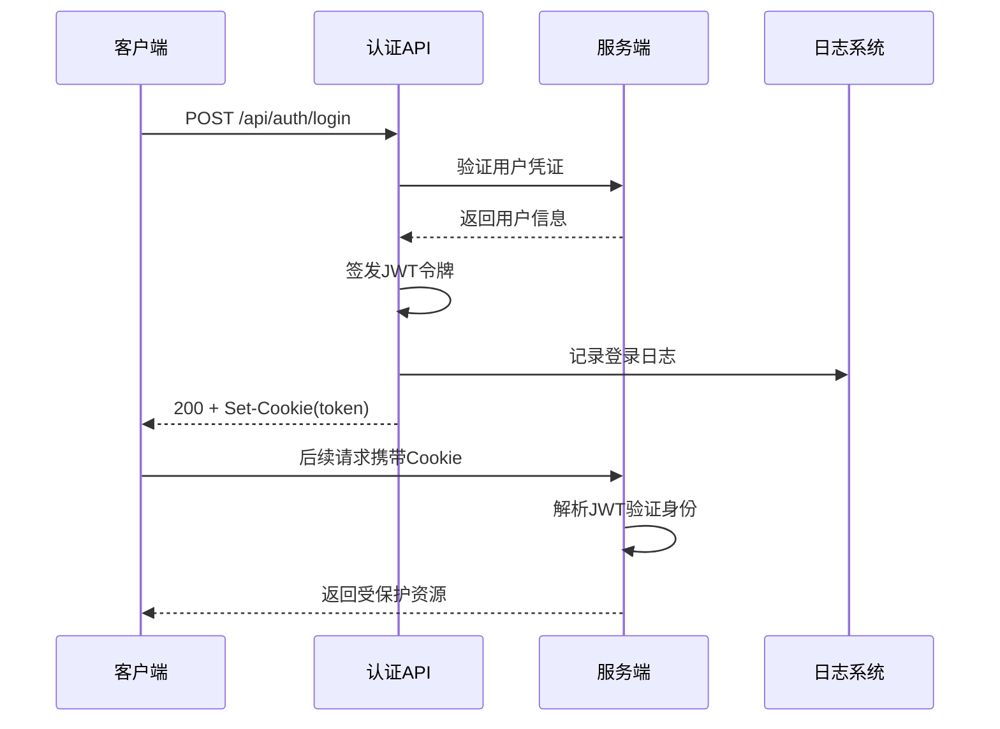

# API参考

<cite>
**本文档中引用的文件**  
- [login/route.ts](file://src/app/api/auth/login/route.ts)
- [logout/route.ts](file://src/app/api/auth/logout/route.ts)
- [session/route.ts](file://src/app/api/auth/session/route.ts)
- [users/route.ts](file://src/app/api/users/route.ts)
- [roles/route.ts](file://src/app/api/roles/route.ts)
- [permissions/route.ts](file://src/app/api/permissions/route.ts)
- [tickets/route.ts](file://src/app/api/tickets/route.ts)
- [logs/route.ts](file://src/app/api/logs/route.ts)
- [auth.ts](file://src/lib/auth.ts)
- [permissions.ts](file://src/lib/permissions.ts)
</cite>

## 目录
1. [简介](#简介)
2. [认证机制](#认证机制)
3. [用户管理API](#用户管理api)
4. [角色管理API](#角色管理api)
5. [权限管理API](#权限管理api)
6. [工单管理API](#工单管理api)
7. [日志管理API](#日志管理api)
8. [代码示例](#代码示例)

## 简介
本API参考文档为v0-game_admin系统提供完整的RESTful接口规范说明。文档覆盖`/auth`、`/users`、`/roles`、`/permissions`、`/tickets`和`/logs`等核心模块，详细描述每个端点的HTTP方法、请求路径、请求头、请求体结构、响应格式及可能的状态码。所有API均采用JWT进行身份认证，并通过权限码进行访问控制。

**Section sources**
- [login/route.ts](file://src/app/api/auth/login/route.ts)
- [users/route.ts](file://src/app/api/users/route.ts)

## 认证机制
系统采用JWT（JSON Web Token）进行用户身份认证。用户登录成功后，服务器返回JWT令牌并设置为HttpOnly Cookie，后续请求需通过Cookie携带该令牌进行验证。

### 认证流程
1. 用户通过`POST /api/auth/login`提交邮箱和密码
2. 服务端验证凭证并签发JWT令牌
3. 令牌通过`Set-Cookie`头返回客户端
4. 客户端后续请求自动携带Cookie中的令牌
5. 服务端通过`getCurrentUser()`解析用户信息

### 权限验证
系统通过`@/lib/permissions.ts`定义的权限码进行细粒度权限控制。每个API端点根据操作类型检查对应的权限码，如`account.user.create`用于创建用户。



**Diagram sources**
- [login/route.ts](file://src/app/api/auth/login/route.ts)
- [auth.ts](file://src/lib/auth.ts)
- [permissions.ts](file://src/lib/permissions.ts)

**Section sources**
- [login/route.ts](file://src/app/api/auth/login/route.ts)
- [auth.ts](file://src/lib/auth.ts)
- [permissions.ts](file://src/lib/permissions.ts)

## 用户管理API
提供用户信息的查询和创建功能。

### 获取用户列表
- **HTTP方法**: GET
- **URL路径**: `/api/users`
- **认证要求**: 是
- **权限要求**: `account.user.read`
- **请求头**: `Authorization: Bearer <token>`（通过Cookie自动传递）
- **查询参数**:
  - `username`: 用户名（模糊匹配）
  - `email`: 邮箱（模糊匹配）
  - `roleId`: 角色ID
  - `status`: 状态（active/inactive）
  - `startDate`: 创建起始日期
  - `endDate`: 创建结束日期
  - `page`: 页码（默认1）
  - `limit`: 每页数量（默认10）

- **成功响应 (200)**:
```json
{
  "success": true,
  "data": [
    {
      "id": 1,
      "username": "admin",
      "email": "admin@example.com",
      "roleId": "admin",
      "status": "active",
      "createdAt": "2024-01-01T00:00:00Z",
      "lastLoginAt": "2024-01-02T00:00:00Z"
    }
  ],
  "meta": {
    "page": 1,
    "limit": 10,
    "total": 1,
    "totalPages": 1
  }
}
```

- **错误响应**:
  - `401 Unauthorized`: 未认证
  - `500 Internal Server Error`: 服务器错误

### 创建用户
- **HTTP方法**: POST
- **URL路径**: `/api/users`
- **认证要求**: 是
- **权限要求**: `account.user.create`
- **请求头**: `Authorization: Bearer <token>`
- **请求体**:
```json
{
  "username": "string",
  "email": "string",
  "password": "string",
  "roleId": "string",
  "status": "active|inactive"
}
```

- **成功响应 (201)**:
```json
{
  "success": true,
  "message": "用户创建成功"
}
```

- **错误响应**:
  - `400 Bad Request`: 缺少必填字段
  - `409 Conflict`: 用户名已存在
  - `401 Unauthorized`: 未认证
  - `500 Internal Server Error`: 服务器错误

**Section sources**
- [users/route.ts](file://src/app/api/users/route.ts)

## 角色管理API
提供角色信息的查询和创建功能。

### 获取角色列表
- **HTTP方法**: GET
- **URL路径**: `/api/roles`
- **认证要求**: 是
- **权限要求**: `account.role.read`
- **请求头**: `Authorization: Bearer <token>`
- **查询参数**:
  - `name`: 角色名称（模糊匹配）
  - `startDate`: 创建起始日期
  - `endDate`: 创建结束日期
  - `page`: 页码（默认1）
  - `limit`: 每页数量（默认10，最大100）

- **成功响应 (200)**:
```json
{
  "success": true,
  "data": [
    {
      "id": 1,
      "name": "管理员",
      "description": "系统管理员角色",
      "createdAt": "2024-01-01T00:00:00Z"
    }
  ],
  "meta": {
    "page": 1,
    "limit": 10,
    "total": 1,
    "totalPages": 1
  }
}
```

### 创建角色
- **HTTP方法**: POST
- **URL路径**: `/api/roles`
- **认证要求**: 是
- **权限要求**: `account.role.create`
- **请求头**: `Authorization: Bearer <token>`
- **请求体**:
```json
{
  "name": "string",
  "description": "string"
}
```

- **成功响应 (201)**:
```json
{
  "success": true,
  "message": "角色创建成功"
}
```

- **错误响应**:
  - `400 Bad Request`: 缺少角色名称
  - `409 Conflict`: 角色名已存在
  - `401 Unauthorized`: 未认证
  - `500 Internal Server Error`: 服务器错误

**Section sources**
- [roles/route.ts](file://src/app/api/roles/route.ts)

## 权限管理API
提供权限信息的查询和创建功能。

### 获取权限列表
- **HTTP方法**: GET
- **URL路径**: `/api/permissions`
- **认证要求**: 是
- **权限要求**: `account.permission.read`
- **请求头**: `Authorization: Bearer <token>`
- **查询参数**:
  - `name`: 权限名称
  - `code`: 权限码
  - `description`: 描述
  - `startDate`: 创建起始日期
  - `endDate`: 创建结束日期
  - `page`: 页码（默认1）
  - `limit`: 每页数量（默认10，最大100）

- **成功响应 (200)**:
```json
{
  "success": true,
  "data": [
    {
      "id": 1,
      "name": "用户读取",
      "code": "account.user.read",
      "description": "查看用户信息的权限",
      "createdAt": "2024-01-01T00:00:00Z"
    }
  ],
  "meta": {
    "page": 1,
    "limit": 10,
    "total": 1,
    "totalPages": 1
  }
}
```

### 创建权限
- **HTTP方法**: POST
- **URL路径**: `/api/permissions`
- **认证要求**: 是
- **权限要求**: `account.permission.create`
- **请求头**: `Authorization: Bearer <token>`
- **请求体**:
```json
{
  "name": "string",
  "code": "string",
  "description": "string"
}
```

- **成功响应 (201)**:
```json
{
  "success": true,
  "message": "权限创建成功"
}
```

**Section sources**
- [permissions/route.ts](file://src/app/api/permissions/route.ts)

## 工单管理API
提供工单的创建功能。

### 创建工单
- **HTTP方法**: POST
- **URL路径**: `/api/tickets`
- **认证要求**: 是
- **权限要求**: `ticket.create`
- **请求头**: `Authorization: Bearer <token>`
- **请求体**:
```json
{
  "title": "string",
  "description": "string",
  "priority": "low|normal|high|urgent",
  "category": "string",
  "tags": ["string"],
  "userId": "number",
  "dueAt": "string"
}
```

- **成功响应 (201)**:
```json
{
  "success": true,
  "data": {
    "id": 1,
    "message": "工单创建成功"
  }
}
```

- **错误响应**:
  - `400 Bad Request`: 缺少必填字段
  - `401 Unauthorized`: 未认证
  - `500 Internal Server Error`: 服务器错误

**Section sources**
- [tickets/route.ts](file://src/app/api/tickets/route.ts)

## 日志管理API
提供系统日志的查询和清理功能。

### 查询日志
- **HTTP方法**: GET
- **URL路径**: `/api/logs`
- **认证要求**: 是
- **权限要求**: `system.log.read`
- **请求头**: `Authorization: Bearer <token>`
- **查询参数**:
  - `level`: 日志级别（info/warn/error）
  - `module`: 模块名称
  - `action`: 操作名称
  - `search`: 全文搜索
  - `startDate`: 起始日期
  - `endDate`: 结束日期
  - `page`: 页码（默认1）
  - `limit`: 每页数量（默认10）

- **成功响应 (200)**:
```json
{
  "success": true,
  "data": [
    {
      "id": 1,
      "level": "info",
      "module": "用户认证",
      "action": "用户登录",
      "message": "用户登录成功",
      "details": {},
      "userId": 1,
      "createdAt": "2024-01-01T00:00:00Z"
    }
  ],
  "meta": {
    "page": 1,
    "limit": 10,
    "total": 1,
    "totalPages": 1
  }
}
```

### 清理日志
- **HTTP方法**: DELETE
- **URL路径**: `/api/logs`
- **认证要求**: 是
- **权限要求**: `system.log.delete`
- **请求头**: `Authorization: Bearer <token>`
- **查询参数**:
  - `days`: 保留天数（默认30）

- **成功响应 (200)**:
```json
{
  "success": true,
  "data": {
    "message": "成功删除 30 天前的日志"
  }
}
```

**Section sources**
- [logs/route.ts](file://src/app/api/logs/route.ts)

## 代码示例
### cURL命令示例

**登录获取令牌**:
```bash
curl -X POST http://localhost:3000/api/auth/login \
  -H "Content-Type: application/json" \
  -d '{
    "email": "admin@example.com",
    "password": "password123"
  }'
```

**创建用户**:
```bash
curl -X POST http://localhost:3000/api/users \
  -H "Content-Type: application/json" \
  -H "Cookie: token=your-jwt-token-here" \
  -d '{
    "username": "newuser",
    "email": "newuser@example.com",
    "password": "password123",
    "roleId": "user"
  }'
```

### JavaScript Fetch示例

**获取当前用户会话**:
```javascript
async function getSession() {
  const response = await fetch('/api/auth/session');
  const data = await response.json();
  return data;
}
```

**创建新角色**:
```javascript
async function createRole(name, description) {
  const response = await fetch('/api/roles', {
    method: 'POST',
    headers: {
      'Content-Type': 'application/json',
    },
    body: JSON.stringify({ name, description })
  });
  
  const data = await response.json();
  return data;
}
```

**查询日志**:
```javascript
async function getLogs(page = 1, limit = 10) {
  const params = new URLSearchParams({ page, limit });
  const response = await fetch(`/api/logs?${params}`);
  const data = await response.json();
  return data;
}
```

**Section sources**
- [session/route.ts](file://src/app/api/auth/session/route.ts)
- [users/route.ts](file://src/app/api/users/route.ts)
- [roles/route.ts](file://src/app/api/roles/route.ts)
- [logs/route.ts](file://src/app/api/logs/route.ts)