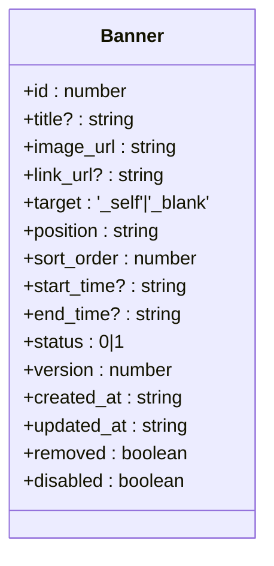
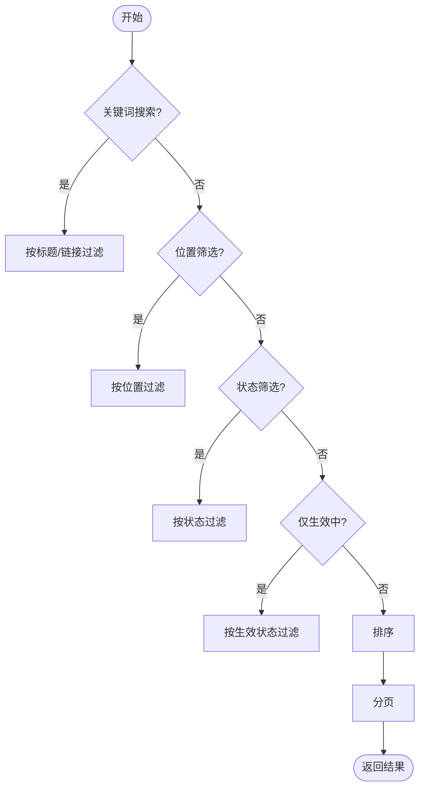
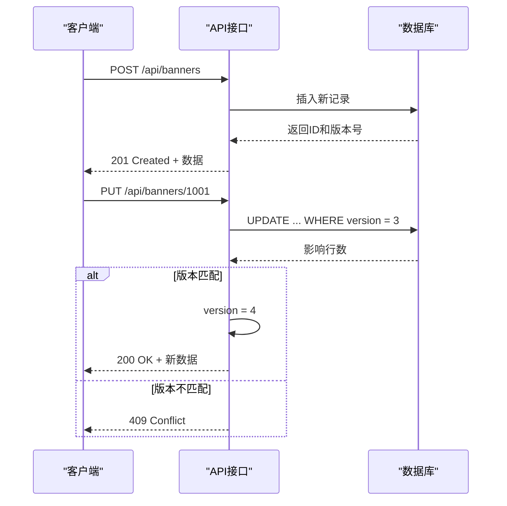
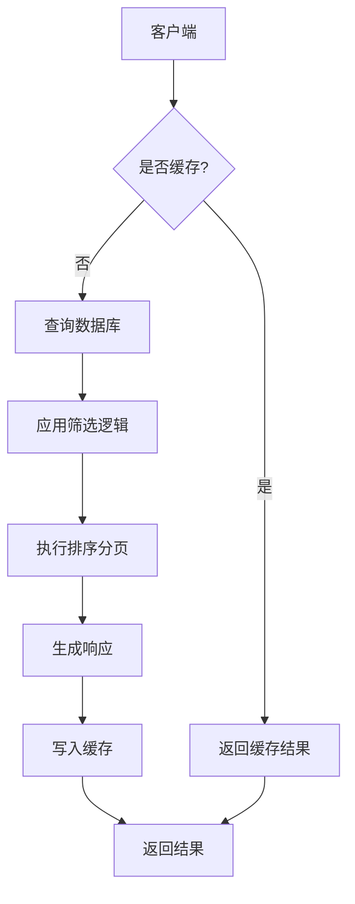

# 公告横幅API

<cite>
**本文档中引用的文件**  
- [route.ts](file://src/app/api/banners/route.ts)
- [id]\route.ts](file://src/app/api/banners/[id]/route.ts)
- [list\route.ts](file://src/app/api/banners/list/route.ts)
- [types.ts](file://src/app/dashboard/home-banners/types.ts)
- [API_SPECIFICATION.md](file://src/app/dashboard/home-banners/API_SPECIFICATION.md)
- [models.ts](file://src/repository/models.ts)
</cite>

## 目录
1. [简介](#简介)
2. [核心API端点](#核心api端点)
3. [Banner对象结构](#banner对象结构)
4. [筛选与分页机制](#筛选与分页机制)
5. [创建与更新示例](#创建与更新示例)
6. [缓存与CDN集成最佳实践](#缓存与cdn集成最佳实践)
7. [错误处理](#错误处理)
8. [业务规则](#业务规则)

## 简介

公告横幅API用于管理游戏平台中的轮播图内容，支持创建、查询、更新和删除操作。该API设计遵循统一的后台管理规范，确保与其他模块（如游戏管理、权限系统）保持一致。前端通过`/api/banners/list`端点获取带筛选条件的分页列表，通过`/api/banners`进行内容创建，并利用版本控制实现乐观锁更新。

**Section sources**
- [API_SPECIFICATION.md](file://src/app/dashboard/home-banners/API_SPECIFICATION.md#L1-L20)

## 核心API端点

### GET /api/banners/list
获取轮播图列表（支持分页和多维度筛选）

### POST /api/banners
创建新的轮播图条目

### GET /api/banners/[id]
获取指定ID的轮播图详情

### PUT /api/banners/[id]
更新现有轮播图信息（需提供版本号以实现乐观锁）

### DELETE /api/banners/[id]
逻辑删除指定轮播图

```mermaid
flowchart TD
A[客户端请求] --> B{请求方法}
B --> |POST /api/banners| C[创建新横幅]
B --> |POST /api/banners/list| D[获取横幅列表]
B --> |GET /api/banners/[id]| E[获取单个详情]
B --> |PUT /api/banners/[id]| F[更新横幅]
B --> |DELETE /api/banners/[id]| G[删除横幅]
C --> H[返回201 Created]
D --> I[返回200 OK + 分页数据]
E --> J[返回200 OK + 详情]
F --> K[返回200 OK 或 409 冲突]
G --> L[返回200 OK]
```

**Diagram sources**
- [route.ts](file://src/app/api/banners/route.ts#L1-L45)
- [id]\route.ts](file://src/app/api/banners/[id]/route.ts#L1-L93)
- [list\route.ts](file://src/app/api/banners/list/route.ts#L1-L194)

**Section sources**
- [route.ts](file://src/app/api/banners/route.ts#L1-L45)
- [id]\route.ts](file://src/app/api/banners/[id]/route.ts#L1-L93)
- [list\route.ts](file://src/app/api/banners/list/route.ts#L1-L194)

## Banner对象结构

| 字段 | 类型 | 说明 |
|------|------|------|
| id | integer | 主键，自增 |
| title | string | 轮播图标题，可为空 |
| image_url | string | 图片URL，必需 |
| link_url | string | 跳转链接，可为空表示无跳转 |
| target | string | 打开方式，'_self' 或 '_blank' |
| position | string | 显示位置（home, promo 等） |
| sort_order | integer | 排序权重，越大越靠前 |
| start_time | datetime | 开始时间，为空表示立即生效 |
| end_time | datetime | 结束时间，为空表示长期有效 |
| status | integer | 状态：0=下线，1=上线 |
| version | integer | 版本号，用于乐观锁 |
| created_at | datetime | 创建时间 |
| updated_at | datetime | 更新时间 |
| removed | boolean | 逻辑删除标记 |
| disabled | boolean | 禁用标记（紧急止投） |



**Diagram sources**
- [types.ts](file://src/app/dashboard/home-banners/types.ts#L4-L20)
- [models.ts](file://src/repository/models.ts#L1-L189)

**Section sources**
- [types.ts](file://src/app/dashboard/home-banners/types.ts#L4-L20)

## 筛选与分页机制

### 支持的筛选参数

| 参数 | 类型 | 默认值 | 说明 |
|------|------|--------|------|
| keyword | string | - | 标题或链接模糊匹配 |
| positions | array | - | 位置多选过滤 |
| status | 0/1/'all' | 'all' | 状态筛选 |
| disabled | boolean | false | 是否禁用 |
| active_only | boolean | false | 仅显示生效中 |
| sort_by | string | sort_order | 排序字段 |
| sort_dir | asc/desc | desc | 排序方向 |
| page | integer | 1 | 页码 |
| page_size | integer | 20 | 每页数量 |

### 时间范围筛选逻辑

- **desired_from/desired_to**：查询与指定时间范围有交集的记录
- **start_from/start_to**：明确筛选开始时间范围
- **end_from/end_to**：明确筛选结束时间范围



**Diagram sources**
- [list\route.ts](file://src/app/api/banners/list/route.ts#L10-L194)
- [API_SPECIFICATION.md](file://src/app/dashboard/home-banners/API_SPECIFICATION.md#L288-L338)

**Section sources**
- [list\route.ts](file://src/app/api/banners/list/route.ts#L10-L194)

## 创建与更新示例

### 创建新横幅

```bash
curl --location --request POST 'https://api.example.com/api/banners' \
--header 'Content-Type: application/json' \
--data-raw '{
  "title": "新年活动",
  "image_url": "https://cdn.example.com/banner_newyear.jpg",
  "link_url": "/promo/newyear",
  "target": "_self",
  "position": "home",
  "sort_order": 100,
  "start_time": "2025-12-01T00:00:00Z",
  "end_time": "2025-12-31T23:59:59Z",
  "status": 1,
  "disabled": false
}'
```

### 更新横幅（带乐观锁）

```bash
curl --location --request PUT 'https://api.example.com/api/banners/1001' \
--header 'Content-Type: application/json' \
--data-raw '{
  "status": 0,
  "version": 3
}'
```



**Diagram sources**
- [route.ts](file://src/app/api/banners/route.ts#L17-L45)
- [id]\route.ts](file://src/app/api/banners/[id]/route.ts#L39-L66)

**Section sources**
- [API_SPECIFICATION.md](file://src/app/dashboard/home-banners/API_SPECIFICATION.md#L103-L259)

## 缓存与CDN集成最佳实践

### 前端投放缓存策略

- **缓存时长**：5-10分钟，平衡实时性与性能
- **缓存键**：`banners:{position}:{lang}`
- **失效机制**：更新后主动清除相关缓存

### CDN优化建议

1. 图片资源使用CDN加速
2. 设置合理的Cache-Control头
3. 启用GZIP压缩JSON响应
4. 对静态图片进行格式优化（WebP）



**Diagram sources**
- [API_SPECIFICATION.md](file://src/app/dashboard/home-banners/API_SPECIFICATION.md#L421-L423)
- [list\route.ts](file://src/app/api/banners/list/route.ts#L112-L185)

**Section sources**
- [API_SPECIFICATION.md](file://src/app/dashboard/home-banners/API_SPECIFICATION.md#L421-L427)

## 错误处理

| 状态码 | 错误类型 | 响应体 |
|--------|----------|--------|
| 400 | 请求参数错误 | { "error": "请求参数错误" } |
| 409 | 版本冲突 | { "error": "版本冲突，请刷新后重试" } |
| 500 | 服务器内部错误 | { "error": "服务器内部错误" } |

**Section sources**
- [API_SPECIFICATION.md](file://src/app/dashboard/home-banners/API_SPECIFICATION.md#L384-L405)

## 业务规则

### 投放有效性判断

前台实际投放需满足：
```
status = 1 
AND disabled = false 
AND (start_time <= now OR start_time 为空)
AND (end_time >= now OR end_time 为空)
```

### 乐观锁机制

- 更新时必须传入`version`字段
- 数据库更新条件包含`version`
- 更新成功后`version`自动递增
- 版本不匹配时返回409状态码

### 紧急止投

通过设置`disabled = true`立即下线轮播图，无需修改状态或时间字段。

**Section sources**
- [API_SPECIFICATION.md](file://src/app/dashboard/home-banners/API_SPECIFICATION.md#L359-L383)