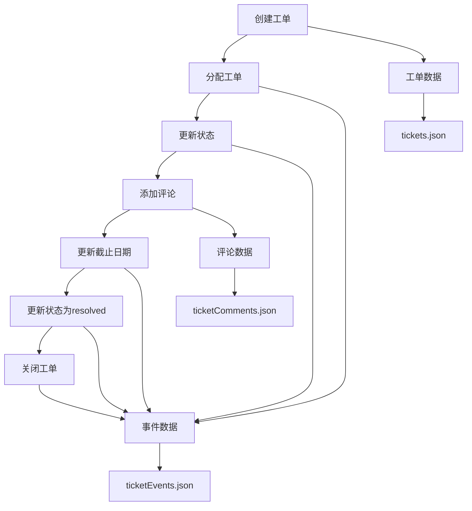

# 工单系统API

<cite>
**本文档引用的文件**  
- [tickets.json](file://data/tickets.json)
- [ticketComments.json](file://data/ticketComments.json)
- [ticketEvents.json](file://data/ticketEvents.json)
- [models.ts](file://src/repository/models.ts)
- [interfaces.ts](file://src/repository/interfaces.ts)
- [jsonRepos.ts](file://src/repository/impl/jsonRepos.ts)
- [route.ts](file://src/app/api/tickets/route.ts)
- [list/route.ts](file://src/app/api/tickets/list/route.ts)
- [\[id\]/route.ts](file://src/app/api/tickets/[id]/route.ts)
- [\[id\]/assign/route.ts](file://src/app/api/tickets/[id]/assign/route.ts)
- [\[id\]/status/route.ts](file://src/app/api/tickets/[id]/status/route.ts)
- [\[id\]/due/route.ts](file://src/app/api/tickets/[id]/due/route.ts)
- [\[id\]/tags/route.ts](file://src/app/api/tickets/[id]/tags/route.ts)
- [\[id\]/comment/route.ts](file://src/app/api/tickets/[id]/comment/route.ts)
</cite>

## 目录
1. [简介](#简介)
2. [数据模型定义](#数据模型定义)
3. [工单列表查询](#工单列表查询)
4. [创建工单](#创建工单)
5. [工单详情与更新](#工单详情与更新)
6. [子资源操作](#子资源操作)
7. [交互流程示例](#交互流程示例)

## 简介
本API文档详细描述了工单系统的核心功能，包括工单的创建、查询、更新以及对工单子资源（如分配、状态、截止日期、标签和评论）的操作。系统通过JSON文件持久化数据，支持灵活的查询条件和完整的操作日志记录。

## 数据模型定义

### 工单（Ticket）
工单是系统的核心实体，包含以下字段：

| 字段 | 类型 | 说明 |
|------|------|------|
| id | number | 工单唯一标识 |
| title | string | 工单标题 |
| description | string | 详细描述 |
| status | string | 状态：open, in_progress, pending, resolved, closed, canceled |
| priority | string | 优先级：low, normal, high, urgent |
| category | string | 分类（如payment, account, game等） |
| tags | string[] | 标签数组 |
| userId | number | 提单人ID |
| assigneeId | number? | 处理人ID（可为空） |
| dueAt | string? | 截止时间（ISO格式） |
| createdAt | string | 创建时间 |
| updatedAt | string | 更新时间 |
| resolvedAt | string? | 解决时间 |
| closedAt | string? | 关闭时间 |

**Section sources**
- [models.ts](file://src/repository/models.ts#L99-L115)

### 工单评论（TicketComment）
记录工单的评论信息：

| 字段 | 类型 | 说明 |
|------|------|------|
| id | number | 评论唯一标识 |
| ticketId | number | 所属工单ID |
| userId | number | 评论人ID |
| content | string | 评论内容 |
| isInternal | boolean | 是否为内部备注 |
| createdAt | string | 创建时间 |

**Section sources**
- [models.ts](file://src/repository/models.ts#L117-L125)

### 工单事件（TicketEvent）
记录工单的所有操作历史：

| 字段 | 类型 | 说明 |
|------|------|------|
| id | number | 事件唯一标识 |
| ticketId | number | 所属工单ID |
| eventType | string | 事件类型（created, assigned, status_changed等） |
| userId | number? | 操作者ID |
| oldValue | unknown? | 变更前的值 |
| newValue | unknown? | 变更后的值 |
| reason | string? | 变更原因 |
| createdAt | string | 创建时间 |

**Section sources**
- [models.ts](file://src/repository/models.ts#L139-L148)

## 工单列表查询

### 查询端点
- `GET /api/tickets` - 传统GET方式（未实现）
- `POST /api/tickets/list` - 推荐的POST方式，支持复杂查询条件

### 查询参数
支持多种过滤条件，以JSON格式在请求体中传递：

```json
{
  "keyword": "充值",
  "statuses": ["open", "in_progress"],
  "priorities": ["high", "urgent"],
  "categories": ["payment"],
  "tagsAny": ["refund"],
  "tagsAll": ["deposit", "alipay"],
  "userIds": [1024],
  "assigneeIds": [2],
  "onlyUnassigned": false,
  "createdFrom": "2025-11-10T00:00:00Z",
  "createdTo": "2025-11-12T23:59:59Z",
  "dueFrom": "2025-11-11T00:00:00Z",
  "dueTo": "2025-11-13T23:59:59Z",
  "onlyOverdue": true,
  "dueWithinMinutes": 1440,
  "myTickets": true,
  "sortBy": "default",
  "sortDir": "desc",
  "page": 1,
  "pageSize": 20
}
```

### 响应格式
```json
{
  "total": 5,
  "page": 1,
  "page_size": 20,
  "list": [
    {
      "id": 1,
      "title": "充值失败，请求退款",
      "status": "in_progress",
      "priority": "high",
      "category": "payment",
      "tags": ["deposit", "refund", "alipay"],
      "userId": 1024,
      "assigneeId": 2,
      "dueAt": "2025-11-12T15:00:00Z",
      "createdAt": "2025-11-11T09:20:00Z",
      "updatedAt": "2025-11-12T04:05:00Z",
      "sla": {
        "isOverdue": false,
        "remainingMinutes": 1435
      }
    }
  ]
}
```

**Section sources**
- [list/route.ts](file://src/app/api/tickets/list/route.ts#L6-L82)
- [jsonRepos.ts](file://src/repository/impl/jsonRepos.ts#L534-L664)

## 创建工单

### 端点
`POST /api/tickets`

### 请求体
```json
{
  "title": "充值失败，请求退款",
  "description": "用户在11月10日下午3点通过支付宝充值500元...",
  "priority": "high",
  "category": "payment",
  "tags": ["deposit", "refund", "alipay"],
  "userId": 1024,
  "dueAt": "2025-11-12T15:00:00Z"
}
```

### 响应
```json
{
  "success": true,
  "data": {
    "id": 6,
    "message": "工单创建成功"
  }
}
```

创建工单时，系统会自动设置状态为"open"，并记录创建时间。同时会生成一条类型为"created"的工单事件。

**Section sources**
- [route.ts](file://src/app/api/tickets/route.ts#L8-L71)

## 工单详情与更新

### 获取工单详情
`GET /api/tickets/[id]`

返回指定ID工单的完整信息。

### 更新工单基础信息
`PATCH /api/tickets/[id]`

支持部分更新工单的任意字段，如标题、描述、优先级等。

### 删除工单
`DELETE /api/tickets/[id]`

删除指定工单及其关联的评论和事件。

**Section sources**
- [\[id\]/route.ts](file://src/app/api/tickets/[id]/route.ts#L7-L111)

## 子资源操作

### 分配工单
`PUT /api/tickets/[id]/assign`

```json
{
  "assigneeId": 2
}
```

分配工单给指定用户，并记录"assigned"事件。

### 更新状态
`PUT /api/tickets/[id]/status`

```json
{
  "status": "resolved",
  "reason": "已为用户完成退款"
}
```

更新工单状态，支持提供变更原因。

### 更新截止日期
`PUT /api/tickets/[id]/due`

```json
{
  "dueAt": "2025-11-13T10:00:00Z"
}
```

设置或修改工单的截止时间。

### 管理标签
`PUT /api/tickets/[id]/tags`

```json
{
  "tags": ["deposit", "urgent", "VIP"]
}
```

替换工单的标签列表。

### 添加评论
`POST /api/tickets/[id]/comment`

```json
{
  "content": "已联系财务部门处理",
  "isInternal": true
}
```

为工单添加评论，支持标记为内部备注。

**Section sources**
- [\[id\]/assign/route.ts](file://src/app/api/tickets/[id]/assign/route.ts#L7-L48)
- [\[id\]/status/route.ts](file://src/app/api/tickets/[id]/status/route.ts#L8-L60)
- [\[id\]/due/route.ts](file://src/app/api/tickets/[id]/due/route.ts#L7-L49)
- [\[id\]/tags/route.ts](file://src/app/api/tickets/[id]/tags/route.ts#L7-L53)
- [\[id\]/comment/route.ts](file://src/app/api/tickets/[id]/comment/route.ts#L7-L58)

## 交互流程示例

### 完整工单生命周期
1. **创建工单**：用户提交"充值失败"工单
2. **分配处理**：客服主管将工单分配给财务专员
3. **更新状态**：财务专员将状态更新为"in_progress"
4. **添加评论**：财务专员添加内部备注"已确认支付宝回调异常"
5. **更新截止日期**：因需要额外验证，将截止日期延长
6. **解决工单**：完成退款后，将状态更新为"resolved"
7. **关闭工单**：客服确认用户满意后关闭工单

### 数据流图


**Diagram sources**
- [tickets.json](file://data/tickets.json)
- [ticketComments.json](file://data/ticketComments.json)
- [ticketEvents.json](file://data/ticketEvents.json)

**Section sources**
- [jsonRepos.ts](file://src/repository/impl/jsonRepos.ts#L677-L790)
- [interfaces.ts](file://src/repository/interfaces.ts#L136-L151)