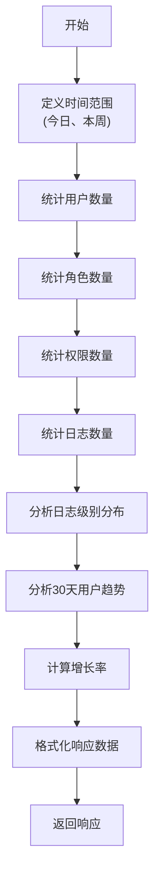
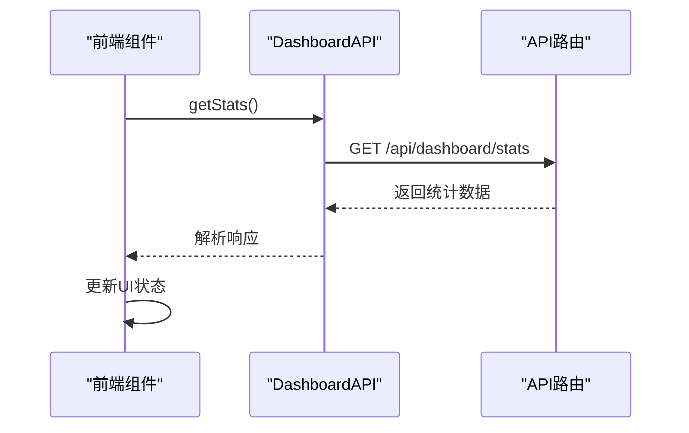
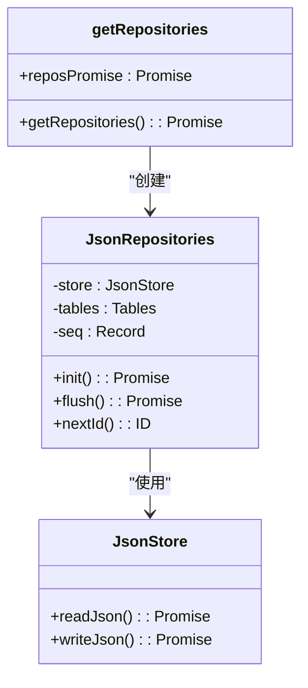
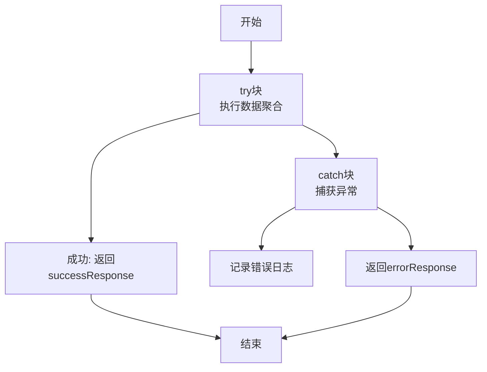

# 数据看板API

<cite>
**Referenced Files in This Document**   
- [route.ts](file://src/app/api/dashboard/stats/route.ts)
- [dashboard.ts](file://src/service/api/dashboard.ts)
- [page.tsx](file://src/app/dashboard/overview/page.tsx)
- [response.ts](file://src/service/response.ts)
- [jsonRepos.ts](file://src/repository/impl/jsonRepos.ts)
- [models.ts](file://src/repository/models.ts)
- [interfaces.ts](file://src/repository/interfaces.ts)
- [index.ts](file://src/repository/index.ts)
</cite>

## 目录
1. [简介](#简介)
2. [核心组件](#核心组件)
3. [接口定义](#接口定义)
4. [数据聚合逻辑](#数据聚合逻辑)
5. [前端集成](#前端集成)
6. [性能优化](#性能优化)
7. [错误处理](#错误处理)

## 简介
数据看板API为系统管理后台提供关键指标的聚合数据，用于可视化展示。该API通过`GET /api/dashboard/stats`端点提供用户、角色、权限和系统日志等核心数据的统计信息，支持实时监控系统状态和业务趋势。

## 核心组件

数据看板API由多个核心组件构成，包括API路由处理、服务层封装、数据访问层和统一响应格式。这些组件协同工作，确保数据的准确获取和高效传输。

**Section sources**
- [route.ts](file://src/app/api/dashboard/stats/route.ts#L1-L108)
- [dashboard.ts](file://src/service/api/dashboard.ts#L1-L10)
- [page.tsx](file://src/app/dashboard/overview/page.tsx#L1-L576)
- [response.ts](file://src/service/response.ts#L1-L80)

## 接口定义

### 端点信息
- **路径**: `GET /api/dashboard/stats`
- **方法**: GET
- **用途**: 获取系统关键指标的聚合统计数据

### 响应结构
响应体遵循统一的API响应格式，包含以下主要字段：

```json
{
  "code": 0,
  "data": {
    "overview": {
      "totalUsers": 0,
      "todayUsers": 0,
      "weekUsers": 0,
      "userGrowthRate": "",
      "totalRoles": 0,
      "totalPermissions": 0,
      "totalLogs": 0,
      "todayLogs": 0,
      "weekLogs": 0,
      "errorLogs": 0
    },
    "recentUsers": [],
    "logLevelStats": [],
    "userTrend": []
  }
}
```

#### 概览数据 (overview)
| 字段 | 类型 | 描述 |
|------|------|------|
| totalUsers | number | 用户总数 |
| todayUsers | number | 今日新增用户数 |
| weekUsers | number | 本周新增用户数 |
| userGrowthRate | string | 用户增长率（百分比字符串） |
| totalRoles | number | 角色总数 |
| totalPermissions | number | 权限总数 |
| totalLogs | number | 日志总数 |
| todayLogs | number | 今日日志数 |
| weekLogs | number | 本周日志数 |
| errorLogs | number | 错误日志数量 |

#### 最近用户 (recentUsers)
包含最近注册的5位用户信息，每个用户对象包含：
- id: 用户ID
- username: 用户名
- email: 邮箱
- avatar: 头像URL
- createdAt: 创建时间

#### 日志级别统计 (logLevelStats)
按日志级别统计的数量，每个条目包含：
- level: 日志级别（info, warn, error, debug）
- count: 该级别日志数量

#### 用户趋势 (userTrend)
最近30天的用户注册趋势数据，每个条目包含：
- date: 日期（YYYY-MM-DD格式）
- users: 当日注册用户数

### 响应示例
```json
{
  "code": 0,
  "data": {
    "overview": {
      "totalUsers": 1567,
      "todayUsers": 23,
      "weekUsers": 156,
      "userGrowthRate": "+14.8%",
      "totalRoles": 8,
      "totalPermissions": 45,
      "totalLogs": 8923,
      "todayLogs": 128,
      "weekLogs": 892,
      "errorLogs": 12
    },
    "recentUsers": [
      {
        "id": 1005,
        "username": "newuser5",
        "email": "newuser5@example.com",
        "avatar": "/avatars/default.jpg",
        "createdAt": "2025-11-12T08:30:00Z"
      }
    ],
    "logLevelStats": [
      { "level": "info", "count": 8500 },
      { "level": "warn", "count": 300 },
      { "level": "error", "count": 12 },
      { "level": "debug", "count": 111 }
    ],
    "userTrend": [
      { "date": "2025-11-12", "users": 23 },
      { "date": "2025-11-11", "users": 18 }
    ]
  }
}
```

**Section sources**
- [route.ts](file://src/app/api/dashboard/stats/route.ts#L87-L102)
- [response.ts](file://src/service/response.ts#L17-L31)
- [models.ts](file://src/repository/models.ts#L6-L18)

## 数据聚合逻辑

### 数据来源
数据看板API从多个数据源聚合信息，主要依赖于JSON仓储实现，通过`getRepositories()`获取数据访问实例。

### 统计计算
#### 时间范围定义
- **今日**: 当天00:00:00至今
- **本周**: 过去7天



**Diagram sources**
- [route.ts](file://src/app/api/dashboard/stats/route.ts#L8-L35)
- [jsonRepos.ts](file://src/repository/impl/jsonRepos.ts#L168-L200)

#### 增长率计算
用户增长率采用简化计算方式：
```
增长率 = (今日用户数 / 本周用户数) * 100%
```

当本周用户数为0时，增长率返回"+0%"。

#### 数据聚合步骤
1. 并行获取各项总数统计
2. 获取所有用户数据以计算最近用户和趋势
3. 获取所有日志数据以分析级别分布
4. 计算30天内每日用户注册数量
5. 计算增长率等衍生指标
6. 组装最终响应数据

**Section sources**
- [route.ts](file://src/app/api/dashboard/stats/route.ts#L18-L85)
- [jsonRepos.ts](file://src/repository/impl/jsonRepos.ts#L168-L200)

## 前端集成

### API调用
前端通过`DashboardAPI.getStats()`方法调用数据看板API：



**Diagram sources**
- [dashboard.ts](file://src/service/api/dashboard.ts#L5-L7)
- [page.tsx](file://src/app/dashboard/overview/page.tsx#L74-L77)

### 数据展示
前端组件`DashboardOverview`负责展示数据看板，主要功能包括：

1. **初始化加载**: 组件挂载时自动调用API获取数据
2. **状态管理**: 使用React状态存储统计数据
3. **图表渲染**: 基于`userTrend`数据生成趋势图表
4. **交互功能**: 支持刷新数据和切换时间范围

#### 图表配置
- 使用AreaChart展示用户趋势
- X轴显示日期
- Y轴显示用户数量
- 支持3天、7天、30天三种时间范围切换

#### 统计卡片
展示关键指标的卡片组件，包括：
- 总用户数（带增长率指示）
- 本周活跃用户
- 系统角色数量
- 系统日志统计

**Section sources**
- [page.tsx](file://src/app/dashboard/overview/page.tsx#L58-L574)
- [dashboard.ts](file://src/service/api/dashboard.ts#L5-L7)

## 性能优化

### 数据访问优化
API采用并行数据获取策略，通过`Promise.all()`同时发起多个统计查询：

```typescript
const [
  usersTotalRes,
  usersTodayRes,
  usersWeekRes,
  rolesTotalRes,
  permissionsTotalRes,
  logsTotalRes,
  logsTodayRes,
  logsWeekRes
] = await Promise.all([
  repos.users.list({ page: 1, limit: 1 }),
  repos.users.list({ startDate: startOfDay.toISOString(), page: 1, limit: 1 }),
  // ... 其他并行查询
]);
```

这种并行处理方式显著减少了总体响应时间。

### 仓储层优化
数据访问层采用JSON仓储模式，具有以下特点：

1. **内存缓存**: 数据在内存中维护，减少文件I/O
2. **批量操作**: 写操作时批量写入文件
3. **按需加载**: 仅在需要时初始化数据

### 服务层缓存
系统通过单例模式实现仓储实例的缓存：



**Diagram sources**
- [index.ts](file://src/repository/index.ts#L7-L11)
- [jsonRepos.ts](file://src/repository/impl/jsonRepos.ts#L62-L88)

首次调用`getRepositories()`时创建实例，后续调用直接复用已创建的Promise，避免重复初始化。

**Section sources**
- [route.ts](file://src/app/api/dashboard/stats/route.ts#L6)
- [index.ts](file://src/repository/index.ts#L7-L11)
- [jsonRepos.ts](file://src/repository/impl/jsonRepos.ts#L62-L88)

## 错误处理

### 异常捕获
API使用try-catch块捕获执行过程中的异常：



**Diagram sources**
- [route.ts](file://src/app/api/dashboard/stats/route.ts#L4-L106)

### 错误响应
当发生错误时，返回标准化的错误响应：

```json
{
  "code": -1,
  "message": "获取统计数据失败"
}
```

前端通过检查`code`字段判断请求是否成功，并显示相应的错误提示。

**Section sources**
- [route.ts](file://src/app/api/dashboard/stats/route.ts#L104-L106)
- [response.ts](file://src/service/response.ts#L34-L43)