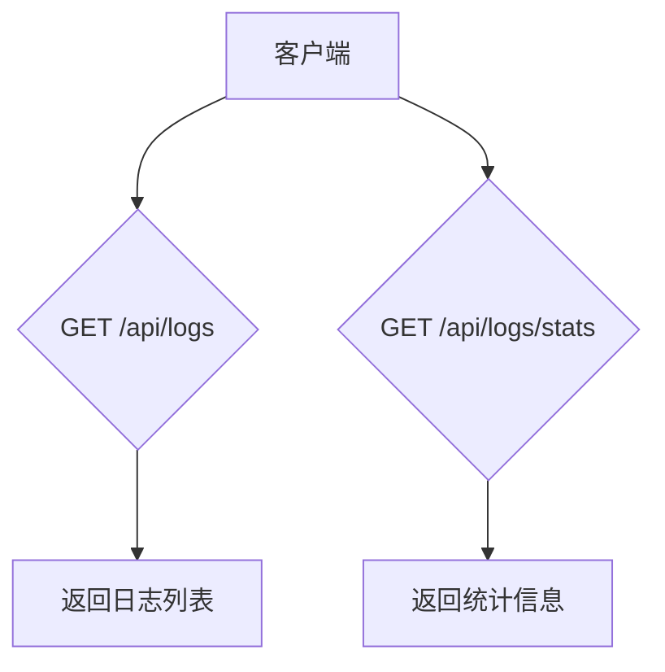
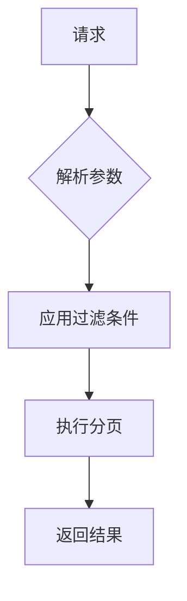
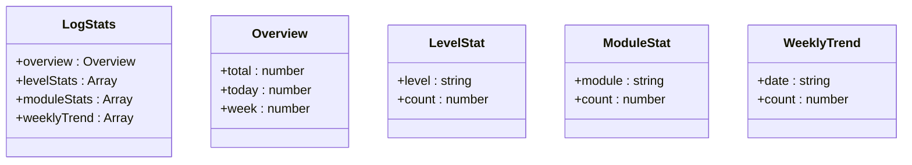
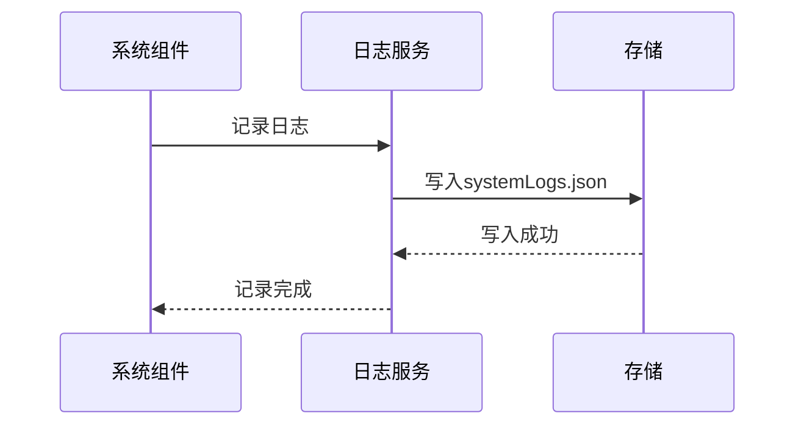

# 日志管理API

<cite>
**本文档引用文件**   
- [route.ts](file://src/app/api/logs/route.ts)
- [stats/route.ts](file://src/app/api/logs/stats/route.ts)
- [log.ts](file://src/service/api/log.ts)
- [systemLogs.json](file://data/systemLogs.json)
- [types.ts](file://src/app/dashboard/system/logs/types.ts)
- [jsonRepos.ts](file://src/repository/impl/jsonRepos.ts)
</cite>

## 目录
1. [简介](#简介)
2. [API端点](#api端点)
3. [日志对象结构](#日志对象结构)
4. [分页与过滤](#分页与过滤)
5. [统计信息](#统计信息)
6. [日志生成机制](#日志生成机制)
7. [查询性能考虑](#查询性能考虑)
8. [使用示例](#使用示例)

## 简介
日志管理API提供对系统日志的访问和分析功能。该API允许用户获取系统日志列表，支持按时间、操作类型、用户等条件进行过滤，并提供日志统计信息用于数据看板展示。日志系统记录了用户认证、系统操作等关键事件，为系统监控和故障排查提供支持。

**Section sources**
- [route.ts](file://src/app/api/logs/route.ts#L9-L50)
- [stats/route.ts](file://src/app/api/logs/stats/route.ts#L5-L85)

## API端点
日志管理API提供两个主要端点：

- **GET /api/logs**：获取系统日志列表
- **GET /api/logs/stats**：获取日志统计信息



**Diagram sources**
- [route.ts](file://src/app/api/logs/route.ts#L9-L50)
- [stats/route.ts](file://src/app/api/logs/stats/route.ts#L5-L85)

## 日志对象结构
日志对象包含以下字段：

| 字段名 | 类型 | 描述 |
|--------|------|------|
| id | number | 日志ID |
| level | string | 日志级别(info, warn, error, debug) |
| action | string | 操作描述 |
| module | string | 所属模块 |
| message | string | 日志消息 |
| details | any | 详细信息 |
| userId | number | 用户ID |
| username | string | 用户名 |
| userAgent | string | 用户代理 |
| ip | string | IP地址 |
| requestId | string | 请求ID |
| duration | number | 持续时间(毫秒) |
| createdAt | string | 创建时间(ISO格式) |
| updatedAt | string | 更新时间(ISO格式) |

**Section sources**
- [systemLogs.json](file://data/systemLogs.json)
- [types.ts](file://src/app/dashboard/system/logs/types.ts#L3-L18)
- [jsonRepos.ts](file://src/repository/impl/jsonRepos.ts#L47-L60)

## 分页与过滤
日志查询支持分页和多种过滤条件。

### 分页参数
| 参数 | 类型 | 默认值 | 描述 |
|------|------|--------|------|
| page | number | 1 | 页码 |
| limit | number | 10 | 每页数量 |

### 过滤参数
| 参数 | 类型 | 描述 |
|------|------|------|
| level | string | 日志级别过滤 |
| module | string | 模块过滤 |
| action | string | 操作类型过滤 |
| search | string | 消息内容搜索 |
| startDate | string | 开始日期(ISO格式) |
| endDate | string | 结束日期(ISO格式) |



**Section sources**
- [route.ts](file://src/app/api/logs/route.ts#L18-L25)
- [types.ts](file://src/app/dashboard/system/logs/types.ts#L56-L64)

## 统计信息
`GET /api/logs/stats`端点返回日志统计信息，用于数据看板展示。

### 统计信息结构
| 字段 | 类型 | 描述 |
|------|------|------|
| overview | object | 概览统计 |
| overview.total | number | 总日志数 |
| overview.today | number | 今日日志数 |
| overview.week | number | 本周日志数 |
| levelStats | array | 按级别统计 |
| moduleStats | array | 按模块统计(Top 10) |
| weeklyTrend | array | 最近7天趋势 |



**Diagram sources**
- [stats/route.ts](file://src/app/api/logs/stats/route.ts#L71-L80)
- [types.ts](file://src/app/dashboard/system/logs/types.ts#L99-L113)

## 日志生成机制
日志系统通过以下机制生成和存储日志：

1. 当系统事件发生时，调用日志记录函数
2. 日志条目包含上下文信息(用户、IP、时间等)
3. 日志被持久化存储到`systemLogs.json`文件
4. 支持按条件查询和统计分析



**Diagram sources**
- [jsonRepos.ts](file://src/repository/impl/jsonRepos.ts#L474-L479)
- [systemLogs.json](file://data/systemLogs.json)

## 查询性能考虑
日志查询性能优化考虑以下方面：

1. **小数据量场景**：当前实现适用于小数据量场景，所有数据加载到内存中处理
2. **索引优化**：对常用查询字段(level, module, action等)进行快速过滤
3. **统计查询优化**：使用分页返回的total字段进行快速计数，避免全表扫描
4. **聚合查询**：对于统计信息，一次性获取数据后在内存中进行聚合计算

**Section sources**
- [jsonRepos.ts](file://src/repository/impl/jsonRepos.ts#L432-L447)
- [stats/route.ts](file://src/app/api/logs/stats/route.ts#L27-L31)

## 使用示例
### 获取日志列表
```http
GET /api/logs?page=1&limit=10&level=error&startDate=2025-10-01&endDate=2025-10-31
```

### 获取日志统计
```http
GET /api/logs/stats
```

### 前端调用示例
```typescript
// 获取日志列表
const response = await LogAPI.getLogs({
  page: 1,
  limit: 10,
  level: 'error',
  startDate: '2025-10-01'
});

// 获取日志统计
const statsResponse = await LogAPI.getStats();
```

**Section sources**
- [log.ts](file://src/service/api/log.ts#L5-L13)
- [route.ts](file://src/app/api/logs/route.ts#L18-L25)
- [stats/route.ts](file://src/app/api/logs/stats/route.ts#L16-L31)