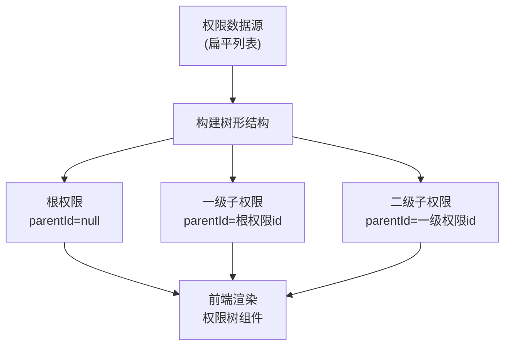
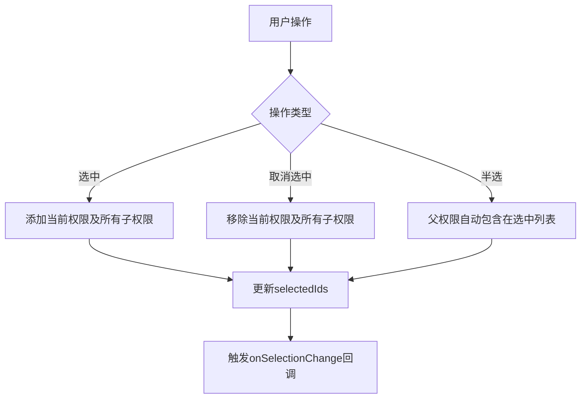

# 权限管理API

<cite>
**本文档引用的文件**  
- [permissions.json](file://data/permissions.json)
- [models.ts](file://src/repository/models.ts)
- [permissions.ts](file://src/lib/permissions.ts)
- [permission-tree.tsx](file://src/components/shared/permission-tree.tsx)
- [route.ts](file://src/app/api/permissions/route.ts)
- [\[id\]/route.ts](file://src/app/api/permissions/[id]/route.ts)
- [all/route.ts](file://src/app/api/permissions/all/route.ts)
</cite>

## 目录
1. [简介](#简介)
2. [权限对象结构](#权限对象结构)
3. [API端点说明](#api端点说明)
4. [树形权限结构实现](#树形权限结构实现)
5. [权限树前端组件](#权限树前端组件)
6. [使用示例与最佳实践](#使用示例与最佳实践)

## 简介
本API提供完整的权限管理功能，支持权限的增删改查操作，并支持树形结构的权限组织方式。系统通过`parentId`字段实现权限的层级关系，支持前端构建权限树形选择器。特别提供`/api/permissions/all`端点返回所有权限的扁平列表，便于前端构建树形结构。

## 权限对象结构
权限对象包含以下字段：

| 字段名 | 类型 | 是否必填 | 说明 |
|-------|------|---------|------|
| id | number | 是 | 权限唯一标识 |
| name | string | 是 | 权限名称（如"查看仪表盘"） |
| code | string | 是 | 权限编码（如"dashboard:view"），用于代码中权限校验 |
| description | string | 否 | 权限描述信息 |
| parentId | number \| null | 否 | 父权限ID，null表示根权限 |
| sortOrder | number | 否 | 排序序号，用于同级权限排序 |
| createdAt | string | 否 | 创建时间（ISO格式） |
| updatedAt | string | 否 | 更新时间（ISO格式） |

**Section sources**
- [models.ts](file://src/repository/models.ts#L29-L38)
- [permissions.json](file://data/permissions.json#L1-L12)

## API端点说明

### GET /api/permissions - 获取权限列表（分页）
获取权限列表，支持分页和查询参数。

**请求参数：**
- `page`: 页码（默认1）
- `limit`: 每页数量（默认10，最大100）
- `name`: 权限名称模糊查询
- `code`: 权限编码精确查询
- `description`: 描述模糊查询
- `startDate`: 创建时间起始（ISO格式）
- `endDate`: 创建时间结束（ISO格式）

**响应示例：**
```json
{
  "data": [
    {
      "id": 1,
      "name": "查看仪表盘",
      "code": "dashboard:view",
      "description": "访问仪表盘",
      "parentId": null,
      "sortOrder": 0
    }
  ],
  "page": 1,
  "limit": 10,
  "total": 1,
  "totalPages": 1
}
```

**Section sources**
- [route.ts](file://src/app/api/permissions/route.ts#L4-L42)

### POST /api/permissions - 创建权限
创建新的权限。

**请求体：**
```json
{
  "name": "权限名称",
  "code": "权限编码",
  "description": "权限描述"
}
```

**Section sources**
- [route.ts](file://src/app/api/permissions/route.ts#L44-L62)

### GET /api/permissions/[id] - 获取单个权限
根据ID获取单个权限详情。

**Section sources**
- [\id\route.ts](file://src/app/api/permissions/[id]/route.ts#L4-L20)

### PUT /api/permissions/[id] - 更新权限
更新权限信息。

**请求体：**
```json
{
  "name": "更新后的名称",
  "code": "更新后的编码",
  "description": "更新后的描述"
}
```

**Section sources**
- [\id\route.ts](file://src/app/api/permissions/[id]/route.ts#L4-L20)

### DELETE /api/permissions/[id] - 删除权限
删除指定ID的权限。

**Section sources**
- [\id\route.ts](file://src/app/api/permissions/[id]/route.ts#L22-L34)

### GET /api/permissions/all - 获取所有权限（扁平列表）
获取所有权限的扁平列表，按`sortOrder`排序，用于前端构建权限树。

**响应示例：**
```json
{
  "data": [
    {
      "id": 1,
      "name": "查看仪表盘",
      "code": "dashboard:view",
      "description": "访问仪表盘",
      "parentId": null,
      "sortOrder": 0
    }
  ]
}
```

**Section sources**
- [all/route.ts](file://src/app/api/permissions/all/route.ts#L4-L25)

## 树形权限结构实现
系统通过`parentId`字段实现树形权限结构。权限数据存储为扁平列表，但在使用时通过算法构建树形结构。

**树形结构构建逻辑：**
1. 所有`parentId`为`null`或不存在的权限为根节点
2. `parentId`指向其他权限`id`的权限为子节点
3. 通过递归算法将扁平列表转换为树形结构
4. 同级权限按`sortOrder`字段排序



**Diagram sources**
- [permission-tree.tsx](file://src/components/shared/permission-tree.tsx#L287-L322)
- [models.ts](file://src/repository/models.ts#L29-L38)

## 权限树前端组件
`PermissionTree`组件用于在前端展示和选择树形权限。

**组件特性：**
- 支持展开/折叠层级
- 复选框支持三种状态：选中、半选、未选中
- 自动计算父节点选中状态
- 选择子权限时自动包含父权限
- 支持禁用状态

**交互逻辑：**
- 选中父权限：自动选中所有子权限
- 取消选中父权限：自动取消选中所有子权限
- 部分子权限被选中：父权限显示半选状态
- 半选状态的父权限会被包含在选中ID列表中



**Diagram sources**
- [permission-tree.tsx](file://src/components/shared/permission-tree.tsx#L116-L141)
- [permission-tree.tsx](file://src/components/shared/permission-tree.tsx#L325-L377)

## 使用示例与最佳实践

### 创建树形权限示例
```json
// 根权限
{
  "id": 1,
  "name": "用户管理",
  "code": "user:manage",
  "parentId": null,
  "sortOrder": 1
}

// 子权限
{
  "id": 2,
  "name": "查看用户",
  "code": "user:read",
  "parentId": 1,
  "sortOrder": 1
}

{
  "id": 3,
  "name": "创建用户",
  "code": "user:create",
  "parentId": 1,
  "sortOrder": 2
}
```

### 最佳实践
1. **权限编码规范**：使用`模块:操作`格式，如`user:read`、`role:create`
2. **层级深度**：建议不超过3级，避免过于复杂的权限结构
3. **排序**：合理设置`sortOrder`确保权限在UI中有序展示
4. **权限粒度**：权限应足够细粒度，但避免过度拆分
5. **常量定义**：在代码中使用常量引用权限编码，避免硬编码

**Section sources**
- [permissions.ts](file://src/lib/permissions.ts#L4-L33)
- [permission-tree.tsx](file://src/components/shared/permission-tree.tsx#L16-L24)