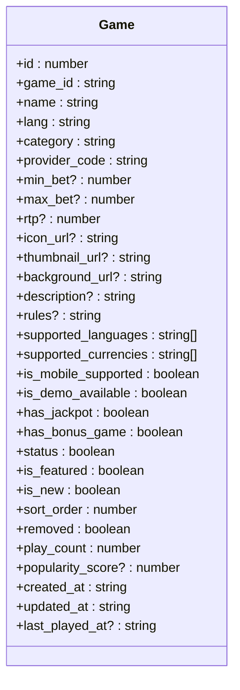
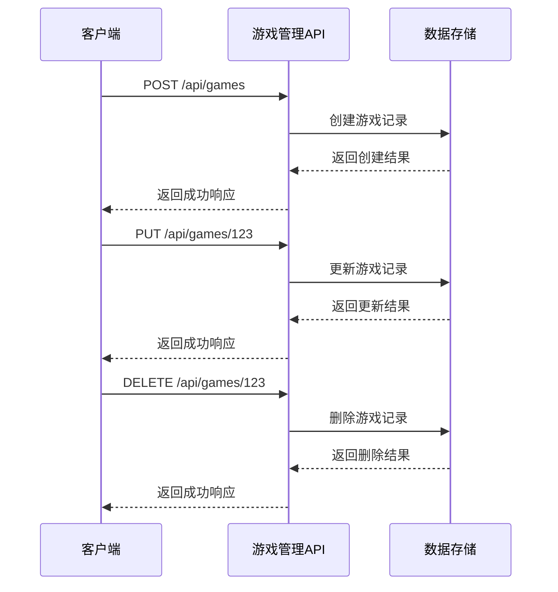
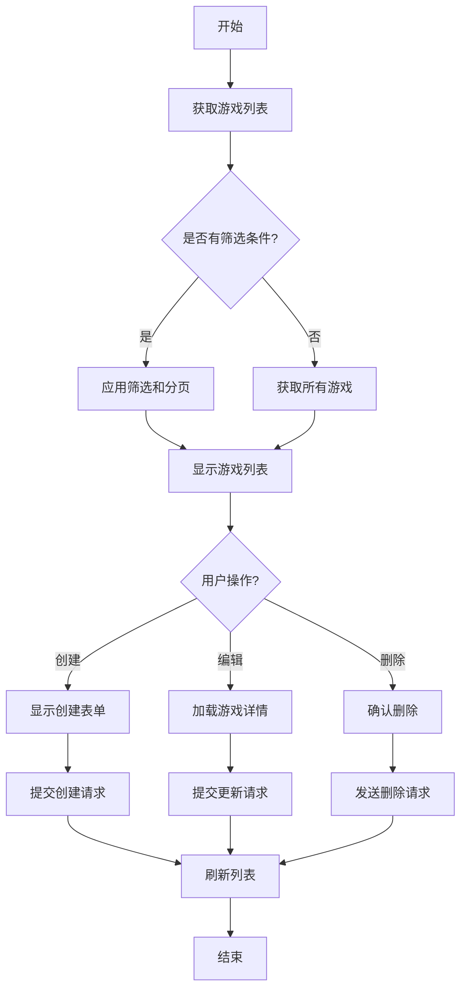

# 游戏管理API

<cite>
**本文档引用的文件**   
- [route.ts](file://src/app/api/games/route.ts)
- [list/route.ts](file://src/app/api/games/list/route.ts)
- [[id]/route.ts](file://src/app/api/games/[id]/route.ts)
- [types.ts](file://src/app/dashboard/games/types.ts)
- [useGameManagement.ts](file://src/app/dashboard/games/hooks/useGameManagement.ts)
</cite>

## 目录
1. [简介](#简介)
2. [核心API端点](#核心api端点)
3. [Game对象定义](#game对象定义)
4. [游戏列表获取](#游戏列表获取)
5. [游戏创建与管理](#游戏创建与管理)
6. [简化游戏列表](#简化游戏列表)
7. [与其他模块的关联](#与其他模块的关联)
8. [完整示例](#完整示例)

## 简介
游戏管理API提供了一套完整的RESTful接口，用于管理游戏资源。该API支持游戏的创建、读取、更新和删除操作，同时提供分页和筛选功能。系统通过POST /api/games/list端点获取游戏列表，支持多种筛选条件和分页参数。此外，还提供了GET /api/games/[id]获取单个游戏详情，POST /api/games创建新游戏，以及PUT /api/games/[id]更新游戏信息的功能。

**Section sources**
- [route.ts](file://src/app/api/games/route.ts#L1-L45)
- [list/route.ts](file://src/app/api/games/list/route.ts#L1-L287)

## 核心API端点
游戏管理API包含以下核心端点：

| 端点 | 方法 | 描述 |
|------|------|------|
| /api/games/list | POST | 获取带分页和筛选的游戏列表 |
| /api/games | POST | 创建新游戏 |
| /api/games/[id] | GET | 获取单个游戏详情 |
| /api/games/[id] | PUT | 更新游戏信息 |
| /api/games/[id] | DELETE | 删除游戏 |

这些端点构成了游戏管理的核心功能，允许管理员全面控制游戏资源。

**Section sources**
- [route.ts](file://src/app/api/games/route.ts#L1-L45)
- [[id]/route.ts](file://src/app/api/games/[id]/route.ts#L1-L92)
- [list/route.ts](file://src/app/api/games/list/route.ts#L1-L287)

## Game对象定义
Game对象包含游戏的完整信息，定义了游戏的各种属性和状态。



**Diagram sources**
- [types.ts](file://src/app/dashboard/games/types.ts#L3-L34)

**Section sources**
- [types.ts](file://src/app/dashboard/games/types.ts#L3-L34)

## 游戏列表获取
通过POST /api/games/list端点获取游戏列表，支持分页和多种筛选条件。

### 请求参数
请求体包含分页和筛选参数：

| 参数 | 类型 | 描述 |
|------|------|------|
| page | number | 页码（默认1） |
| page_size | number | 每页数量（默认20） |
| keyword | string | 关键词搜索（游戏名称或标识） |
| provider_codes | string[] | 供应商代码筛选 |
| categories | string[] | 分类筛选 |
| lang | string | 语言筛选 |
| status | boolean | 状态筛选（启用/停用） |
| is_new | boolean | 新品筛选 |
| is_featured | boolean | 推荐筛选 |
| sort_by | string | 排序字段 |
| sort_dir | 'asc'&#124;'desc' | 排序方向 |

### 响应结构
响应包含分页信息和游戏列表：

```json
{
  "total": 264,
  "page": 1,
  "page_size": 20,
  "list": [
    {
      "id": 123,
      "game_id": "PG_DRAGON_HERO",
      "name": "龙之英雄",
      "category": "slot",
      "provider_code": "PG",
      "status": true,
      "is_featured": true,
      "play_count": 9821
    }
  ]
}
```

**Section sources**
- [list/route.ts](file://src/app/api/games/list/route.ts#L1-L287)
- [useGameManagement.ts](file://src/app/dashboard/games/hooks/useGameManagement.ts#L17-L79)

## 游戏创建与管理
游戏管理API提供完整的CRUD操作，支持游戏的创建、更新和删除。

### 创建游戏
使用POST /api/games创建新游戏，请求体包含游戏的基本信息：

```json
{
  "game_id": "PG_NEW_GAME",
  "name": "新游戏",
  "lang": "zh-CN",
  "category": "slot",
  "provider_code": "PG",
  "status": true,
  "is_featured": false
}
```

### 更新游戏
使用PUT /api/games/[id]更新游戏信息，可以更新单个或多个字段：

```json
{
  "status": false,
  "is_featured": true
}
```

### 删除游戏
使用DELETE /api/games/[id]删除指定游戏，删除操作需要确认。



**Diagram sources**
- [route.ts](file://src/app/api/games/route.ts#L1-L45)
- [[id]/route.ts](file://src/app/api/games/[id]/route.ts#L1-L92)

**Section sources**
- [route.ts](file://src/app/api/games/route.ts#L1-L45)
- [[id]/route.ts](file://src/app/api/games/[id]/route.ts#L1-L92)
- [useGameManagement.ts](file://src/app/dashboard/games/hooks/useGameManagement.ts#L94-L166)

## 简化游戏列表
GET /api/games/list端点可能提供简化的游戏列表，用于其他功能的下拉选择。

### 简化响应
简化版本仅包含id和名称字段：

```json
{
  "total": 264,
  "page": 1,
  "page_size": 20,
  "list": [
    {
      "id": 123,
      "game_id": "PG_DRAGON_HERO",
      "name": "龙之英雄"
    }
  ]
}
```

这种简化列表适用于需要快速加载游戏选项的场景，如活动配置、公告关联等。

**Section sources**
- [list/route.ts](file://src/app/api/games/list/route.ts#L1-L287)

## 与其他模块的关联
游戏管理API与其他模块有紧密的关联，支持系统的整体功能。

### 与活动模块的关联
游戏可以作为活动的组成部分，通过游戏ID关联到特定活动。活动配置时可以从简化游戏列表中选择参与活动的游戏。

### 与公告模块的关联
公告可以关联到特定游戏，当游戏有重要更新时，可以通过公告通知玩家。游戏详情页会显示相关的公告信息。

### 与权限系统的关联
游戏管理操作需要相应的权限控制，只有具有游戏管理权限的用户才能执行创建、更新和删除操作。

**Section sources**
- [types.ts](file://src/app/dashboard/games/types.ts#L3-L34)
- [useGameManagement.ts](file://src/app/dashboard/games/hooks/useGameManagement.ts#L17-L212)

## 完整示例
以下是一个完整的游戏管理操作示例：



**Diagram sources**
- [useGameManagement.ts](file://src/app/dashboard/games/hooks/useGameManagement.ts#L17-L212)
- [page.tsx](file://src/app/dashboard/games/page.tsx#L17-L224)

**Section sources**
- [useGameManagement.ts](file://src/app/dashboard/games/hooks/useGameManagement.ts#L17-L212)
- [page.tsx](file://src/app/dashboard/games/page.tsx#L17-L224)