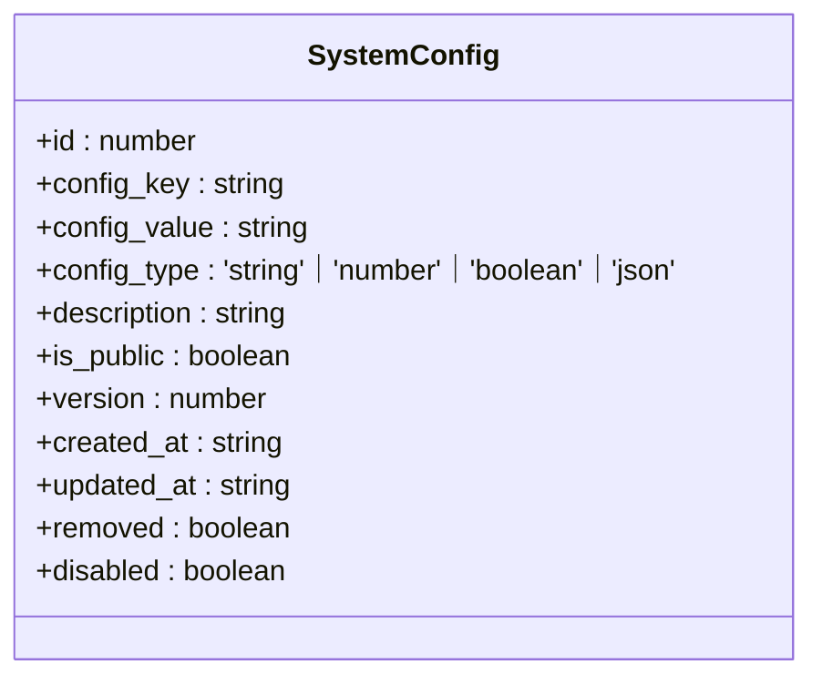
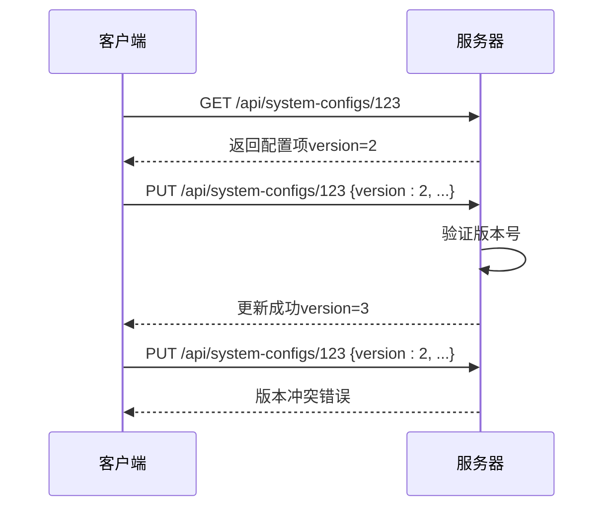
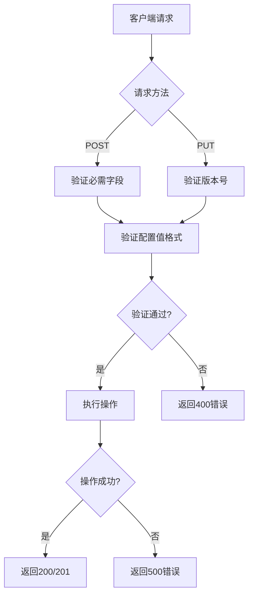
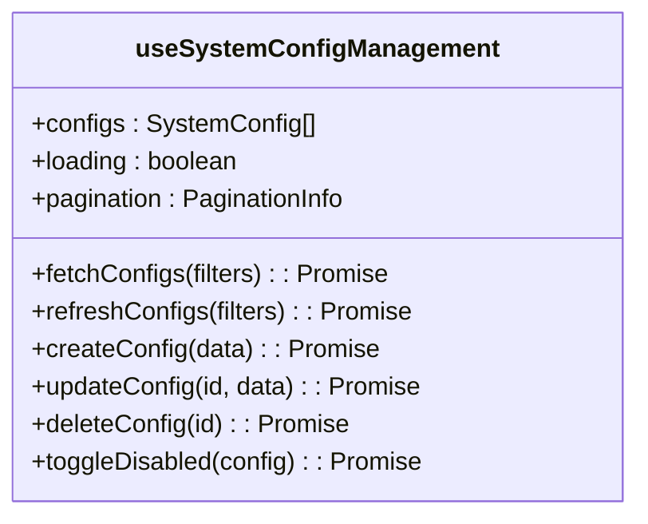

# 系统配置API

<cite>
**本文档引用的文件**
- [route.ts](file://src/app/api/system-configs/route.ts)
- [types.ts](file://src/app/dashboard/system/config/types.ts)
- [useSystemConfigManagement.ts](file://src/app/dashboard/system/config/hooks/useSystemConfigManagement.ts)
- [constants.ts](file://src/app/dashboard/system/config/constants.ts)
- [system-configs\[id\]\route.ts](file://src/app/api/system-configs/[id]/route.ts)
</cite>

## 目录
1. [简介](#简介)
2. [API端点](#api端点)
3. [配置项对象结构](#配置项对象结构)
4. [安全更新实践](#安全更新实践)
5. [错误处理](#错误处理)
6. [前端实现](#前端实现)

## 简介
系统配置API用于管理系统级参数，如应用名称、默认设置等核心配置。该API提供了一套完整的CRUD操作，支持创建、读取、更新和删除系统配置项。所有配置项都经过严格的类型验证和权限控制，确保系统配置的安全性和一致性。

**Section sources**
- [route.ts](file://src/app/api/system-configs/route.ts#L1-L70)
- [types.ts](file://src/app/dashboard/system/config/types.ts#L1-L77)

## API端点

### GET /api/system-configs/list
获取所有系统配置项列表。该端点支持分页和多种筛选条件。

**请求示例**
```http
POST /api/system-configs/list
Content-Type: application/json

{
  "page": 1,
  "page_size": 20,
  "keyword": "app",
  "config_types": ["string"],
  "is_public": true,
  "disabled": false,
  "sort_by": "updated_at",
  "sort_dir": "desc"
}
```

### POST /api/system-configs
创建新的配置项。

**请求示例**
```http
POST /api/system-configs
Content-Type: application/json

{
  "config_key": "app.name",
  "config_value": "游戏管理系统",
  "config_type": "string",
  "description": "应用名称",
  "is_public": true,
  "disabled": false
}
```

### GET /api/system-configs/[id]
获取特定配置项的详细信息。

**请求示例**
```http
GET /api/system-configs/123
```

### PUT /api/system-configs/[id]
更新配置项的值。

**请求示例**
```http
PUT /api/system-configs/123
Content-Type: application/json

{
  "config_value": "新应用名称",
  "version": 2
}
```

### DELETE /api/system-configs/[id]
删除配置项。

**请求示例**
```http
DELETE /api/system-configs/123
```

**Section sources**
- [route.ts](file://src/app/api/system-configs/route.ts#L1-L70)
- [system-configs\[id\]\route.ts](file://src/app/api/system-configs/[id]/route.ts#L1-L133)

## 配置项对象结构
系统配置项包含以下属性：

| 属性名 | 类型 | 必需 | 描述 |
|-------|------|------|------|
| id | number | 是 | 配置项唯一标识 |
| config_key | string | 是 | 配置键，必须唯一 |
| config_value | string | 是 | 配置值，存储为字符串 |
| config_type | string | 是 | 配置值类型：string、number、boolean、json |
| description | string | 否 | 配置项描述 |
| is_public | boolean | 否 | 是否为公开配置 |
| version | number | 是 | 版本号，用于乐观锁 |
| created_at | string | 是 | 创建时间（ISO格式） |
| updated_at | string | 是 | 更新时间（ISO格式） |
| removed | boolean | 是 | 是否已删除 |
| disabled | boolean | 是 | 是否已禁用 |

**配置值类型验证规则：**
- **string**: 普通字符串值
- **number**: 必须是有效的数字格式
- **boolean**: 必须是'true'、'false'、'1'或'0'
- **json**: 必须是有效的JSON格式



**Diagram sources**
- [types.ts](file://src/app/dashboard/system/config/types.ts#L4-L15)

## 安全更新实践
为确保系统配置的安全更新，API实现了以下安全机制：

### 乐观锁机制
所有更新操作都必须包含版本号（version）字段。服务器会验证版本号是否匹配，防止并发更新冲突。



**Diagram sources**
- [system-configs\[id\]\route.ts](file://src/app/api/system-configs/[id]/route.ts#L54-L58)
- [useSystemConfigManagement.ts](file://src/app/dashboard/system/config/hooks/useSystemConfigManagement.ts#L116-L147)

### 输入验证
API对所有输入数据进行严格验证：

1. **必需字段验证**: 确保config_key、config_value和config_type存在
2. **类型格式验证**: 根据config_type验证config_value的格式
3. **JSON格式验证**: 对config_type为'json'的值进行JSON解析验证
4. **数字格式验证**: 对config_type为'number'的值进行数字解析验证
5. **布尔值验证**: 对config_type为'boolean'的值进行有效值检查

### 权限控制
系统配置操作需要相应的权限：
- **创建配置**: 需要`system.config.create`权限
- **读取配置**: 需要`system.config.read`权限
- **更新配置**: 需要`system.config.update`权限
- **删除配置**: 需要`system.config.delete`权限

**Section sources**
- [system-configs\[id\]\route.ts](file://src/app/api/system-configs/[id]/route.ts#L54-L87)
- [route.ts](file://src/app/api/system-configs/route.ts#L12-L43)

## 错误处理
API返回标准化的错误响应：

| HTTP状态码 | 错误类型 | 描述 |
|-----------|---------|------|
| 400 | Bad Request | 输入数据验证失败 |
| 404 | Not Found | 配置项不存在 |
| 409 | Conflict | 版本冲突或键已存在 |
| 500 | Internal Server Error | 服务器内部错误 |

**常见错误消息：**
- `缺少必需字段: config_key, config_value, config_type`
- `配置值不是有效的JSON格式`
- `配置值不是有效的数字格式`
- `配置值不是有效的布尔值（true/false/1/0）`
- `缺少版本号（version）字段，无法进行更新`
- `版本冲突，请刷新后重试`



**Diagram sources**
- [route.ts](file://src/app/api/system-configs/route.ts#L12-L69)
- [system-configs\[id\]\route.ts](file://src/app/api/system-configs/[id]/route.ts#L54-L105)

## 前端实现
前端使用React Hooks管理配置项的状态和操作。

### 状态管理Hook
`useSystemConfigManagement` Hook提供了配置项的CRUD操作：



**Section sources**
- [useSystemConfigManagement.ts](file://src/app/dashboard/system/config/hooks/useSystemConfigManagement.ts#L1-L202)
- [constants.ts](file://src/app/dashboard/system/config/constants.ts#L122-L142)