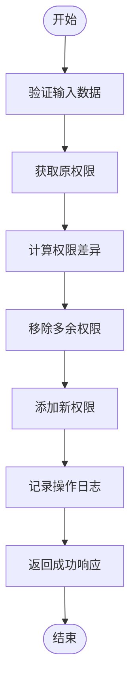

# 角色管理API

<cite>
**本文档引用的文件**
- [roles.json](file://data/roles.json)
- [rolePermissions.json](file://data/rolePermissions.json)
- [route.ts](file://src/app/api/roles/route.ts)
- [route.ts](file://src/app/api/roles/[id]/route.ts)
- [route.ts](file://src/app/api/roles/[id]/permissions/route.ts)
- [route.ts](file://src/app/api/roles/label/route.ts)
- [role.ts](file://src/service/api/role.ts)
</cite>

## 目录
1. [简介](#简介)
2. [核心API端点](#核心api端点)
3. [角色权限管理](#角色权限管理)
4. [角色标签端点](#角色标签端点)
5. [数据结构定义](#数据结构定义)
6. [请求响应示例](#请求响应示例)
7. [业务逻辑说明](#业务逻辑说明)

## 简介
本API文档详细描述了系统中角色管理模块的接口设计与功能实现。通过该API，管理员可以对系统角色进行增删改查操作，并分配和管理角色权限。所有角色数据存储于`data/roles.json`，权限分配关系存储于`data/rolePermissions.json`，采用JSON文件作为持久化存储。

## 核心API端点

### GET /api/roles - 获取角色列表
支持分页查询，可按名称、创建时间范围筛选角色。默认每页10条，最多支持100条/页。

**Section sources**
- [route.ts](file://src/app/api/roles/route.ts#L6-L39)

### POST /api/roles - 创建角色
创建新角色，需提供角色名称和描述。系统会校验角色名是否已存在，防止重复创建。

**Section sources**
- [route.ts](file://src/app/api/roles/route.ts#L42-L97)

### GET /api/roles/[id] - 获取特定角色
根据ID获取单个角色的详细信息。

**Section sources**
- [route.ts](file://src/app/api/roles/[id]/route.ts#L1-L120)

### PUT /api/roles/[id] - 更新角色
更新指定ID角色的名称和描述信息。系统会记录变更字段的日志。

**Section sources**
- [route.ts](file://src/app/api/roles/[id]/route.ts#L9-L68)

### DELETE /api/roles/[id] - 删除角色
删除指定ID的角色。超级管理员角色受保护，不可删除。

**Section sources**
- [route.ts](file://src/app/api/roles/[id]/route.ts#L71-L118)

## 角色权限管理

### GET /api/roles/[id]/permissions - 获取角色权限
返回指定角色当前拥有的所有权限列表，包含权限ID、名称、编码和描述。


**Diagram sources**
- [route.ts](file://src/app/api/roles/[id]/permissions/route.ts#L7-L37)

### PUT /api/roles/[id]/permissions - 分配角色权限
更新角色的权限集合，接收`permissionIds`数组参数。系统采用幂等设计，自动计算新增与移除的权限并执行相应操作。



**Diagram sources**
- [route.ts](file://src/app/api/roles/[id]/permissions/route.ts#L41-L107)

## 角色标签端点

### GET /api/roles/label - 获取角色标签列表
返回所有角色的ID和名称，用于前端下拉选择器等场景。一次性加载所有角色（适用于小数据量场景）。

**Section sources**
- [route.ts](file://src/app/api/roles/label/route.ts#L4-L14)

## 数据结构定义

### Role对象
表示系统中的角色实体。

| 字段 | 类型 | 说明 |
|------|------|------|
| id | number | 角色唯一标识 |
| name | string | 角色名称 |
| isSuper | boolean | 是否为超级管理员 |
| description | string | 角色描述 |
| createdAt | string | 创建时间（ISO格式） |
| updatedAt | string | 更新时间（ISO格式） |

**Section sources**
- [roles.json](file://data/roles.json#L1-L10)

### RolePermission对象
表示角色与权限的关联关系。

| 字段 | 类型 | 说明 |
|------|------|------|
| id | number | 关联记录ID |
| roleId | number | 角色ID |
| permissionId | number | 权限ID |
| createdAt | string | 创建时间（ISO格式） |

**Section sources**
- [rolePermissions.json](file://data/rolePermissions.json#L1-L8)

## 请求响应示例

### 获取角色列表响应
```json
{
  "data": [
    {
      "id": 1,
      "name": "超级管理员",
      "isSuper": true,
      "description": "拥有所有权限",
      "createdAt": "2024-01-01T00:00:00.000Z",
      "updatedAt": "2024-01-01T00:00:00.000Z"
    }
  ],
  "meta": {
    "page": 1,
    "limit": 10,
    "total": 1,
    "totalPages": 1
  },
  "success": true
}
```

### 分配角色权限请求
```json
{
  "permissionIds": [1, 2, 3]
}
```

## 业务逻辑说明
角色权限分配采用"全量更新+差异计算"模式。当接收到新的权限ID数组时，系统会：
1. 查询当前角色已有的权限集合
2. 计算需要新增的权限（在新集合中但不在原集合）
3. 计算需要移除的权限（在原集合中但不在新集合）
4. 依次执行删除和新增操作
5. 记录详细的变更日志，包括操作人、变更前后状态等

该设计确保了权限更新的幂等性，无论调用多少次，最终状态都与最后一次请求一致。同时通过细粒度日志记录，保证了操作的可追溯性。

**Section sources**
- [route.ts](file://src/app/api/roles/[id]/permissions/route.ts#L66-L94)
- [route.ts](file://src/app/api/roles/route.ts#L43-L97)
- [route.ts](file://src/app/api/roles/[id]/route.ts#L13-L68)