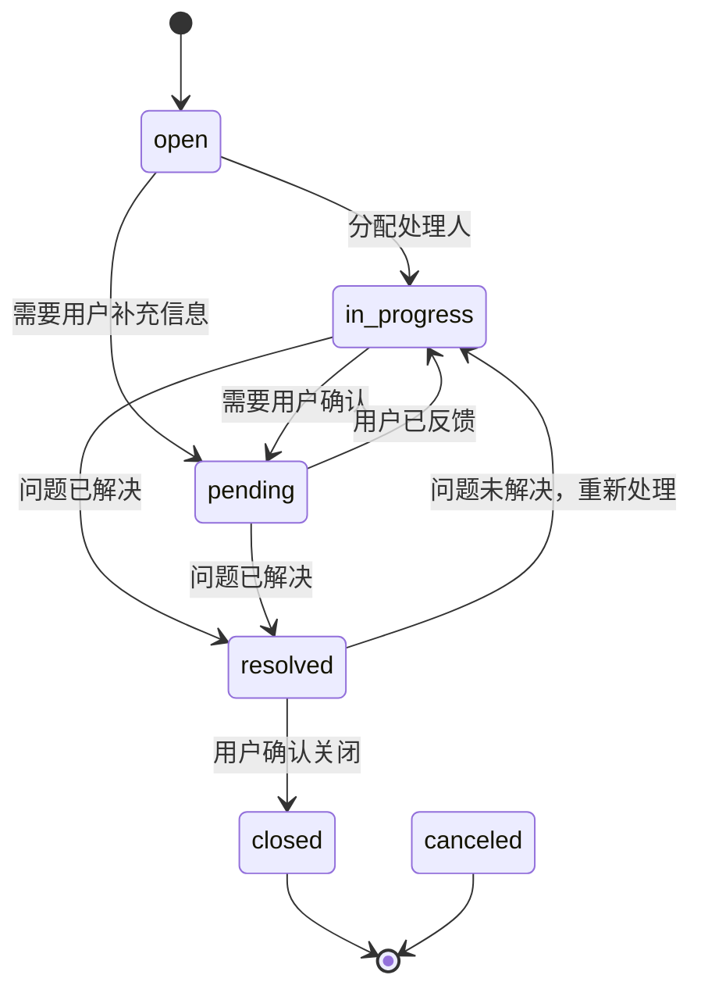
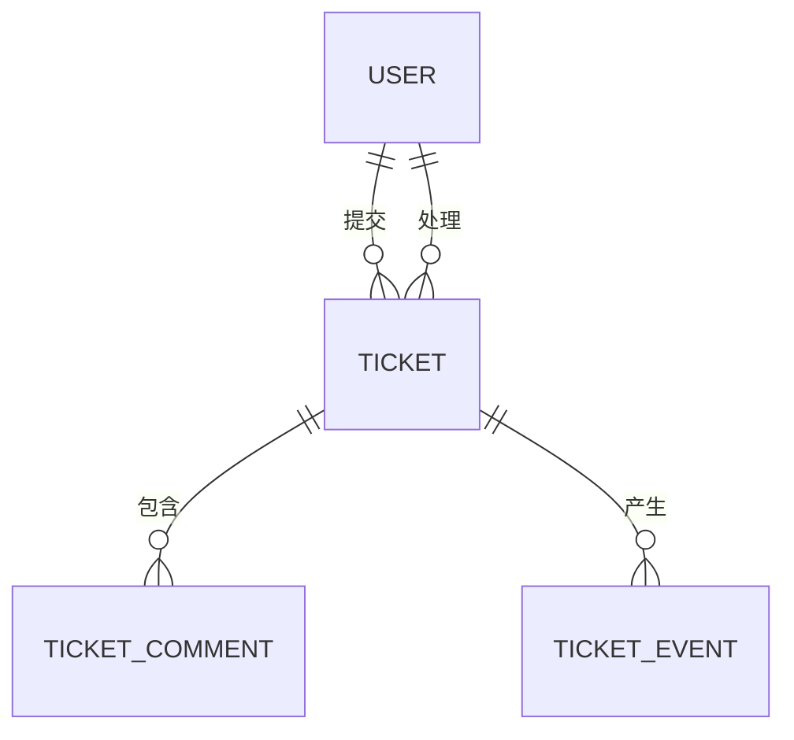

# 工单模型

<cite>
**本文档引用文件**  
- [tickets.json](file://data/tickets.json)
- [ticketComments.json](file://data/ticketComments.json)
- [ticketEvents.json](file://data/ticketEvents.json)
- [users.json](file://data/users.json)
- [models.ts](file://src/repository/models.ts)
- [ticket.ts](file://src/service/api/ticket.ts)
</cite>

## 目录
1. [引言](#引言)
2. [工单核心字段定义](#工单核心字段定义)
3. [工单状态流转逻辑](#工单状态流转逻辑)
4. [优先级业务影响](#优先级业务影响)
5. [工单关联关系](#工单关联关系)
6. [总结](#总结)

## 引言
本工单模型文档旨在全面定义 v0-game_admin 系统中工单（Ticket）的数据结构、状态流转机制、优先级策略及其与其他实体的关联关系。通过分析 `tickets.json` 中的实际数据与 `models.ts` 中的类型定义，确保前后端对工单的理解一致，并为后续功能开发、查询统计和自动化处理提供依据。

**Section sources**
- [models.ts](file://src/repository/models.ts#L82-L102)
- [tickets.json](file://data/tickets.json)

## 工单核心字段定义
工单接口（`Ticket`）包含以下字段，定义于 `models.ts` 中，用于描述用户提交的问题或请求的完整上下文。

| 字段名 | 类型 | 是否必填 | 说明 |
|-------|------|----------|------|
| `id` | 数字 | 是 | 工单唯一标识符 |
| `title` | 字符串 | 是 | 工单标题，简明扼要描述问题 |
| `description` | 字符串 | 是 | 详细问题描述，包含上下文信息 |
| `status` | 枚举 | 是 | 当前状态，取值：`open`, `in_progress`, `pending`, `resolved`, `closed`, `canceled` |
| `priority` | 枚举 | 是 | 优先级，取值：`low`, `normal`, `high`, `urgent` |
| `category` | 字符串 | 是 | 问题分类，如 `payment`, `account`, `game`, `vip`, `withdrawal` 等 |
| `tags` | 字符串数组 | 否 | 标签数组，用于多维度标记（如 `deposit`, `refund`, `VIP`） |
| `userId` | 数字 | 是 | 提单人用户ID，关联 `users` 表 |
| `assigneeId` | 数字（可选） | 否 | 处理人工号，`null` 表示未分配 |
| `attachmentsCount` | 数字（可选） | 否 | 附件数量，默认为 0 |
| `dueAt` | 时间戳（可选） | 否 | 截止时间（ISO 格式），`null` 表示无截止时间 |
| `createdAt` | 时间戳 | 是 | 创建时间 |
| `updatedAt` | 时间戳 | 是 | 最后更新时间 |
| `resolvedAt` | 时间戳（可选） | 否 | 解决时间，`null` 表示未解决 |
| `closedAt` | 时间戳（可选） | 否 | 关闭时间，`null` 表示未关闭 |

**Section sources**
- [models.ts](file://src/repository/models.ts#L86-L102)
- [tickets.json](file://data/tickets.json)

## 工单状态流转逻辑
工单状态反映了问题处理的生命周期。通过分析 `tickets.json` 和 `ticketEvents.json`，可梳理出以下状态流转逻辑：

**Diagram sources**
- [models.ts](file://src/repository/models.ts#L83)
- [ticketEvents.json](file://data/ticketEvents.json)

### 状态说明与流转示例
- **`open`（开启）**：工单刚创建，等待分配。例如工单ID 3（游戏卡顿）当前为 `open`。
- **`in_progress`（处理中）**：已分配处理人，正在处理。例如工单ID 1（充值失败）和ID 5（提现延迟）均为 `in_progress`。
- **`pending`（待处理/待确认）**：处理过程暂停，需用户反馈或等待外部条件。例如工单ID 2（账户锁定）在解决后被设为 `pending`，等待用户确认登录是否成功。
- **`resolved`（已解决）**：问题已处理完毕，等待用户确认。例如工单ID 4（VIP特权未生效）已解决，但尚未关闭。
- **`closed`（已关闭）**：用户确认问题解决，工单归档。目前示例中无此状态。
- **`canceled`（已取消）**：工单被取消，通常由提单人或管理员操作。

状态变更通过 `TicketAPI.changeTicketStatus()` 接口触发，并在 `ticketEvents` 中记录 `status_changed` 事件。

**Section sources**
- [tickets.json](file://data/tickets.json)
- [ticketEvents.json](file://data/ticketEvents.json)
- [ticket.ts](file://src/service/api/ticket.ts#L99-L103)

## 优先级业务影响
优先级决定了工单的处理顺序和资源分配，直接影响用户满意度和系统 SLA。

| 优先级 | 业务影响 | 处理建议 |
|--------|----------|----------|
| `low`（低） | 影响轻微，如界面错别字、非核心功能建议 | 可安排在低峰期处理，响应时间可放宽 |
| `normal`（普通） | 一般性问题，影响部分用户体验 | 在正常工作时间内处理，建议24小时内响应 |
| `high`（高） | 影响核心功能，如充值失败、VIP权益问题 | 需立即关注，优先处理，建议2小时内响应 |
| `urgent`（紧急） | 严重影响用户或系统，如账户锁定、大额提现延迟 | 最高优先级，需立即处理，建议30分钟内响应 |

**示例分析**：
- 工单ID 1（充值失败）为 `high` 优先级，涉及资金问题，需财务介入。
- 工单ID 2（账户锁定）和ID 5（提现延迟）为 `urgent` 优先级，直接影响用户登录和资金提取，必须最优先处理。

优先级可在创建时指定或后续通过 `TicketAPI.updateTicket()` 调整。

**Section sources**
- [models.ts](file://src/repository/models.ts#L84)
- [tickets.json](file://data/tickets.json)
- [ticket.ts](file://src/service/api/ticket.ts#L76-L80)

## 工单关联关系
工单系统通过外键与多个实体关联，形成完整的支持闭环。

### 与用户（User）的关联
- **提单人**：通过 `userId` 字段关联 `users` 表，可获取用户信息（如VIP等级）以判断优先级。
- **处理人**：通过 `assigneeId` 字段关联 `users` 表，明确责任归属。

**Diagram sources**
- [models.ts](file://src/repository/models.ts#L6-L18)
- [tickets.json](file://data/tickets.json)
- [users.json](file://data/users.json)

### 与评论（TicketComment）的关联
- 每个工单可包含多条评论，存储在 `ticketComments.json` 中。
- `isInternal` 字段区分用户可见评论和内部备注（如工单ID 1的内部备注）。
- 评论按 `createdAt` 排序，形成处理过程的沟通记录。

**Section sources**
- [models.ts](file://src/repository/models.ts#L104-L112)
- [ticketComments.json](file://data/ticketComments.json)

### 与事件（TicketEvent）的关联
- 每个工单操作（创建、分配、状态变更等）都会生成一个事件，记录在 `ticketEvents.json` 中。
- `eventType` 字段定义事件类型，`oldValue` 和 `newValue` 记录变更前后值，`reason` 可记录原因。
- 事件流是审计和追溯工单处理过程的关键依据。

**Section sources**
- [models.ts](file://src/repository/models.ts#L114-L135)
- [ticketEvents.json](file://data/ticketEvents.json)

## 总结
v0-game_admin 的工单模型设计清晰，涵盖了问题处理的全生命周期。通过 `status` 和 `priority` 字段实现流程化和优先级管理，结合 `category` 和 `tags` 支持多维度分类与检索。工单与用户、评论、事件的关联关系，构建了一个完整的支持与审计体系，为提升客服效率和用户体验提供了坚实的数据基础。