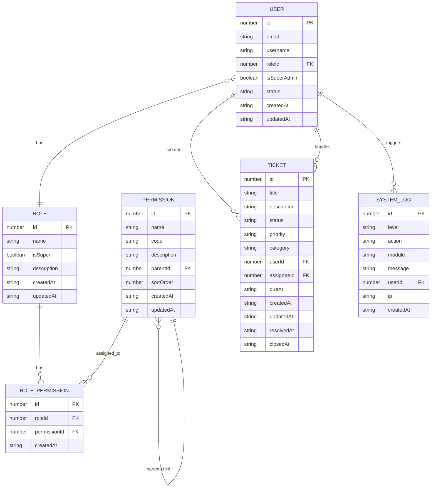

# 数据模型

<cite>
**Referenced Files in This Document**   
- [users.json](file://data/users.json)
- [roles.json](file://data/roles.json)
- [permissions.json](file://data/permissions.json)
- [rolePermissions.json](file://data/rolePermissions.json)
- [tickets.json](file://data/tickets.json)
- [systemLogs.json](file://data/systemLogs.json)
- [models.ts](file://src/repository/models.ts)
</cite>

## 目录
1. [用户模型](#用户模型)
2. [角色模型](#角色模型)
3. [权限模型](#权限模型)
4. [工单模型](#工单模型)
5. [系统日志模型](#系统日志模型)
6. [实体关系图](#实体关系图)

## 用户模型

用户（User）是系统的核心实体，代表系统中的操作者。其数据模型定义在 `src/repository/models.ts` 中的 `User` 接口，并通过 `data/users.json` 文件进行持久化存储。

**字段说明：**
- `id` (number): 用户的唯一标识符。
- `email` (string): 用户的邮箱地址，用于登录和身份识别。
- `username` (string): 用户名，用于显示和登录。
- `password` (string): 用户密码的加密哈希值，系统不存储明文密码。
- `avatar` (string | null): 用户头像的URL路径，可为空。
- `roleId` (number): 外键，关联到 `roles.json` 文件中的角色ID，定义了用户的基本权限。
- `isSuperAdmin` (boolean): 布尔值，标识该用户是否为超级管理员。超级管理员拥有所有权限，不受常规角色权限限制。
- `status` (enum): 用户状态，枚举值为 `'active'` 或 `'disabled'`。`'active'` 表示用户可以正常登录和操作，`'disabled'` 表示用户已被禁用，无法登录系统。
- `lastLoginAt` (string | null): ISO格式的时间字符串，记录用户最后一次成功登录的时间。
- `createdAt` (string): ISO格式的时间字符串，记录用户创建时间。
- `updatedAt` (string): ISO格式的时间字符串，记录用户信息最后一次更新时间。

**业务含义：**
用户模型是权限控制的基础。通过 `roleId` 字段与角色模型建立关联，用户的权限由其所属角色决定。`status` 字段用于实现用户账号的启用和禁用功能，`isSuperAdmin` 字段为系统提供了最高权限的管理入口。

**Section sources**
- [models.ts](file://src/repository/models.ts#L6-L17)
- [users.json](file://data/users.json)

## 角色模型

角色（Role）是权限管理的载体，用于对权限进行分组，以便于批量分配给用户。其数据模型定义在 `src/repository/models.ts` 中的 `Role` 接口，并通过 `data/roles.json` 文件进行持久化存储。

**字段说明：**
- `id` (number): 角色的唯一标识符。
- `name` (string): 角色的名称，如“超级管理员”、“客服主管”等，用于显示。
- `isSuper` (boolean): 布尔值，标识该角色是否为超级角色。此字段与用户模型中的 `isSuperAdmin` 相对应，用于在角色层面定义最高权限。
- `description` (string | null): 角色的描述信息，可为空，用于说明该角色的职责和权限范围。
- `createdAt` (string): ISO格式的时间字符串，记录角色创建时间。
- `updatedAt` (string): ISO格式的时间字符串，记录角色信息最后一次更新时间。

**业务含义：**
角色模型实现了权限的抽象和复用。通过将一组权限赋予一个角色，可以方便地将该角色分配给多个用户，从而实现权限的批量管理。例如，创建一个“客服”角色并赋予处理工单的权限，然后将所有客服人员的 `roleId` 设置为该角色的ID。

**Section sources**
- [models.ts](file://src/repository/models.ts#L20-L26)
- [roles.json](file://data/roles.json)

## 权限模型

权限（Permission）是系统中最小的权限单元，代表一项具体的操作能力。其数据模型定义在 `src/repository/models.ts` 中的 `Permission` 接口，并通过 `data/permissions.json` 文件进行持久化存储。

**字段说明：**
- `id` (number): 权限的唯一标识符。
- `name` (string): 权限的中文名称，如“查看仪表盘”、“管理用户”等，用于界面显示。
- `code` (string): 权限的唯一编码，如 `dashboard:view`、`user:manage` 等，用于代码中的权限校验，是权限的核心标识。
- `description` (string | null): 权限的描述信息，可为空。
- `parentId` (number | null): 父权限ID，用于构建权限的树形结构。如果为 `null`，则表示该权限为根节点。
- `sortOrder` (number): 排序序号，用于在界面中对权限进行排序显示。
- `createdAt` (string): ISO格式的时间字符串，记录权限创建时间。
- `updatedAt` (string): ISO格式的时间字符串，记录权限信息最后一次更新时间。

**业务含义：**
权限模型定义了系统中所有可被控制的操作。`code` 字段是权限校验的关键，前端和后端通过检查用户是否拥有某个 `code` 的权限来决定是否允许执行相应操作。`parentId` 字段使得权限可以组织成树状结构，便于在界面上以菜单或目录的形式展示。

**Section sources**
- [models.ts](file://src/repository/models.ts#L29-L37)
- [permissions.json](file://data/permissions.json)

## 工单模型

工单（Ticket）是系统中用于处理用户请求或问题的核心实体。其数据模型定义在 `src/repository/models.ts` 中的 `Ticket` 接口，并通过 `data/tickets.json` 文件进行持久化存储。

**字段说明：**
- `id` (number): 工单的唯一标识符。
- `title` (string): 工单标题，简要描述问题或请求。
- `description` (string): 工单详细描述，包含问题的具体信息。
- `status` (enum): 工单状态，枚举值为 `'open'` (待处理), `'in_progress'` (处理中), `'pending'` (挂起), `'resolved'` (已解决), `'closed'` (已关闭), `'canceled'` (已取消)。
- `priority` (enum): 优先级，枚举值为 `'low'`, `'normal'`, `'high'`, `'urgent'`，用于标识工单的紧急程度。
- `category` (string): 分类，如 `payment` (支付), `account` (账户), `game` (游戏) 等，用于对工单进行分类管理。
- `tags` (string[]): 标签数组，用于对工单进行多维度标记，便于搜索和过滤。
- `userId` (number): 外键，关联到 `users.json` 文件中的用户ID，表示提单人的ID。
- `assigneeId` (number | null): 外键，关联到 `users.json` 文件中的用户ID，表示当前处理人的ID，可为空。
- `attachmentsCount` (number): 附件数量，记录工单相关的附件个数。
- `dueAt` (string | null): 截止时间，ISO格式的时间字符串，表示工单需要完成的最后期限。
- `createdAt` (string): ISO格式的时间字符串，记录工单创建时间。
- `updatedAt` (string): ISO格式的时间字符串，记录工单信息最后一次更新时间。
- `resolvedAt` (string | null): 解决时间，ISO格式的时间字符串，记录工单被解决的时间。
- `closedAt` (string | null): 关闭时间，ISO格式的时间字符串，记录工单被关闭的时间。

**业务含义：**
工单模型是一个复杂的状态机，通过 `status` 字段跟踪工单的生命周期。`priority` 和 `dueAt` 字段用于支持服务等级协议（SLA）管理。`tags` 字段提供了灵活的分类方式。工单与用户、评论、事件等模型存在关联，共同构成一个完整的工单处理系统。

**Section sources**
- [models.ts](file://src/repository/models.ts#L86-L101)
- [tickets.json](file://data/tickets.json)

## 系统日志模型

系统日志（SystemLog）用于记录系统中发生的重要事件，如用户登录、操作等，是审计和故障排查的关键。其数据模型定义在 `src/repository/models.ts` 中的 `SystemLog` 接口，并通过 `data/systemLogs.json` 文件进行持久化存储。

**字段说明：**
- `id` (number): 日志的唯一标识符。
- `level` (enum): 日志级别，枚举值为 `'info'` (信息), `'warn'` (警告), `'error'` (错误), `'debug'` (调试)。
- `action` (string): 动作描述，如“用户登录”、“创建工单”等。
- `module` (string): 模块名称，如“用户认证”、“工单管理”等，用于标识日志来源的模块。
- `message` (string): 简要消息，对事件的简短描述。
- `details` (unknown): 详细信息，一个JSON对象，包含事件相关的详细数据，如登录失败的原因、操作的参数等。
- `userId` (number | null): 外键，关联到 `users.json` 文件中的用户ID，表示执行该操作的用户ID，可为空（如系统自动任务）。
- `userAgent` (string | null): 发起请求的客户端用户代理字符串。
- `ip` (string | null): 发起请求的客户端IP地址。
- `requestId` (string | null): 请求ID，用于追踪单次请求的完整日志链。
- `duration` (number | null): 操作耗时（毫秒），可为空。
- `createdAt` (string): ISO格式的时间字符串，记录日志生成时间。

**业务含义：**
系统日志模型提供了系统的操作审计能力。通过分析 `level`、`action`、`module` 和 `details` 字段，管理员可以了解系统的运行状况、排查问题、追踪用户行为。`userId`、`ip` 和 `userAgent` 字段对于安全审计至关重要。

**Section sources**
- [models.ts](file://src/repository/models.ts#L47-L59)
- [systemLogs.json](file://data/systemLogs.json)

## 实体关系图

该图展示了 `User`、`Role`、`Permission`、`Ticket` 和 `SystemLog` 五个核心实体之间的关系。

**Diagram sources**
- [models.ts](file://src/repository/models.ts#L5-L17)
- [models.ts](file://src/repository/models.ts#L19-L26)
- [models.ts](file://src/repository/models.ts#L28-L37)
- [models.ts](file://src/repository/models.ts#L40-L44)
- [models.ts](file://src/repository/models.ts#L85-L101)
- [models.ts](file://src/repository/models.ts#L46-L59)

**Section sources**
- [models.ts](file://src/repository/models.ts)
- [data/users.json](file://data/users.json)
- [data/roles.json](file://data/roles.json)
- [data/permissions.json](file://data/permissions.json)
- [data/rolePermissions.json](file://data/rolePermissions.json)
- [data/tickets.json](file://data/tickets.json)
- [data/systemLogs.json](file://data/systemLogs.json)