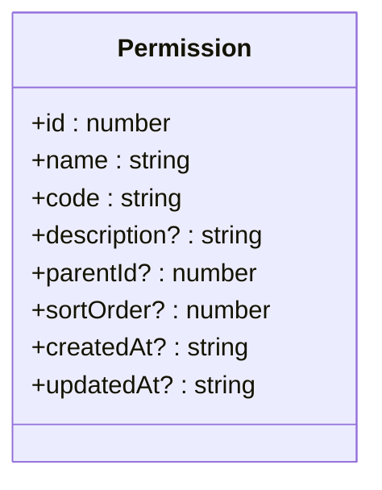
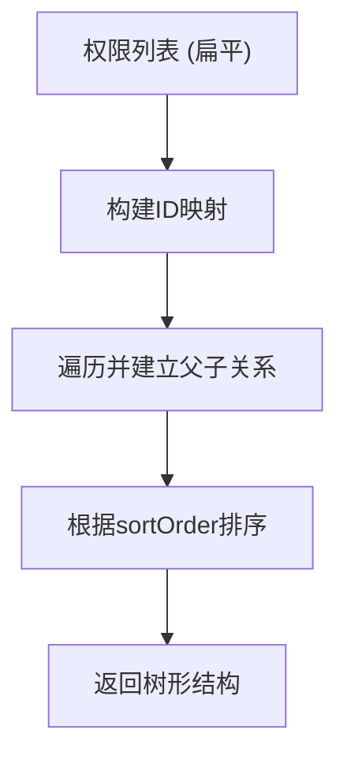
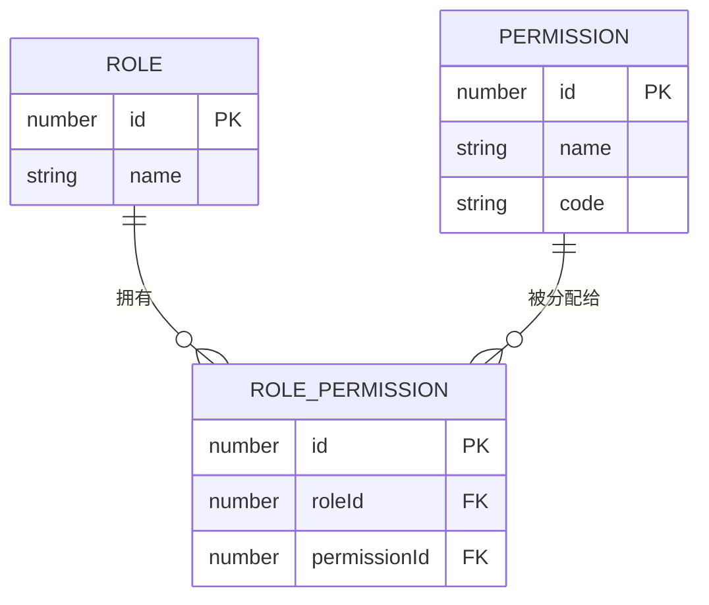
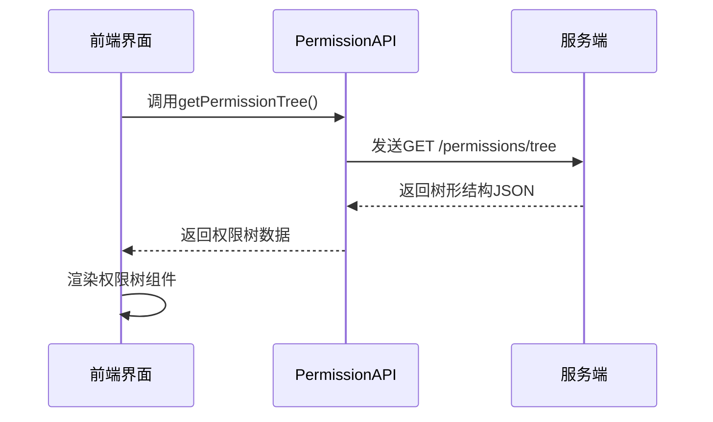

# 权限模型

<cite>
**本文档引用的文件**  
- [permissions.json](file://data/permissions.json)
- [models.ts](file://src/repository/models.ts)
- [permission-tree.tsx](file://src/components/shared/permission-tree.tsx)
- [permissions.ts](file://src/lib/permissions.ts)
- [permission.ts](file://src/service/api/permission.ts)
</cite>

## 目录
1. [介绍](#介绍)
2. [权限数据结构](#权限数据结构)
3. [权限码命名规范与层级结构](#权限码命名规范与层级结构)
4. [权限树的实现机制](#权限树的实现机制)
5. [权限与角色的多对多关系](#权限与角色的多对多关系)
6. [权限管理的前端交互](#权限管理的前端交互)
7. [权限模型的后端接口支持](#权限模型的后端接口支持)
8. [总结](#总结)

## 介绍
v0-game_admin系统的权限模型是整个系统访问控制的核心。该模型通过细粒度的权限定义、树形结构组织以及灵活的角色绑定机制，实现了对后台功能模块的精确访问控制。本文档深入解析权限接口的设计、权限树的构建逻辑、权限码的命名规范，以及权限与角色之间的关联机制，为系统管理员和开发者提供清晰的权限管理指导。

**Section sources**
- [models.ts](file://src/repository/models.ts#L29-L38)

## 权限数据结构
权限模型的核心是`Permission`接口，其字段定义如下：

- **id**：权限的唯一数字标识符。
- **name**：权限的可读名称（如“查看仪表盘”）。
- **code**：权限的唯一编码，用于程序中的权限校验（如`dashboard:view`）。
- **description**：权限的可选描述信息，用于说明其用途。
- **parentId**：父权限的ID，用于构建树形层级结构；若为根权限，则值为`null`。
- **sortOrder**：排序值，用于在同级权限中定义显示顺序。
- **createdAt** 和 **updatedAt**：权限创建和最后更新的时间戳，采用ISO格式字符串。

该结构支持扁平化权限列表与树形权限结构的双向转换，既便于数据库存储，也适合前端展示。



**Diagram sources**
- [models.ts](file://src/repository/models.ts#L29-L38)

**Section sources**
- [models.ts](file://src/repository/models.ts#L29-L38)

## 权限码命名规范与层级结构
权限码（`code`）是权限系统中用于程序判断的核心标识。其命名遵循**模块:操作**的规范，例如`dashboard:view`表示“仪表盘模块的查看操作”。

基于`permissions.json`中的示例：
```json
{
  "id": 1,
  "name": "查看仪表盘",
  "code": "dashboard:view",
  "description": "访问仪表盘",
  "parentId": null,
  "sortOrder": 0
}
```
可以看出：
- `dashboard` 代表功能模块。
- `view` 代表具体操作类型。

这种命名方式具有良好的可读性和可扩展性，便于通过字符串匹配实现通配符权限控制（如`dashboard:*`表示对仪表盘的所有操作）。

**Section sources**
- [permissions.json](file://data/permissions.json#L1-L12)

## 权限树的实现机制
权限树通过`parentId`字段实现父子层级关系。每个权限节点可以拥有零个或多个子权限，形成一个多叉树结构。

### 树形结构构建逻辑
前端组件`permission-tree.tsx`负责将扁平的权限列表转换为树形结构：
1. 遍历所有权限，建立以`id`为键的映射表。
2. 再次遍历权限，若`parentId`存在且有效，则将当前权限添加到对应父权限的`children`数组中。
3. 若`parentId`为空或无效，则该权限为根节点。
4. 最后根据`sortOrder`对每一层级的子节点进行排序。

此机制支持无限层级嵌套，适用于复杂系统的权限组织。



**Diagram sources**
- [permission-tree.tsx](file://src/components/shared/permission-tree.tsx#L287-L322)

**Section sources**
- [permission-tree.tsx](file://src/components/shared/permission-tree.tsx#L287-L322)

## 权限与角色的多对多关系
系统通过`RolePermission`关联表实现权限与角色的多对多关系。

### 数据模型
- **Role**：角色实体，包含角色ID、名称等信息。
- **Permission**：权限实体。
- **RolePermission**：关联表，包含`roleId`和`permissionId`，表示某个角色拥有某项权限。

这种设计允许一个角色被赋予多个权限，同时一个权限也可被多个角色共享，极大提升了权限分配的灵活性。



**Diagram sources**
- [models.ts](file://src/repository/models.ts#L20-L27)
- [models.ts](file://src/repository/models.ts#L29-L38)
- [models.ts](file://src/repository/models.ts#L40-L45)

**Section sources**
- [models.ts](file://src/repository/models.ts#L40-L45)

## 权限管理的前端交互
前端通过`PermissionTree`组件提供直观的权限树形选择界面。该组件具备以下特性：
- 支持展开/折叠权限节点。
- 复选框支持三种状态：选中、半选（部分子权限被选中）、未选中。
- 当选择父权限时，自动选中其所有子权限；取消选择时，自动移除所有子权限。
- 半选状态的父权限在提交时也会被包含在选中列表中，确保权限逻辑的完整性。

此交互设计简化了复杂权限的批量操作，提升了管理效率。

**Section sources**
- [permission-tree.tsx](file://src/components/shared/permission-tree.tsx#L280-L403)

## 权限模型的后端接口支持
后端通过`PermissionAPI`类提供完整的权限管理接口：
- `getPermissions()`：获取分页权限列表。
- `getPermissionTree()`：获取完整的权限树结构。
- `getAllPermissions()`：获取所有权限（用于下拉选择）。
- `createPermission()`、`updatePermission()`、`deletePermission()`：权限的增删改操作。

这些接口为前端权限管理页面提供了数据支撑，确保权限配置的动态性和实时性。



**Diagram sources**
- [permission.ts](file://src/service/api/permission.ts#L17-L19)

**Section sources**
- [permission.ts](file://src/service/api/permission.ts#L4-L58)

## 总结
v0-game_admin系统的权限模型通过`Permission`接口定义了细粒度的权限单元，利用`parentId`构建灵活的树形结构，并通过`RolePermission`关联表实现权限与角色的多对多绑定。前端`PermissionTree`组件提供了直观的树形交互，后端API则确保了数据的完整性和一致性。该模型设计合理，扩展性强，能够有效支撑系统的访问控制需求。