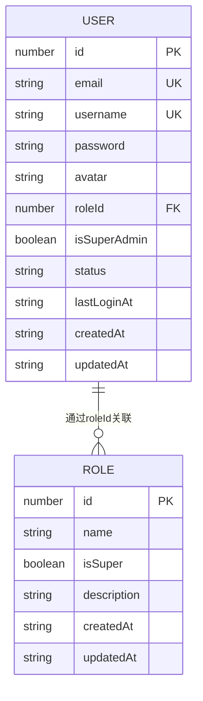

# 用户模型

<cite>
**本文档引用的文件**
- [users.json](file://data/users.json)
- [roles.json](file://data/roles.json)
- [models.ts](file://src/repository/models.ts)
- [jsonRepos.ts](file://src/repository/impl/jsonRepos.ts)
- [user.ts](file://src/service/api/user.ts)
- [UserForm.tsx](file://src/app/dashboard/account/user/components/UserForm.tsx)
</cite>

## 目录
1. [用户模型字段详解](#用户模型字段详解)
2. [用户与角色关系](#用户与角色关系)
3. [用户模型在系统中的作用](#用户模型在系统中的作用)
4. [安全实践](#安全实践)

## 用户模型字段详解

用户模型定义了系统中用户的核心属性，所有字段均具有明确的业务含义和数据类型。

**Section sources**
- [models.ts](file://src/repository/models.ts#L6-L17)

### id（数字）
用户唯一标识符，作为主键在系统中全局唯一。该字段为自增数字，用于数据库记录、API请求和权限关联。

### email（字符串）
用户的注册邮箱，作为登录凭证和系统通信的主要联系方式。邮箱需符合标准格式，并在系统中保持唯一性。

### username（字符串）
用户的显示名称，用于界面展示和用户识别。用户名在系统中必须唯一，便于管理员和用户之间进行识别和管理。

### password（加密哈希字符串）
用户密码的加密存储字段。系统不存储明文密码，而是存储通过bcrypt算法生成的哈希值，确保即使数据库泄露，原始密码也无法被轻易还原。

### avatar（可选字符串）
用户头像的URL路径，可为空。若未设置，系统将使用默认头像。该字段支持相对路径或绝对URL，用于在界面中展示用户形象。

### roleId（数字）
关联角色的ID，建立用户与角色之间的多对一关系。通过此字段，用户继承对应角色的权限集合，实现基于角色的访问控制（RBAC）。

### isSuperAdmin（可选布尔值）
标识用户是否为超级管理员。超级管理员拥有系统最高权限，不受常规角色权限限制，通常用于系统初始化和紧急维护。

### status（可选枚举值：'active' | 'disabled'）
表示用户账户的当前状态。`active`表示账户正常可用，`disabled`表示账户已被禁用，无法登录系统。该字段用于账户管理和安全控制。

### lastLoginAt（可选ISO时间字符串）
记录用户最后一次成功登录的时间，采用ISO 8601格式。该信息用于安全审计、活跃度分析和异常登录检测。

### createdAt和updatedAt（ISO时间字符串）
分别记录用户创建时间和最后更新时间，采用ISO 8601格式。这两个字段为审计和数据追踪提供时间维度信息，确保操作可追溯。

## 用户与角色关系

用户与角色之间存在多对一的关联关系，通过`roleId`字段实现。每个用户必须归属于一个角色，而一个角色可以被多个用户共享。

**Diagram sources**
- [models.ts](file://src/repository/models.ts#L6-L17)
- [models.ts](file://src/repository/models.ts#L20-L26)

系统通过`roles.json`文件管理角色定义，用户通过`roleId`引用对应角色。例如，管理员用户在`users.json`中的`roleId`为1，对应`roles.json`中ID为1的"超级管理员"角色。

**Section sources**
- [users.json](file://data/users.json#L1-L15)
- [roles.json](file://data/roles.json#L1-L10)

## 用户模型在系统中的作用

用户模型在v0-game_admin系统中扮演着核心角色，贯穿认证、权限控制和审计日志三大关键功能。

### 认证流程
用户模型是身份认证的基础。当用户登录时，系统通过`email`和`password`字段验证身份。认证成功后，系统记录`lastLoginAt`时间，并生成会话令牌。

### 权限控制
通过`roleId`字段，系统实现基于角色的权限管理。用户的所有操作权限由其关联角色决定。`isSuperAdmin`字段为超级管理员提供特殊权限，绕过常规权限检查。

### 审计日志
用户模型为审计提供关键信息。系统日志通过`userId`关联用户，记录所有操作。`createdAt`和`updatedAt`字段确保所有用户变更可追溯，`status`字段变化也会被记录，用于安全审计。

**Section sources**
- [jsonRepos.ts](file://src/repository/impl/jsonRepos.ts#L121-L161)
- [user.ts](file://src/service/api/user.ts#L3-L41)

## 安全实践

系统采用行业标准的安全实践来保护用户数据，特别是密码存储。

### 密码加密
系统使用bcrypt算法对用户密码进行加密存储。bcrypt是一种自适应哈希函数，具有盐值（salt）和成本因子，能有效抵御彩虹表和暴力破解攻击。密码字段存储的是哈希值而非明文，确保即使数据泄露，用户密码仍保持安全。

### 超级管理员保护
超级管理员账户受到特殊保护。在用户管理界面中，超级管理员的`status`字段不可修改，防止意外禁用。同时，`isSuperAdmin`字段只能通过系统初始化脚本设置，不能通过常规用户界面修改。

### 会话安全
系统通过JWT（JSON Web Token）管理用户会话。令牌包含用户基本信息，但不包含敏感数据。令牌具有有效期，过期后需重新认证，减少长期会话带来的安全风险。

**Section sources**
- [UserForm.tsx](file://src/app/dashboard/account/user/components/UserForm.tsx#L98-L107)
- [auth.ts](file://src/lib/auth.ts#L4-L10)