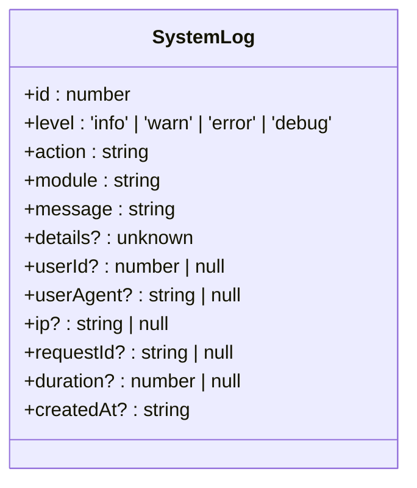
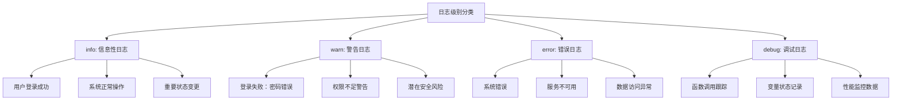
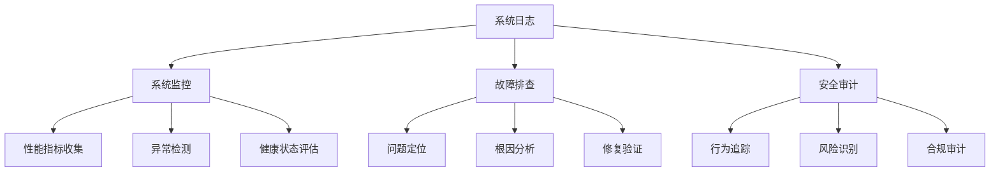
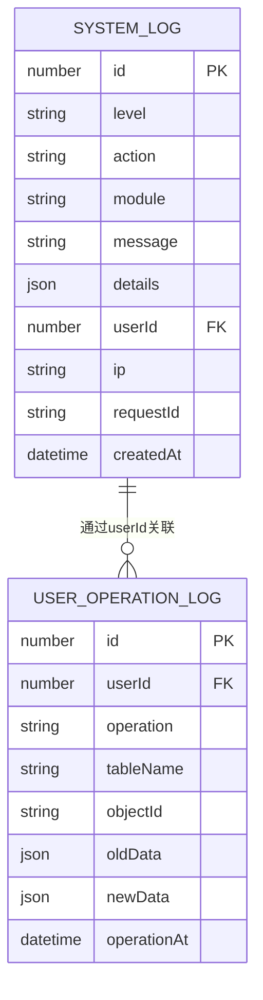

# 系统日志模型

<cite>
**本文档引用文件**  
- [systemLogs.json](file://data/systemLogs.json)
- [models.ts](file://src/repository/models.ts)
- [logger.ts](file://src/lib/logger.ts)
- [logs.ts](file://src/repository/impl/jsonRepos.ts)
- [route.ts](file://src/app/api/logs/route.ts)
- [types.ts](file://src/app/dashboard/system/logs/types.ts)
- [constants.ts](file://src/app/dashboard/system/logs/constants.ts)
</cite>

## 目录
1. [系统日志模型概述](#系统日志模型概述)
2. [SystemLog接口详细说明](#systemlog接口详细说明)
3. [日志级别使用场景示例](#日志级别使用场景示例)
4. [系统日志的核心作用](#系统日志的核心作用)
5. [系统日志与用户操作日志的区别与联系](#系统日志与用户操作日志的区别与联系)

## 系统日志模型概述

系统日志模型是v0-game_admin系统中用于记录系统运行状态、用户行为和安全事件的核心数据结构。该模型通过结构化的JSON格式存储日志信息，支持高效的查询、分析和审计功能。系统日志不仅为系统监控提供实时数据支持，还为故障排查和安全审计提供了关键证据链。

**Section sources**
- [systemLogs.json](file://data/systemLogs.json)
- [models.ts](file://src/repository/models.ts)

## SystemLog接口详细说明

SystemLog接口定义了系统日志的完整数据结构，包含以下字段：

- **id**: 日志唯一标识符（数字类型）
- **level**: 日志级别，枚举值为 'info', 'warn', 'error', 'debug'
- **action**: 操作动作描述（字符串类型）
- **module**: 所属模块名称（字符串类型）
- **message**: 日志消息摘要（字符串类型）
- **details**: 详细信息，可包含任意类型的数据结构
- **userId**: 操作用户ID（可选，数字类型）
- **userAgent**: 用户代理信息（可选，字符串类型）
- **ip**: 客户端IP地址（可选，字符串类型）
- **requestId**: 请求唯一标识符（可选，字符串类型）
- **duration**: 操作耗时（毫秒，可选，数字类型）
- **createdAt**: 日志创建时间，ISO格式时间字符串

该接口在代码中通过TypeScript接口明确定义，确保了类型安全和数据一致性。

**Diagram sources**
- [models.ts](file://src/repository/models.ts#L46-L59)

**Section sources**
- [models.ts](file://src/repository/models.ts#L46-L59)
- [logger.ts](file://src/lib/logger.ts#L5-L15)

## 日志级别使用场景示例

通过分析systemLogs.json中的实际日志数据，可以明确不同日志级别的使用场景：

**Diagram sources**
- [systemLogs.json](file://data/systemLogs.json#L1-L121)

**Section sources**
- [systemLogs.json](file://data/systemLogs.json#L1-L121)
- [logger.ts](file://src/lib/logger.ts#L130-L202)

## 系统日志的核心作用

系统日志在v0-game_admin系统中扮演着至关重要的角色，主要体现在以下三个方面：

### 系统监控
系统日志为实时监控提供了数据基础，通过收集和分析日志数据，可以及时发现系统性能瓶颈、资源使用异常和潜在故障。日志中的duration字段特别适用于性能监控，能够精确记录关键操作的执行时间。

### 故障排查
当系统出现异常时，系统日志提供了完整的上下文信息。通过requestId可以追踪完整的请求链路，结合details字段中的详细信息，开发人员能够快速定位问题根源。例如，登录失败的日志记录了具体的失败原因、用户信息和时间戳，极大提高了问题诊断效率。

### 安全审计
系统日志是安全审计的重要依据。通过记录用户操作、IP地址和userAgent等信息，可以构建完整的行为轨迹，用于检测异常登录、权限滥用等安全事件。userId字段的存在使得所有操作都可以追溯到具体用户，增强了系统的安全性和问责性。

**Diagram sources**
- [logger.ts](file://src/lib/logger.ts)
- [route.ts](file://src/app/api/logs/route.ts)

**Section sources**
- [logger.ts](file://src/lib/logger.ts)
- [route.ts](file://src/app/api/logs/route.ts)

## 系统日志与用户操作日志的区别与联系

虽然系统日志和用户操作日志都记录了系统中的活动，但它们在目的、内容和使用场景上存在显著差异：

### 主要区别
| 特性 | 系统日志 | 用户操作日志 |
|------|----------|------------|
| **记录内容** | 系统事件、错误、性能数据 | 用户对数据的增删改查操作 |
| **详细程度** | 包含技术细节和堆栈信息 | 聚焦业务操作和数据变更 |
| **主要用途** | 系统维护和故障排查 | 操作审计和数据追溯 |
| **数据结构** | 通用日志结构 | 包含oldData/newData快照 |

### 相互联系
两种日志系统相辅相成，共同构成了完整的监控和审计体系。系统日志中的userId字段可以与用户操作日志关联，实现从技术事件到业务操作的完整追溯。在安全事件调查中，通常需要同时分析两种日志，以获得全面的事件视图。

**Diagram sources**
- [models.ts](file://src/repository/models.ts#L46-L87)
- [types.ts](file://src/app/dashboard/system/logs/types.ts)

**Section sources**
- [models.ts](file://src/repository/models.ts#L46-L87)
- [types.ts](file://src/app/dashboard/system/logs/types.ts)
- [constants.ts](file://src/app/dashboard/system/logs/constants.ts)