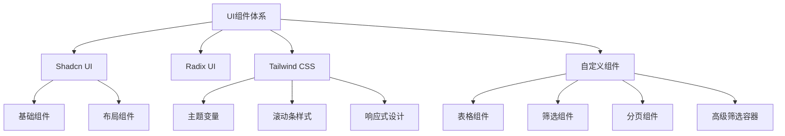
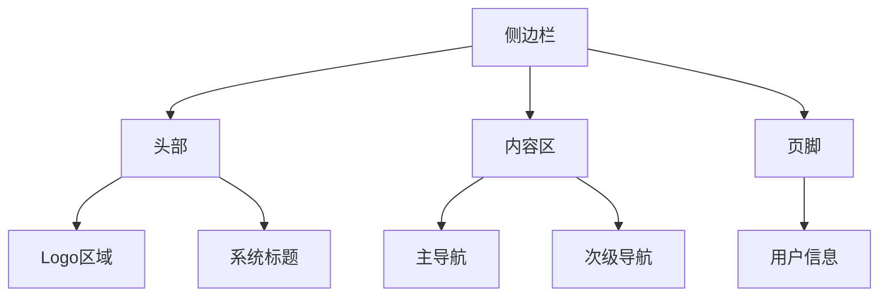
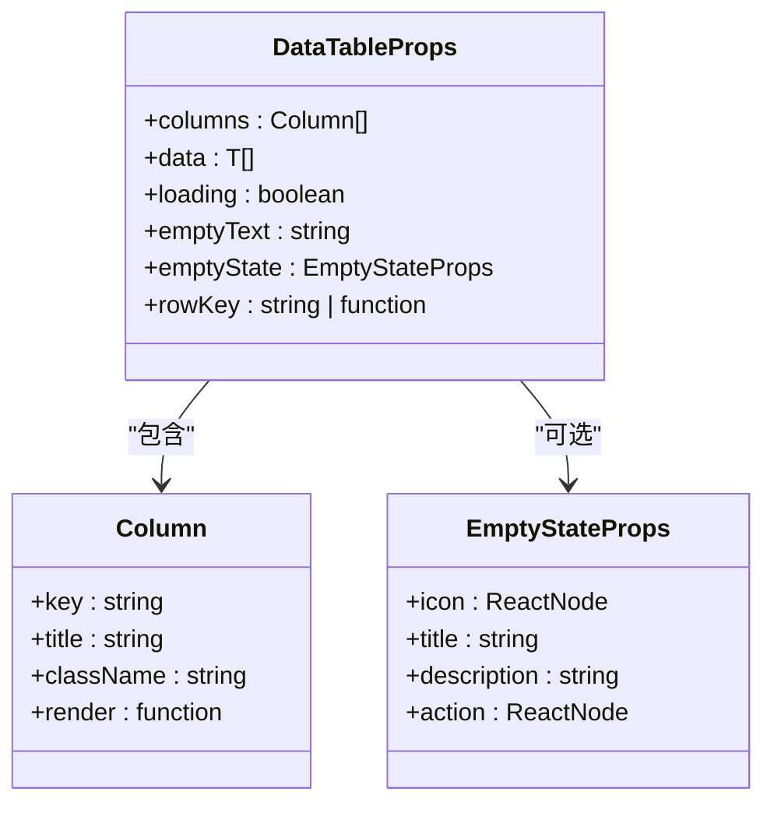
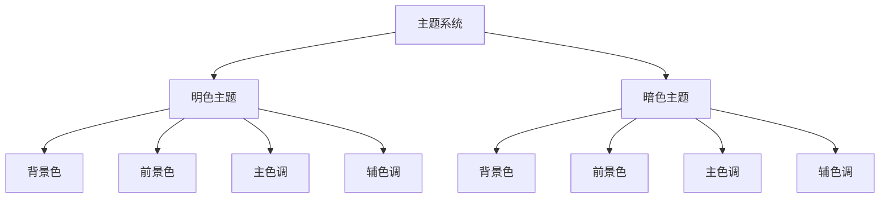
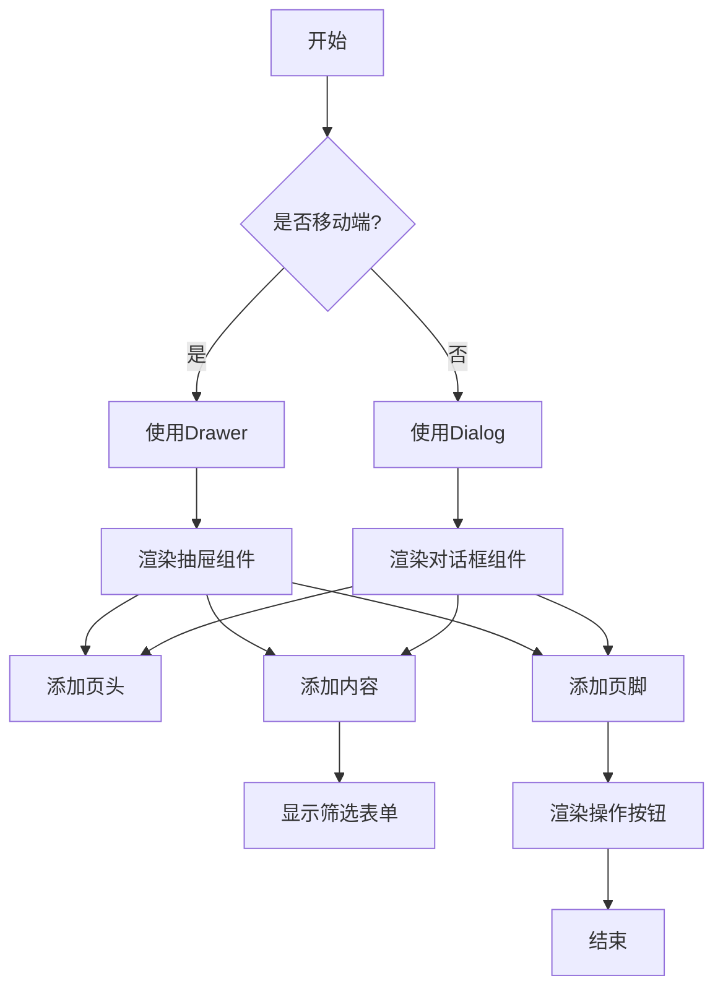

# UI组件体系

<cite>
**本文档引用文件**  
- [components.json](file://components.json)
- [globals.css](file://src/app/globals.css)
- [button.tsx](file://src/components/ui/button.tsx)
- [dialog.tsx](file://src/components/ui/dialog.tsx)
- [table.tsx](file://src/components/ui/table.tsx)
- [data-table.tsx](file://src/components/table/data-table.tsx)
- [pagination.tsx](file://src/components/table/pagination.tsx)
- [search-filter.tsx](file://src/components/table/search-filter.tsx)
- [app-sidebar.tsx](file://src/components/layout/app-sidebar.tsx)
- [header.tsx](file://src/components/layout/header.tsx)
- [utils.ts](file://src/components/table/utils.ts)
- [input.tsx](file://src/components/ui/input.tsx)
- [select.tsx](file://src/components/ui/select.tsx)
- [advanced-filter-container.tsx](file://src/components/shared/advanced-filter-container.tsx)
</cite>

## 目录
1. [简介](#简介)
2. [组件库架构](#组件库架构)
3. [基础UI组件](#基础ui组件)
4. [布局组件](#布局组件)
5. [表格组件设计](#表格组件设计)
6. [样式与主题系统](#样式与主题系统)
7. [组件组合最佳实践](#组件组合最佳实践)
8. [结论](#结论)

## 简介
v0-game_admin系统采用Shadcn UI与Radix UI构建现代化的管理后台界面体系。该UI组件体系遵循模块化设计原则，通过Tailwind CSS实现响应式布局与主题定制，结合React Server Components技术提升性能表现。系统提供了一套完整的组件解决方案，涵盖基础交互元素、数据展示组件和整体布局结构，确保管理后台界面风格统一、功能完善且易于维护。

## 组件库架构

**组件库架构来源**  
- [components.json](file://components.json#L1-L21)
- [globals.css](file://src/app/globals.css#L1-L167)

## 基础UI组件

### 按钮组件
按钮组件基于Radix UI的Slot组件构建，通过cva库定义多种变体样式。支持default、destructive、outline、secondary、ghost和link六种样式变体，以及default、sm、lg和icon四种尺寸规格。组件采用data-slot属性进行语义化标记，确保无障碍访问支持。

**基础UI组件来源**  
- [button.tsx](file://src/components/ui/button.tsx#L1-L60)
- [dialog.tsx](file://src/components/ui/dialog.tsx#L1-L136)

### 对话框组件
对话框组件封装Radix UI的Dialog原语，提供完整的模态对话框功能。包含Dialog、DialogTrigger、DialogContent、DialogHeader、DialogFooter等子组件，支持标题、描述、关闭按钮等标准元素。遮罩层具有淡入淡出动画效果，内容区域支持居中定位和缩放动画。

### 输入框与选择器
输入框组件提供统一的边框、阴影和焦点样式，支持无障碍属性验证。选择器组件基于Radix UI的Select原语构建，包含触发器、内容区域、滚动按钮等完整功能，支持单选和多选模式，具有良好的移动端适配性。

## 布局组件

### 侧边栏组件
侧边栏组件采用Shadcn UI的Sidebar组件构建，包含头部、内容区和页脚三部分。头部显示系统logo和名称，内容区集成权限控制的主导航菜单，页脚显示用户信息。侧边栏支持内嵌变体样式，与主内容区形成清晰的视觉层次。

**布局组件来源**  
- [app-sidebar.tsx](file://src/components/layout/app-sidebar.tsx#L1-L69)
- [header.tsx](file://src/components/layout/header.tsx#L1-L42)

### 页头组件
页头组件位于页面顶部，包含侧边栏触发器、面包屑导航、搜索框和主题切换按钮。采用半透明背景和模糊效果，实现现代化的视觉层次。在桌面端显示完整搜索框，移动端则简化为搜索图标按钮，确保不同设备上的良好用户体验。

## 表格组件设计

### 数据表格组件
数据表格组件(data-table)是系统核心的数据展示组件，提供灵活的列配置、空状态处理和加载骨架屏功能。组件接受泛型类型参数，支持自定义渲染函数，可处理复杂的数据展示需求。表头固定在顶部，支持粘性定位，确保滚动时表头始终可见。

**表格组件设计来源**  
- [data-table.tsx](file://src/components/table/data-table.tsx#L1-L131)
- [table-skeleton.tsx](file://src/components/ui/table-skeleton.tsx)
- [utils.ts](file://src/components/table/utils.ts#L1-L49)

### 分页组件
分页组件支持桌面端和移动端两种布局模式。桌面端显示完整的分页信息和控制按钮，移动端则采用更紧凑的布局。组件提供每页显示数量选择功能，支持常见的10、20、30、50、100条等选项，可自定义选项数组。分页状态包含当前页码、每页数量、总记录数和总页数等信息。

### 筛选组件
筛选组件(search-filter)支持文本搜索、下拉选择和日期范围三种筛选类型。采用防抖技术优化性能，避免频繁触发搜索请求。日期范围选择器集成日历组件，支持中文本地化显示。组件自动检测活跃筛选条件，提供"清空筛选"快捷按钮，提升用户操作效率。

## 样式与主题系统

### 主题变量定义
系统在globals.css中通过CSS变量定义完整的主题体系，包含背景色、前景色、边框色、阴影色等基础颜色变量。采用oklch颜色模型确保色彩一致性，支持明暗两种主题模式。通过:root选择器定义默认主题，.dark类选择器定义暗色主题，实现平滑的主题切换效果。

**样式与主题系统来源**  
- [globals.css](file://src/app/globals.css#L46-L113)
- [components.json](file://components.json#L6-L12)

### 滚动条样式
系统统一定义了跨浏览器的滚动条样式，确保在不同平台上的视觉一致性。Webkit内核浏览器通过::-webkit-scrollbar系列伪元素定制，Firefox浏览器通过scrollbar-width和scrollbar-color属性控制。滚动条宽度为6px，轨道背景色与页面背景一致，滑块采用半透明设计，悬停时增加不透明度，提供良好的视觉反馈。

## 组件组合最佳实践

### 高级筛选容器
高级筛选容器组件根据设备类型自动选择Dialog或Drawer展示模式。在桌面端使用居中的对话框，在移动端使用底部弹出的抽屉，确保最佳的用户体验。容器集成查询、重置和取消操作按钮，支持加载状态显示，与筛选表单组件配合使用，构建完整的高级筛选功能。

**组件组合最佳实践来源**  
- [advanced-filter-container.tsx](file://src/components/shared/advanced-filter-container.tsx#L1-L149)
- [use-mobile.ts](file://src/hooks/use-mobile.ts)

### 组件别名配置
components.json文件定义了组件导入别名，简化模块引用路径。通过@/components、@/lib、@/hooks等别名，开发者可以使用更简洁的导入语句。配置文件还指定Tailwind CSS的主样式文件和主题风格，确保整个项目使用一致的设计语言。

## 结论
v0-game_admin系统的UI组件体系构建在Shadcn UI和Radix UI的基础之上，通过合理的架构设计和组件封装，提供了高效、一致且可维护的界面开发方案。系统充分利用Tailwind CSS的实用优先特性，结合TypeScript的类型安全，确保组件的可靠性和可预测性。建议开发者遵循既定的组件使用规范，充分利用现有的组件组合模式，快速构建符合系统风格的管理界面。