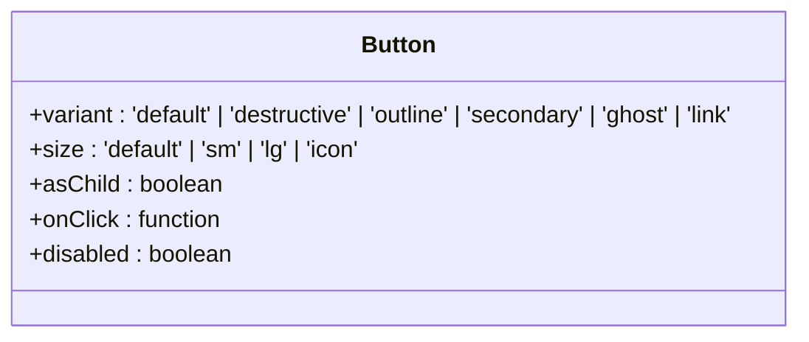
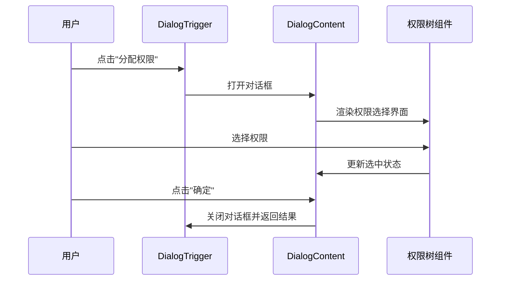
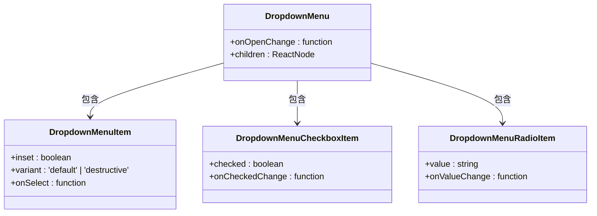
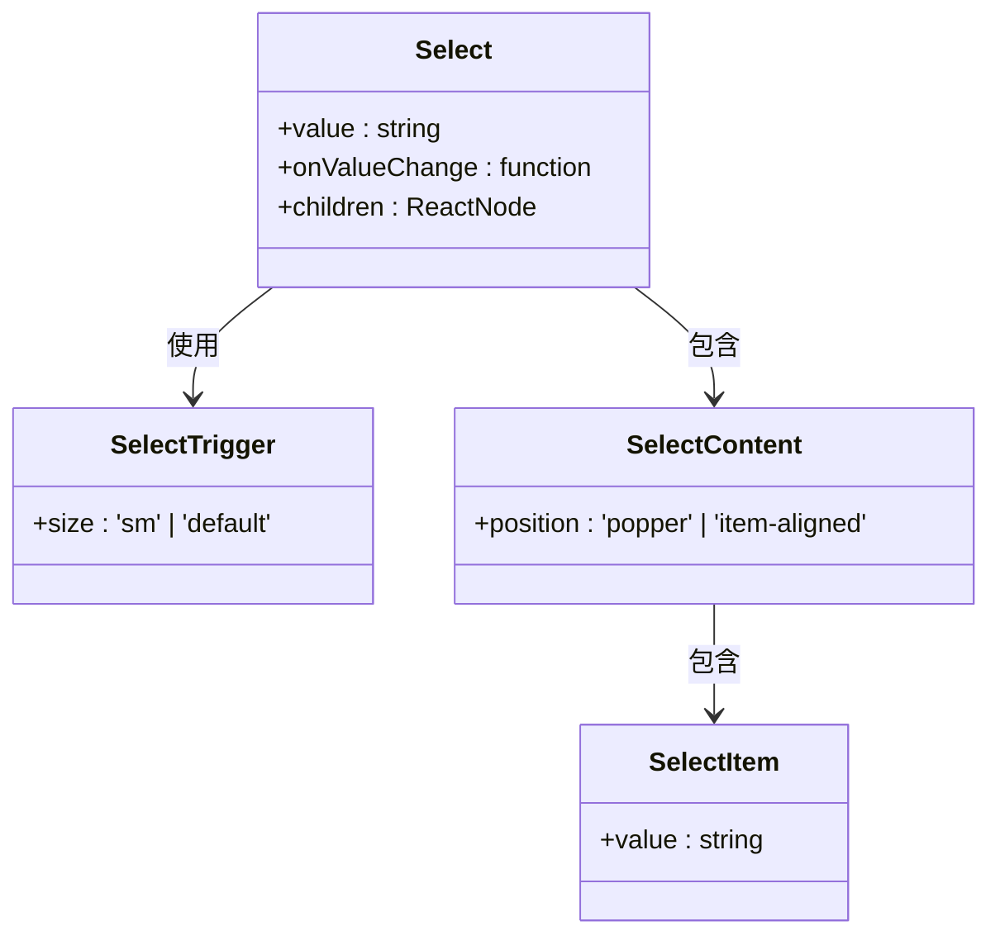
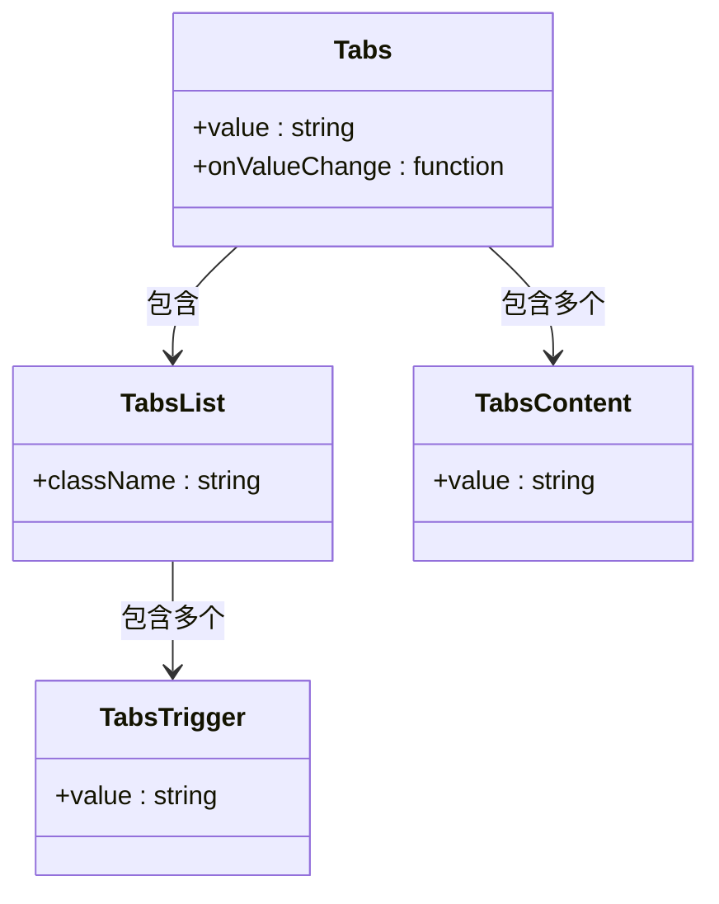

# 基础UI组件

<cite>
**本文档引用文件**  
- [button.tsx](file://src/components/ui/button.tsx)
- [dialog.tsx](file://src/components/ui/dialog.tsx)
- [dropdown-menu.tsx](file://src/components/ui/dropdown-menu.tsx)
- [popover.tsx](file://src/components/ui/popover.tsx)
- [sheet.tsx](file://src/components/ui/sheet.tsx)
- [input.tsx](file://src/components/ui/input.tsx)
- [textarea.tsx](file://src/components/ui/textarea.tsx)
- [checkbox.tsx](file://src/components/ui/checkbox.tsx)
- [select.tsx](file://src/components/ui/select.tsx)
- [calendar.tsx](file://src/components/ui/calendar.tsx)
- [tabs.tsx](file://src/components/ui/tabs.tsx)
- [tooltip.tsx](file://src/components/ui/tooltip.tsx)
- [slider.tsx](file://src/components/ui/slider.tsx)
- [components.json](file://components.json)
</cite>

## 目录
1. [简介](#简介)
2. [交互式组件](#交互式组件)
   - [按钮 (Button)](#按钮-button)
   - [对话框 (Dialog)](#对话框-dialog)
   - [下拉菜单 (Dropdown Menu)](#下拉菜单-dropdown-menu)
   - [弹出层 (Popover)](#弹出层-popover)
   - [抽屉 (Sheet)](#抽屉-sheet)
   - [提示框 (Tooltip)](#提示框-tooltip)
3. [表单类组件](#表单类组件)
   - [输入框 (Input)](#输入框-input)
   - [文本域 (Textarea)](#文本域-textarea)
   - [复选框 (Checkbox)](#复选框-checkbox)
   - [选择器 (Select)](#选择器-select)
4. [复合输入组件](#复合输入组件)
   - [日历 (Calendar)](#日历-calendar)
   - [标签页 (Tabs)](#标签页-tabs)
5. [可访问性与主题适配](#可访问性与主题适配)
6. [实际应用场景](#实际应用场景)

## 简介
v0-game_admin系统基于Shadcn UI和Radix UI构建了一套原子级UI组件库，旨在提供一致、可复用且高度可定制的用户界面元素。这些组件遵循现代设计原则，支持暗色主题，并具备良好的可访问性。本文档详细说明了核心UI组件的使用规范，包括props定义、事件回调机制以及在权限管理、用户操作等场景中的具体应用。

**Section sources**
- [components.json](file://components.json)

## 交互式组件

### 按钮 (Button)
按钮组件是用户界面中最基本的交互元素之一，用于触发操作或导航。该系统中的按钮组件通过`buttonVariants`定义了多种样式变体和尺寸选项。

**属性定义**
- `variant`: 按钮变体，包括`default`、`destructive`、`outline`、`secondary`、`ghost`和`link`
- `size`: 按钮尺寸，包括`default`、`sm`、`lg`和`icon`
- `asChild`: 允许将按钮样式应用于其他组件

**事件回调**
- 支持标准的`onClick`事件处理
- 可通过`disabled`属性控制禁用状态

**可访问性支持**
- 使用`aria-invalid`属性标记无效状态
- 提供`focus-visible`伪类确保键盘导航可见性

**Diagram sources**
- [button.tsx](file://src/components/ui/button.tsx#L6-L35)

### 对话框 (Dialog)
对话框组件用于展示模态内容，如确认操作、编辑表单等。它由多个子组件组成，包括触发器、内容区域和关闭按钮。

**属性定义**
- `open`: 控制对话框的打开/关闭状态
- `onOpenChange`: 状态变化时的回调函数
- `modal`: 是否为模态对话框

**事件回调**
- `onOpenChange`回调接收布尔值参数，表示对话框的新状态
- 可通过`DialogClose`组件显式关闭对话框

**实际应用**
在角色权限分配场景中，使用`Dialog`组件与`DropdownMenu`组合实现权限选择功能。例如，在`RolePermissionDialog`中，通过对话框展示权限树形结构供用户选择。

**Diagram sources**
- [dialog.tsx](file://src/components/ui/dialog.tsx#L8-L12)
- [RolePermissionDialog.tsx](file://src/app/dashboard/account/role/components/RolePermissionDialog.tsx)

**Section sources**
- [dialog.tsx](file://src/components/ui/dialog.tsx#L1-L136)

### 下拉菜单 (Dropdown Menu)
下拉菜单组件提供了一个浮动的菜单列表，通常用于展示操作选项或导航链接。

**属性定义**
- 支持分组(`DropdownMenuGroup`)、标签(`DropdownMenuLabel`)、分隔线(`DropdownMenuSeparator`)
- 提供复选框项(`DropdownMenuCheckboxItem`)和单选框项(`DropdownMenuRadioItem`)
- 支持嵌套子菜单(`DropdownMenuSub`)

**事件回调**
- `onSelect`回调在菜单项被选择时触发
- 可通过`onOpenChange`监听菜单的展开/收起状态

**可访问性支持**
- 使用ARIA属性确保屏幕阅读器兼容
- 支持键盘导航（上下箭头、Enter、Escape）

**Diagram sources**
- [dropdown-menu.tsx](file://src/components/ui/dropdown-menu.tsx#L8-L12)

### 弹出层 (Popover)
弹出层组件类似于对话框，但通常以非模态方式显示，适合展示辅助信息或工具提示。

**属性定义**
- `align`: 对齐方式（`start`、`center`、`end`）
- `sideOffset`: 距离触发元素的偏移量
- `open`和`onOpenChange`: 控制显示状态

**使用边界**
- 适用于短文本提示、简单表单等轻量级内容
- 不适合复杂交互或多步骤流程

**Section sources**
- [popover.tsx](file://src/components/ui/popover.tsx#L7-L11)

### 抽屉 (Sheet)
抽屉组件从屏幕边缘滑入，提供更大的空间进行复杂操作，常用于移动设备或需要保留上下文的场景。

**属性定义**
- `side`: 抽屉滑出方向（`top`、`right`、`bottom`、`left`）
- `open`和`onOpenChange`: 控制抽屉状态

**动画效果**
- 使用CSS过渡实现平滑的滑入/滑出动画
- 支持不同的持续时间配置

**Section sources**
- [sheet.tsx](file://src/components/ui/sheet.tsx#L8-L10)

### 提示框 (Tooltip)
提示框组件用于在用户悬停或聚焦元素时显示简短说明文本。

**属性定义**
- `delayDuration`: 显示延迟时间
- `sideOffset`: 相对于触发元素的偏移量
- `open`和`onOpenChange`: 控制显示状态

**最佳实践**
- 提示文本应简洁明了
- 避免包含重要操作或长篇内容

**Section sources**
- [tooltip.tsx](file://src/components/ui/tooltip.tsx#L8-L12)

## 表单类组件

### 输入框 (Input)
输入框组件用于接收用户输入的文本内容。

**属性定义**
- 支持所有原生`<input>`元素的属性
- 自动应用统一的样式和交互效果

**数据绑定**
- 可与React状态管理结合使用
- 支持受控和非受控模式

**验证集成**
- 通过`aria-invalid`属性标记验证错误
- 可配合`form`组件实现完整表单验证

**Section sources**
- [input.tsx](file://src/components/ui/input.tsx#L4-L18)

### 文本域 (Textarea)
文本域组件用于多行文本输入。

**属性定义**
- 支持`rows`、`cols`等原生属性
- 自动调整高度以适应内容

**使用场景**
- 评论、描述等需要较长文本输入的场合

**Section sources**
- [textarea.tsx](file://src/components/ui/textarea.tsx#L4-L15)

### 复选框 (Checkbox)
复选框组件用于多项选择。

**属性定义**
- `checked`: 当前选中状态
- `onCheckedChange`: 状态变化回调

**视觉反馈**
- 选中时显示对勾图标
- 支持禁用状态的灰显效果

**Section sources**
- [checkbox.tsx](file://src/components/ui/checkbox.tsx#L8-L29)

### 选择器 (Select)
选择器组件提供下拉列表供用户选择预定义选项。

**属性定义**
- `value`: 当前选中值
- `onValueChange`: 值变化回调
- 支持分组(`SelectGroup`)、标签(`SelectLabel`)、分隔线(`SelectSeparator`)

**滚动支持**
- 当选项过多时自动启用滚动条
- 提供上下滚动按钮

**Diagram sources**
- [select.tsx](file://src/components/ui/select.tsx#L8-L12)

## 复合输入组件

### 日历 (Calendar)
日历组件用于日期选择，支持单日和日期范围选择模式。

**属性定义**
- `mode`: 选择模式（`single`、`range`、`multiple`）
- `selected`: 选中日期
- `onSelect`: 选择回调

**主题适配**
- 通过Tailwind CSS变量支持暗色主题
- 不同状态使用语义化颜色类名

**Section sources**
- [calendar.tsx](file://src/components/ui/calendar.tsx#L9-L72)

### 标签页 (Tabs)
标签页组件用于组织相关内容到不同的面板中。

**属性定义**
- `value`: 当前激活的标签值
- `onValueChange`: 值变化回调

**布局结构**
- `TabsList`: 标签列表容器
- `TabsTrigger`: 单个标签项
- `TabsContent`: 对应的内容面板

**最佳实践**
- 标签数量不宜过多（建议不超过5个）
- 内容切换应保持上下文连贯

**Diagram sources**
- [tabs.tsx](file://src/components/ui/tabs.tsx#L7-L18)

## 可访问性与主题适配
所有UI组件均遵循WCAG 2.1可访问性标准，支持键盘导航和屏幕阅读器。通过Tailwind CSS的暗色类名系统实现主题切换，利用`dark:`前缀应用暗色模式样式。组件使用语义化的HTML元素和ARIA属性确保不同能力用户的平等访问。

**Section sources**
- [components.json](file://components.json)
- [globals.css](file://src/app/globals.css)

## 实际应用场景
在权限管理系统中，`Dialog`组件与`PermissionTree`组件结合使用，实现权限的可视化选择。用户点击"分配权限"按钮后，弹出对话框展示树形权限结构，通过复选框进行选择，最终保存到角色配置中。这种组合模式提高了操作效率和用户体验。

**Section sources**
- [RolePermissionDialog.tsx](file://src/app/dashboard/account/role/components/RolePermissionDialog.tsx)
- [permission-tree.tsx](file://src/components/shared/permission-tree.tsx)