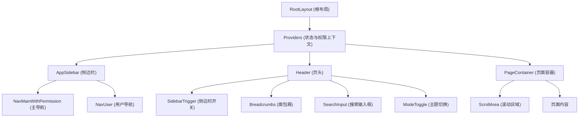
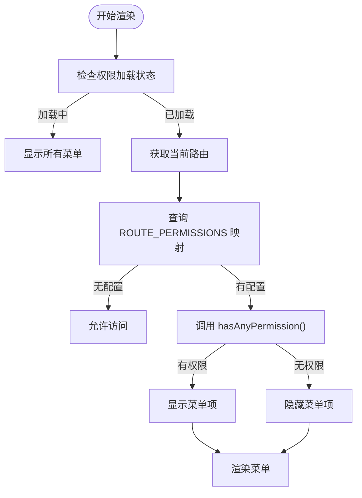

# 布局组件

<cite>
**本文档中引用的文件**  
- [app-sidebar.tsx](file://src/components/layout/app-sidebar.tsx)
- [header.tsx](file://src/components/layout/header.tsx)
- [nav-main-with-permission.tsx](file://src/components/layout/nav-main-with-permission.tsx)
- [breadcrumbs.tsx](file://src/components/layout/breadcrumbs.tsx)
- [page-container.tsx](file://src/components/layout/page-container.tsx)
- [mode-toggle.tsx](file://src/components/layout/mode-toggle.tsx)
- [layout.tsx](file://src/app/layout.tsx)
- [permissions.ts](file://src/lib/permissions.ts)
- [use-permissions.ts](file://src/hooks/use-permissions.ts)
- [breadcrumbs.ts](file://src/config/breadcrumbs.ts)
- [router.ts](file://src/constants/router.ts)
</cite>

## 目录
1. [引言](#引言)
2. [整体界面架构](#整体界面架构)
3. [主导航结构](#主导航结构)
4. [权限驱动的导航渲染](#权限驱动的导航渲染)
5. [面包屑导航](#面包屑导航)
6. [页面布局容器](#页面布局容器)
7. [主题切换机制](#主题切换机制)
8. [Next.js布局系统与状态共享](#nextjs布局系统与状态共享)
9. [响应式适配策略](#响应式适配策略)

## 引言
本文件详细解析v0-game_admin管理后台的布局组件体系，涵盖从整体架构到具体实现的各个层面。重点说明核心布局组件如何协同工作，构建稳定、可扩展且具备权限控制能力的管理界面。

## 整体界面架构

**图示来源**  
- [layout.tsx](file://src/app/layout.tsx#L25-L45)
- [app-sidebar.tsx](file://src/components/layout/app-sidebar.tsx#L26-L68)
- [header.tsx](file://src/components/layout/header.tsx#L10-L41)
- [page-container.tsx](file://src/components/layout/page-container.tsx#L4-L22)

**本节来源**  
- [layout.tsx](file://src/app/layout.tsx#L1-L46)
- [app-sidebar.tsx](file://src/components/layout/app-sidebar.tsx#L1-L69)
- [header.tsx](file://src/components/layout/header.tsx#L1-L42)

## 主导航结构

管理后台的主导航由 `app-sidebar` 与 `header` 两个核心组件协同构建，形成左侧侧边栏与顶部页头相结合的主流布局模式。

`app-sidebar` 组件作为左侧导航容器，集成主菜单、用户信息及辅助功能。其内部结构包含：
- **SidebarHeader**：显示系统Logo与名称
- **SidebarContent**：承载主导航与次级导航
- **SidebarFooter**：展示用户操作入口

`header` 组件位于页面顶部，提供全局操作与导航辅助，包含：
- **SidebarTrigger**：控制侧边栏展开/收起
- **Breadcrumbs**：显示当前页面层级路径
- **SearchInput/SearchButton**：提供搜索功能（桌面端显示输入框，移动端显示图标按钮）
- **ModeToggle**：主题切换控件

二者通过 Next.js 的布局系统嵌套组合，实现一致的视觉风格与交互体验。

**本节来源**  
- [app-sidebar.tsx](file://src/components/layout/app-sidebar.tsx#L26-L68)
- [header.tsx](file://src/components/layout/header.tsx#L10-L41)

## 权限驱动的导航渲染

`nav-main-with-permission` 组件实现了基于 RBAC（基于角色的访问控制）模型的动态导航渲染机制，确保用户仅能看到其具备访问权限的菜单项。

### 权限校验逻辑

该组件依赖 `usePermissions` Hook 获取当前用户的权限集合，并通过以下流程进行权限判断：

1. **权限映射**：从 `ROUTE_PERMISSIONS` 常量中查找当前路由所需的权限。
2. **权限检查**：调用 `hasAnyPermission` 方法验证用户是否具备任一所需权限。
3. **加载状态处理**：在权限加载期间（`loading` 状态），默认显示所有菜单项以避免闪烁。

**图示来源**  
- [nav-main-with-permission.tsx](file://src/components/layout/nav-main-with-permission.tsx#L27-L167)
- [use-permissions.ts](file://src/hooks/use-permissions.ts#L8-L26)
- [permissions.ts](file://src/lib/permissions.ts#L1-L39)

### 路由映射关系

导航项的权限控制通过 `ROUTE_PERMISSIONS` 常量与路由路径建立映射。例如：

- `/dashboard/account/user` → `account.user.read`
- `/dashboard/system/logs` → `system.log.read`

该映射关系由 `lib/permissions.ts` 定义，并在 `nav-main-with-permission.tsx` 中用于动态过滤菜单项。组件采用递归方式遍历菜单树，若某父级菜单的所有子项均无权限访问，则该父级菜单也会被隐藏。

**本节来源**  
- [nav-main-with-permission.tsx](file://src/components/layout/nav-main-with-permission.tsx#L7-L167)
- [permissions.ts](file://src/lib/permissions.ts#L35-L39)
- [router.ts](file://src/constants/router.ts)

## 面包屑导航

`breadcrumbs` 组件根据当前路由自动生成层级导航路径，帮助用户理解当前位置并支持快速跳转。

### 生成机制

组件通过 `useBreadcrumbs` Hook 获取面包屑数据，其核心逻辑位于 `config/breadcrumbs.ts` 中的 `getBreadcrumbs` 函数：

1. **路径解析**：将当前 `pathname` 拆分为路径段。
2. **菜单匹配**：遍历预定义的导航列表（`navList`），逐级匹配路径对应的菜单项。
3. **层级构建**：从根路径开始，依次添加匹配到的父级和当前菜单项。
4. **去重处理**：使用 `Set` 结构避免重复添加相同标题。

### 响应式显示

组件针对不同设备采用差异化显示策略：
- **移动端（<768px）**：仅显示最后两级（上级 + 当前页），节省空间。
- **桌面端（≥768px）**：显示完整路径层级，提供完整导航信息。

分隔符使用 `Slash` 图标，视觉清晰且符合现代设计规范。

**本节来源**  
- [breadcrumbs.tsx](file://src/components/layout/breadcrumbs.tsx#L1-L94)
- [breadcrumbs.ts](file://src/config/breadcrumbs.ts#L1-L87)
- [use-breadcrumbs.ts](file://src/hooks/use-breadcrumbs.ts)

## 页面布局容器

`page-container` 组件提供标准化的页面布局容器，统一管理内容区域的样式与滚动行为。

### 核心特性

- **响应式内边距**：移动端使用 `p-4`，桌面端使用 `md:px-6`，确保内容在不同设备上均有良好可读性。
- **高度自适应**：容器高度为 `calc(100dvh - 52px)`，减去页头高度，实现内容区域占满剩余视口。
- **滚动控制**：默认启用 `ScrollArea` 组件处理内容溢出，可通过 `scrollable` 属性关闭。

该组件作为所有页面内容的直接父容器，保证了布局的一致性与可维护性。

**本节来源**  
- [page-container.tsx](file://src/components/layout/page-container.tsx#L1-L23)

## 主题切换机制

`mode-toggle` 组件实现完整的主题切换功能，支持浅色、深色及跟随系统三种模式。

### 技术方案

基于 `next-themes` 库实现主题管理：
- **状态获取**：通过 `useTheme()` Hook 获取当前主题状态（`theme`）和切换方法（`setTheme`）。
- **UI 交互**：使用 `DropdownMenu` 提供下拉选项，点击后调用 `setTheme` 更新主题。
- **视觉反馈**：当前选中主题后显示勾选标记（✓），提升用户体验。
- **图标动画**：利用 CSS 变换实现太阳与月亮图标的平滑旋转与缩放过渡。

图标采用 `lucide-react` 提供的 `Sun`、`Moon` 和 `Monitor`，语义清晰且风格统一。

**本节来源**  
- [mode-toggle.tsx](file://src/components/layout/mode-toggle.tsx#L1-L67)
- [useTheme](https://github.com/pacocoursey/next-themes) （外部依赖）

## Next.js布局系统与状态共享

### 嵌套布局结构

系统采用 Next.js App Router 的嵌套布局机制：
- **根布局**（`app/layout.tsx`）：定义全局 HTML 结构、字体与全局提供者（Providers）。
- **仪表盘布局**（`app/dashboard/layout.tsx`）：集成侧边栏、页头与页面容器，构成管理后台的主体框架。

子页面自动继承父级布局，无需重复定义公共 UI 组件。

### 状态共享模式

通过 `contexts/providers.tsx` 中的 `Providers` 组件实现跨组件状态共享：
- **认证状态**：`auth` 函数在服务端获取会话，并通过 `session` 属性传递给客户端。
- **权限状态**：`useAuthStore` 全局状态管理用户权限，在 `nav-main-with-permission` 和 `usePermissions` 中被消费。
- **主题状态**：`next-themes` 的 `ThemeProvider` 提供主题上下文，被 `ModeToggle` 使用。

这种模式实现了服务端与客户端的状态同步，确保权限与主题等关键状态在首屏渲染时即可正确应用。

**本节来源**  
- [layout.tsx](file://src/app/layout.tsx#L25-L45)
- [providers.tsx](file://src/contexts/providers.tsx)
- [auth.ts](file://src/lib/auth.ts)
- [auth.ts](file://src/stores/auth.ts)

## 响应式适配策略

系统采用移动优先的响应式设计，确保在各种设备上均有良好体验。

### 断点定义
- **移动端**：`< 768px` (`sm` 断点以下)
- **桌面端**：`≥ 768px` (`md` 断点及以上)

### 关键适配点

| 组件 | 移动端行为 | 桌面端行为 |
|------|------------|------------|
| **Header** | 显示搜索图标按钮 | 显示完整搜索输入框 |
| **Breadcrumbs** | 仅显示最后两级 | 显示完整路径层级 |
| **Sidebar** | 默认收起，通过触发器展开 | 默认展开，可手动收起 |
| **PageContainer** | 内边距为 `p-4` | 内边距为 `md:px-6` |

通过 Tailwind CSS 的响应式前缀（如 `md:`、`sm:`）实现样式切换，代码简洁且高效。

**本节来源**  
- [header.tsx](file://src/components/layout/header.tsx#L26-L33)
- [breadcrumbs.tsx](file://src/components/layout/breadcrumbs.tsx#L29-L62)
- [page-container.tsx](file://src/components/layout/page-container.tsx#L14-L15)