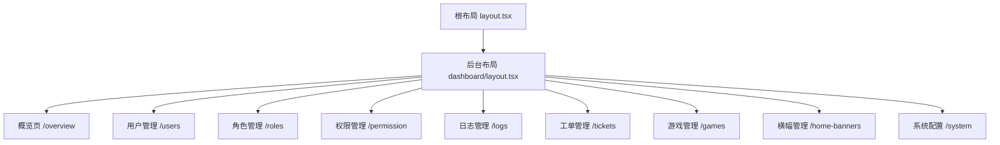
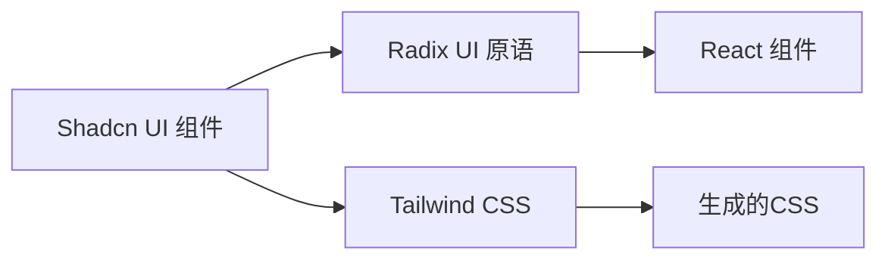
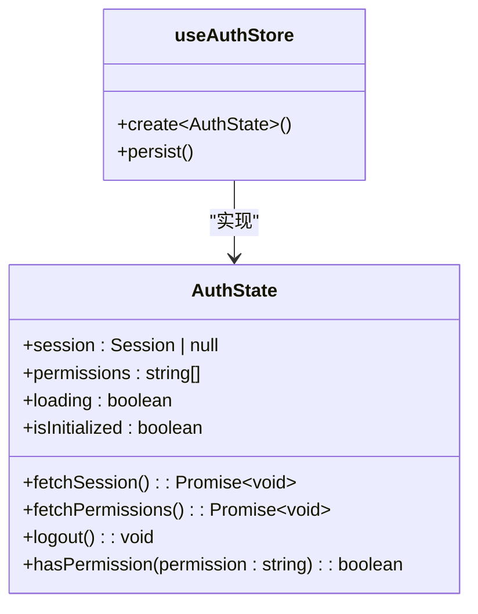
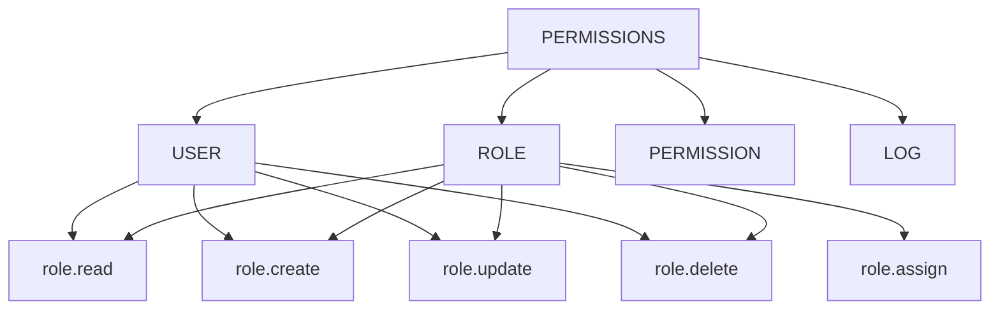
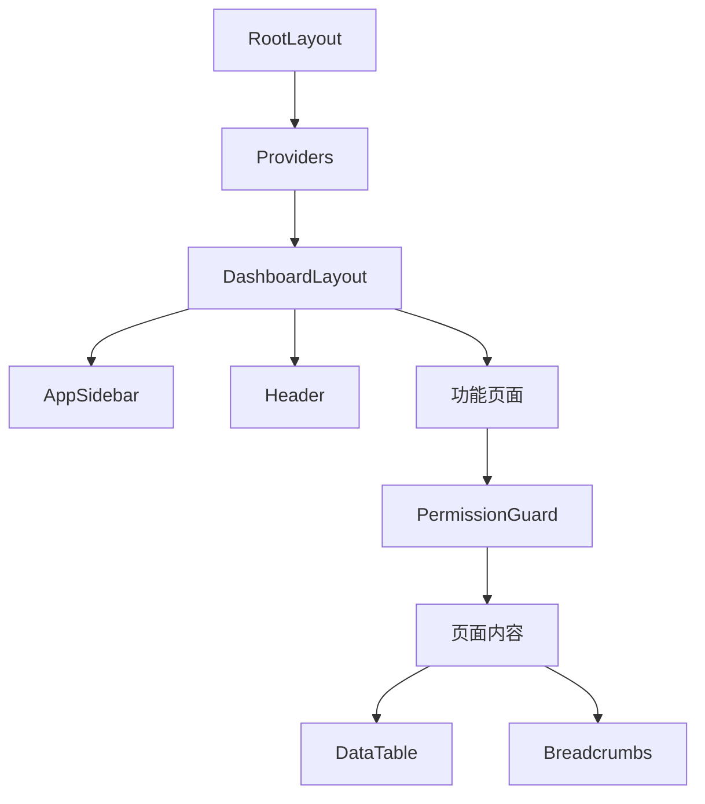
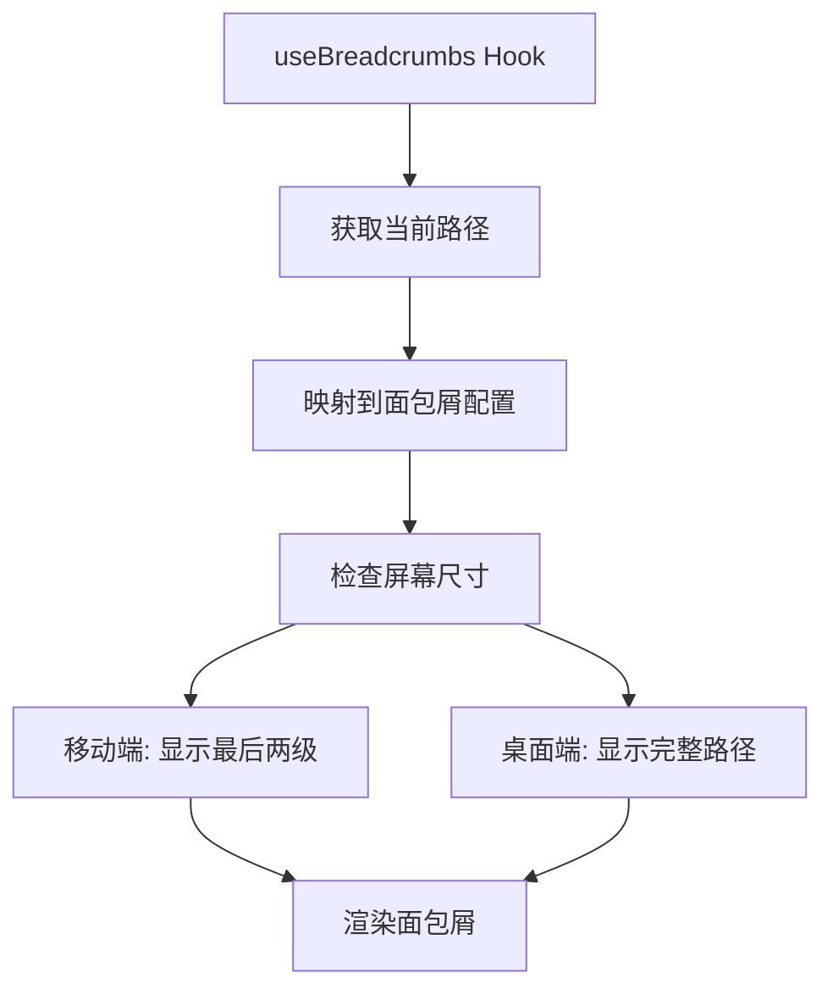

# 前端架构

<cite>
**本文档引用的文件**  
- [layout.tsx](file://src/app/layout.tsx)
- [dashboard/layout.tsx](file://src/app/dashboard/layout.tsx)
- [permission-guard.tsx](file://src/components/auth/permission-guard.tsx)
- [server-permission-guard.tsx](file://src/components/auth/server-permission-guard.tsx)
- [use-permissions.ts](file://src/hooks/use-permissions.ts)
- [use-auth.ts](file://src/hooks/use-auth.ts)
- [auth.ts](file://src/stores/auth.ts)
- [breadcrumb.tsx](file://src/components/layout/breadcrumbs.tsx)
- [use-breadcrumbs.ts](file://src/hooks/use-breadcrumbs.ts)
- [data-table.tsx](file://src/components/table/data-table.tsx)
- [components.json](file://components.json)
- [next.config.ts](file://next.config.ts)
- [globals.css](file://src/app/globals.css)
- [ui/breadcrumb.tsx](file://src/components/ui/breadcrumb.tsx)
- [ui/button.tsx](file://src/components/ui/button.tsx)
- [lib/permissions.ts](file://src/lib/permissions.ts)
- [lib/server-permissions.ts](file://src/lib/server-permissions.ts)
- [permissions.md](file://src/docs/permissions.md)
</cite>

## 目录
1. [项目结构](#项目结构)
2. [页面路由与布局](#页面路由与布局)
3. [UI组件库设计](#ui组件库设计)
4. [前端状态管理](#前端状态管理)
5. [权限控制机制](#权限控制机制)
6. [组件层级与渲染流程](#组件层级与渲染流程)
7. [响应式布局与面包屑导航](#响应式布局与面包屑导航)
8. [实际使用示例](#实际使用示例)

## 项目结构

v0-game_admin系统的前端项目采用Next.js 15的App Router架构，整体结构清晰，模块化程度高。核心目录包括`app`、`components`、`hooks`、`lib`、`stores`等，分别负责页面路由、UI组件、自定义Hook、工具函数和状态管理。

前端技术栈基于React 19与TypeScript，样式系统采用Tailwind CSS结合Shadcn UI组件库，状态管理使用Zustand，同时集成Radix UI提供底层可访问性组件。通过`components.json`配置文件定义了组件库的样式主题与路径别名，确保开发一致性。

**Section sources**
- [components.json](file://components.json)
- [next.config.ts](file://next.config.ts)
- [package.json](file://package.json)

## 页面路由与布局

系统采用Next.js 15的App Router进行页面路由管理，路由结构基于文件系统自动生成。根布局文件`app/layout.tsx`定义了全局的HTML结构和Providers，所有页面共享此布局。`dashboard`目录下的`layout.tsx`定义了管理后台的侧边栏布局，通过`SidebarProvider`和`AppSidebar`实现可折叠的侧边导航。

页面路由遵循RESTful风格，如`/dashboard/users`用于用户列表，`/dashboard/users/[id]`用于用户详情。API路由位于`app/api`目录下，每个端点通过`route.ts`文件定义，支持GET、POST等HTTP方法。



**Diagram sources**
- [layout.tsx](file://src/app/layout.tsx)
- [dashboard/layout.tsx](file://src/app/dashboard/layout.tsx)

**Section sources**
- [layout.tsx](file://src/app/layout.tsx)
- [dashboard/layout.tsx](file://src/app/dashboard/layout.tsx)

## UI组件库设计

UI组件库基于Shadcn UI构建，通过`components.json`配置为`new-york`风格，并集成Radix UI作为底层可访问性组件。组件库分为`ui`基础组件和`layout`布局组件两大类，同时提供`table`、`auth`等业务相关组件。

### Shadcn UI与Radix UI集成

Shadcn UI组件（如`Button`、`Table`）在内部使用Radix UI的原语（如`Slot`、`Primitive`）确保高可访问性和可组合性。例如，`button.tsx`使用`@radix-ui/react-slot`实现`asChild`功能，允许将按钮样式应用于任意子组件。



**Diagram sources**
- [ui/button.tsx](file://src/components/ui/button.tsx)
- [ui/breadcrumb.tsx](file://src/components/ui/breadcrumb.tsx)

### Tailwind CSS样式组织

样式组织遵循原子化CSS原则，通过`class-variance-authority`（CVA）定义组件变体。全局样式在`globals.css`中配置，包括字体、颜色变量和基础布局类。响应式设计通过Tailwind的断点系统（`md:`、`lg:`）实现。

### 自定义组件复用机制

系统提供了多个可复用的自定义组件：
- **table组件**：`DataTable`封装了表格渲染逻辑，支持加载状态、空状态和分页
- **breadcrumb组件**：`Breadcrumbs`组件根据当前路径动态生成面包屑导航
- **permission-guard组件**：权限守卫组件用于路由级别的权限控制

**Section sources**
- [components.json](file://components.json)
- [ui/button.tsx](file://src/components/ui/button.tsx)
- [ui/breadcrumb.tsx](file://src/components/ui/breadcrumb.tsx)
- [table/data-table.tsx](file://src/components/table/data-table.tsx)

## 前端状态管理

前端状态管理采用Zustand实现，核心状态存储在`stores/auth.ts`中，通过`useAuthStore` Hook提供全局访问。状态包括用户会话、权限列表、加载状态等，使用`zustand/persist`实现localStorage持久化。

### Zustand状态管理实现

`auth.ts`定义了`AuthState`接口，包含session、permissions等状态字段，以及fetchSession、fetchPermissions等异步操作方法。通过`persist`中间件将核心数据持久化，同时设置`skipHydration: true`避免服务端渲染水合问题。



**Diagram sources**
- [stores/auth.ts](file://src/stores/auth.ts)

### 自定义Hook状态访问

通过`use-auth.ts`和`use-permissions.ts`提供便捷的状态访问接口：
- `useAuth()`：获取用户会话和认证状态
- `usePermissions()`：获取权限列表和权限检查方法

这些Hook封装了Zustand store的复杂性，使组件可以简单地访问全局状态。

**Section sources**
- [stores/auth.ts](file://src/stores/auth.ts)
- [hooks/use-auth.ts](file://src/hooks/use-auth.ts)
- [hooks/use-permissions.ts](file://src/hooks/use-permissions.ts)

## 权限控制机制

系统实现了客户端和服务端双重权限控制机制，确保安全性与用户体验的平衡。

### 客户端权限守卫

`permission-guard.tsx`组件用于客户端权限控制，作为React组件包裹受保护的内容。它通过`useAuth`和`usePermissions` Hook获取用户状态和权限，根据`permissions`属性检查用户是否具有相应权限。

```tsx
<PermissionGuard permissions={PERMISSIONS.USER.READ}>
  <div>用户管理页面内容</div>
</PermissionGuard>
```

### 服务端权限守卫

`server-permission-guard.tsx`组件用于服务端权限控制，在页面渲染前进行权限检查。它使用`auth()`函数获取会话信息，通过`hasAnyPermission`或`hasAllPermissions`函数检查权限，若无权限则直接重定向。

```tsx
export default async function UserPage() {
  return (
    <ServerPermissionGuard permissions={PERMISSIONS.USER.READ}>
      <div>用户管理页面</div>
    </ServerPermissionGuard>
  );
}
```

### 权限常量定义

权限常量在`lib/permissions.ts`中定义，采用嵌套对象结构，便于管理和引用。



**Diagram sources**
- [lib/permissions.ts](file://src/lib/permissions.ts)

**Section sources**
- [components/auth/permission-guard.tsx](file://src/components/auth/permission-guard.tsx)
- [components/auth/server-permission-guard.tsx](file://src/components/auth/server-permission-guard.tsx)
- [lib/permissions.ts](file://src/lib/permissions.ts)
- [lib/server-permissions.ts](file://src/lib/server-permissions.ts)
- [src/docs/permissions.md](file://src/docs/permissions.md)

## 组件层级与渲染流程

系统采用React Server Components与客户端组件协同工作的模式，优化性能和用户体验。

### 组件层级关系



### 渲染流程

1. 服务端渲染`RootLayout`，获取会话信息
2. 通过`Providers`注入`session`到客户端
3. `DashboardLayout`渲染侧边栏和头部
4. 功能页面通过`ServerPermissionGuard`进行服务端权限检查
5. 页面内容通过`PermissionGuard`进行客户端权限检查
6. `Breadcrumbs`组件根据路径生成面包屑
7. `DataTable`组件渲染数据表格

**Diagram sources**
- [layout.tsx](file://src/app/layout.tsx)
- [dashboard/layout.tsx](file://src/app/dashboard/layout.tsx)
- [components/auth/permission-guard.tsx](file://src/components/auth/permission-guard.tsx)
- [components/layout/breadcrumbs.tsx](file://src/components/layout/breadcrumbs.tsx)
- [components/table/data-table.tsx](file://src/components/table/data-table.tsx)

**Section sources**
- [layout.tsx](file://src/app/layout.tsx)
- [dashboard/layout.tsx](file://src/app/dashboard/layout.tsx)
- [components/auth/permission-guard.tsx](file://src/components/auth/permission-guard.tsx)
- [components/layout/breadcrumbs.tsx](file://src/components/layout/breadcrumbs.tsx)
- [components/table/data-table.tsx](file://src/components/table/data-table.tsx)

## 响应式布局与面包屑导航

系统采用响应式设计，适配桌面和移动设备。

### 面包屑导航实现

`Breadcrumbs`组件通过`useBreadcrumbs` Hook获取当前路径的面包屑数据，根据屏幕尺寸显示不同层级：
- 移动端：显示最后两个层级
- 桌面端：显示完整路径



**Diagram sources**
- [hooks/use-breadcrumbs.ts](file://src/hooks/use-breadcrumbs.ts)
- [components/layout/breadcrumbs.tsx](file://src/components/layout/breadcrumbs.tsx)
- [config/breadcrumbs.ts](file://src/config/breadcrumbs.ts)

**Section sources**
- [hooks/use-breadcrumbs.ts](file://src/hooks/use-breadcrumbs.ts)
- [components/layout/breadcrumbs.tsx](file://src/components/layout/breadcrumbs.tsx)

## 实际使用示例

### 新页面权限控制

在新页面中使用权限控制：

```tsx
import { ServerPermissionGuard } from '@/components/auth/server-permission-guard';
import { PERMISSIONS } from '@/lib/permissions';

export default async function NewFeaturePage() {
  return (
    <ServerPermissionGuard permissions={PERMISSIONS.USER.READ}>
      <div>新功能页面内容</div>
    </ServerPermissionGuard>
  );
}
```

### 响应式表格布局

使用`DataTable`组件创建响应式表格：

```tsx
import { DataTable } from '@/components/table/data-table';

function UserTable({ data, loading }) {
  const columns = [
    { key: 'name', title: '姓名' },
    { key: 'email', title: '邮箱' },
    { key: 'role', title: '角色' }
  ];

  return <DataTable columns={columns} data={data} loading={loading} />;
}
```

**Section sources**
- [src/docs/permissions.md](file://src/docs/permissions.md)
- [components/table/data-table.tsx](file://src/components/table/data-table.tsx)