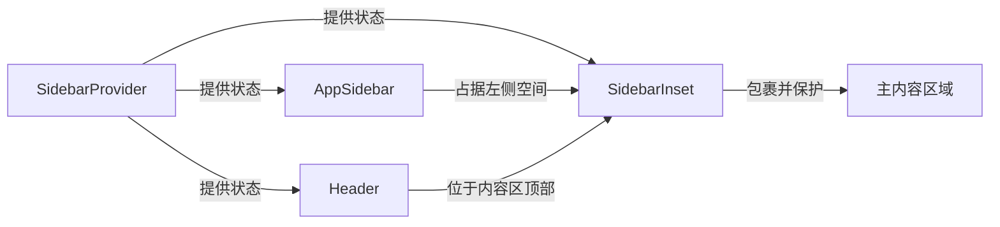

# App Router 结构

<cite>
**Referenced Files in This Document**   
- [src\app\layout.tsx](file://src/app/layout.tsx)
- [src\app\dashboard\layout.tsx](file://src/app/dashboard/layout.tsx)
- [src\contexts\providers.tsx](file://src/contexts/providers.tsx)
- [src\components\layout\app-sidebar.tsx](file://src/components/layout/app-sidebar.tsx)
- [src\components\layout\header.tsx](file://src/components/layout/header.tsx)
- [src\components\ui\sidebar.tsx](file://src/components/ui/sidebar.tsx)
- [src\lib\auth.ts](file://src/lib/auth.ts)
</cite>

## 目录结构

v0-game_admin系统采用Next.js 15的App Router架构，其目录结构遵循现代React应用的最佳实践。`src/app`目录是应用的核心，其中`layout.tsx`作为根布局文件，定义了整个应用的全局结构和共享组件。`dashboard`目录作为管理后台的主要工作区，拥有独立的`layout.tsx`文件，实现了仪表盘特有的布局逻辑。API路由被组织在`api`子目录中，通过`route.ts`文件定义RESTful端点。这种分层结构清晰地分离了应用的不同关注点，使得代码维护和功能扩展更加高效。

## 根布局与仪表盘布局的嵌套关系

v0-game_admin系统中的布局采用嵌套式设计，形成了清晰的层次结构。根布局（`src/app/layout.tsx`）作为最外层的容器，负责处理全局性的初始化任务，如身份验证、主题管理和状态提供。当用户访问`/dashboard`路径下的任何页面时，Next.js会自动将根布局与仪表盘布局（`src/app/dashboard/layout.tsx`）进行组合。这种嵌套机制允许仪表盘布局在继承根布局提供的全局服务的同时，注入自身特有的UI组件，如侧边栏和页眉。最终的页面结构是两个布局组件的叠加结果，实现了功能的复用与定制。

**Section sources**
- [src\app\layout.tsx](file://src/app/layout.tsx#L24-L44)
- [src\app\dashboard\layout.tsx](file://src/app/dashboard/layout.tsx#L10-L26)

## 根布局的初始化流程

根布局`src/app/layout.tsx`在应用启动时执行一系列关键的初始化操作，为整个应用奠定基础。

### 身份验证流程

根布局通过调用`auth()`函数（位于`src/lib/auth.ts`）来预加载会话数据。该函数是一个异步服务器端函数，它从HTTP Cookie中读取JWT令牌，验证其有效性，并解析出用户信息。这个过程在页面渲染前完成，确保了所有后续的布局和页面组件都能访问到最新的会话状态，实现了服务端的预认证。

### 上下文提供者集成

`Providers`组件（位于`src/contexts/providers.tsx`）是应用状态管理的核心。它被包裹在`RootLayout`中，为整个应用树提供多个React Context。具体包括：
- `SessionProvider`：由Next-Auth提供，将`auth()`函数获取的会话数据分发给所有子组件。
- `ThemeProvider`：由Next-Themes提供，管理应用的明暗主题切换，并将状态持久化到本地存储。
- `KBarComponent`：实现全局的命令面板功能，提供快速导航和操作。

### 通知组件初始化

`Toaster`组件（来自`src/components/ui/sonner.tsx`）被直接渲染在`Providers`内部。它作为应用的全局通知中心，监听并显示来自任何组件的Toast消息。由于它位于根布局中，因此整个应用中的任何地方都可以通过调用`toast()`函数来触发通知，实现了通知系统的全局可用性。

```mermaid
flowchart TD
A[RootLayout 开始] --> B[调用 auth() 函数]
B --> C{是否获取到有效会话?}
C --> |是| D[创建 Providers 组件]
C --> |否| D
D --> E[初始化 SessionProvider]
D --> F[初始化 ThemeProvider]
D --> G[初始化 KBarComponent]
E --> H[渲染 Toaster 组件]
F --> H
G --> H
H --> I[渲染子页面]
```

**Diagram sources **
- [src\app\layout.tsx](file://src/app/layout.tsx#L24-L44)
- [src\lib\auth.ts](file://src/lib/auth.ts#L19-L44)
- [src\contexts\providers.tsx](file://src/contexts/providers.tsx#L7-L25)
- [src\components\ui\sonner.tsx](file://src/components/ui/sonner.tsx#L5-L22)

**Section sources**
- [src\app\layout.tsx](file://src/app/layout.tsx#L24-L44)
- [src\lib\auth.ts](file://src/lib/auth.ts#L19-L44)
- [src\contexts\providers.tsx](file://src/contexts/providers.tsx#L7-L25)

## 仪表盘布局的协作机制

仪表盘布局`src/app/dashboard/layout.tsx`构建了一个功能完整的管理后台界面，其核心是侧边栏、页眉和主内容区的协作。

### 组件协作流程

1.  **状态管理**：`SidebarProvider`（来自`src/components/ui/sidebar.tsx`）作为顶层容器，使用React Context管理侧边栏的展开/折叠状态。该状态被持久化到浏览器Cookie中，确保用户刷新页面后仍能保持其偏好。
2.  **侧边栏渲染**：`AppSidebar`组件被`SidebarProvider`包含，它根据当前的侧边栏状态（由`useSidebar` Hook提供）来决定自身的显示方式。在桌面端，它可以是展开或折叠的固定侧边栏；在移动端，则会转换为一个可滑动的抽屉（Sheet）。
3.  **页眉渲染**：`Header`组件同样位于`SidebarProvider`内，它通过`useSidebar` Hook获取状态，并渲染一个包含面包屑导航、搜索框和主题切换按钮的页眉。
4.  **内容区域包裹**：`SidebarInset`是一个特殊的`<main>`元素，它被设计用来包裹主内容区域。它的样式会根据`SidebarProvider`的状态动态调整，例如在侧边栏折叠时自动增加左边距，从而避免内容被侧边栏遮挡。

### SidebarInset 的作用

`SidebarInset`组件是实现响应式布局的关键。它通过CSS类和内联样式，监听`SidebarProvider`上下文中的`state`（'expanded'或'collapsed'）。当侧边栏状态改变时，`SidebarInset`会自动调整其`margin-left`，确保主内容区域始终在侧边栏之后正确显示，无需在每个页面组件中手动处理布局偏移。



**Diagram sources **
- [src\app\dashboard\layout.tsx](file://src/app/dashboard/layout.tsx#L10-L26)
- [src\components\ui\sidebar.tsx](file://src/components/ui/sidebar.tsx#L55-L151)
- [src\components\layout\app-sidebar.tsx](file://src/components/layout/app-sidebar.tsx#L26-L68)
- [src\components\layout\header.tsx](file://src/components/layout/header.tsx#L10-L41)

**Section sources**
- [src\app\dashboard\layout.tsx](file://src/app/dashboard/layout.tsx#L10-L26)
- [src\components\ui\sidebar.tsx](file://src/components/ui/sidebar.tsx#L55-L151)

## 异步特性与预加载模式

Next.js App Router的布局组件支持异步渲染，这为v0-game_admin系统带来了显著的性能和开发优势。

### 异步布局的优势

`RootLayout`和`DashboardLayout`都被定义为`async`函数。这允许它们在渲染前执行异步操作，如数据获取。在`RootLayout`中，`const session = await auth();`这行代码就是一个典型的异步数据预取。Next.js会等待这个Promise解析完成，然后将获取到的会话数据作为`session`属性传递给`Providers`组件。这种方式将数据获取逻辑从页面组件提升到了布局层，实现了数据的预加载。

### 最佳实践

这种模式的最佳实践是将所有全局性的、影响多个页面的数据获取操作放在根布局中。例如，用户会话、全局配置或未读通知计数等。这可以避免在每个页面组件中重复进行相同的数据请求，减少了网络开销，并确保了用户在进入任何页面时，核心数据都已就绪。对于仅在特定区域（如仪表盘）需要的数据，则可以在该区域的布局（如`DashboardLayout`）中进行预取，从而实现数据获取的分层和优化。

**Section sources**
- [src\app\layout.tsx](file://src/app/layout.tsx#L24-L44)
- [src\lib\auth.ts](file://src/lib/auth.ts#L19-L44)