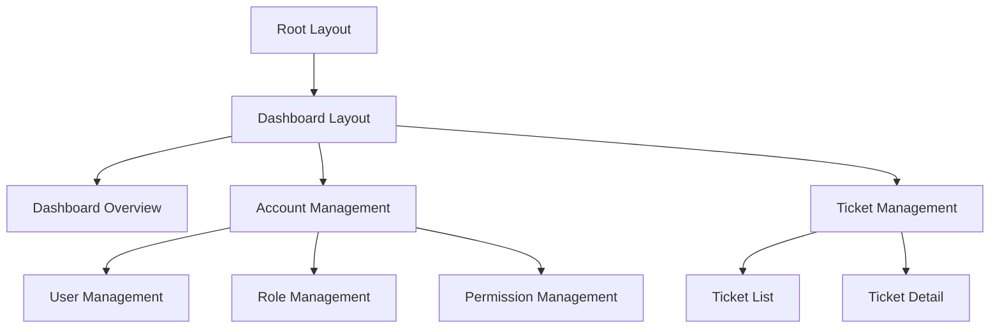
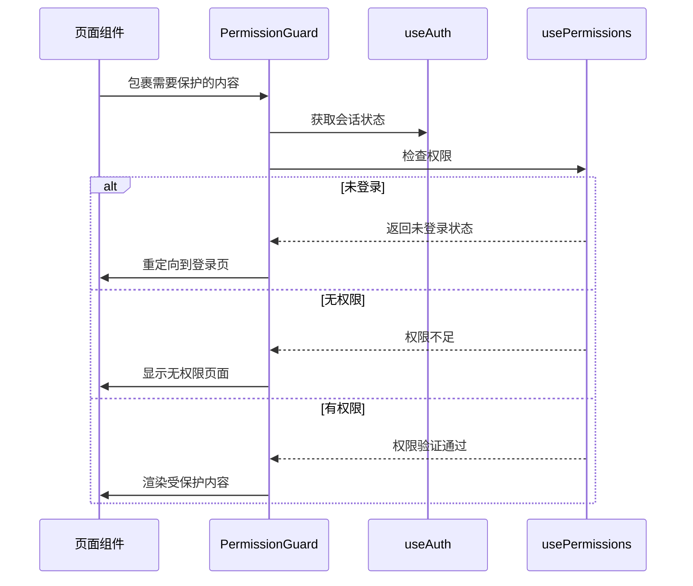
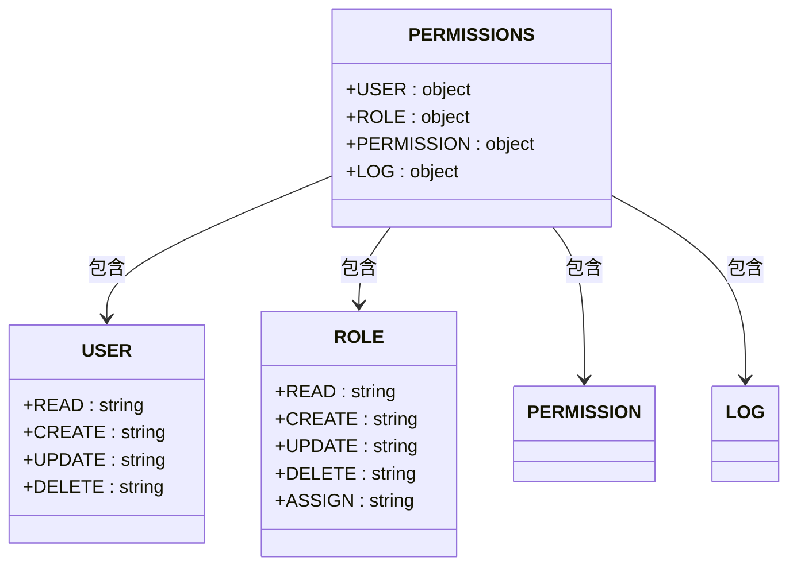
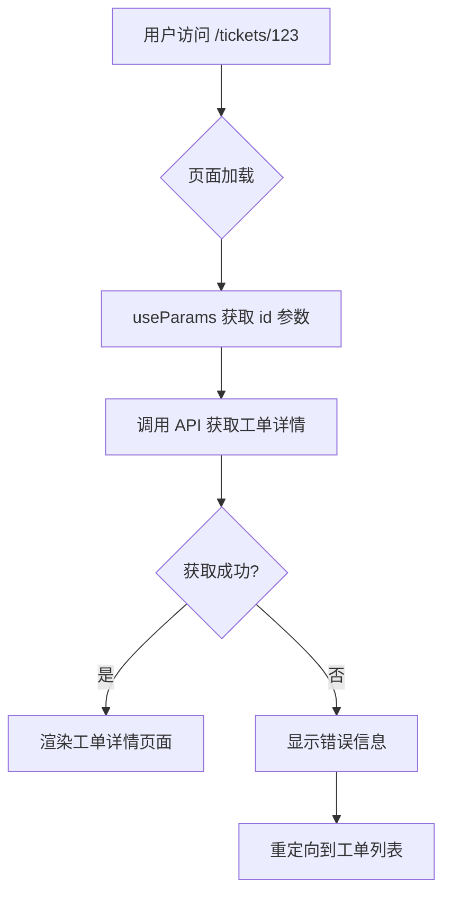

# 前端路由系统

<cite>
**本文档引用的文件**   
- [layout.tsx](file://src/app/layout.tsx)
- [login/page.tsx](file://src/app/login/page.tsx)
- [dashboard/layout.tsx](file://src/app/dashboard/layout.tsx)
- [dashboard/page.tsx](file://src/app/dashboard/page.tsx)
- [dashboard/overview/page.tsx](file://src/app/dashboard/overview/page.tsx)
- [dashboard/account/user/page.tsx](file://src/app/dashboard/account/user/page.tsx)
- [dashboard/account/role/page.tsx](file://src/app/dashboard/account/role/page.tsx)
- [dashboard/account/permission/page.tsx](file://src/app/dashboard/account/permission/page.tsx)
- [dashboard/tickets/page.tsx](file://src/app/dashboard/tickets/page.tsx)
- [dashboard/tickets/[id]/page.tsx](file://src/app/dashboard/tickets/[id]/page.tsx)
- [api/users/[id]/route.ts](file://src/app/api/users/[id]/route.ts)
- [api/tickets/[id]/route.ts](file://src/app/api/tickets/[id]/route.ts)
- [components/auth/permission-guard.tsx](file://src/components/auth/permission-guard.tsx)
- [components/auth/server-permission-guard.tsx](file://src/components/auth/server-permission-guard.tsx)
- [lib/permissions.ts](file://src/lib/permissions.ts)
- [lib/server-permissions.ts](file://src/lib/server-permissions.ts)
- [constants/router.ts](file://src/constants/router.ts)
- [lib/searchparams.ts](file://src/lib/searchparams.ts)
</cite>

## 目录
1. [项目结构与路由基础](#项目结构与路由基础)
2. [核心路由架构](#核心路由架构)
3. [权限系统集成](#权限系统集成)
4. [动态路由应用](#动态路由应用)
5. [搜索参数管理](#搜索参数管理)
6. [最佳实践与错误处理](#最佳实践与错误处理)

## 项目结构与路由基础

v0-game_admin系统采用Next.js 15的App Router架构，路由系统基于文件系统自动生成。项目核心路由结构位于`/src/app`目录下，遵循约定优于配置的原则。

系统主要包含两大功能区域：公共访问区和管理后台区。公共访问区以`/login`路径为代表，提供用户登录界面；管理后台区以`/dashboard`为前缀，包含所有需要认证访问的管理功能页面。

系统基于Next.js 15构建，技术栈包括React 19、TypeScript、Tailwind CSS和Shadcn UI组件库，确保了现代前端开发的最佳实践和高性能用户体验。

**Section sources**
- [layout.tsx](file://src/app/layout.tsx)
- [login/page.tsx](file://src/app/login/page.tsx)
- [README.md](file://README.md)

## 核心路由架构

### 应用布局结构

系统采用多层布局嵌套的设计模式。根布局文件`app/layout.tsx`定义了全局的HTML结构、字体加载和全局提供者（Providers），为整个应用提供基础环境。



**Diagram sources**
- [layout.tsx](file://src/app/layout.tsx)
- [dashboard/layout.tsx](file://src/app/dashboard/layout.tsx)

### 仪表盘布局与导航

`/src/app/dashboard/layout.tsx`文件定义了管理后台的通用布局，包含侧边栏（AppSidebar）、头部导航（Header）和主要内容区域。该布局通过`SidebarProvider`和`SidebarInset`组件实现响应式侧边栏功能。

仪表盘首页`/src/app/dashboard/page.tsx`作为重定向入口，未登录用户将被重定向到登录页，已登录用户则自动跳转到`/dashboard/overview`工作台页面。

**Section sources**
- [dashboard/layout.tsx](file://src/app/dashboard/layout.tsx)
- [dashboard/page.tsx](file://src/app/dashboard/page.tsx)
- [dashboard/overview/page.tsx](file://src/app/dashboard/overview/page.tsx)

### 功能模块路由组织

系统功能模块按业务领域组织在`/src/app/dashboard`目录下，主要分为业务管理和系统管理两大类：

- **业务管理模块**：包括游戏管理、玩家管理、数据分析、活动管理、通告管理、Banner管理、工单管理和订单管理
- **系统管理模块**：包括账号管理（用户、角色、权限）和系统管理（日志、配置、支付渠道）

每个功能模块都有独立的子路由结构，例如账号管理模块包含用户管理、角色管理和权限管理三个子页面，分别对应`/dashboard/account/user`、`/dashboard/account/role`和`/dashboard/account/permission`路径。

**Section sources**
- [constants/router.ts](file://src/constants/router.ts)
- [dashboard/account/user/page.tsx](file://src/app/dashboard/account/user/page.tsx)
- [dashboard/account/role/page.tsx](file://src/app/dashboard/account/role/page.tsx)
- [dashboard/account/permission/page.tsx](file://src/app/dashboard/account/permission/page.tsx)

## 权限系统集成

### 客户端权限控制

系统实现了基于角色的访问控制（RBAC）机制，通过`PermissionGuard`组件在客户端进行权限验证。该组件接收权限码数组作为参数，检查当前用户是否具有访问特定页面的权限。



**Diagram sources**
- [components/auth/permission-guard.tsx](file://src/components/auth/permission-guard.tsx)
- [hooks/use-permissions.ts](file://src/hooks/use-permissions.ts)

### 服务端权限控制

对于需要在服务端进行权限验证的场景，系统提供了`ServerPermissionGuard`组件。该组件在服务器端执行权限检查，可有效防止客户端绕过权限验证。

服务端权限检查通过`checkPagePermission`工具函数实现，该函数结合了用户会话验证和权限码检查，支持"需要所有权限"和"需要任意权限"两种模式。

**Section sources**
- [components/auth/server-permission-guard.tsx](file://src/components/auth/server-permission-guard.tsx)
- [lib/server-permissions.ts](file://src/lib/server-permissions.ts)

### 权限常量与映射

系统在`src/lib/permissions.ts`文件中定义了所有权限常量，采用嵌套对象结构组织权限码，便于维护和引用。



**Diagram sources**
- [lib/permissions.ts](file://src/lib/permissions.ts)

## 动态路由应用

### 动态路由参数获取

系统在用户管理、工单管理等模块中广泛使用动态路由，通过`[id]`模式实现详情页的路由。例如`/dashboard/tickets/[id]`路径用于显示特定工单的详细信息。

在页面组件中，通过`useParams` Hook获取动态路由参数：

```typescript
const params = useParams();
const id = params.id; // 获取动态路由参数
```

对应的API路由也采用相同的动态路径结构，如`/api/tickets/[id]/route.ts`，实现前后端路由的一致性。

**Section sources**
- [dashboard/tickets/[id]/page.tsx](file://src/app/dashboard/tickets/[id]/page.tsx)
- [api/tickets/[id]/route.ts](file://src/app/api/tickets/[id]/route.ts)

### 动态路由处理流程

当用户访问动态路由时，系统执行以下处理流程：



**Diagram sources**
- [dashboard/tickets/[id]/page.tsx](file://src/app/dashboard/tickets/[id]/page.tsx)

### 嵌套路由与API集成

系统实现了前端页面路由与后端API路由的紧密集成。例如工单详情页不仅显示工单信息，还通过API获取相关的评论和事件记录，形成完整的数据展示。

API路由采用RESTful设计风格，支持标准的HTTP方法：
- GET: 获取资源
- POST: 创建资源  
- PATCH: 更新资源
- DELETE: 删除资源

**Section sources**
- [api/tickets/[id]/route.ts](file://src/app/api/tickets/[id]/route.ts)
- [api/users/[id]/route.ts](file://src/app/api/users/[id]/route.ts)

## 搜索参数管理

系统使用`nuqs`库管理URL搜索参数，实现了搜索参数的类型安全和服务器端渲染支持。在`src/lib/searchparams.ts`文件中定义了通用的搜索参数模式。

```typescript
export const searchParams = {
  page: parseAsInteger.withDefault(1),
  limit: parseAsInteger.withDefault(10),
  q: parseAsString,
  gender: parseAsString,
  categories: parseAsString
};
```

这些搜索参数在列表页面中被广泛使用，支持分页、搜索和筛选功能。通过`searchParamsCache`和`serialize`工具，实现了搜索参数的缓存和序列化，优化了用户体验。

**Section sources**
- [lib/searchparams.ts](file://src/lib/searchparams.ts)
- [dashboard/account/role/hooks/useRoleFilters.ts](file://src/app/dashboard/account/role/hooks/useRoleFilters.ts)

## 最佳实践与错误处理

### 路由跳转最佳实践

系统推荐使用Next.js的`useRouter` Hook进行编程式导航，确保路由跳转的一致性和可预测性。

```typescript
const router = useRouter();
// 正确的路由跳转方式
router.push('/dashboard/tickets');
router.back(); // 返回上一页
```

对于需要权限验证的页面跳转，应在跳转前进行权限检查，或使用权限守卫组件包裹目标页面。

### 错误处理机制

系统实现了全面的错误处理机制，包括：

1. **路由参数验证**：在动态路由中验证参数的有效性，无效参数返回404页面
2. **资源存在性检查**：在获取数据前检查资源是否存在，不存在时显示友好提示
3. **网络错误处理**：捕获API请求错误，显示适当的错误消息
4. **权限错误处理**：权限不足时重定向到登录页或显示无权限页面

错误处理遵循用户友好的原则，避免显示技术性错误信息，同时记录详细的错误日志供开发者排查问题。

**Section sources**
- [error.tsx](file://src/app/error.tsx)
- [not-found.tsx](file://src/app/not-found.tsx)
- [dashboard/tickets/[id]/page.tsx](file://src/app/dashboard/tickets/[id]/page.tsx)