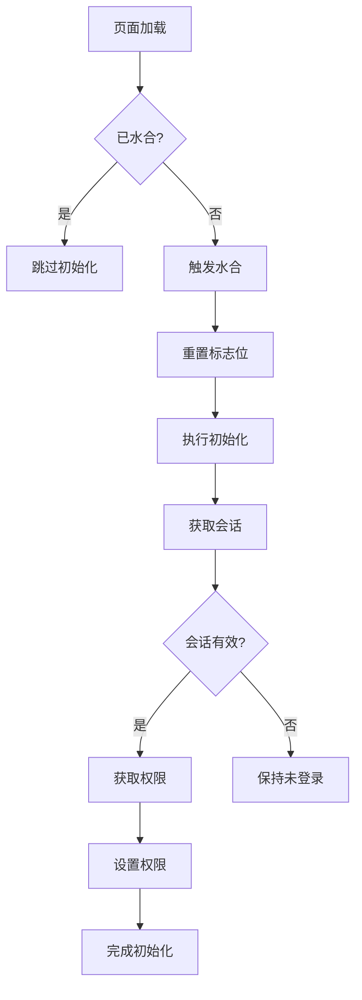
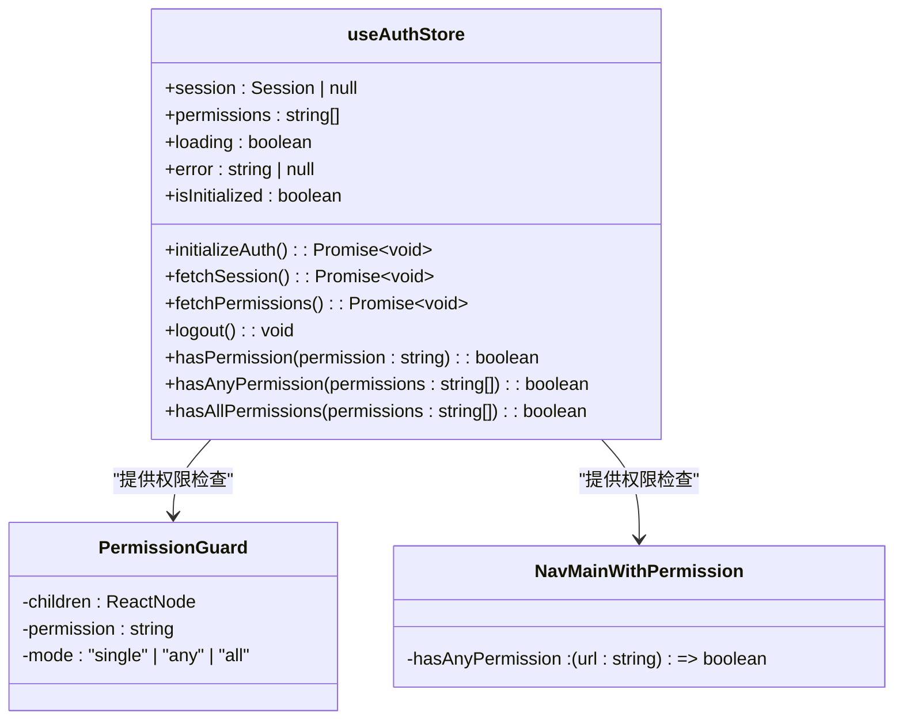

# 状态定义与核心字段

<cite>
**本文档中引用的文件**  
- [auth.ts](file://src/stores/auth.ts)
- [server-permissions.ts](file://src/lib/server-permissions.ts)
- [permission-guard.tsx](file://src/components/auth/permission-guard.tsx)
- [nav-main-with-permission.tsx](file://src/components/layout/nav-main-with-permission.tsx)
- [use-permissions.ts](file://src/hooks/use-permissions.ts)
- [login-form.tsx](file://src/app/login/components/login-form.tsx)
- [nav-user.tsx](file://src/components/layout/nav-user.tsx)
</cite>

## 目录
1. [简介](#简介)
2. [核心状态字段定义](#核心状态字段定义)
3. [状态字段在认证流程中的作用](#状态字段在认证流程中的作用)
4. [状态初始化与持久化策略](#状态初始化与持久化策略)
5. [权限检查机制与使用场景](#权限检查机制与使用场景)
6. [状态对组件渲染的影响](#状态对组件渲染的影响)
7. [认证与授权机制的整体支撑](#认证与授权机制的整体支撑)

## 简介
`useAuthStore` 是 v0-game_admin 系统中用于管理全局用户认证和权限状态的核心 Zustand 状态管理模块。该模块定义了用户会话、权限列表、加载状态、错误信息及初始化标志等关键字段，支撑整个系统的安全访问控制。通过合理设计状态结构和行为逻辑，确保系统在页面加载、登录、登出、权限校验等场景下具备一致性和可靠性。

**Section sources**
- [auth.ts](file://src/stores/auth.ts#L1-L43)

## 核心状态字段定义
`useAuthStore` 定义了以下核心状态字段，其类型和初始值均在 `AuthState` 接口和 store 初始化中明确声明：

- **session**: `Session | null`，存储用户会话信息，包含用户基本信息（如 ID、邮箱、用户名），初始值为 `null`
- **permissions**: `string[]`，保存当前用户的权限编码列表，用于前端权限判断，初始值为空数组 `[]`
- **loading**: `boolean`，控制全局加载状态显示（如初始化、获取会话时），初始值为 `false`
- **permissionsLoading**: `boolean`，专门用于权限获取过程中的加载状态，避免与其他加载逻辑冲突，初始值为 `false`
- **error**: `string | null`，记录认证过程中发生的错误信息，初始值为 `null`
- **isInitialized**: `boolean`，标识认证状态是否已完成初始化，防止重复执行，初始值为 `false`

这些字段共同构成了系统的认证状态基石，确保前端能够准确反映用户的登录状态和权限能力。

**Section sources**
- [auth.ts](file://src/stores/auth.ts#L15-L22)

## 状态字段在认证流程中的作用
每个状态字段在用户认证流程中扮演着特定角色：

- **session**：存储从服务端 `/auth/session` 接口获取的用户会话数据。当用户成功登录后，该字段被填充；登出或会话失效时被设为 `null`，直接影响用户是否处于登录状态。
- **permissions**：通过调用 `/auth/permissions` 接口获取当前用户拥有的权限编码集合。该字段是前端进行权限判断（如菜单显示、按钮禁用）的依据。
- **loading**：在执行 `initializeAuth`、`fetchSession` 等异步操作时设为 `true`，用于展示全局加载指示器，提升用户体验。
- **permissionsLoading**：在调用 `fetchPermissions` 期间设为 `true`，可用于局部权限刷新时的加载反馈。
- **error**：捕获认证过程中的异常信息（如网络错误、会话过期），可在 UI 中提示用户具体问题。
- **isInitialized**：确保 `initializeAuth` 方法在整个应用生命周期中仅执行一次，防止多次重复初始化导致状态混乱。

这些字段协同工作，保障了认证流程的健壮性和可预测性。

**Section sources**
- [auth.ts](file://src/stores/auth.ts#L48-L54)

## 状态初始化与持久化策略
`useAuthStore` 采用 `zustand/persist` 实现状态持久化，并通过精细的初始化逻辑确保状态一致性：

- **初始化入口**：`triggerGlobalInitialization` 方法作为全局唯一初始化入口，通过 `hasGloballyHydrated` 全局标志确保只执行一次水合（rehydrate）和初始化。
- **初始化流程**：`initializeAuth` 方法依次调用 `fetchSession` 和 `fetchPermissions`，完成会话恢复和权限加载。使用 `hasEverInitialized` 防止重复初始化。
- **持久化配置**：仅持久化 `session` 和 `permissions` 两个核心字段，而 `loading`、`error`、`isInitialized` 等临时状态不被持久化，确保每次刷新页面都能重新进入加载流程。
- **服务端渲染兼容**：设置 `skipHydration: true`，避免服务端渲染时状态不一致问题。

此策略既保证了用户体验（登录状态保留），又维护了状态的准确性与安全性。

**Diagram sources**
- [auth.ts](file://src/stores/auth.ts#L149-L161)

**Section sources**
- [auth.ts](file://src/stores/auth.ts#L56-L80)

## 权限检查机制与使用场景
`useAuthStore` 提供了三个核心权限检查方法，支持灵活的权限控制：

- **hasPermission**: 判断用户是否拥有某单一权限
- **hasAnyPermission**: 判断用户是否拥有参数数组中任意一个权限
- **hasAllPermissions**: 判断用户是否拥有参数数组中所有权限

这些方法在系统中被广泛使用：
- **菜单渲染控制**：`nav-main-with-permission.tsx` 使用 `hasAnyPermission` 判断用户是否有权访问某路由对应的菜单项
- **组件级权限控制**：`permission-guard.tsx` 使用 `hasPermission` 或 `hasAllPermissions` 包裹敏感组件，决定是否渲染
- **Hook 封装复用**：`use-permissions.ts` 导出这些方法，供各类组件便捷调用

此外，服务端也提供了对应的异步权限检查函数（如 `hasPermission`、`hasAnyPermission`），用于服务端渲染或 API 路由中的权限验证，实现前后端一致的权限逻辑。

**Diagram sources**
- [auth.ts](file://src/stores/auth.ts#L190-L203)
- [permission-guard.tsx](file://src/components/auth/permission-guard.tsx#L23)
- [nav-main-with-permission.tsx](file://src/components/layout/nav-main-with-permission.tsx#L27)

**Section sources**
- [auth.ts](file://src/stores/auth.ts#L190-L203)
- [use-permissions.ts](file://src/hooks/use-permissions.ts#L12-L14)
- [server-permissions.ts](file://src/lib/server-permissions.ts#L71-L114)

## 状态对组件渲染的影响
`useAuthStore` 的状态直接驱动着 UI 的条件渲染与交互反馈：

- 当 `loading` 为 `true` 时，系统可能展示加载骨架屏或禁用交互元素
- 当 `session` 为 `null` 时，导航栏显示登录入口，已登录区域隐藏
- 当 `isInitialized` 为 `false` 时，系统等待初始化完成，避免未授权访问
- 在 `login-form.tsx` 登录成功后，调用 `forceReInitialize` 强制刷新认证状态，触发 UI 更新
- 在 `nav-user.tsx` 中点击退出时，调用 `logout` 方法清除状态并跳转至登录页

这种响应式设计使得 UI 能够实时、准确地反映用户的认证状态变化。

**Section sources**
- [login-form.tsx](file://src/app/login/components/login-form.tsx#L25)
- [nav-user.tsx](file://src/components/layout/nav-user.tsx#L41-L60)

## 认证与授权机制的整体支撑
`useAuthStore` 作为系统的认证授权中枢，通过以下方式支撑整体安全机制：

1. **统一状态管理**：集中管理所有与认证相关的状态，避免分散导致的数据不一致
2. **自动化初始化**：在应用启动时自动恢复会话和权限，无需手动干预
3. **权限细粒度控制**：支持单权限、任一权限、全部权限三种判断模式，满足不同场景需求
4. **前后端一致性**：前端权限检查与服务端逻辑保持一致，形成双重保障
5. **可维护性与扩展性**：通过清晰的接口定义和模块化设计，便于后续功能扩展和问题排查

该状态管理方案有效支撑了 v0-game_admin 系统的安全性、稳定性和用户体验。

**Section sources**
- [auth.ts](file://src/stores/auth.ts#L44-L218)