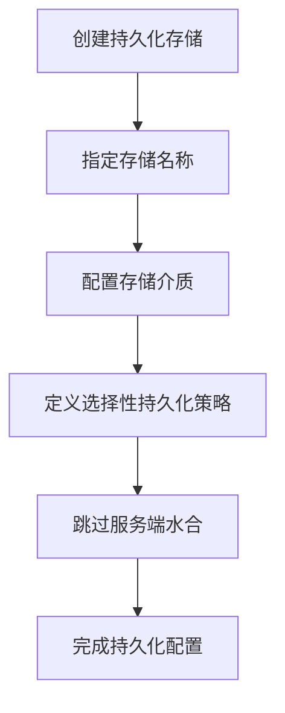
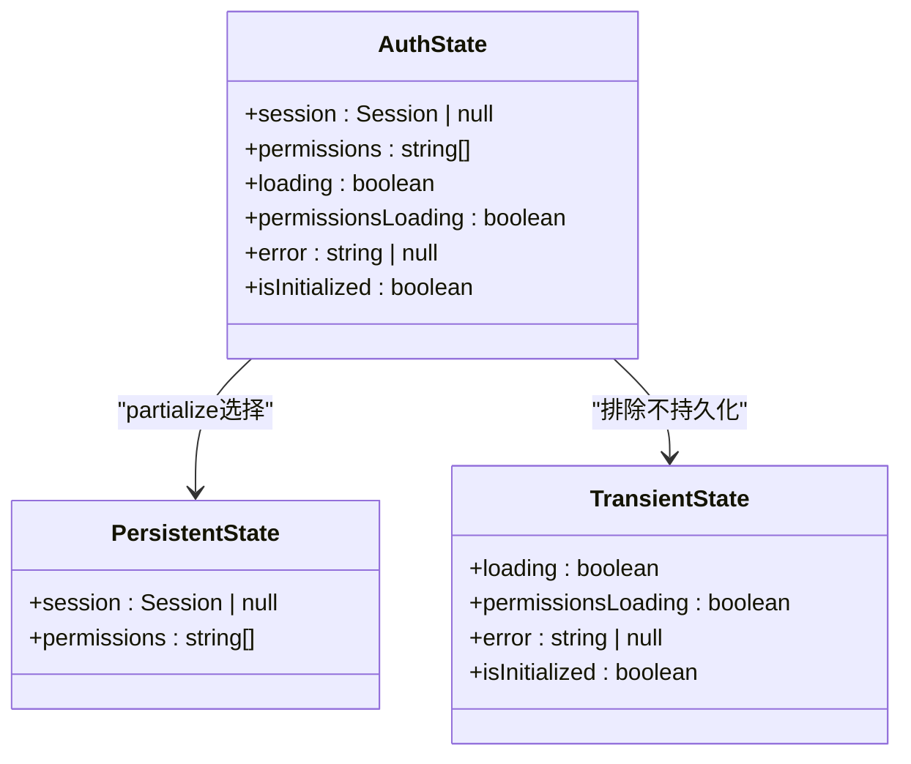
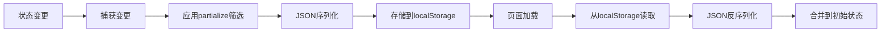
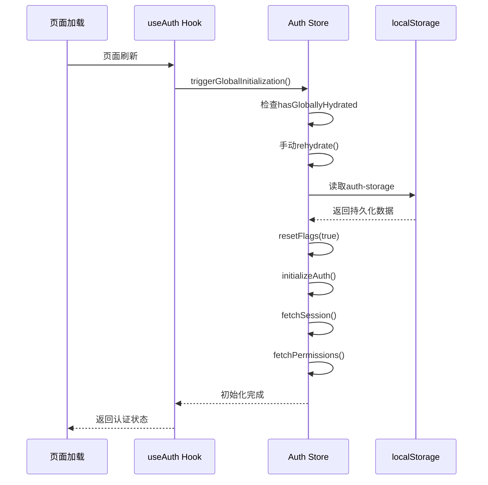
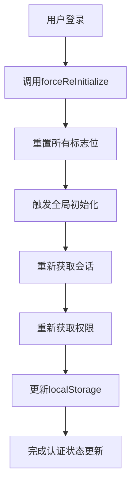
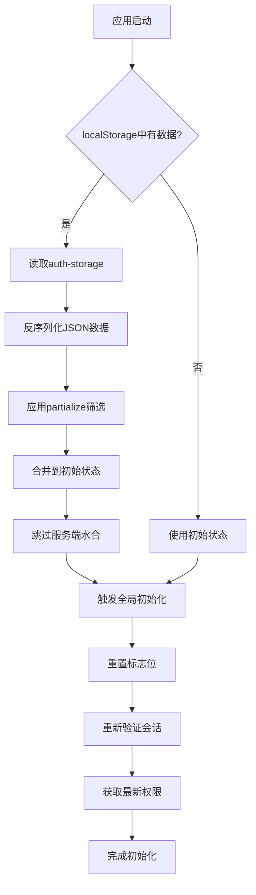

# 状态持久化机制

<cite>
**本文档引用文件**  
- [auth.ts](file://src/stores/auth.ts)
- [use-auth.ts](file://src/hooks/use-auth.ts)
- [login-form.tsx](file://src/app/login/components/login-form.tsx)
</cite>

## 目录
1. [简介](#简介)
2. [状态持久化配置](#状态持久化配置)
3. [选择性持久化策略](#选择性持久化策略)
4. [存储机制与序列化](#存储机制与序列化)
5. [初始化与水合流程](#初始化与水合流程)
6. [持久化键名规则](#持久化键名规则)
7. [完整状态持久化流程图](#完整状态持久化流程图)

## 简介
v0-game_admin系统采用Zustand状态管理库的`persist`中间件实现状态持久化，确保用户认证信息在页面刷新后能够正确恢复。本系统通过精细化的持久化策略，仅保存核心认证数据，避免临时状态和控制标志的持久化，从而保证应用在重新加载时能正确执行初始化流程。

## 状态持久化配置

v0-game_admin系统使用Zustand的`persist`中间件来实现状态持久化。该中间件配置了基于`localStorage`的存储机制，通过`createJSONStorage`创建JSON格式的存储实例。持久化配置的核心目标是确保用户会话和权限信息在页面刷新后能够自动恢复，同时避免不必要的状态持久化。

**图示来源**  
- [auth.ts](file://src/stores/auth.ts#L206-L216)

**节来源**  
- [auth.ts](file://src/stores/auth.ts#L206-L216)

## 选择性持久化策略

系统通过`partialize`函数实现选择性持久化，仅保留核心认证数据，避免持久化临时状态和控制标志。这种策略确保了页面刷新后能够正确重新初始化，防止状态混乱。

`partialize`函数明确指定只持久化`session`和`permissions`两个字段：
- `session`: 存储用户会话信息，包含用户身份数据
- `permissions`: 存储用户权限列表，用于权限控制

同时，系统刻意避免持久化以下临时状态和控制标志：
- `loading`: 临时加载状态，不应跨会话保留
- `permissionsLoading`: 权限加载状态，属于临时状态
- `error`: 错误信息，属于瞬态数据
- `isInitialized`: 初始化标志，确保每次刷新都会重新初始化

**图示来源**  
- [auth.ts](file://src/stores/auth.ts#L209-L213)

**节来源**  
- [auth.ts](file://src/stores/auth.ts#L209-L213)

## 存储机制与序列化

系统使用`createJSONStorage(() => localStorage)`配置存储机制，将状态数据以JSON格式存储在浏览器的`localStorage`中。`createJSONStorage`是Zustand提供的工具函数，用于创建支持JSON序列化的存储实例。

该存储机制的工作流程如下：
1. 状态变更时，`persist`中间件自动捕获变更
2. 通过`partialize`函数筛选需要持久化的数据
3. 使用`JSON.stringify`将筛选后的数据序列化为字符串
4. 将序列化后的字符串存储到`localStorage`中指定的键下
5. 页面加载时，从`localStorage`读取数据并反序列化
6. 将反序列化的数据合并到初始状态中

**图示来源**  
- [auth.ts](file://src/stores/auth.ts#L207-L208)

**节来源**  
- [auth.ts](file://src/stores/auth.ts#L207-L208)

## 初始化与水合流程

系统设计了精细的初始化与水合流程，确保在页面刷新后能够正确恢复状态并执行必要的初始化操作。通过`skipHydration: true`配置跳过服务端渲染的水合过程，避免服务端和客户端状态不一致的问题。

初始化流程的关键步骤包括：
1. 页面加载时，调用`triggerGlobalInitialization`启动全局初始化
2. 手动触发`rehydrate`从`localStorage`恢复持久化状态
3. 重置所有请求标志位和初始化状态
4. 执行`initializeAuth`重新验证会话有效性
5. 获取最新的权限信息

**图示来源**  
- [auth.ts](file://src/stores/auth.ts#L150-L160)
- [use-auth.ts](file://src/hooks/use-auth.ts#L12-L24)

**节来源**  
- [auth.ts](file://src/stores/auth.ts#L150-L160)
- [use-auth.ts](file://src/hooks/use-auth.ts#L12-L24)

## 持久化键名规则

系统通过`name: 'auth-storage'`配置指定持久化数据在`localStorage`中的存储键名。该键名遵循以下规则和设计考虑：

1. **命名规范**: 使用有意义的名称`auth-storage`明确标识该存储项的用途
2. **唯一性**: 确保在整个应用中该键名的唯一性，避免与其他存储项冲突
3. **可读性**: 采用连字符分隔的命名方式，提高键名的可读性
4. **作用域**: 该键名作用于整个认证状态存储，涵盖会话和权限信息

当用户登录成功后，系统会强制重新初始化认证状态，确保获取最新的会话和权限信息，同时更新`localStorage`中的持久化数据。

**图示来源**  
- [auth.ts](file://src/stores/auth.ts#L206-L206)
- [login-form.tsx](file://src/app/login/components/login-form.tsx#L52-L55)

**节来源**  
- [auth.ts](file://src/stores/auth.ts#L206-L206)
- [login-form.tsx](file://src/app/login/components/login-form.tsx#L52-L55)

## 完整状态持久化流程图

**图示来源**  
- [auth.ts](file://src/stores/auth.ts#L44-L218)
- [use-auth.ts](file://src/hooks/use-auth.ts#L1-L32)

**节来源**  
- [auth.ts](file://src/stores/auth.ts#L44-L218)
- [use-auth.ts](file://src/hooks/use-auth.ts#L1-L32)