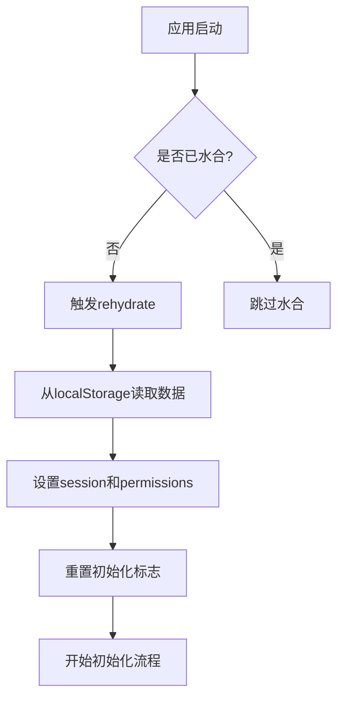
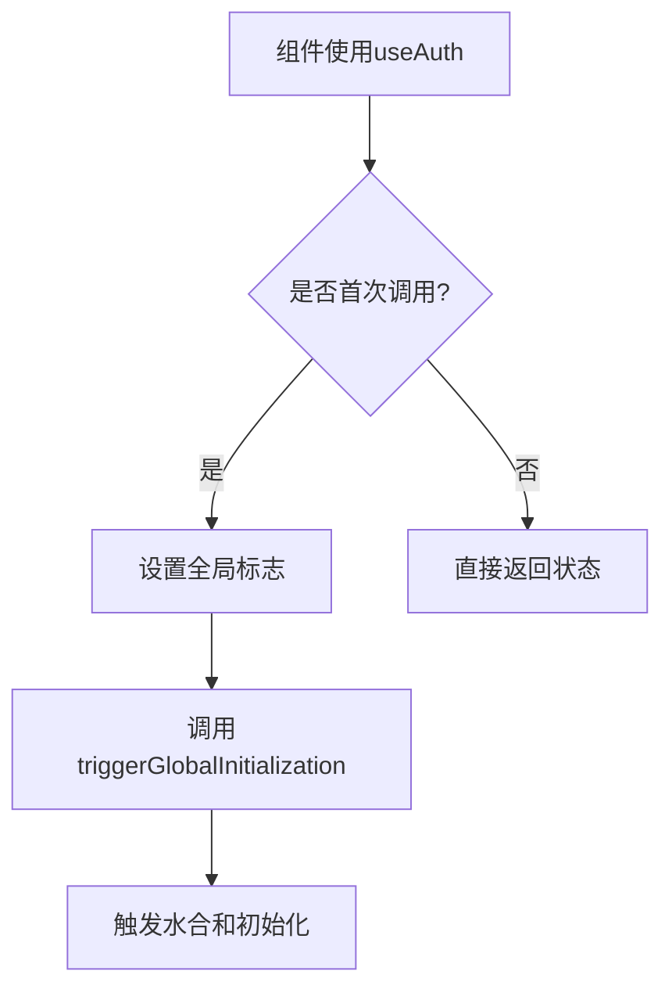
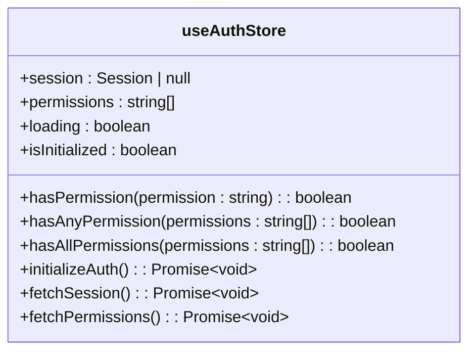
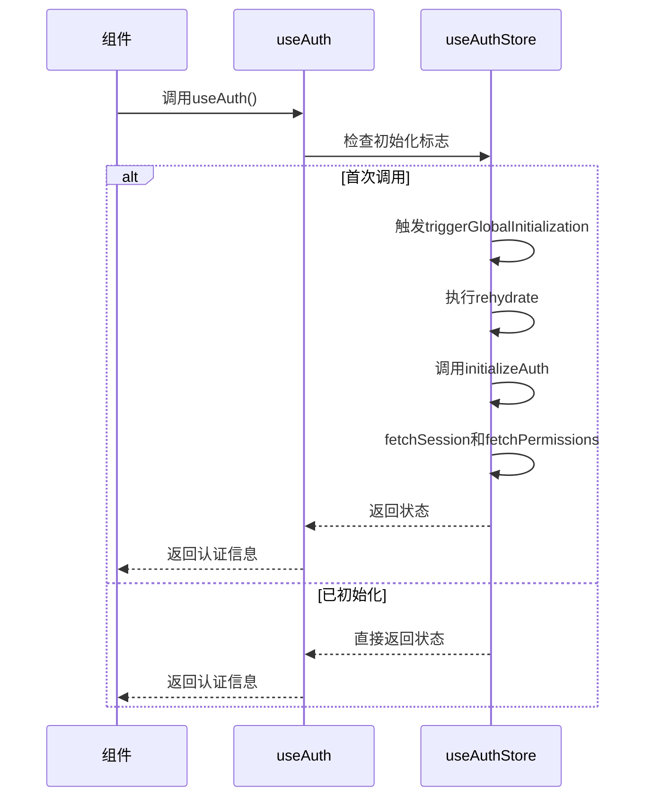
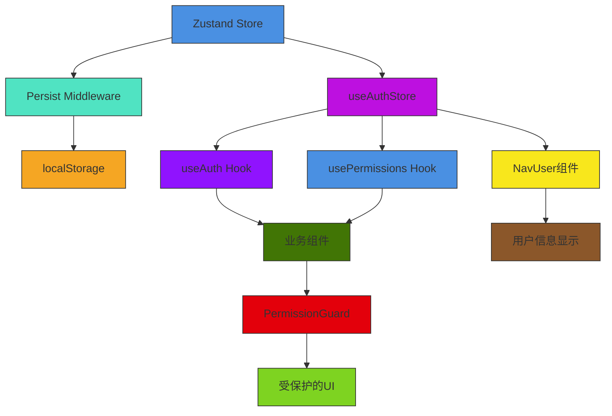

# 状态管理机制

<cite>
**本文档引用的文件**   
- [auth.ts](file://src/stores/auth.ts)
- [use-auth.ts](file://src/hooks/use-auth.ts)
- [use-permissions.ts](file://src/hooks/use-permissions.ts)
- [login-form.tsx](file://src/app/login/components/login-form.tsx)
- [nav-user.tsx](file://src/components/layout/nav-user.tsx)
- [permission-guard.tsx](file://src/components/auth/permission-guard.tsx)
</cite>

## 目录
1. [简介](#简介)
2. [核心状态仓库设计](#核心状态仓库设计)
3. [状态持久化与水合机制](#状态持久化与水合机制)
4. [自定义Hook封装](#自定义hook封装)
5. [权限检查方法实现](#权限检查方法实现)
6. [认证状态初始化流程](#认证状态初始化流程)
7. [状态管理架构图](#状态管理架构图)

## 简介
v0-game_admin系统采用Zustand作为全局状态管理解决方案，构建了基于useAuthStore的状态管理架构。该架构实现了用户会话、权限列表、加载状态等核心数据的集中管理，通过localStorage实现状态持久化，并结合自定义Hook提供简洁的API供组件使用。本系统特别设计了全局水合机制和skipHydration配置，确保在服务端渲染环境下的正确初始化。

## 核心状态仓库设计

useAuthStore是v0-game_admin系统的核心状态仓库，基于Zustand创建并使用persist中间件实现状态持久化。该仓库管理着用户会话、权限列表和加载状态等关键信息。

状态仓库定义了AuthState接口，包含session、permissions、loading等核心字段，以及initializeAuth、fetchSession、fetchPermissions等操作方法。其中session字段存储用户登录信息，permissions数组维护用户的权限列表，loading和permissionsLoading分别表示会话和权限的加载状态。

仓库通过全局标志位hasEverInitialized和hasGloballyHydrated确保初始化逻辑只执行一次，避免重复请求。同时，通过isSessionFetching和isPermissionsFetching标志位防止并发请求，保证状态的一致性。

**Section sources**
- [auth.ts](file://src/stores/auth.ts#L1-L220)

## 状态持久化与水合机制

系统通过Zustand的persist中间件实现状态持久化，将核心数据存储在localStorage中。配置中指定了存储名称为'auth-storage'，并使用createJSONStorage创建JSON存储实例。

持久化配置采用partialize函数，仅持久化session和permissions两个核心字段，而isInitialized等临时状态不进行持久化，确保每次页面刷新都能重新初始化。这种设计避免了过期状态带来的问题，同时保留了关键的用户认证信息。

**Diagram sources**
- [auth.ts](file://src/stores/auth.ts#L206-L216)

**Section sources**
- [auth.ts](file://src/stores/auth.ts#L206-L216)

## 自定义Hook封装

系统提供了useAuth和usePermissions两个自定义Hook，封装了状态访问逻辑，为组件提供简洁的API。

useAuth Hook通过useEffect在组件挂载时触发全局初始化，利用hasTriggeredGlobalInit标志确保只初始化一次。它返回session、loading、isAuthenticated和hasHydrated等状态，其中isAuthenticated通过session.user的存在性判断用户是否已认证。

**Diagram sources**
- [use-auth.ts](file://src/hooks/use-auth.ts#L11-L31)

usePermissions Hook则封装了权限相关的状态和方法，合并了loading和permissionsLoading状态，提供hasPermission、hasAnyPermission等权限检查方法。这种分层设计使得组件可以根据需要选择合适的Hook，降低耦合度。

**Section sources**
- [use-auth.ts](file://src/hooks/use-auth.ts#L11-L31)
- [use-permissions.ts](file://src/hooks/use-permissions.ts#L8-L26)

## 权限检查方法实现

useAuthStore提供了三个核心权限检查方法：hasPermission、hasAnyPermission和hasAllPermissions。这些方法基于用户权限列表实现细粒度的权限控制。

hasPermission方法检查用户是否具有指定的单个权限，通过Array.includes方法判断权限代码是否存在于用户权限列表中。hasAnyPermission方法检查用户是否具有任意一个指定权限，使用Array.some方法遍历权限数组。hasAllPermissions方法则检查用户是否具有所有指定权限，使用Array.every方法确保每个权限都存在。

**Diagram sources**
- [auth.ts](file://src/stores/auth.ts#L190-L203)

这些方法在PermissionGuard组件中被广泛使用，实现路由级别的权限控制。组件通过requireAll参数区分"任意权限"和"所有权限"的检查模式，满足不同的业务场景需求。

**Section sources**
- [auth.ts](file://src/stores/auth.ts#L190-L203)
- [permission-guard.tsx](file://src/components/auth/permission-guard.tsx#L28-L42)

## 认证状态初始化流程

系统的认证状态初始化采用分阶段的全局水合机制。初始化流程由triggerGlobalInitialization方法启动，该方法首先检查hasGloballyHydrated标志，确保只执行一次。

初始化过程包含三个关键步骤：首先手动触发persist.rehydrate()从localStorage恢复状态；然后调用resetFlags(true)重置所有标志位；最后执行initializeAuth方法获取最新的会话和权限信息。

登录成功后，系统通过forceReInitialize方法实现强制重新初始化。该方法重置所有全局标志，包括hasGloballyHydrated和hasEverInitialized，然后重新触发全局初始化流程，确保获取最新的用户权限信息。

**Diagram sources**
- [auth.ts](file://src/stores/auth.ts#L150-L171)
- [login-form.tsx](file://src/app/login/components/login-form.tsx#L52-L55)

**Section sources**
- [auth.ts](file://src/stores/auth.ts#L150-L171)
- [login-form.tsx](file://src/app/login/components/login-form.tsx#L52-L55)

## 状态管理架构图

**Diagram sources**
- [auth.ts](file://src/stores/auth.ts#L44-L218)
- [use-auth.ts](file://src/hooks/use-auth.ts#L11-L31)
- [use-permissions.ts](file://src/hooks/use-permissions.ts#L8-L26)
- [nav-user.tsx](file://src/components/layout/nav-user.tsx#L27-L123)

**Section sources**
- [auth.ts](file://src/stores/auth.ts#L44-L218)
- [use-auth.ts](file://src/hooks/use-auth.ts#L11-L31)
- [use-permissions.ts](file://src/hooks/use-permissions.ts#L8-L26)
- [nav-user.tsx](file://src/components/layout/nav-user.tsx#L27-L123)