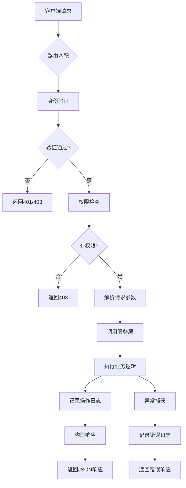

# API路由层

<cite>
**本文档引用文件**   
- [auth.ts](file://src/lib/auth.ts)
- [response.ts](file://src/service/response.ts)
- [jsonRepos.ts](file://src/repository/impl/jsonRepos.ts)
- [logger.ts](file://src/lib/logger.ts)
- [login/route.ts](file://src/app/api/auth/login/route.ts)
- [tickets/[id]/status/route.ts](file://src/app/api/tickets/[id]/status/route.ts)
- [tickets/[id]/route.ts](file://src/app/api/tickets/[id]/route.ts)
- [roles/[id]/permissions/route.ts](file://src/app/api/roles/[id]/permissions/route.ts)
- [games/[id]/route.ts](file://src/app/api/games/[id]/route.ts)
- [banners/[id]/route.ts](file://src/app/api/banners/[id]/route.ts)
- [system-configs/[id]/route.ts](file://src/app/api/system-configs/[id]/route.ts)
</cite>

## 目录
1. [简介](#简介)
2. [请求生命周期](#请求生命周期)
3. [HTTP方法处理机制](#http方法处理机制)
4. [动态路由参数处理](#动态路由参数处理)
5. [请求体解析与响应构造](#请求体解析与响应构造)
6. [业务逻辑调用示例](#业务逻辑调用示例)
7. [错误处理与异常响应](#错误处理与异常响应)
8. [分页响应结构](#分页响应结构)
9. [API版本控制策略](#api版本控制策略)
10. [安全性考虑](#安全性考虑)

## 简介
v0-game_admin系统的API路由层基于Next.js App Router构建，采用TypeScript实现RESTful风格的接口设计。系统通过`route.ts`文件定义各个端点的行为，支持GET、POST、PUT、DELETE等HTTP方法，并结合服务层完成业务逻辑处理。API路由统一使用JWT进行身份验证，通过仓储模式访问数据，并采用结构化日志记录操作行为。

**Section sources**
- [auth.ts](file://src/lib/auth.ts#L1-L78)
- [response.ts](file://src/service/response.ts#L1-L80)

## 请求生命周期
API请求从客户端发起后，经过Next.js服务器路由系统分发到对应的`route.ts`处理函数。首先通过中间件或直接在路由中进行身份验证和权限检查，随后解析请求参数和请求体，调用服务层或仓储层执行业务逻辑，最后构造标准化的JSON响应返回给客户端。整个过程包含错误捕获和日志记录机制。



**Diagram sources **
- [auth.ts](file://src/lib/auth.ts#L1-L78)
- [logger.ts](file://src/lib/logger.ts#L1-L322)

## HTTP方法处理机制
API路由支持标准的HTTP方法：GET用于获取资源，POST用于创建资源，PUT用于更新资源，DELETE用于删除资源。每个方法对应`route.ts`文件中的同名导出函数。系统通过Next.js的Request对象访问请求信息，使用NextResponse构造响应。所有响应都遵循统一的格式规范。

**Section sources**
- [response.ts](file://src/service/response.ts#L1-L80)
- [login/route.ts](file://src/app/api/auth/login/route.ts#L12-L87)

## 动态路由参数处理
系统使用Next.js的动态路由功能，通过`[id]`等占位符实现参数化路由。在处理函数中，通过解构`{ params }`参数获取路径变量。系统会对参数进行类型转换和有效性验证，如将字符串ID转换为整数并检查其有效性，确保后续操作的安全性。

```mermaid
flowchart TD
A[请求路径 /api/tickets/123] --> B[匹配动态路由 /api/tickets/[id]]
B --> C[提取params.id = "123"]
C --> D[parseInt(params.id)]
D --> E{转换成功?}
E --> |否| F[返回错误响应]
E --> |是| G[继续处理]
```

**Diagram sources **
- [tickets/[id]/route.ts](file://src/app/api/tickets/[id]/route.ts#L6-L29)
- [games/[id]/route.ts](file://src/app/api/games/[id]/route.ts#L6-L32)

## 请求体解析与响应构造
系统使用`request.json()`方法异步解析请求体，获取客户端提交的数据。响应通过`NextResponse.json()`构造，但实际开发中使用封装的响应函数如`successResponse`和`errorResponse`来确保响应格式的一致性。这些函数定义了统一的响应结构，包含code、data、message和分页信息。

**Section sources**
- [response.ts](file://src/service/response.ts#L16-L79)
- [tickets/[id]/status/route.ts](file://src/app/api/tickets/[id]/status/route.ts#L21-L22)

## 业务逻辑调用示例
### 用户登录处理
用户登录API通过POST方法接收邮箱和密码，验证用户凭证后签发JWT令牌。处理过程中会更新用户的最后登录时间，并将令牌通过HTTP-only cookie返回，确保安全性。

### 工单状态更新
工单状态更新API通过POST方法接收新的状态值，验证用户权限后调用仓储层更新工单状态。系统会记录状态变更前后的值，并生成相应的操作日志，便于审计追踪。

**Section sources**
- [login/route.ts](file://src/app/api/auth/login/route.ts#L12-L87)
- [tickets/[id]/status/route.ts](file://src/app/api/tickets/[id]/status/route.ts#L7-L61)

## 错误处理与异常响应
系统定义了统一的错误码映射表，使用`errorResponse`、`unauthorizedResponse`、`forbiddenResponse`等函数构造不同类型的错误响应。所有异常都会被捕获，记录详细的错误日志，并返回适当的HTTP状态码和错误信息，避免暴露系统内部细节。

| 错误码 | HTTP状态码 | 含义 | 示例场景 |
|-------|-----------|------|---------|
| -1 | 200/400/401/403/404 | 通用错误 | 参数验证失败 |
| 401 | 401 | 未授权 | JWT验证失败 |
| 403 | 403 | 权限不足 | 用户无权操作 |
| 404 | 404 | 资源不存在 | ID不存在 |

**Section sources**
- [response.ts](file://src/service/response.ts#L33-L79)
- [tickets/[id]/route.ts](file://src/app/api/tickets/[id]/route.ts#L13-L14)

## 分页响应结构
列表查询接口返回包含分页信息的标准化响应，`pager`字段提供当前页码、每页数量、总数和总页数。这种设计使前端能够轻松实现分页控件，同时保持API的一致性。分页参数通过查询字符串传递，系统会对页码和数量进行有效性验证。

```json
{
  "code": 0,
  "data": [...],
  "pager": {
    "page": 1,
    "limit": 10,
    "total": 100,
    "totalPages": 10
  }
}
```

**Section sources**
- [response.ts](file://src/service/response.ts#L8-L13)
- [logs/route.ts](file://src/app/api/logs/route.ts#L40-L45)

## API版本控制策略
当前系统采用URL路径进行版本控制，API端点以`/api`为前缀。未来可通过引入`/api/v1/`等版本号前缀实现向后兼容的API演进。系统设计考虑了扩展性，允许在不破坏现有客户端的情况下添加新功能和修改接口。

**Section sources**
- [base.ts](file://src/service/api/base.ts#L1-L3)
- 所有`route.ts`文件

## 安全性考虑
系统实施多层次的安全防护：使用JWT进行身份验证，通过HTTP-only和Secure标志保护令牌cookie；基于角色的权限控制（RBAC）确保用户只能访问授权资源；所有敏感操作都记录详细的审计日志；输入数据经过验证和清理，防止注入攻击。此外，系统还考虑了CORS配置和CSRF防护。

**Section sources**
- [auth.ts](file://src/lib/auth.ts#L1-L78)
- [server-permissions.ts](file://src/lib/server-permissions.ts#L1-L51)
- [logger.ts](file://src/lib/logger.ts#L1-L322)