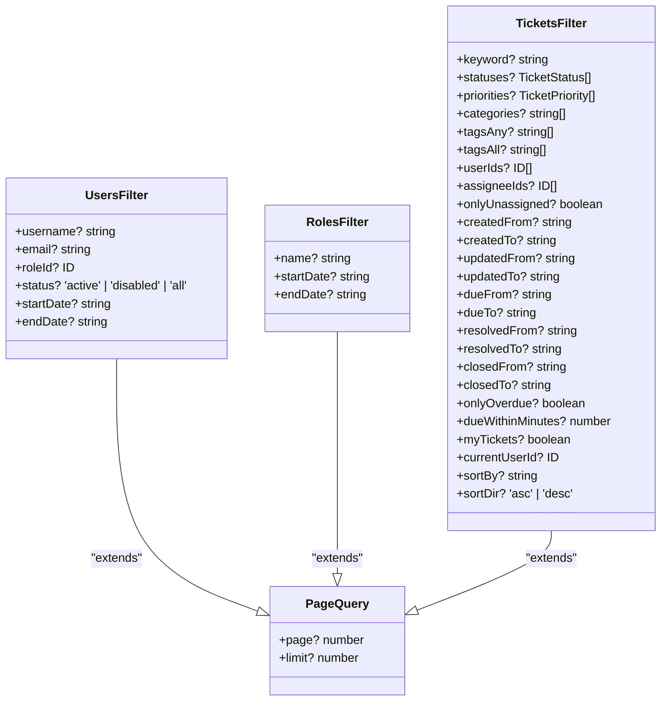

# 仓储接口契约

<cite>
**本文档引用的文件**   
- [interfaces.ts](file://src/repository/interfaces.ts)
- [jsonRepos.ts](file://src/repository/impl/jsonRepos.ts)
- [models.ts](file://src/repository/models.ts)
- [index.ts](file://src/repository/index.ts)
</cite>

## 目录
1. [仓储接口聚合设计](#仓储接口聚合设计)
2. [过滤器接口设计原则](#过滤器接口设计原则)
3. [联合类型设计意图](#联合类型设计意图)
4. [统一查询约定](#统一查询约定)
5. [去重设计考量](#去重设计考量)
6. [工单操作语义化设计](#工单操作语义化设计)

## 仓储接口聚合设计

`Repositories` 接口作为仓储模式的核心聚合点，通过定义 `users`、`roles`、`permissions` 等具体仓储实例的契约，实现了对数据访问层的统一管理。该接口在 `interfaces.ts` 文件中被声明，作为所有具体仓储实现的顶层抽象，确保了上层业务逻辑与底层数据存储的解耦。通过此聚合接口，应用可以以一致的方式访问用户、角色、权限等不同领域的数据，而无需关心具体的实现细节。

**Section sources**
- [interfaces.ts](file://src/repository/interfaces.ts#L237-L246)

## 过滤器接口设计原则

过滤器接口如 `UsersFilter`、`RolesFilter` 和 `TicketsFilter` 均继承自 `PageQuery` 接口，实现了分页参数（`page` 和 `limit`）的复用。这种设计遵循了DRY（Don't Repeat Yourself）原则，避免了在每个过滤器中重复定义分页字段。同时，各过滤器接口扩展了业务特定的筛选条件，例如 `UsersFilter` 包含 `username`、`email` 和 `roleId` 等字段，`TicketsFilter` 则包含 `statuses`、`priorities` 和 `tagsAny` 等工单特有的筛选条件。这种设计既保证了通用功能的复用，又满足了不同业务场景下的特定需求。

**Diagram sources **
- [interfaces.ts](file://src/repository/interfaces.ts#L22-L32)
- [interfaces.ts](file://src/repository/interfaces.ts#L35-L39)
- [interfaces.ts](file://src/repository/interfaces.ts#L58-L83)
- [models.ts](file://src/repository/models.ts#L221-L224)

## 联合类型设计意图

`UsersRepository` 接口中 `list` 方法的返回类型被设计为 `Promise<PageResult<User & { role?: Pick<Role, 'id' | 'name'> }>>`，其核心意图在于满足前端展示需求。通过联合类型 `User & { role?: Pick<Role, 'id' | 'name'> }`，该方法在返回用户基本信息的同时，内联了其关联角色的 `id` 和 `name` 字段。这种设计避免了前端为了显示角色名称而进行二次查询，显著提升了接口效率和用户体验。`Pick` 工具类型的使用确保了只暴露必要的角色信息，遵循了最小权限原则。

**Section sources**
- [interfaces.ts](file://src/repository/interfaces.ts#L108-L118)

## 统一查询约定

在 `jsonRepos.ts` 的实现中，`findByName`、`getById` 等查询方法严格遵循了 `Promise<undefined | T>` 的返回约定。例如，`getById` 方法在未找到对应ID的实体时会返回 `undefined`，而非抛出异常或返回空对象。这种约定为调用方提供了清晰且一致的错误处理语义：调用者必须显式检查返回值是否为 `undefined` 来判断查询结果是否存在。这增强了代码的健壮性和可预测性，避免了因异常处理不当导致的程序崩溃。

**Section sources**
- [jsonRepos.ts](file://src/repository/impl/jsonRepos.ts#L216-L218)
- [jsonRepos.ts](file://src/repository/impl/jsonRepos.ts#L292-L294)

## 去重设计考量

`RolePermissionsRepository` 接口的 `add` 方法在实现时包含了去重逻辑。当尝试为一个角色添加已存在的权限时，系统不会创建重复的关联记录，而是直接返回已存在关联的ID。这种设计的业务考量在于维护数据的完整性和一致性。角色与权限的关联关系本质上是一个集合，不允许存在重复项。去重机制防止了因业务逻辑错误或并发操作导致的数据冗余，确保了权限分配的准确无误，是保障系统安全性的关键一环。

**Section sources**
- [interfaces.ts](file://src/repository/interfaces.ts#L138-L142)
- [jsonRepos.ts](file://src/repository/impl/jsonRepos.ts#L406-L421)

## 工单操作语义化设计

`TicketsRepository` 接口中的 `assign`、`changeStatus` 等方法体现了高度的语义化设计。这些方法名直接反映了工单系统中的核心业务动作，如“分配”和“变更状态”，使得代码意图一目了然。更重要的是，这些操作不仅仅是简单的数据更新，它们还封装了相关的业务规则和副作用。例如，`changeStatus` 方法在更新工单状态的同时，会根据新状态自动设置 `resolvedAt` 或 `closedAt` 时间戳，并记录相应的操作事件。这种设计将复杂的业务逻辑封装在仓储层，保证了核心业务规则的集中管理和一致性。

**Section sources**
- [interfaces.ts](file://src/repository/interfaces.ts#L152-L182)
- [jsonRepos.ts](file://src/repository/impl/jsonRepos.ts#L727-L775)