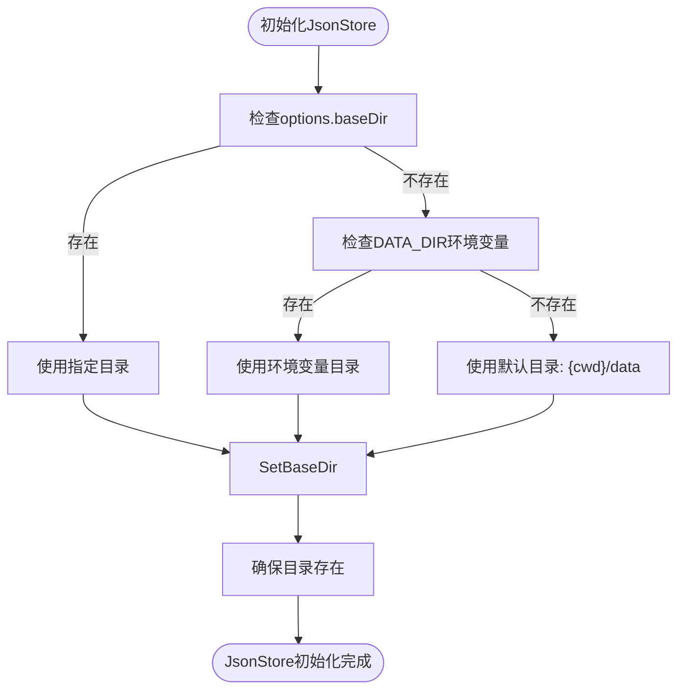
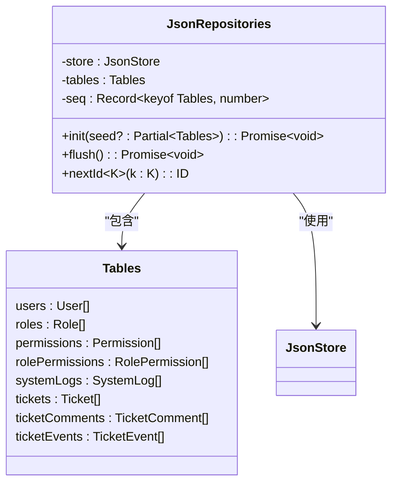
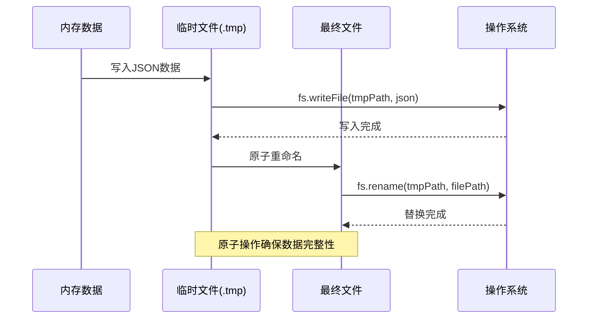
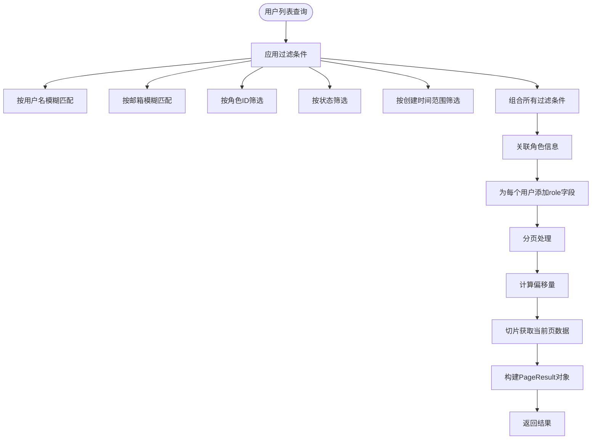
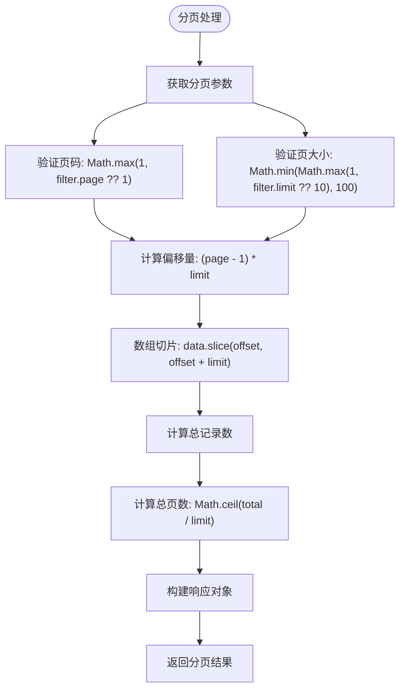
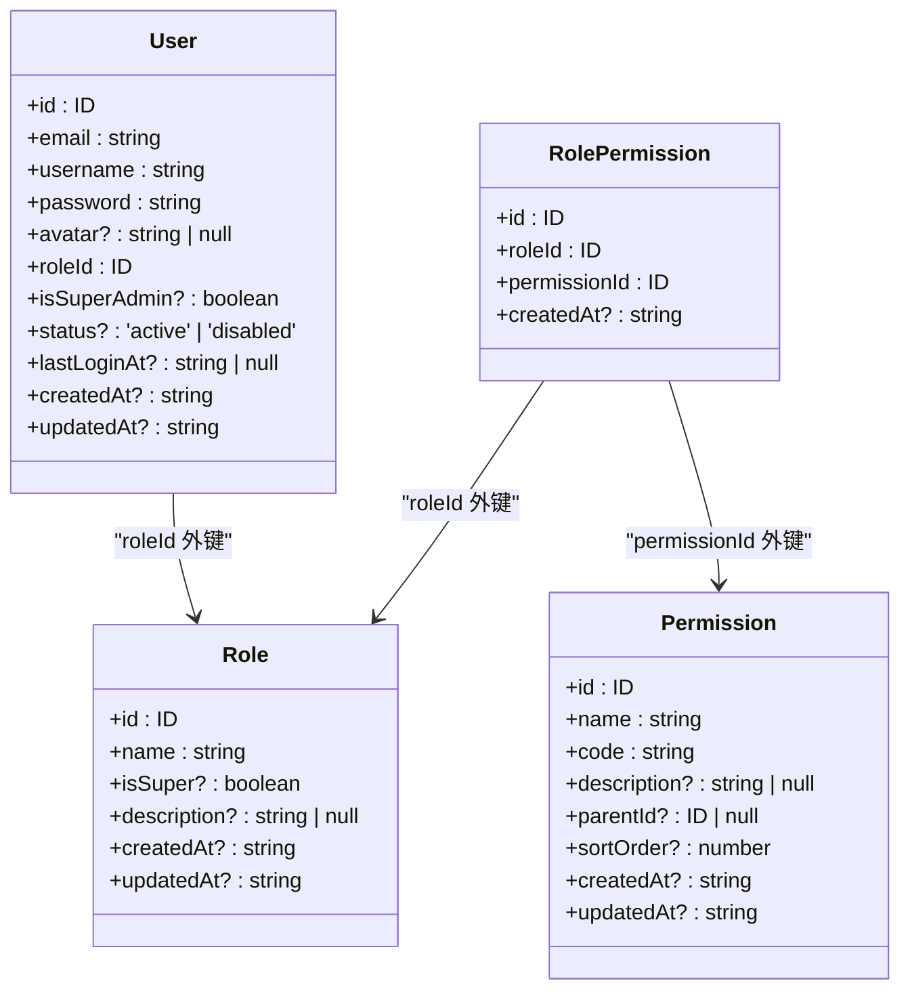
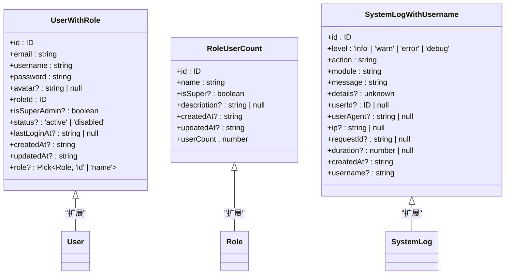
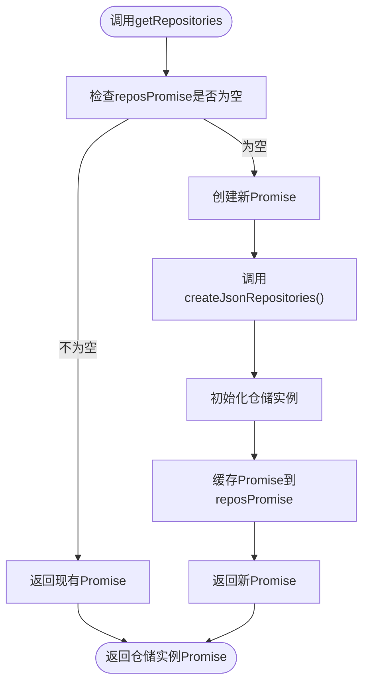
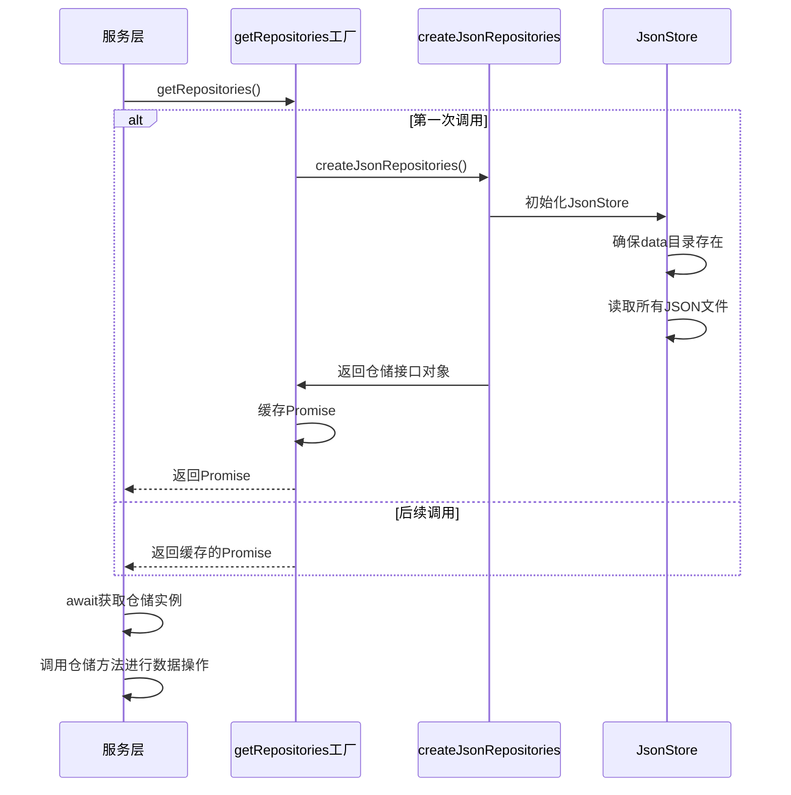
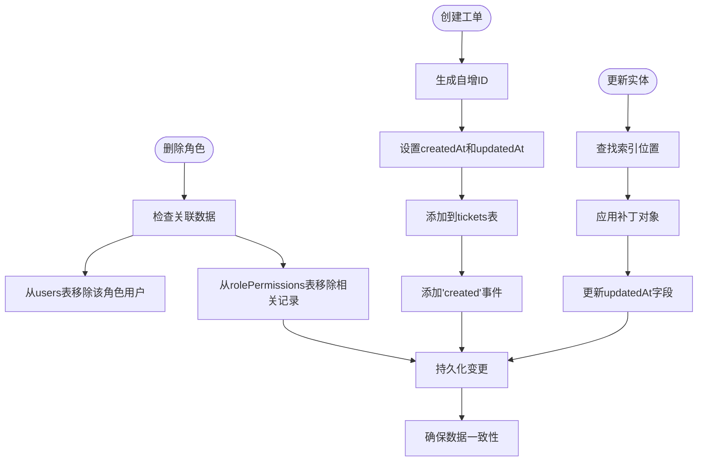

# 仓储模式实现

<cite>
**本文档引用文件**   
- [jsonStore.ts](file://src/repository/store/jsonStore.ts)
- [jsonRepos.ts](file://src/repository/impl/jsonRepos.ts)
- [index.ts](file://src/repository/index.ts)
- [models.ts](file://src/repository/models.ts)
- [interfaces.ts](file://src/repository/interfaces.ts)
</cite>

## 目录
1. [简介](#简介)
2. [JsonStore底层数据读写机制](#jsonstore底层数据读写机制)
3. [JsonRepository接口实现与CRUD操作](#jsonrepository接口实现与crud操作)
4. [实体模型与数据映射](#实体模型与数据映射)
5. [单例工厂模式与服务注入](#单例工厂模式与服务注入)
6. [数据一致性与并发处理](#数据一致性与并发处理)
7. [未来数据库迁移路径](#未来数据库迁移路径)

## 简介
v0-game_admin项目采用基于JSON文件的仓储模式实现，通过分层架构将数据访问逻辑与业务逻辑分离。该实现包含三个核心组件：JsonStore提供底层文件读写能力，JsonRepository实现具体的数据访问接口，以及通过单例工厂模式管理仓储实例的生命周期。这种设计既满足了开发阶段的快速迭代需求，又为未来迁移到数据库系统预留了清晰的扩展路径。

## JsonStore底层数据读写机制

### 文件读取与目录初始化
JsonStore类作为底层存储引擎，负责管理JSON文件的读写操作。其构造函数接受可选的`JsonStoreOptions`参数，用于指定数据存储目录。若未指定，则按优先级依次使用环境变量`DATA_DIR`或当前工作目录下的`data`子目录作为默认存储路径。



**Diagram sources**
- [jsonStore.ts](file://src/repository/store/jsonStore.ts#L10-L17)

### 缓存机制与内存管理
JsonStore本身不直接实现缓存，而是由上层的JsonRepositories类在内存中维护数据表和自增ID序列。JsonRepositories在初始化时一次性将所有JSON文件加载到内存中的`tables`对象，后续所有读写操作均在内存中进行，仅在数据变更时将整个数据集持久化到文件系统。



**Diagram sources**
- [jsonRepos.ts](file://src/repository/impl/jsonRepos.ts#L62-L87)

### 写入原子性保障
为确保数据写入的原子性，JsonStore采用"写入临时文件后重命名"的策略。`writeJson`方法首先将数据写入以`.tmp`为后缀的临时文件，待写入完成后通过`fs.rename`原子性地替换原文件。这种方法避免了写入过程中程序崩溃导致的数据损坏风险。



**Diagram sources**
- [jsonStore.ts](file://src/repository/store/jsonStore.ts#L40-L47)

**Section sources**
- [jsonStore.ts](file://src/repository/store/jsonStore.ts#L1-L49)

## JsonRepository接口实现与CRUD操作

### 接口定义与契约
`interfaces.ts`文件定义了统一的数据访问接口契约，包括`UsersRepository`、`RolesRepository`、`PermissionsRepository`等。这些接口遵循标准的CRUD模式，并针对具体业务需求扩展了分页、过滤等方法。接口设计采用Promise异步模式，便于处理文件I/O操作。

```mermaid
classDiagram
class UsersRepository {
+list(filter : UsersFilter) : Promise~PageResult~User & { role? : Pick~Role, 'id' | 'name'~ }~~
+findByUsername(username : string) : Promise~User | undefined~
+findByEmail(email : string) : Promise~User | undefined~
+getById(id : ID) : Promise~User | undefined~
+create(user : Omit~User, 'id' | 'createdAt' | 'updatedAt'~) : Promise~ID~
+update(id : ID, patch : Partial~User~) : Promise~void~
+delete(id : ID) : Promise~void~
}
class RolesRepository {
+list(filter : RolesFilter) : Promise~PageResult~Role & { userCount : number }~~
+getById(id : ID) : Promise~Role | undefined~
+findByName(name : string) : Promise~Role | undefined~
+create(role : Omit~Role, 'id' | 'createdAt' | 'updatedAt'~) : Promise~ID~
+update(id : ID, patch : Partial~Role~) : Promise~void~
+delete(id : ID) : Promise~void~
}
class PermissionsRepository {
+list(filter : PermissionsFilter) : Promise~PageResult~Permission~~
+getById(id : ID) : Promise~Permission | undefined~
+findByCode(code : string) : Promise~Permission | undefined~
+create(p : Omit~Permission, 'id' | 'createdAt' | 'updatedAt'~) : Promise~ID~
+update(id : ID, patch : Partial~Permission~) : Promise~void~
+delete(id : ID) : Promise~void~
}
UsersRepository <|-- JsonRepositories : "实现"
RolesRepository <|-- JsonRepositories : "实现"
PermissionsRepository <|-- JsonRepositories : "实现"
```

**Diagram sources**
- [interfaces.ts](file://src/repository/interfaces.ts#L105-L133)

### 数据查询与过滤实现
JsonRepository的查询方法在内存数据集上应用过滤逻辑。以用户列表查询为例，`list`方法首先根据`UsersFilter`中的条件（用户名、邮箱、角色ID、状态、时间范围等）对用户数组进行过滤，然后关联查询角色信息，最后进行分页处理。



**Diagram sources**
- [jsonRepos.ts](file://src/repository/impl/jsonRepos.ts#L168-L200)

### 分页逻辑与性能考量
分页功能通过计算偏移量和限制数量实现。系统支持1-100条/页的分页大小限制，防止一次性加载过多数据。分页结果包含总记录数、总页数等元信息，便于前端展示分页控件。



**Diagram sources**
- [jsonRepos.ts](file://src/repository/impl/jsonRepos.ts#L171-L173)

**Section sources**
- [jsonRepos.ts](file://src/repository/impl/jsonRepos.ts#L167-L201)

## 实体模型与数据映射

### 领域模型结构定义
`models.ts`文件定义了与系统数据结构对齐的领域模型类型，包括`User`、`Role`、`Permission`、`RolePermission`等核心实体。这些模型采用TypeScript接口定义，确保类型安全和代码可维护性。



**Diagram sources**
- [models.ts](file://src/repository/models.ts#L6-L26)

### 接口层数据映射关系
在数据访问过程中，实体模型与接口层数据结构存在映射关系。例如，用户列表查询返回的结果不仅包含用户基本信息，还通过`role`字段关联了角色的ID和名称，实现了数据的丰富化。



**Diagram sources**
- [models.ts](file://src/repository/models.ts#L170-L188)
- [jsonRepos.ts](file://src/repository/impl/jsonRepos.ts#L188-L191)

**Section sources**
- [models.ts](file://src/repository/models.ts#L4-L188)

## 单例工厂模式与服务注入

### getRepositories单例实现原理
`index.ts`文件中的`getRepositories`函数实现了单例工厂模式。该函数使用`reposPromise`变量缓存仓储实例的Promise对象，确保在整个应用生命周期中只初始化一次仓储实例，避免重复加载文件和内存浪费。



**Diagram sources**
- [index.ts](file://src/repository/index.ts#L5-L11)

### 服务层注入方式
服务层通过导入`getRepositories`函数来获取仓储实例，实现依赖注入。由于返回的是Promise，调用方需要使用async/await语法获取实际的仓储对象。这种设计解耦了服务层与具体仓储实现，便于单元测试和未来替换。



**Diagram sources**
- [index.ts](file://src/repository/index.ts#L7-L11)
- [jsonRepos.ts](file://src/repository/impl/jsonRepos.ts#L864-L875)

**Section sources**
- [index.ts](file://src/repository/index.ts#L1-L12)

## 数据一致性与并发处理

### 数据一致性保障措施
系统通过多种机制保障数据一致性。首先，在删除角色时，会级联清理`rolePermissions`表中相关的权限分配记录；其次，在创建工单时，会自动添加"created"事件记录；最后，所有数据变更都会更新`updatedAt`时间戳。



**Diagram sources**
- [jsonRepos.ts](file://src/repository/impl/jsonRepos.ts#L308-L317)
- [jsonRepos.ts](file://src/repository/impl/jsonRepos.ts#L677-L694)

### 并发访问处理策略
当前实现未显式处理并发访问，所有操作基于内存数据的单线程处理。由于Node.js的单线程事件循环特性，同一时刻只有一个操作能修改内存数据，因此避免了竞态条件。但对于高并发场景，建议引入文件锁或迁移到数据库系统。

```mermaid
flowchart TD
Request1([请求1: 读取用户]) --> EventLoop["进入事件循环队列"]
Request2([请求2: 更新用户]) --> EventLoop
Request3([请求3: 删除用户]) --> EventLoop
EventLoop --> Process1["顺序处理请求1"]
Process1 --> Process2["顺序处理请求2"]
Process2 --> Process3["顺序处理请求3"]
Process3 --> Complete["所有操作完成"]
Note over EventLoop: Node.js单线程事件循环确保操作串行化
```

**Section sources**
- [jsonRepos.ts](file://src/repository/impl/jsonRepos.ts#L148-L159)

## 未来数据库迁移路径

### 迁移可行性分析
当前基于JSON文件的仓储模式为未来迁移到数据库系统提供了良好的基础。由于所有数据访问都通过定义良好的接口进行，只需实现新的数据库仓储类并注入到工厂模式中，即可完成迁移，业务代码无需修改。

```mermaid
flowchart LR
A[当前实现] --> B[JsonRepositories]
B --> C[JsonStore]
C --> D[JSON文件]
E[未来实现] --> F[DatabaseRepositories]
F --> G[数据库连接]
G --> H[MySQL/PostgreSQL]
I[业务服务层] --> J[Repositories接口]
J --> A
J --> E
style D stroke:#f66,stroke-width:2px
style H stroke:#6f6,stroke-width:2px
Note over D: 开发/测试环境
Note over H: 生产环境
```

**Diagram sources**
- [interfaces.ts](file://src/repository/interfaces.ts#L194-L202)

### 推荐迁移步骤
1. **接口抽象**：保持现有接口定义不变，确保契约稳定性
2. **实现新仓储**：创建基于数据库的仓储实现类，如`DatabaseUsersRepository`
3. **配置切换**：通过环境变量或配置文件控制使用JSON或数据库实现
4. **数据迁移**：编写脚本将JSON数据导入数据库
5. **渐进式切换**：先在非关键模块验证，逐步扩大范围

**Section sources**
- [interfaces.ts](file://src/repository/interfaces.ts#L105-L202)
- [index.ts](file://src/repository/index.ts#L7-L11)