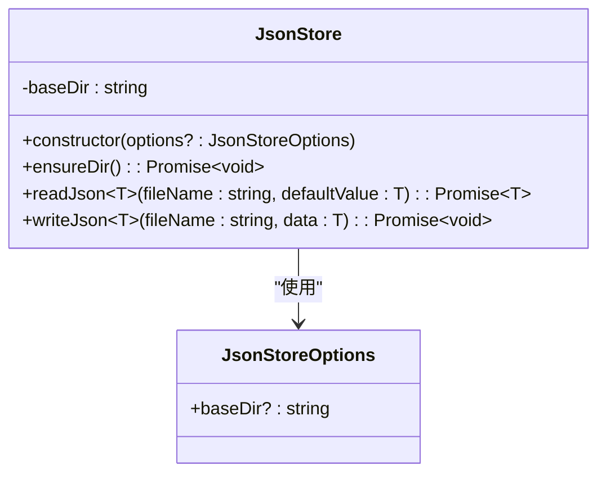

# 数据存储层

<cite>
**Referenced Files in This Document**   
- [jsonStore.ts](file://src/repository/store/jsonStore.ts)
- [data/permissions.json](file://data/permissions.json)
- [data/roles.json](file://data/roles.json)
- [data/users.json](file://data/users.json)
</cite>

## 目录

1. [引言](#引言)
2. [核心组件](#核心组件)
3. [数据持久化生命周期](#数据持久化生命周期)
4. [容错与恢复机制](#容错与恢复机制)
5. [原子写入策略](#原子写入策略)
6. [结论](#结论)

## 引言

`JsonStore` 类是本系统中负责数据持久化的底层存储引擎，为整个应用提供可靠、稳健的 JSON 文件读写能力。该组件设计简洁但功能完备，通过一系列精心设计的机制确保了数据在各种异常情况下的完整性与一致性。它被广泛应用于权限、角色、用户等核心数据的存储与管理，是系统稳定运行的关键基础设施。

## 核心组件

`JsonStore` 类的设计围绕着数据目录管理、安全读取和原子写入三大核心功能展开。其构造函数通过多级优先级策略确定数据存储路径，`ensureDir` 方法确保数据目录的可用性，`readJson` 方法提供容错读取，而 `writeJson` 方法则实现了关键的原子写入策略。

**Diagram sources**
- [jsonStore.ts](file://src/repository/store/jsonStore.ts#L6-L48)

**Section sources**
- [jsonStore.ts](file://src/repository/store/jsonStore.ts#L10-L48)

## 数据持久化生命周期

`JsonStore` 管理的数据生命周期始于构造函数对存储路径的初始化。当实例化时，构造函数会按照 `options.baseDir` > `DATA_DIR` 环境变量 > `{cwd}/data` 的优先级顺序确定最终的 `baseDir`。这一设计确保了配置的灵活性，允许通过代码、环境变量或默认路径来指定数据目录。

数据目录的创建由 `ensureDir` 方法负责。该方法利用 Node.js `fs.mkdir` 的 `recursive` 选项，能够一次性创建完整的目录路径，即使父目录不存在也不会失败。这为后续的读写操作提供了坚实的目录保障。

数据文件的读取由 `readJson` 方法完成。该方法首先调用 `ensureDir` 确保目录存在，然后尝试读取指定文件。如果文件不存在（`ENOENT`）或路径错误（`ENOTDIR`），则自动调用 `writeJson` 写入传入的默认值，并返回该默认值。这种“读取即初始化”的模式极大地简化了上层应用的逻辑。

数据的写入则由 `writeJson` 方法执行，其核心是原子写入策略，以防止写入过程中断导致的数据损坏。

**Section sources**
- [jsonStore.ts](file://src/repository/store/jsonStore.ts#L13-L21)
- [jsonStore.ts](file://src/repository/store/jsonStore.ts#L24-L37)
- [jsonStore.ts](file://src/repository/store/jsonStore.ts#L40-L47)

## 容错与恢复机制

`JsonStore` 的容错能力主要体现在 `readJson` 方法的异常处理逻辑中。该方法并非简单地将文件系统错误抛出，而是对特定的错误码进行智能处理。

当捕获到异常时，它会检查错误对象的 `code` 属性。如果错误码为 `ENOENT`（文件不存在）或 `ENOTDIR`（路径不是目录），则判定为可恢复的初始化错误。此时，系统不会中断，而是自动调用 `writeJson` 方法，将传入的 `defaultValue` 写入该路径，从而创建一个全新的、内容正确的文件。这一机制确保了系统在首次启动或数据文件意外丢失时，能够自动恢复到一个已知的、安全的初始状态，而无需人工干预。

对于其他类型的错误（如权限不足、磁盘满等），则会原样抛出，以便上层应用进行更高级别的错误处理。这种区分对待的策略平衡了自动化恢复与错误透明性。

**Section sources**
- [jsonStore.ts](file://src/repository/store/jsonStore.ts#L30-L36)

## 原子写入策略

`JsonStore` 的 `writeJson` 方法采用了一种经典的原子写入（Atomic Write）策略来保证数据完整性。该策略的核心思想是“先写后改”，具体流程如下：

1.  **创建临时文件**：在目标文件的同一目录下，创建一个以 `.tmp` 为后缀的临时文件（`tmpPath`）。
2.  **写入数据**：将序列化后的 JSON 数据完整地写入这个临时文件。
3.  **原子重命名**：一旦写入成功，立即调用 `fs.rename` 将临时文件重命名为目标文件名。

`fs.rename` 操作在大多数现代文件系统上是原子的，这意味着该操作要么完全成功，要么完全失败，不会出现中间状态。因此，即使在重命名操作的瞬间发生系统崩溃或断电，也只会导致旧文件依然存在，而不会产生一个被截断或内容损坏的文件。这从根本上杜绝了因写入中断而导致的数据损坏风险，是保证数据存储稳健性的关键技术。

**Section sources**
- [jsonStore.ts](file://src/repository/store/jsonStore.ts#L40-L47)

## 结论

`JsonStore` 类通过其精巧的设计，为系统提供了一个简单、可靠且健壮的数据存储解决方案。其多级路径配置、自动目录创建、容错读取和原子写入等特性，共同构成了一个能够抵御多种故障场景的底层存储引擎。结合 `data/` 目录下的多个 JSON 文件（如 `permissions.json`, `roles.json`, `users.json`），`JsonStore` 实现了数据从内存到磁盘的完整、安全的持久化生命周期，是整个系统数据一致性和可靠性的基石。