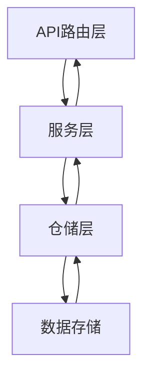
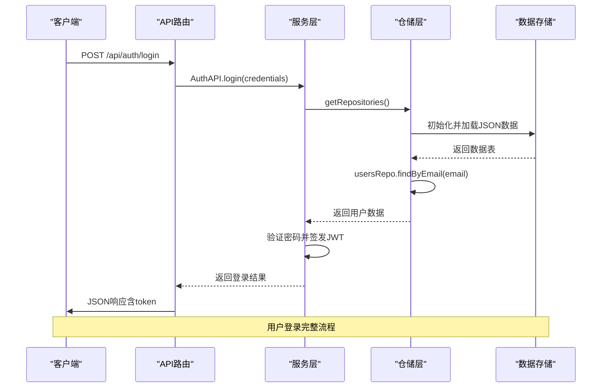
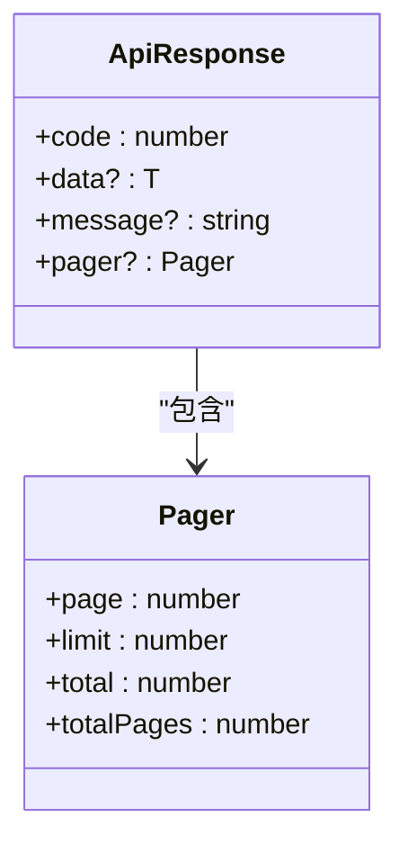

# 后端架构

<cite>
**本文档引用文件**   
- [route.ts](file://src/app/api/auth/login/route.ts)
- [auth.ts](file://src/service/api/auth.ts)
- [user.ts](file://src/service/api/user.ts)
- [permission.ts](file://src/service/api/permission.ts)
- [base.ts](file://src/service/api/base.ts)
- [jsonStore.ts](file://src/repository/store/jsonStore.ts)
- [jsonRepos.ts](file://src/repository/impl/jsonRepos.ts)
- [interfaces.ts](file://src/repository/interfaces.ts)
- [index.ts](file://src/repository/index.ts)
- [response.ts](file://src/service/response.ts)
- [logger.ts](file://src/lib/logger.ts)
</cite>

## 目录
1. [API路由层实现](#apiroute)
2. [服务层职责划分](#service)
3. [仓储模式实现](#repository)
4. [调用链路分析](#callchain)
5. [用户请求处理序列图](#sequence)
6. [错误处理与日志记录](#errorlog)
7. [响应格式标准化](#responseformat)

## API路由层实现
v0-game_admin系统采用Next.js的App Router架构实现API路由层。每个API端点通过`route.ts`文件中的导出函数处理HTTP请求，支持GET、POST、PUT、DELETE等方法。路由文件位于`src/app/api`目录下，按功能模块组织，如认证、用户、权限等。

API路由通过解构`Request`对象获取请求参数，调用服务层处理业务逻辑，并返回标准化的JSON响应。系统使用`NextResponse.json()`方法构建响应，确保内容类型为`application/json`。路由层不直接处理数据持久化，而是依赖服务层和仓储层完成数据操作。

**Section sources**
- [route.ts](file://src/app/api/auth/login/route.ts#L1-L87)
- [route.ts](file://src/app/api/users/route.ts#L1-L120)

## 服务层职责划分
服务层位于`src/service/api`目录，采用类静态方法模式封装业务逻辑。各模块职责明确，通过`base.ts`统一请求处理流程，确保API调用的一致性和可维护性。

### 认证服务
`auth.ts`模块提供用户认证相关功能，包括登录、退出、会话管理和权限获取。`AuthAPI`类封装了对`/auth`端点的调用，通过`apiRequest`函数发送HTTP请求。

### 用户服务
`user.ts`模块处理用户管理功能，包括用户列表查询、详情获取、创建、更新和删除操作。`UserAPI`类提供对`/users`端点的封装，支持分页和搜索参数。

### 权限服务
`permission.ts`模块管理权限系统，提供权限列表、树结构、详情、创建、更新和删除等功能。`PermissionAPI`类还支持获取所有权限和子节点权限，满足前端下拉选择和权限树展示需求。

### 基础请求服务
`base.ts`模块定义了API基础URL和通用请求函数`apiRequest`，处理请求头设置、错误捕获和JSON解析。`buildSearchParams`函数用于构建查询参数字符串，支持分页和过滤功能。

**Section sources**
- [auth.ts](file://src/service/api/auth.ts#L1-L29)
- [user.ts](file://src/service/api/user.ts#L1-L43)
- [permission.ts](file://src/service/api/permission.ts#L1-L58)
- [base.ts](file://src/service/api/base.ts#L1-L41)

## 仓储模式实现
系统采用仓储模式（Repository Pattern）实现数据访问层，位于`src/repository`目录。该模式将数据访问逻辑与业务逻辑分离，提高代码的可测试性和可维护性。

### 数据存储层
`store/jsonStore.ts`实现`JsonStore`类，提供JSON文件的读写能力。采用原子写入策略，通过临时文件和重命名确保数据完整性。`ensureDir`方法确保数据目录存在，`readJson`和`writeJson`方法处理JSON序列化和反序列化。

### 仓储实现层
`impl/jsonRepos.ts`实现`JsonRepositories`类，基于内存数据和JSON持久化。该类维护多个数据表（users、roles、permissions等）和自增ID序列。`init`方法初始化数据，从JSON文件加载数据到内存。`flush`方法将内存数据写回JSON文件。

### 数据访问契约
`interfaces.ts`定义仓储接口，包括`UsersRepository`、`RolesRepository`、`PermissionsRepository`等。这些接口声明了数据访问方法，如`list`、`getById`、`create`、`update`、`delete`等，支持分页、过滤和关联查询。

### 单例访问入口
`index.ts`通过`getRepositories()`函数提供仓储单例访问。该函数使用Promise缓存，确保仓储实例只初始化一次，后续调用直接复用。`createJsonRepositories`工厂函数创建并初始化仓储实例。

**Section sources**
- [jsonStore.ts](file://src/repository/store/jsonStore.ts#L1-L49)
- [jsonRepos.ts](file://src/repository/impl/jsonRepos.ts#L1-L616)
- [interfaces.ts](file://src/repository/interfaces.ts#L1-L129)
- [index.ts](file://src/repository/index.ts#L1-L12)

## 调用链路分析
系统形成清晰的三层调用链路：API层 → 服务层 → 仓储层。API路由接收HTTP请求，调用服务层方法；服务层处理业务逻辑，调用仓储层进行数据操作；仓储层与数据存储交互，返回结果给服务层，最终由API层返回HTTP响应。

例如，用户登录流程：`auth/login/route.ts`接收登录请求 → 调用`auth.ts`服务 → 使用`getRepositories()`获取仓储实例 → 调用`usersRepo.findByEmail()`查询用户 → 验证密码 → 签发JWT令牌 → 返回登录结果。

**Section sources**
- [route.ts](file://src/app/api/auth/login/route.ts#L1-L87)
- [auth.ts](file://src/service/api/auth.ts#L1-L29)
- [index.ts](file://src/repository/index.ts#L1-L12)

**Diagram sources**
- [route.ts](file://src/app/api/auth/login/route.ts#L1-L87)
- [auth.ts](file://src/service/api/auth.ts#L1-L29)
- [index.ts](file://src/repository/index.ts#L1-L12)

## 用户请求处理序列图

**Diagram sources**
- [route.ts](file://src/app/api/auth/login/route.ts#L1-L87)
- [auth.ts](file://src/service/api/auth.ts#L1-L29)
- [jsonRepos.ts](file://src/repository/impl/jsonRepos.ts#L1-L616)
- [jsonStore.ts](file://src/repository/store/jsonStore.ts#L1-L49)

## 错误处理与日志记录
系统实现完善的错误处理和日志记录机制。`response.ts`定义统一的响应格式，`errorResponse`函数处理错误响应，支持自定义状态码。`logger.ts`提供日志记录功能，支持info、warn、error、debug级别。

日志记录器`Logger`类支持模块和用户ID标识，`createLog`函数将日志写入仓储。系统在关键操作（如登录、用户创建）中记录详细日志，包括操作人、时间、IP地址和用户代理。日志数据持久化到`systemLogs.json`文件。

**Section sources**
- [response.ts](file://src/service/response.ts#L1-L79)
- [logger.ts](file://src/lib/logger.ts#L1-L322)

## 响应格式标准化
系统通过`response.ts`实现响应格式标准化。`ApiResponse`接口定义统一的响应结构，包含`code`、`data`、`message`和`pager`字段。`successResponse`函数返回成功响应（code=0），`errorResponse`返回错误响应（code=-1）。

分页数据通过`pager`字段返回，包含当前页、每页数量、总数和总页数。API路由使用这些函数构建响应，确保所有端点返回一致的JSON格式，便于前端统一处理。

**Diagram sources**
- [response.ts](file://src/service/response.ts#L3-L13)