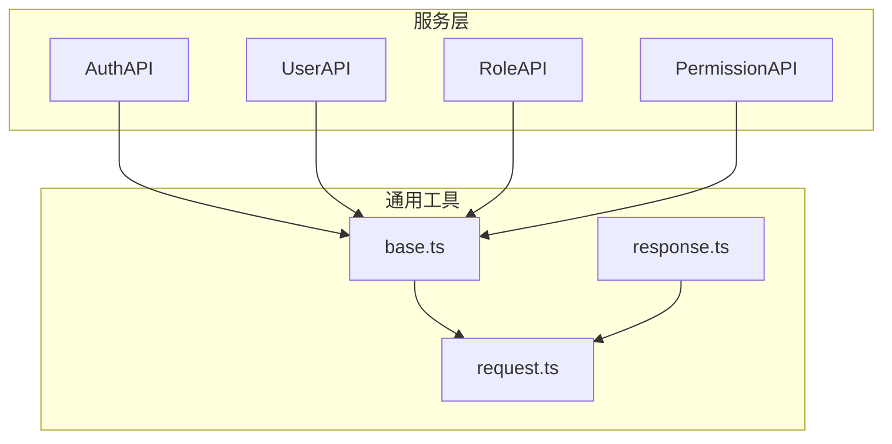
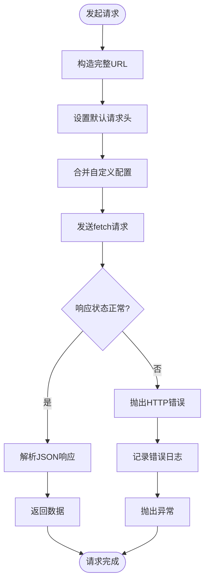
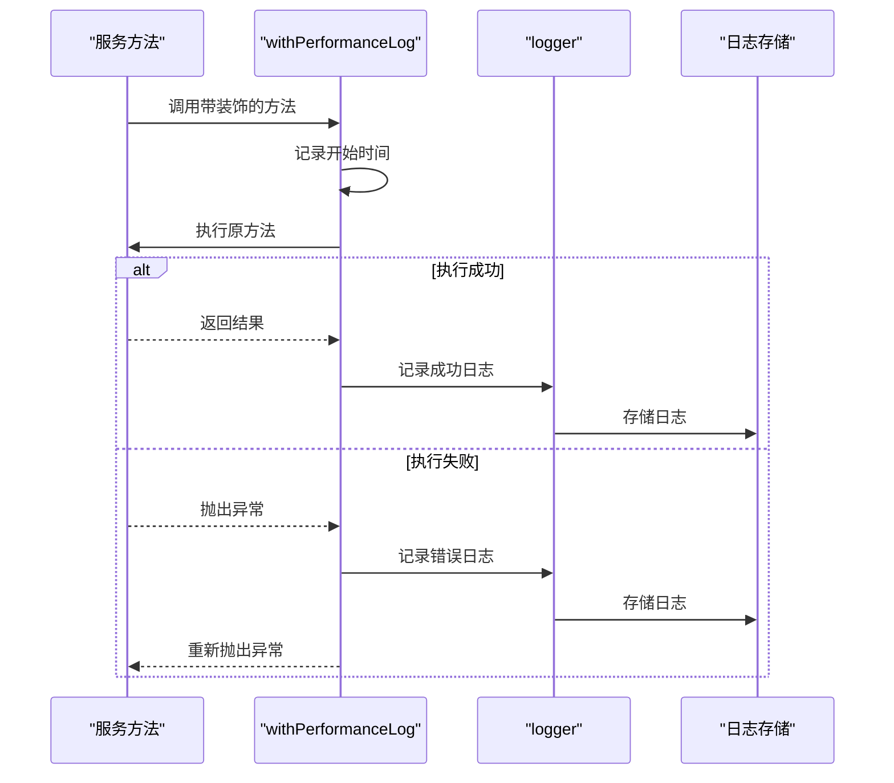
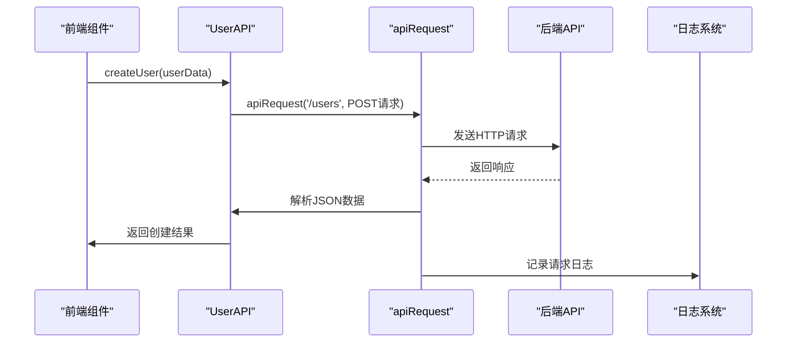

# 服务层设计

<cite>
**本文档中引用的文件**  
- [auth.ts](file://src/service/api/auth.ts)
- [user.ts](file://src/service/api/user.ts)
- [role.ts](file://src/service/api/role.ts)
- [base.ts](file://src/service/api/base.ts)
- [permission.ts](file://src/service/api/permission.ts)
- [request.ts](file://src/service/request.ts)
- [response.ts](file://src/service/response.ts)
- [logger.ts](file://src/lib/logger.ts)
</cite>

## 目录
1. [简介](#简介)
2. [服务层架构概览](#服务层架构概览)
3. [核心服务模块设计](#核心服务模块设计)
4. [通用请求处理机制](#通用请求处理机制)
5. [请求配置与拦截策略](#请求配置与拦截策略)
6. [服务调用链路分析](#服务调用链路分析)
7. [响应处理与错误转换](#响应处理与错误转换)
8. [接口规范与异步模式](#接口规范与异步模式)
9. [前端集成方式](#前端集成方式)
10. [性能优化建议](#性能优化建议)
11. [常见调用错误排查](#常见调用错误排查)

## 简介
本文件深入解析 `v0-game_admin` 项目的服务层架构设计，涵盖认证、用户、角色等核心模块的业务逻辑封装方式，阐述通用请求机制、统一配置管理、错误处理流程及与前端的集成模式。

## 服务层架构概览
服务层采用模块化设计，每个业务领域（如认证、用户、角色、权限）均封装为独立的静态类，通过统一的 `apiRequest` 函数发起 HTTP 请求，确保代码结构清晰、职责分离。

**图示来源**  
- [auth.ts](file://src/service/api/auth.ts#L3-L28)
- [user.ts](file://src/service/api/user.ts#L3-L41)
- [role.ts](file://src/service/api/role.ts#L3-L59)
- [permission.ts](file://src/service/api/permission.ts#L4-L58)
- [base.ts](file://src/service/api/base.ts#L4-L40)

## 核心服务模块设计
各服务模块通过静态类封装其领域内的业务逻辑，对外暴露清晰的接口方法。

### AuthAPI 模块
负责用户认证相关操作，包括登录、登出、会话获取和权限查询。

**模块来源**  
- [auth.ts](file://src/service/api/auth.ts#L3-L28)

### UserAPI 模块
封装用户管理功能，支持用户列表查询、详情获取、创建、更新和删除操作。

**模块来源**  
- [user.ts](file://src/service/api/user.ts#L3-L41)

### RoleAPI 模块
提供角色全生命周期管理，包括权限分配、角色查询与维护。

**模块来源**  
- [role.ts](file://src/service/api/role.ts#L3-L59)

### PermissionAPI 模块
管理权限体系，支持权限树结构获取、权限增删改查及子节点查询。

**模块来源**  
- [permission.ts](file://src/service/api/permission.ts#L4-L58)

## 通用请求处理机制
服务层通过 `base.ts` 中的 `apiRequest` 和 `buildSearchParams` 实现统一的请求处理逻辑。

### apiRequest 函数
封装通用的 fetch 请求逻辑，自动设置请求头、处理响应解析与错误抛出。

**图示来源**  
- [base.ts](file://src/service/api/base.ts#L4-L27)

### buildSearchParams 函数
将参数对象转换为 URL 查询字符串，自动过滤空值并进行类型转换。

**模块来源**  
- [base.ts](file://src/service/api/base.ts#L30-L40)

## 请求配置与拦截策略
服务层通过默认配置统一管理请求头、超时、重试等策略，并与仓储层完全解耦。

### 统一请求头管理
所有请求默认携带 `Content-Type: application/json`，确保前后端数据格式一致。

### 超时与重试机制
当前实现中未显式配置超时与重试，可通过扩展 `apiRequest` 函数实现。

### 日志记录机制
通过 `logger.ts` 提供的装饰器 `withPerformanceLog` 实现性能监控与操作日志记录。

**图示来源**  
- [logger.ts](file://src/lib/logger.ts#L272-L321)

## 服务调用链路分析
以创建用户为例，展示完整的服务调用链路。

**图示来源**  
- [user.ts](file://src/service/api/user.ts#L20-L24)
- [base.ts](file://src/service/api/base.ts#L4-L27)

## 响应处理与错误转换
服务层统一处理响应格式与错误转换，提升前端处理一致性。

### 响应格式规范
所有 API 响应遵循统一的 `ApiResponse` 结构，包含 code、data、message 和分页信息。

**模块来源**  
- [response.ts](file://src/service/response.ts#L4-L14)

### 错误转换机制
捕获原始网络错误并转换为结构化错误对象，便于前端统一处理。

**模块来源**  
- [base.ts](file://src/service/api/base.ts#L18-L26)

## 接口规范与异步模式
服务接口采用静态异步方法设计，返回 Promise，便于链式调用与错误处理。

### 接口定义规范
- 所有方法为 `static async`
- 参数类型明确标注
- 使用 `buildSearchParams` 处理查询参数
- 统一使用 `apiRequest` 发起请求

### 异步处理模式
采用 async/await 模式，提升代码可读性与错误处理能力。

**模块来源**  
- [user.ts](file://src/service/api/user.ts#L5-L9)
- [role.ts](file://src/service/api/role.ts#L5-L9)

## 前端集成方式
通过 `request.ts` 统一导出所有服务类，便于前端按需导入使用。

**模块来源**  
- [request.ts](file://src/service/request.ts#L5-L10)

## 性能优化建议
1. **请求缓存**：对频繁查询的静态数据（如角色列表）添加缓存机制
2. **批量操作**：提供批量创建/更新接口，减少网络往返
3. **分页优化**：合理设置默认分页大小，避免一次性加载过多数据
4. **懒加载**：对树形结构数据（如权限树）实现按需加载
5. **性能监控**：全面应用 `withPerformanceLog` 装饰器，监控关键路径性能

## 常见调用错误排查
| 错误现象 | 可能原因 | 解决方案 |
|--------|--------|--------|
| 请求失败，状态码 401 | 未登录或会话过期 | 检查登录状态，重新登录 |
| 请求失败，状态码 403 | 权限不足 | 检查当前用户角色权限 |
| 请求失败，状态码 404 | 接口路径错误 | 核对 API 路径拼写 |
| 响应数据为空 | 参数传递错误 | 检查 `buildSearchParams` 参数 |
| 连续请求失败 | 网络问题或服务不可用 | 检查网络连接，查看服务状态 |
| 创建用户失败 | 密码加密未处理 | 确保前端或后端完成密码加密 |

**排查来源**  
- [base.ts](file://src/service/api/base.ts#L18-L26)
- [auth.ts](file://src/service/api/auth.ts#L5-L9)
- [user.ts](file://src/service/api/user.ts#L20-L24)
- [logger.ts](file://src/lib/logger.ts#L272-L321)