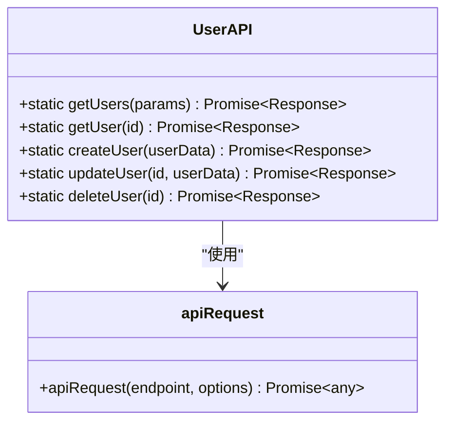
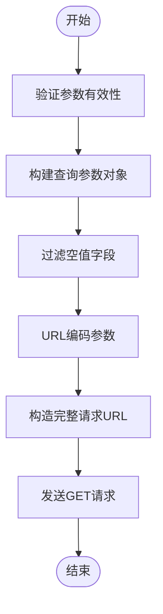
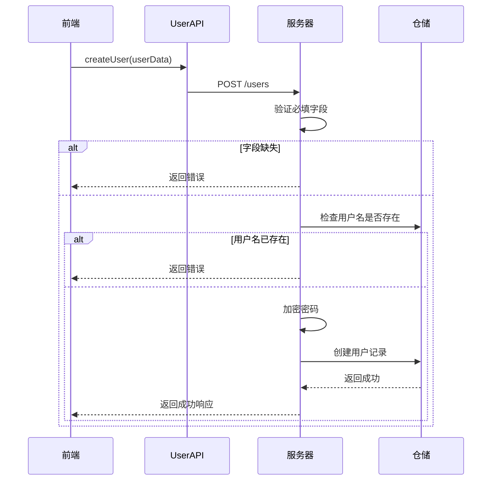
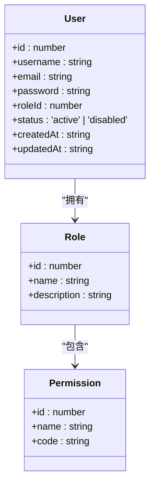
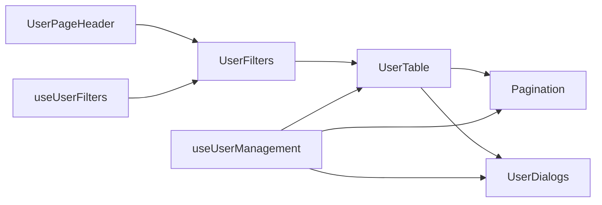
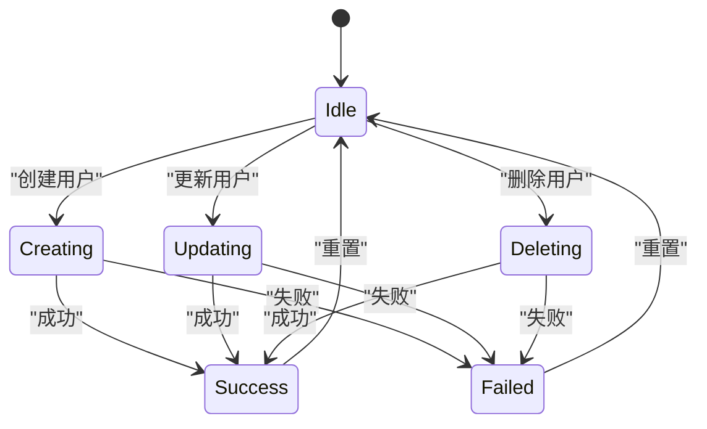
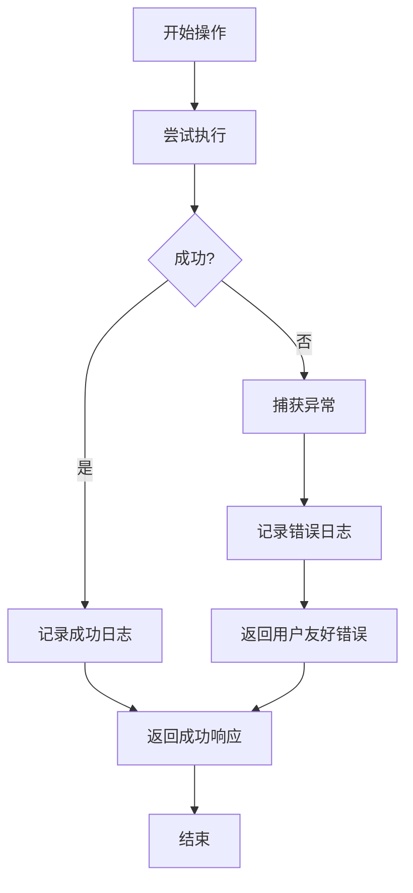

# 用户管理服务

<cite>
**本文档引用文件**  
- [user.ts](file://src/service/api/user.ts)
- [route.ts](file://src/app/api/users/route.ts)
- [jsonRepos.ts](file://src/repository/impl/jsonRepos.ts)
- [base.ts](file://src/service/api/base.ts)
- [useUserManagement.ts](file://src/app/dashboard/account/user/hooks/useUserManagement.ts)
- [types.ts](file://src/app/dashboard/account/user/types.ts)
- [page.tsx](file://src/app/dashboard/account/user/page.tsx)
- [models.ts](file://src/repository/models.ts)
</cite>

## 目录
1. [简介](#简介)
2. [核心功能概览](#核心功能概览)
3. [分页查询与参数构建](#分页查询与参数构建)
4. [用户创建流程](#用户创建流程)
5. [用户更新与权限控制](#用户更新与权限控制)
6. [前后端集成与前端组件](#前后端集成与前端组件)
7. [数据一致性与并发控制](#数据一致性与并发控制)
8. [异常处理与日志记录](#异常处理与日志记录)
9. [典型使用示例](#典型使用示例)
10. [附录](#附录)

## 简介
本系统提供完整的用户全生命周期管理功能，涵盖用户查询、创建、更新、删除等核心操作。通过标准化的API接口与前端组件集成，实现高效、安全的用户管理。系统采用基于JSON的仓储模式进行数据持久化，结合角色权限体系保障操作安全，并通过日志记录实现操作审计。

## 核心功能概览
`UserAPI`类封装了用户管理的五个核心方法：`getUsers`、`getUser`、`createUser`、`updateUser`和`deleteUser`，分别对应用户列表查询、详情获取、创建、更新和删除操作。这些方法通过统一的`apiRequest`函数与后端API通信，确保请求格式和错误处理的一致性。



**图示来源**  
- [user.ts](file://src/service/api/user.ts#L3-L41)

**本节来源**  
- [user.ts](file://src/service/api/user.ts#L3-L41)

## 分页查询与参数构建
用户列表查询支持分页和多种筛选条件。`getUsers`方法接收包含页码、页面大小和搜索关键词的参数对象，并通过`buildSearchParams`工具函数将其转换为URL查询字符串。该函数会自动过滤空值并进行URL编码，确保生成合法的查询参数。



**图示来源**  
- [base.ts](file://src/service/api/base.ts#L31-L41)
- [user.ts](file://src/service/api/user.ts#L5-L12)

**本节来源**  
- [base.ts](file://src/service/api/base.ts#L31-L41)
- [user.ts](file://src/service/api/user.ts#L5-L12)

## 用户创建流程
用户创建过程包含完整的数据校验和安全处理机制。系统首先验证用户名、邮箱和密码等必填字段，然后检查用户名是否已存在，最后对密码进行加密存储。密码使用bcrypt算法进行哈希处理，盐值轮数由环境变量`SALT_ROUNDS`控制，默认为12轮。



**图示来源**  
- [route.ts](file://src/app/api/users/route.ts#L45-L118)
- [jsonRepos.ts](file://src/repository/impl/jsonRepos.ts#L220-L236)

**本节来源**  
- [route.ts](file://src/app/api/users/route.ts#L45-L118)
- [jsonRepos.ts](file://src/repository/impl/jsonRepos.ts#L220-L236)

## 用户更新与权限控制
用户更新操作支持字段级权限控制，允许根据用户角色和权限决定可修改的字段范围。更新操作会自动更新`updatedAt`时间戳，并触发相应的日志记录。系统通过乐观并发控制机制防止数据冲突，确保更新操作的原子性和一致性。



**图示来源**  
- [models.ts](file://src/repository/models.ts#L6-L27)
- [jsonRepos.ts](file://src/repository/impl/jsonRepos.ts#L238-L247)

**本节来源**  
- [models.ts](file://src/repository/models.ts#L6-L27)
- [jsonRepos.ts](file://src/repository/impl/jsonRepos.ts#L238-L247)

## 前后端集成与前端组件
用户管理功能通过`useUserManagement` Hook与前端组件集成，实现数据获取、状态管理和用户交互。前端页面采用组件化设计，包含用户表格、筛选器、分页控件和对话框等可复用组件，支持响应式布局和无障碍访问。



**图示来源**  
- [page.tsx](file://src/app/dashboard/account/user/page.tsx)
- [useUserManagement.ts](file://src/app/dashboard/account/user/hooks/useUserManagement.ts)

**本节来源**  
- [page.tsx](file://src/app/dashboard/account/user/page.tsx)
- [useUserManagement.ts](file://src/app/dashboard/account/user/hooks/useUserManagement.ts)

## 数据一致性与并发控制
系统通过事务性操作和日志记录保障数据一致性。所有数据变更操作都包含在原子性事务中，确保操作的完整性。系统采用基于时间戳的并发控制机制，通过比较`updatedAt`字段防止并发修改冲突。同时，系统记录详细的操作日志，包括操作前后的数据快照，便于审计和问题排查。



**图示来源**  
- [jsonRepos.ts](file://src/repository/impl/jsonRepos.ts#L234-L235)
- [route.ts](file://src/app/api/users/route.ts#L97-L105)

**本节来源**  
- [jsonRepos.ts](file://src/repository/impl/jsonRepos.ts#L234-L235)
- [route.ts](file://src/app/api/users/route.ts#L97-L105)

## 异常处理与日志记录
系统实现全面的异常处理机制，捕获并处理各种运行时错误。所有操作都包含详细的日志记录，包括操作类型、操作对象、操作者信息和操作结果。日志记录采用结构化格式，便于后续分析和监控。系统还提供友好的错误提示，帮助用户快速定位和解决问题。



**图示来源**  
- [route.ts](file://src/app/api/users/route.ts#L53-L66)
- [route.ts](file://src/app/api/users/route.ts#L109-L117)

**本节来源**  
- [route.ts](file://src/app/api/users/route.ts#L53-L66)
- [route.ts](file://src/app/api/users/route.ts#L109-L117)

## 典型使用示例
以下为用户管理功能的典型使用场景示例：

1. **分页查询用户列表**：
```typescript
const result = await UserAPI.getUsers({
  page: 1,
  pageSize: 10,
  search: 'admin'
});
```

2. **创建新用户**：
```typescript
const success = await UserAPI.createUser({
  username: 'newuser',
  email: 'newuser@example.com',
  password: 'securepassword',
  roleId: 2
});
```

3. **更新用户信息**：
```typescript
const success = await UserAPI.updateUser(123, {
  email: 'updated@example.com',
  status: 'disabled'
});
```

**本节来源**  
- [useUserManagement.ts](file://src/app/dashboard/account/user/hooks/useUserManagement.ts#L90-L151)
- [page.tsx](file://src/app/dashboard/account/user/page.tsx#L88-L107)

## 附录
### 数据模型定义
用户数据模型包含以下字段：
- `id`: 用户唯一标识符
- `username`: 用户名
- `email`: 电子邮箱
- `password`: 加密后的密码哈希
- `roleId`: 角色ID
- `status`: 用户状态（active/disabled）
- `createdAt`: 创建时间
- `updatedAt`: 更新时间

### 环境变量配置
- `SALT_ROUNDS`: 密码加密盐值轮数，默认为12
- `JWT_SECRET`: JWT令牌密钥

**本节来源**  
- [models.ts](file://src/repository/models.ts#L6-L17)
- [route.ts](file://src/app/api/users/route.ts#L83-L85)