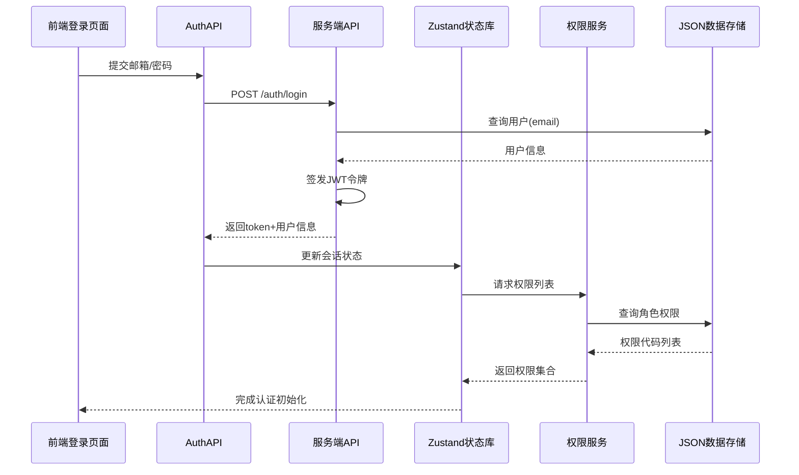
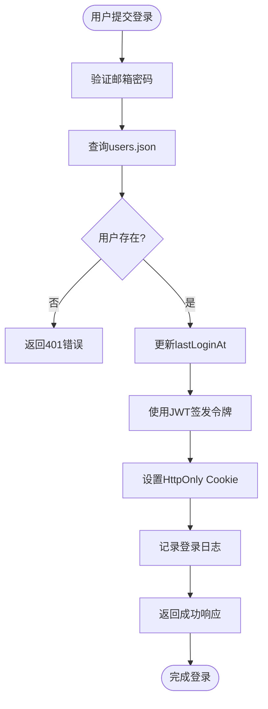
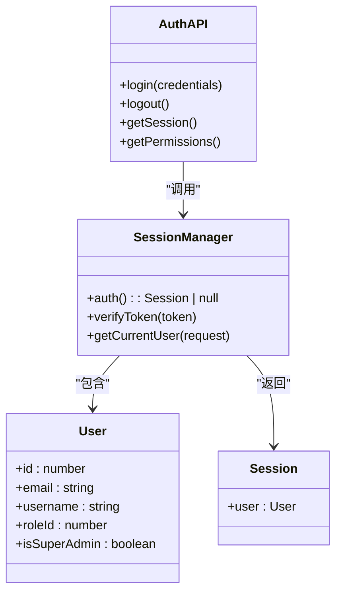
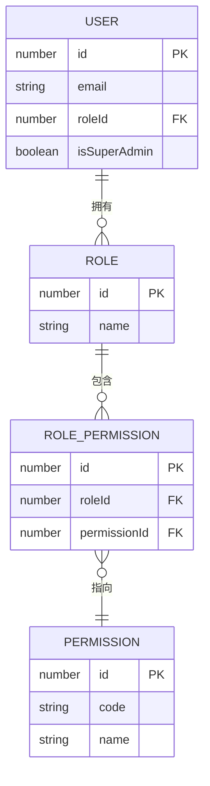
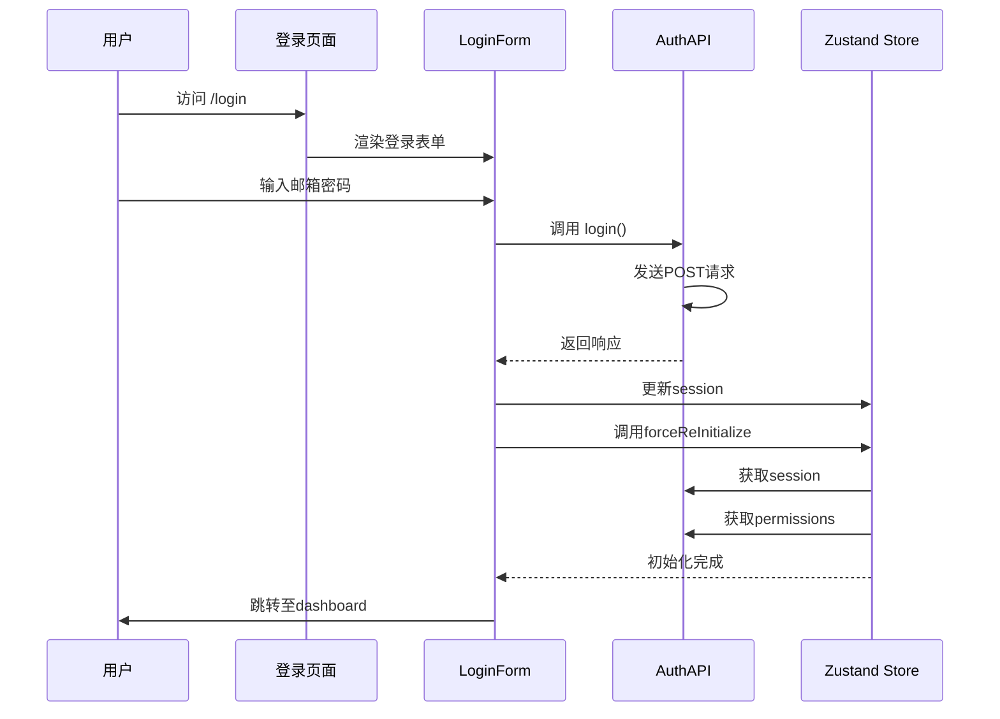

# 身份认证服务

<cite>
**本文档引用文件**  
- [auth.ts](file://src/service/api/auth.ts)
- [login/route.ts](file://src/app/api/auth/login/route.ts)
- [logout/route.ts](file://src/app/api/auth/logout/route.ts)
- [session/route.ts](file://src/app/api/auth/session/route.ts)
- [permissions/route.ts](file://src/app/api/auth/permissions/route.ts)
- [auth.ts](file://src/lib/auth.ts)
- [server-permissions.ts](file://src/lib/server-permissions.ts)
- [login-form.tsx](file://src/app/login/components/login-form.tsx)
- [page.tsx](file://src/app/login/page.tsx)
- [nav-user.tsx](file://src/components/layout/nav-user.tsx)
- [auth.ts](file://src/stores/auth.ts)
- [use-auth.ts](file://src/hooks/use-auth.ts)
- [types.ts](file://src/types/auth.ts)
- [models.ts](file://src/repository/models.ts)
- [users.json](file://data/users.json)
</cite>

## 目录
1. [简介](#简介)
2. [项目结构](#项目结构)
3. [核心组件](#核心组件)
4. [架构概览](#架构概览)
5. [详细组件分析](#详细组件分析)
6. [依赖分析](#依赖分析)
7. [性能考虑](#性能考虑)
8. [故障排除指南](#故障排除指南)
9. [结论](#结论)

## 简介
本系统实现了基于JWT的身份认证服务，包含登录、登出、会话管理与权限获取四大核心功能。系统采用RBAC权限模型，通过JSON Web Token进行状态维护，并结合Zustand状态管理库实现前后端一体化认证流程。前端登录页面与认证API紧密集成，支持凭证加密传输与令牌自动刷新机制。

## 项目结构
身份认证功能分布在多个目录中，主要包括API路由、服务封装、状态管理与UI组件。

```mermaid
graph TB
subgraph "API 路由"
A[/auth/login\route.ts]
B[/auth/logout\route.ts]
C[/auth/session\route.ts]
D[/auth/permissions\route.ts]
end
subgraph "服务层"
E[service/api/auth.ts]
F[lib/auth.ts]
G[lib/server-permissions.ts]
end
subgraph "状态管理"
H[stores/auth.ts]
I[hooks/use-auth.ts]
end
subgraph "用户界面"
J[app/login/page.tsx]
K[app/login/components/login-form.tsx]
L[components/layout/nav-user.tsx]
end
A --> E
B --> E
C --> E
D --> E
E --> F
E --> G
F --> H
G --> H
H --> I
J --> K
K --> E
L --> E
```

**图示来源**
- [auth.ts](file://src/service/api/auth.ts)
- [login/route.ts](file://src/app/api/auth/login/route.ts)
- [logout/route.ts](file://src/app/api/auth/logout/route.ts)
- [session/route.ts](file://src/app/api/auth/session/route.ts)
- [permissions/route.ts](file://src/app/api/auth/permissions/route.ts)
- [auth.ts](file://src/lib/auth.ts)
- [server-permissions.ts](file://src/lib/server-permissions.ts)
- [login-form.tsx](file://src/app/login/components/login-form.tsx)
- [nav-user.tsx](file://src/components/layout/nav-user.tsx)

**本节来源**
- [src/app/api/auth/](file://src/app/api/auth/)
- [src/service/api/auth.ts](file://src/service/api/auth.ts)
- [src/lib/auth.ts](file://src/lib/auth.ts)
- [src/stores/auth.ts](file://src/stores/auth.ts)

## 核心组件
身份认证系统由四个核心方法构成：`login`、`logout`、`getSession` 和 `getPermissions`，分别处理用户认证、会话终止、状态查询与权限获取。

**本节来源**
- [auth.ts](file://src/service/api/auth.ts#L3-L28)
- [types.ts](file://src/types/auth.ts)

## 架构概览
系统采用分层架构设计，从前端UI到后端API再到数据存储形成完整闭环。



**图示来源**
- [login-form.tsx](file://src/app/login/components/login-form.tsx#L44-L52)
- [auth.ts](file://src/service/api/auth.ts#L5-L10)
- [login/route.ts](file://src/app/api/auth/login/route.ts)
- [auth.ts](file://src/lib/auth.ts)
- [server-permissions.ts](file://src/lib/server-permissions.ts)

## 详细组件分析

### 登录机制分析
登录功能实现用户凭证验证与JWT令牌签发全过程。



**图示来源**
- [login/route.ts](file://src/app/api/auth/login/route.ts#L12-L76)
- [users.json](file://data/users.json)
- [logger.ts](file://src/lib/logger.ts)

**本节来源**
- [login/route.ts](file://src/app/api/auth/login/route.ts)
- [auth.ts](file://src/service/api/auth.ts#L5-L10)
- [types.ts](file://src/types/auth.ts)

### 会话管理分析
会话管理通过中间件解析JWT令牌并维护用户状态。



**图示来源**
- [auth.ts](file://src/lib/auth.ts)
- [session/route.ts](file://src/app/api/auth/session/route.ts)
- [types.ts](file://src/types/auth.ts)

**本节来源**
- [auth.ts](file://src/lib/auth.ts)
- [session/route.ts](file://src/app/api/auth/session/route.ts)

### 权限获取分析
权限系统基于RBAC模型，通过角色关联权限实现细粒度控制。



**图示来源**
- [server-permissions.ts](file://src/lib/server-permissions.ts#L27-L66)
- [models.ts](file://src/repository/models.ts)
- [roles.json](file://data/roles.json)
- [permissions.json](file://data/permissions.json)
- [rolePermissions.json](file://data/rolePermissions.json)

**本节来源**
- [permissions/route.ts](file://src/app/api/auth/permissions/route.ts)
- [server-permissions.ts](file://src/lib/server-permissions.ts)
- [models.ts](file://src/repository/models.ts)

### 前端集成分析
前端通过组件与状态管理实现完整的认证交互流程。



**图示来源**
- [page.tsx](file://src/app/login/page.tsx)
- [login-form.tsx](file://src/app/login/components/login-form.tsx)
- [auth.ts](file://src/stores/auth.ts)
- [use-auth.ts](file://src/hooks/use-auth.ts)

**本节来源**
- [page.tsx](file://src/app/login/page.tsx)
- [login-form.tsx](file://src/app/login/components/login-form.tsx)
- [use-auth.ts](file://src/hooks/use-auth.ts)

## 依赖分析
认证系统涉及多个模块间的依赖关系。

```mermaid
graph TD
A[login/page.tsx] --> B[login-form.tsx]
B --> C[AuthAPI.login]
C --> D[/auth/login/route.ts]
D --> E[getRepositories]
D --> F[jsonwebtoken.sign]
D --> G[logger.info]
H[nav-user.tsx] --> I[AuthAPI.logout]
I --> J[/auth/logout/route.ts]
K[use-auth.ts] --> L[authStore]
L --> M[AuthAPI.getSession]
L --> N[AuthAPI.getPermissions]
M --> O[/auth/session/route.ts]
N --> P[/auth/permissions/route.ts]
P --> Q[getUserPermissions]
Q --> R[getRepositories]
```

**图示来源**
- [package.json](file://package.json)
- 所有引用文件

**本节来源**
- [package.json](file://package.json)
- 所有引用文件

## 性能考虑
系统在认证流程中已考虑多项性能优化：
- 权限获取采用缓存机制避免重复请求
- JWT令牌减少数据库查询频率
- JSON文件存储优化读取性能
- 前端状态持久化减少初始化时间

建议生产环境使用数据库替代JSON文件存储以提升并发性能。

## 故障排除指南
常见认证问题及解决方案：

| 错误码 | 含义 | 解决方案 |
|-------|------|---------|
| 401 | 未授权 | 检查邮箱密码是否正确 |
| 403 | 禁止访问 | 确认用户角色权限配置 |
| 500 | 服务器错误 | 检查JWT密钥配置与日志输出 |
| Token过期 | 会话失效 | 实现自动刷新机制或重新登录 |

安全防护措施包括：
- 密码使用bcrypt加密存储
- JWT令牌设置HttpOnly与Secure标志
- 敏感操作记录审计日志
- 输入参数严格校验

单元测试应覆盖：
- 正常登录登出流程
- 错误凭证处理
- 会话过期场景
- 权限边界测试

生产监控指标建议：
- 每日登录次数
- 认证失败率
- 平均响应时间
- 在线会话数量

**本节来源**
- [login/route.ts](file://src/app/api/auth/login/route.ts)
- [logout/route.ts](file://src/app/api/auth/logout/route.ts)
- [logger.ts](file://src/lib/logger.ts)
- [auth.ts](file://src/lib/auth.ts)

## 结论
本身份认证系统实现了安全可靠的用户管理机制，具备良好的扩展性与维护性。通过JWT实现无状态认证，结合RBAC模型提供灵活的权限控制。前端与后端紧密协作，确保用户体验流畅。建议后续增加多因素认证、登录频率限制等安全特性以进一步提升系统安全性。