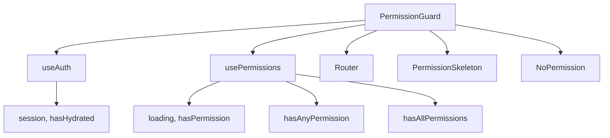
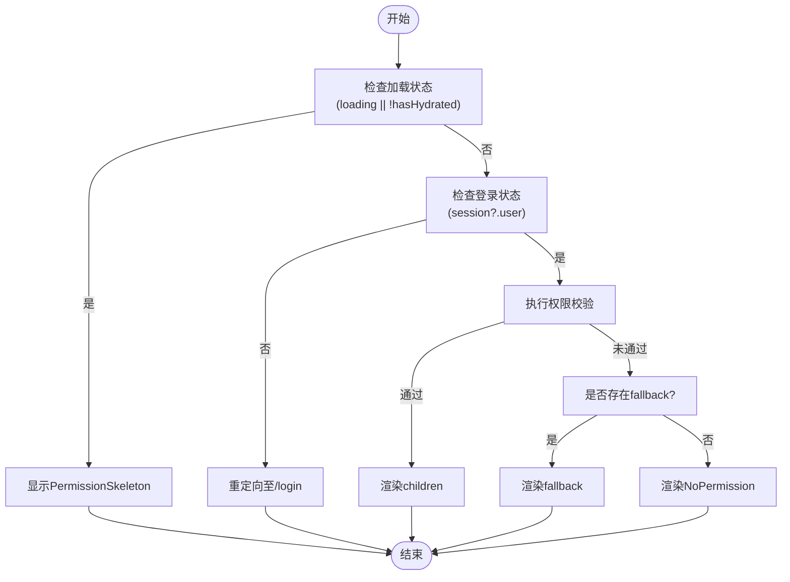

# PermissionGuard组件

<cite>
**本文档引用的文件**
- [permission-guard.tsx](file://src/components/auth/permission-guard.tsx)
- [use-permissions.ts](file://src/hooks/use-permissions.ts)
- [auth.ts](file://src/stores/auth.ts)
- [permissions.json](file://data/permissions.json)
- [permissions.md](file://src/docs/permissions.md)
</cite>

## 目录
1. [介绍](#介绍)
2. [核心功能与设计](#核心功能与设计)
3. [参数详解](#参数详解)
4. [使用方式](#使用方式)
5. [内部实现机制](#内部实现机制)
6. [高阶组件withPermission](#高阶组件withpermission)
7. [最佳实践与常见场景](#最佳实践与常见场景)
8. [潜在陷阱与解决方案](#潜在陷阱与解决方案)
9. [总结](#总结)

## 介绍

PermissionGuard组件是v0-game_admin项目中权限控制系统的核心守卫组件，用于在客户端对用户访问进行细粒度的权限控制。该组件通过集成usePermissions Hook和全局认证状态，实现了对页面级和UI元素级的动态权限校验。它不仅支持单个权限码的检查，还支持多个权限码的组合判断（任意一个或全部满足），并提供了灵活的fallback机制以应对无权限访问的情况。

**Section sources**
- [permissions.md](file://src/docs/permissions.md#L1-L61)

## 核心功能与设计

PermissionGuard组件作为权限控制的前端守卫，其主要职责是拦截未经授权的访问请求，并根据用户的权限状态决定是否渲染受保护的内容。该组件采用声明式编程范式，开发者只需将目标内容包裹在PermissionGuard标签内，并指定所需的权限码即可完成保护。

组件的设计遵循单一职责原则，专注于权限校验逻辑，同时保持高度的可复用性和灵活性。它与usePermissions Hook紧密协作，后者从Zustand状态管理库中提取当前用户的权限列表及相关操作方法。整个权限体系基于RBAC（基于角色的访问控制）模型构建，权限码采用树形结构组织，便于管理和扩展。



**Diagram sources**
- [permission-guard.tsx](file://src/components/auth/permission-guard.tsx#L1-L94)
- [use-permissions.ts](file://src/hooks/use-permissions.ts#L1-L26)

**Section sources**
- [permission-guard.tsx](file://src/components/auth/permission-guard.tsx#L1-L94)
- [use-permissions.ts](file://src/hooks/use-permissions.ts#L1-L26)

## 参数详解

### permissions
- **类型**: `string | string[]`
- **描述**: 指定需要校验的权限码。支持传入单个权限码或权限码数组。
- **行为逻辑**: 当传入数组时，结合requireAll参数决定校验策略：若requireAll为true，则要求用户具备数组中所有权限；否则只需具备任一权限即可通过校验。

### requireAll
- **类型**: `boolean`
- **默认值**: `false`
- **描述**: 控制多权限校验的逻辑模式。
- **行为逻辑**: 
  - `true`: 用户必须拥有permissions数组中的所有权限才能通过校验。
  - `false`: 用户只需拥有permissions数组中的任意一个权限即可通过校验。

### fallback
- **类型**: `React.ReactNode`
- **描述**: 当用户无权限访问时显示的备用UI内容。
- **行为逻辑**: 如果提供了fallback属性，则在权限校验失败时渲染该内容；否则默认显示NoPermission组件。

**Section sources**
- [permission-guard.tsx](file://src/components/auth/permission-guard.tsx#L9-L14)
- [permissions.md](file://src/docs/permissions.md#L62-L119)

## 使用方式

### 页面级权限保护

将整个页面内容包裹在PermissionGuard中，确保只有具备指定权限的用户才能访问该页面。

```tsx
<PermissionGuard permissions={PERMISSIONS.USER.READ}>
  <UserManagementPage />
</PermissionGuard>
```

### UI元素级权限控制

用于控制按钮、操作项等UI元素的可见性或可交互性。

```tsx
<PermissionGuard permissions={PERMISSIONS.USER.CREATE}>
  <Button>新增用户</Button>
</PermissionGuard>
```

### 多权限组合校验

支持复杂的权限组合场景，如需要同时具备读取和更新权限。

```tsx
<PermissionGuard 
  permissions={[PERMISSIONS.USER.READ, PERMISSIONS.USER.UPDATE]} 
  requireAll={true}
>
  <EditUserForm />
</PermissionGuard>
```

**Section sources**
- [permissions.md](file://src/docs/permissions.md#L34-L48)

## 内部实现机制

### 加载状态处理

组件首先检查权限加载状态（loading）和水合状态（hasHydrated）。任一状态为真时，渲染PermissionSkeleton作为加载占位符，避免出现内容闪烁或布局偏移。

### 未登录处理

当session.user不存在时，判定用户未登录，自动重定向至登录页（/login），实现无缝的身份验证跳转。

### 权限校验流程

1. 将permissions参数统一转换为数组格式。
2. 根据requireAll参数选择调用hasAllPermissions或hasAnyPermission方法。
3. 调用结果为false时，优先渲染fallback内容；若未提供fallback，则渲染NoPermission组件。



**Diagram sources**
- [permission-guard.tsx](file://src/components/auth/permission-guard.tsx#L42-L65)
- [auth.ts](file://src/stores/auth.ts#L190-L204)

**Section sources**
- [permission-guard.tsx](file://src/components/auth/permission-guard.tsx#L42-L65)
- [auth.ts](file://src/stores/auth.ts#L190-L204)

## 高阶组件withPermission

withPermission是一个高阶函数，用于将PermissionGuard的功能封装到任意React组件中，实现更简洁的权限控制语法。

### 用途

- 将权限控制逻辑与UI组件解耦
- 支持函数式组件和类组件的权限注入
- 提供更语义化的组件命名

### 使用示例

```tsx
const ProtectedUserPage = withPermission(UserPage, PERMISSIONS.USER.READ);
```

该方式等价于手动包裹PermissionGuard，但代码更加简洁且易于复用。

```mermaid
classDiagram
class PermissionGuard {
+children : ReactNode
+permissions : string|string[]
+requireAll : boolean
+fallback : ReactNode
+checkPermission() : boolean
}
class withPermission {
+Component : ReactComponent
+permissions : string|string[]
+options : {requireAll, fallback}
+WrappedComponent : FunctionComponent
}
withPermission --> PermissionGuard : "返回包装组件"
ClientComponent --> withPermission : "作为参数传入"
```

**Diagram sources**
- [permission-guard.tsx](file://src/components/auth/permission-guard.tsx#L70-L93)

**Section sources**
- [permission-guard.tsx](file://src/components/auth/permission-guard.tsx#L70-L93)

## 最佳实践与常见场景

### 场景一：保护管理页面

对敏感的管理页面（如用户管理、角色管理）实施严格的权限保护。

```tsx
<PermissionGuard permissions={PERMISSIONS.USER.READ}>
  <UserManagementDashboard />
</PermissionGuard>
```

### 场景二：动态按钮控制

根据权限动态显示/隐藏操作按钮，提升用户体验。

```tsx
<div>
  <PermissionGuard permissions={PERMISSIONS.USER.CREATE}>
    <Button>创建</Button>
  </PermissionGuard>
  <PermissionGuard permissions={PERMISSIONS.USER.DELETE}>
    <Button variant="destructive">删除</Button>
  </PermissionGuard>
</div>
```

### 场景三：表单字段级控制

在复杂表单中，根据不同权限显示不同的输入字段。

```tsx
<PermissionGuard permissions={PERMISSIONS.USER.SENSITIVE_UPDATE}>
  <FormField name="salary" label="薪资" type="number" />
</PermissionGuard>
```

**Section sources**
- [permissions.md](file://src/docs/permissions.md#L62-L119)

## 潜在陷阱与解决方案

### 陷阱一：权限码硬编码

避免在组件中直接使用字符串权限码，应统一从PERMISSIONS常量导入。

**解决方案**:
```tsx
// 错误做法
<PermissionGuard permissions="account.user.read">

// 正确做法
<PermissionGuard permissions={PERMISSIONS.USER.READ}>
```

### 陷阱二：服务端与客户端权限不一致

Next.js应用中可能存在SSR与CSR权限状态不同步的问题。

**解决方案**:
- 使用hasHydrated标志确保客户端水合完成后再进行最终渲染
- 在服务端使用ServerPermissionGuard进行预校验

### 陷阱三：权限变更后未及时更新

用户权限变更后，客户端可能仍缓存旧权限。

**解决方案**:
- 在关键操作前手动触发权限刷新
- 利用Zustand的持久化存储确保权限状态一致性

**Section sources**
- [auth.ts](file://src/stores/auth.ts#L106-L135)
- [permissions.md](file://src/docs/permissions.md#L83-L97)

## 总结

PermissionGuard组件作为v0-game_admin权限体系的前端核心，通过简洁的API设计实现了强大的权限控制能力。它不仅支持灵活的权限组合校验，还提供了完善的加载状态管理和用户体验优化。配合withPermission高阶组件，开发者可以轻松地在不同粒度上实施权限保护。该组件的设计充分考虑了实际应用场景中的各种边界情况，是构建安全可靠的管理后台不可或缺的基础组件。

**Section sources**
- [permission-guard.tsx](file://src/components/auth/permission-guard.tsx#L1-L94)
- [use-permissions.ts](file://src/hooks/use-permissions.ts#L1-L26)