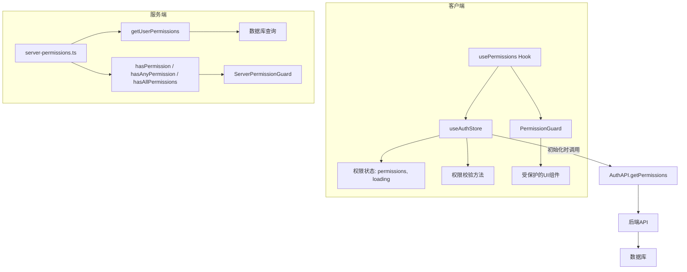
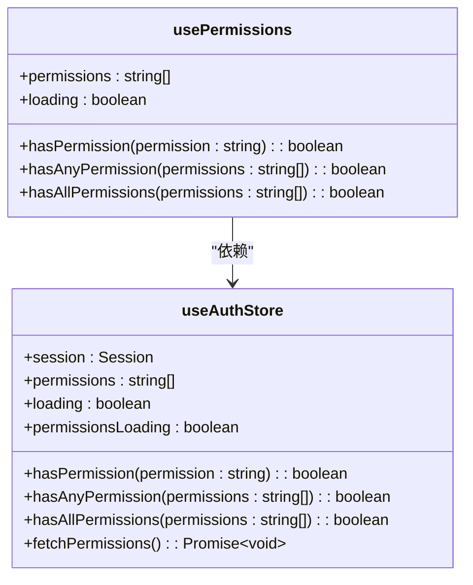
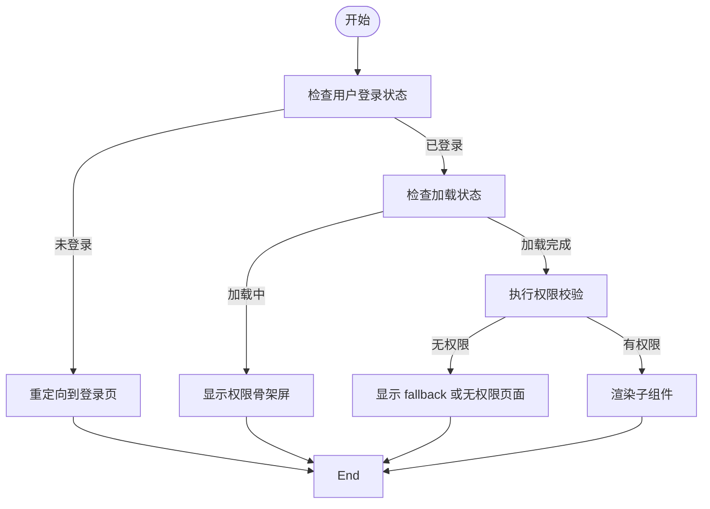
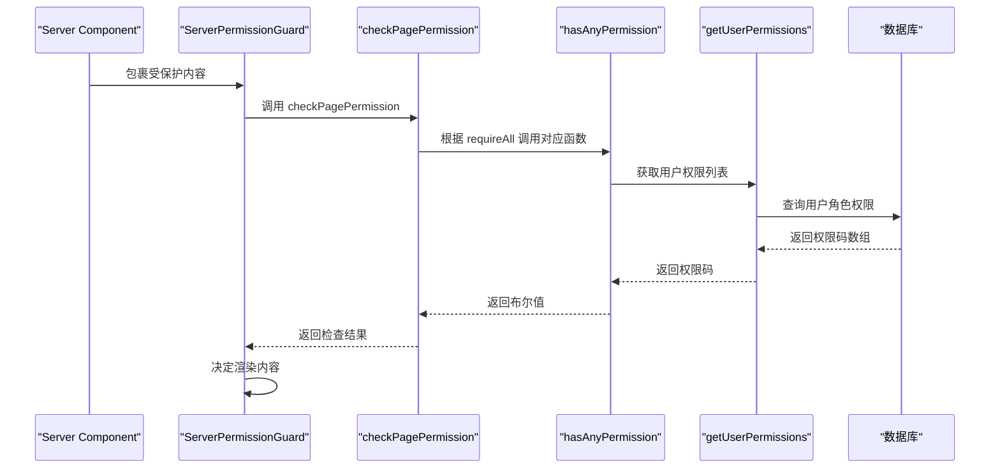
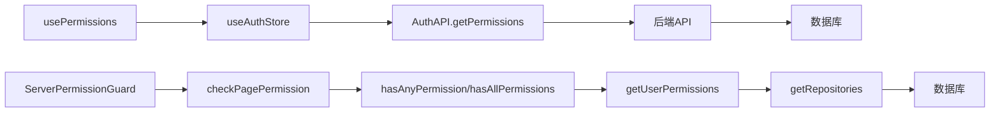

# usePermissions Hook

<cite>
**本文档中引用的文件**  
- [use-permissions.ts](file://src/hooks/use-permissions.ts)
- [auth.ts](file://src/stores/auth.ts)
- [permission-guard.tsx](file://src/components/auth/permission-guard.tsx)
- [server-permission-guard.tsx](file://src/components/auth/server-permission-guard.tsx)
- [nav-main-with-permission.tsx](file://src/components/layout/nav-main-with-permission.tsx)
- [server-permissions.ts](file://src/lib/server-permissions.ts)
</cite>

## 目录
1. [简介](#简介)
2. [核心组件](#核心组件)
3. [架构概述](#架构概述)
4. [详细组件分析](#详细组件分析)
5. [依赖分析](#依赖分析)
6. [性能考虑](#性能考虑)
7. [故障排除指南](#故障排除指南)
8. [结论](#结论)

## 简介
`usePermissions` 是一个自定义的 React Hook，用于在前端应用中统一处理用户权限的获取与校验逻辑。该 Hook 从 Zustand 状态管理库 `useAuthStore` 中提取当前用户的权限列表、加载状态以及权限校验方法，并为组件提供简洁的接口来判断用户是否具备特定权限。结合 `PermissionGuard` 组件，该 Hook 实现了细粒度的前端权限控制流程，确保只有具备相应权限的用户才能访问特定功能或页面。

## 核心组件
`usePermissions` Hook 的主要职责是从全局认证状态中提取权限相关数据和方法，包括：
- 当前用户的权限代码列表（`permissions`）
- 权限加载状态（`loading`，合并了会话和权限的加载状态）
- 权限校验函数：`hasPermission`、`hasAnyPermission`、`hasAllPermissions`

这些状态和方法均来源于 `useAuthStore`，并通过简化后的接口暴露给调用方，使权限判断逻辑更加清晰且易于使用。

**Section sources**
- [use-permissions.ts](file://src/hooks/use-permissions.ts#L7-L24)

## 架构概述
整个权限系统的架构分为客户端和服务端两个层面。客户端通过 `useAuthStore` 管理用户会话和权限状态，`usePermissions` Hook 封装了对这些状态的访问逻辑。服务端则通过 `getUserPermissions` 函数从数据库中获取用户权限，并提供 `hasPermission`、`hasAnyPermission`、`hasAllPermissions` 等异步权限检查函数供服务端组件使用。

**Diagram sources**
- [use-permissions.ts](file://src/hooks/use-permissions.ts#L7-L24)
- [auth.ts](file://src/stores/auth.ts#L44-L218)
- [server-permissions.ts](file://src/lib/server-permissions.ts#L27-L114)

## 详细组件分析

### usePermissions Hook 分析
`usePermissions` 是一个轻量级的封装 Hook，其核心逻辑是解构 `useAuthStore` 中的状态和方法，并重新组合返回一个更简洁的接口。它将 `loading` 和 `permissionsLoading` 合并为单一的 `loading` 状态，避免组件需要同时处理多个加载状态。

#### 对象关系图

**Diagram sources**
- [use-permissions.ts](file://src/hooks/use-permissions.ts#L7-L24)
- [auth.ts](file://src/stores/auth.ts#L44-L218)

### PermissionGuard 组件分析
`PermissionGuard` 是一个基于 `usePermissions` 的高阶组件，用于在路由级别进行权限控制。它接收一组权限码和匹配模式（任意一个或全部），并在渲染前执行权限检查。

#### 权限检查流程图

**Diagram sources**
- [permission-guard.tsx](file://src/components/auth/permission-guard.tsx#L17-L65)

### 服务端权限检查分析
服务端通过 `server-permissions.ts` 提供了一套完整的权限检查机制，支持在服务器组件中进行权限判断。`checkPagePermission` 函数可用于页面级权限控制，常用于 `generateMetadata` 或 `generateStaticParams` 中。

#### 服务端权限检查序列图

**Diagram sources**
- [server-permission-guard.tsx](file://src/components/auth/server-permission-guard.tsx#L50-L88)
- [server-permissions.ts](file://src/lib/server-permissions.ts#L71-L114)

## 依赖分析
`usePermissions` Hook 的依赖链清晰明确：
- 直接依赖 `useAuthStore`，从中获取权限状态和校验方法
- `useAuthStore` 依赖 `AuthAPI.getPermissions` 接口从后端获取权限数据
- 服务端权限检查依赖 `getUserFromRequest` 从 cookie 中解析用户信息，并通过仓储模式访问数据库

**Diagram sources**
- [use-permissions.ts](file://src/hooks/use-permissions.ts#L7-L24)
- [auth.ts](file://src/stores/auth.ts#L106-L134)
- [server-permissions.ts](file://src/lib/server-permissions.ts#L27-L66)

**Section sources**
- [use-permissions.ts](file://src/hooks/use-permissions.ts#L7-L24)
- [auth.ts](file://src/stores/auth.ts#L44-L218)
- [server-permissions.ts](file://src/lib/server-permissions.ts#L27-L114)

## 性能考虑
- `usePermissions` 本身不涉及复杂计算，性能开销极低
- 权限数据在 `useAuthStore` 中持久化存储于 `localStorage`，避免每次刷新都重新请求
- 服务端权限检查通过缓存和批量查询优化数据库访问
- 前端权限检查为同步操作，响应迅速

## 故障排除指南
常见问题及解决方案：
- **权限未及时更新**：确保在用户角色变更后调用 `useAuthStore.forceReInitialize()` 重新拉取权限
- **服务端权限检查失败**：确认请求上下文中有有效的认证 cookie
- **菜单权限不生效**：检查 `ROUTE_PERMISSIONS` 配置是否正确映射路由与权限码
- **超级管理员权限异常**：确认用户 `isSuperAdmin` 字段正确设置，且权限列表获取逻辑无误

**Section sources**
- [auth.ts](file://src/stores/auth.ts#L163-L171)
- [server-permissions.ts](file://src/lib/server-permissions.ts#L45-L48)

## 结论
`usePermissions` Hook 成功地将复杂的权限管理逻辑封装成简单易用的接口，提升了前端权限控制的开发效率和代码可维护性。通过与 `PermissionGuard` 和服务端权限检查机制的配合，实现了前后端一致的权限校验体系，保障了系统的安全性与灵活性。