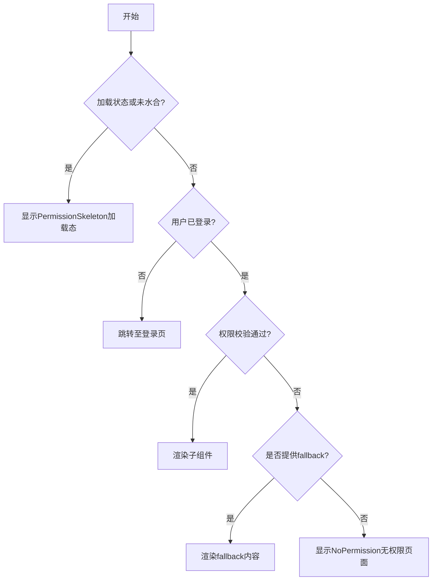
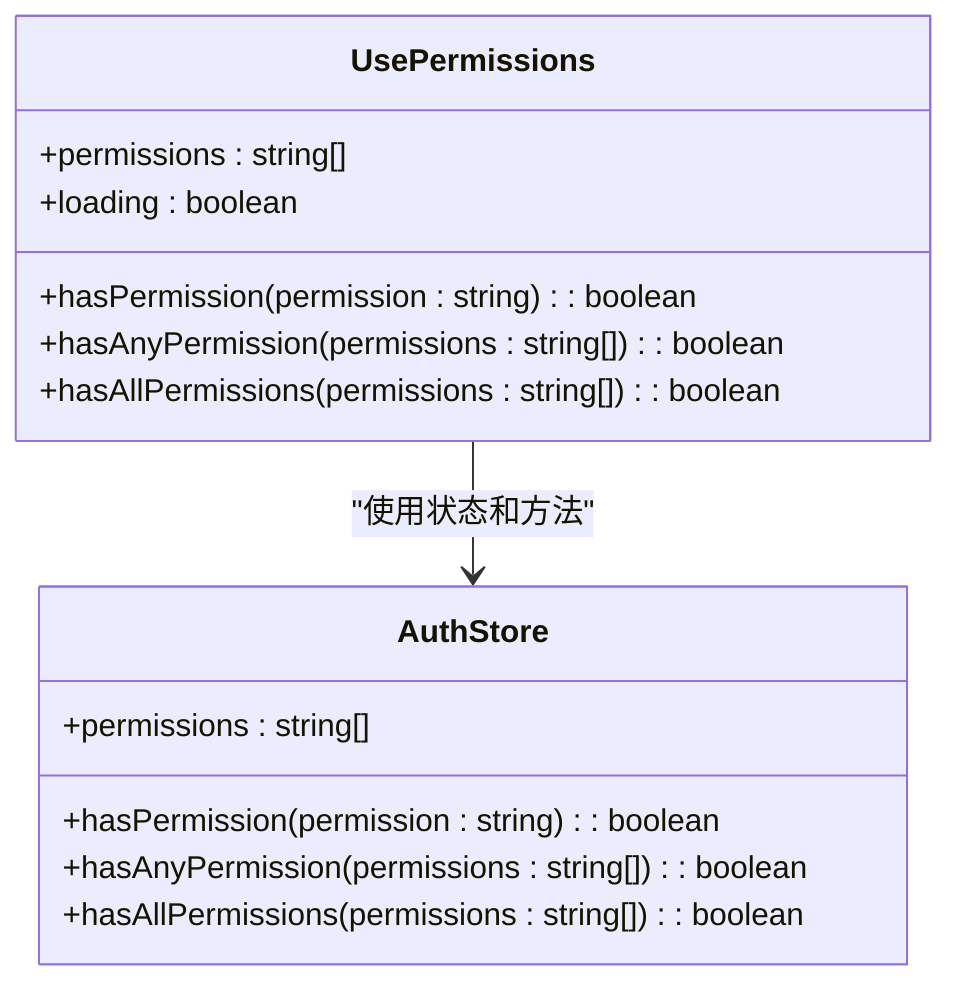
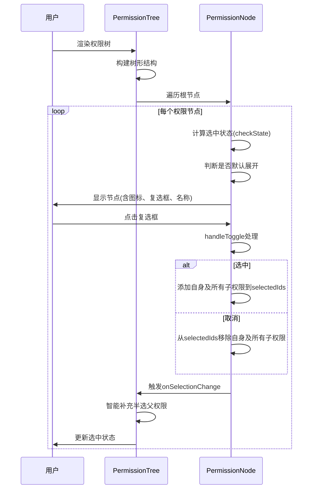

# 前端权限控制

<cite>
**本文档引用文件**  
- [permission-guard.tsx](file://src/components/auth/permission-guard.tsx)
- [use-permissions.ts](file://src/hooks/use-permissions.ts)
- [auth.ts](file://src/stores/auth.ts)
- [permission-tree.tsx](file://src/components/shared/permission-tree.tsx)
- [permissions.ts](file://src/lib/permissions.ts)
- [no-permission.tsx](file://src/components/ui/no-permission.tsx)
- [permission-skeleton.tsx](file://src/components/ui/permission-skeleton.tsx)
</cite>

## 目录
1. [权限系统概述](#权限系统概述)
2. [PermissionGuard组件详解](#permissionguard组件详解)
3. [use-permissions Hook实现机制](#use-permissions-hook实现机制)
4. [权限树组件功能解析](#权限树组件功能解析)
5. [使用示例与最佳实践](#使用示例与最佳实践)
6. [常见问题与解决方案](#常见问题与解决方案)

## 权限系统概述

本项目采用基于角色的权限控制系统（RBAC），支持前后端一体化的权限验证机制。权限结构采用树形层级设计，通过权限码（Permission Code）进行唯一标识，如 `account.user.read` 表示“用户管理-查看用户”权限。系统支持父子权限关系，父权限的授予会自动包含其所有子权限。

权限数据通过Zustand状态管理库进行全局维护，并在用户登录后从服务端获取并持久化存储于localStorage中，确保页面刷新后仍能保持权限状态。

**Section sources**
- [permissions.ts](file://src/lib/permissions.ts)
- [auth.ts](file://src/stores/auth.ts)

## PermissionGuard组件详解

`PermissionGuard` 是核心的客户端权限控制组件，用于包裹需要权限保护的UI元素或页面组件。该组件通过 `use-permissions` Hook 获取当前用户的权限列表，并根据配置的权限要求进行校验。

### 组件Props参数说明

| 参数 | 类型 | 默认值 | 说明 |
|------|------|--------|------|
| `permissions` | `string \| string[]` | 必填 | 需要校验的权限码，支持单个权限或权限数组 |
| `requireAll` | `boolean` | `false` | 是否需要满足所有权限（true）或任意一个权限（false） |
| `fallback` | `React.ReactNode` | - | 权限校验失败时显示的备用内容，若未提供则显示默认无权限页面 |

### 组件逻辑流程



**Diagram sources**
- [permission-guard.tsx](file://src/components/auth/permission-guard.tsx)

**Section sources**
- [permission-guard.tsx](file://src/components/auth/permission-guard.tsx)
- [no-permission.tsx](file://src/components/ui/no-permission.tsx)
- [permission-skeleton.tsx](file://src/components/ui/permission-skeleton.tsx)

## use-permissions Hook实现机制

`use-permissions` 是一个自定义Hook，负责从Zustand状态管理中获取权限数据，并提供便捷的权限校验方法。

### 数据来源

该Hook通过 `useAuthStore` 从全局状态中获取以下数据：
- `permissions`: 用户拥有的权限码数组
- `loading`: 权限加载状态
- `hasPermission`: 单权限校验函数
- `hasAnyPermission`: 任意权限校验函数
- `hasAllPermissions`: 所有权限校验函数

### 权限校验方法



**Diagram sources**
- [use-permissions.ts](file://src/hooks/use-permissions.ts)
- [auth.ts](file://src/stores/auth.ts)

**Section sources**
- [use-permissions.ts](file://src/hooks/use-permissions.ts)
- [auth.ts](file://src/stores/auth.ts)

## 权限树组件功能解析

`PermissionTree` 组件用于可视化展示权限的树形结构，支持在角色分配权限等场景中进行权限选择。

### 核心功能

1. **树形展开/折叠**：点击文件夹图标可展开或折叠子权限节点
2. **复选框级联选择**：
   - 选中父权限时，自动选中所有子权限
   - 取消父权限时，自动取消所有子权限
   - 子权限部分选中时，父权限显示半选状态
3. **智能状态管理**：自动展开包含已选权限的父节点

### 交互逻辑



**Diagram sources**
- [permission-tree.tsx](file://src/components/shared/permission-tree.tsx)

**Section sources**
- [permission-tree.tsx](file://src/components/shared/permission-tree.tsx)

## 使用示例与最佳实践

### 基本用法

```tsx
<PermissionGuard permissions={PERMISSIONS.USER.READ}>
  <UserManagementContent />
</PermissionGuard>
```

### 多权限校验

```tsx
// 需要任意一个权限
<PermissionGuard 
  permissions={[PERMISSIONS.USER.READ, PERMISSIONS.USER.CREATE]} 
  requireAll={false}
>
  <div>可查看或创建用户的区域</div>
</PermissionGuard>

// 需要所有权限
<PermissionGuard 
  permissions={[PERMISSIONS.USER.READ, PERMISSIONS.USER.UPDATE]} 
  requireAll={true}
>
  <div>可查看且可编辑用户的区域</div>
</PermissionGuard>
```

### 自定义无权限内容

```tsx
<PermissionGuard 
  permissions={PERMISSIONS.USER.DELETE}
  fallback={<Button disabled>删除用户</Button>}
>
  <Button>删除用户</Button>
</PermissionGuard>
```

### 高阶组件用法

```tsx
const ProtectedUserPage = withPermission(UserPage, PERMISSIONS.USER.READ);
```

### 最佳实践

1. **使用预定义常量**：始终使用 `PERMISSIONS` 常量，避免硬编码权限码
2. **合理设置fallback**：对于按钮等UI元素，提供禁用状态作为fallback
3. **服务端双重验证**：前端权限控制仅用于UI展示，关键操作必须在服务端再次验证
4. **权限变更处理**：当用户权限发生变更时，建议刷新页面以确保状态同步

**Section sources**
- [permission-guard.tsx](file://src/components/auth/permission-guard.tsx)
- [permissions.ts](file://src/lib/permissions.ts)

## 常见问题与解决方案

### 问题1：权限变更后仍能访问受限页面

**原因**：权限数据被缓存在localStorage中，未及时更新。

**解决方案**：
- 重新登录
- 手动刷新页面
- 在权限管理操作后调用 `useAuthStore.getState().forceReInitialize()`

### 问题2：超级管理员权限失效

**原因**：超级管理员应自动拥有所有权限。

**解决方案**：确保用户数据中 `isSuperAdmin` 字段正确设置，服务端 `getUserPermissions` 方法会自动返回所有权限。

### 问题3：权限树选择状态异常

**原因**：`selectedIds` 状态未正确处理级联逻辑。

**解决方案**：使用 `PermissionTree` 组件提供的 `onSelectionChange` 回调，该回调已内置智能处理逻辑，会自动补充半选状态的父权限。

**Section sources**
- [auth.ts](file://src/stores/auth.ts)
- [server-permissions.ts](file://src/lib/server-permissions.ts)
- [permission-tree.tsx](file://src/components/shared/permission-tree.tsx)