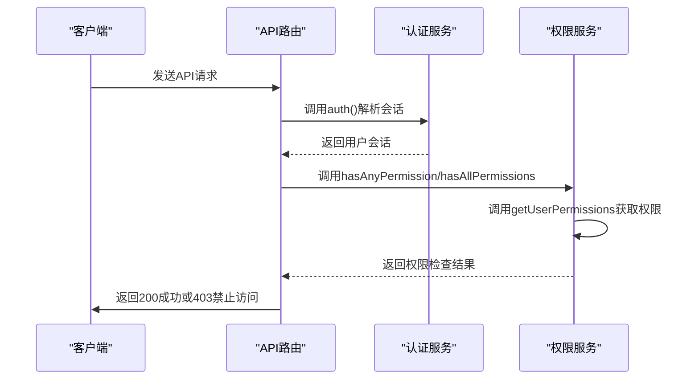

# API路由权限验证

<cite>
**Referenced Files in This Document**   
- [server-permissions.ts](file://src/lib/server-permissions.ts)
- [auth.ts](file://src/lib/auth.ts)
- [users/route.ts](file://src/app/api/users/route.ts)
- [roles/route.ts](file://src/app/api/roles/route.ts)
- [permissions/route.ts](file://src/app/api/permissions/route.ts)
- [logger.ts](file://src/lib/logger.ts)
- [jsonRepos.ts](file://src/repository/impl/jsonRepos.ts)
- [super-admin.ts](file://src/lib/super-admin.ts)
</cite>

## 目录
1. [简介](#简介)
2. [核心权限验证机制](#核心权限验证机制)
3. [权限验证执行流程](#权限验证执行流程)
4. [API端点保护示例](#api端点保护示例)
5. [超级管理员权限处理](#超级管理员权限处理)
6. [错误处理与日志记录](#错误处理与日志记录)
7. [性能优化策略](#性能优化策略)
8. [安全漏洞防范](#安全漏洞防范)
9. [结论](#结论)

## 简介
本文档详细阐述了v0-game_admin项目中Next.js API路由的权限验证机制。该系统通过集成后端权限验证，确保API端点的安全性。文档重点介绍了如何在API路由中使用`hasAnyPermission`和`hasAllPermissions`函数进行权限检查，保护用户管理、角色管理和权限管理等敏感操作。系统通过认证信息解析、权限检查和响应处理的完整流程，实现了细粒度的访问控制。

## 核心权限验证机制
v0-game_admin项目通过`src/lib/server-permissions.ts`文件提供了核心的权限验证功能。该模块导出了`hasAnyPermission`和`hasAllPermissions`两个关键函数，用于在API路由中进行权限检查。

`hasAnyPermission`函数检查用户是否具有任意一个指定的权限代码，而`hasAllPermissions`则要求用户必须拥有所有指定的权限代码。这两个函数都基于`getUserPermissions`函数获取用户的权限列表，并通过数组的`some`和`every`方法进行逻辑判断。

权限验证机制在服务端执行，确保了安全性。当在API路由中调用这些函数时，系统会自动从请求中获取用户ID，查询其关联的角色和权限，并进行验证。验证结果为布尔值，根据结果返回相应的HTTP状态码。

**Section sources**
- [server-permissions.ts](file://src/lib/server-permissions.ts#L87-L114)

## 权限验证执行流程
API路由权限验证的执行流程遵循一个清晰的步骤序列。首先，系统从请求头中获取认证信息，通常是存储在Cookie中的JWT令牌。然后，通过`auth()`函数解析会话信息，获取当前用户的身份。

接下来，系统调用`server-permissions.ts`中的权限检查函数（如`hasAnyPermission`或`hasAllPermissions`）进行验证。这些函数会查询用户的权限列表，并与请求的权限代码进行比对。权限检查过程中，系统会从仓储层获取用户的角色信息，并根据角色关联的权限进行判断。

根据权限检查的结果，系统返回相应的HTTP响应。如果验证通过，返回200成功响应；如果验证失败，则返回403禁止访问状态码。整个流程在服务端完成，确保了权限验证的安全性和可靠性。

**Diagram sources**
- [auth.ts](file://src/lib/auth.ts#L18-L43)
- [server-permissions.ts](file://src/lib/server-permissions.ts#L87-L114)

## API端点保护示例
在实际的API路由中，权限验证通常作为中间件在敏感操作前执行。以用户管理API为例，在`POST`、`PUT`、`DELETE`等操作前，需要插入权限检查。

在`src/app/api/users/route.ts`文件中，虽然没有直接显示权限检查代码，但可以通过导入`hasAnyPermission`或`hasAllPermissions`函数来实现。例如，在创建用户前，可以检查用户是否具有`account.user.create`权限。

类似地，在角色管理API和权限管理API中，也需要进行相应的权限检查。对于角色管理，可以检查`account.role.create`、`account.role.update`等权限；对于权限管理，则检查`account.permission.create`、`account.permission.update`等权限。

这些权限检查通常在路由处理函数的开头执行，确保在进行任何数据操作前完成验证。如果验证失败，立即返回403状态码，阻止后续操作。

**Section sources**
- [users/route.ts](file://src/app/api/users/route.ts)
- [roles/route.ts](file://src/app/api/roles/route.ts)
- [permissions/route.ts](file://src/app/api/permissions/route.ts)

## 超级管理员权限处理
系统对超级管理员用户有特殊的权限处理逻辑。根据`src/lib/super-admin.ts`文件中的实现，超级管理员用户（`isSuperAdmin`为`true`）拥有所有权限，可以绕过常规的权限检查。

当`getUserPermissions`函数检测到用户是超级管理员时，会查询系统中所有的权限代码并返回，而不是根据角色关联的权限进行判断。这种设计确保了超级管理员可以访问系统中的所有功能。

同时，系统也对超级管理员的修改和删除操作进行了特殊保护。例如，`preventSuperAdminModification`函数会阻止对超级管理员用户的修改或删除操作，`preventSuperAdminDisable`函数会阻止禁用超级管理员账户。这些保护措施确保了系统最高权限账户的安全性。

**Section sources**
- [super-admin.ts](file://src/lib/super-admin.ts)
- [server-permissions.ts](file://src/lib/server-permissions.ts#L44-L48)

## 错误处理与日志记录
系统实现了完善的错误处理和日志记录机制。当权限检查失败时，系统会返回403禁止访问状态码，并记录相应的错误信息。在`server-permissions.ts`文件中，权限检查函数都包含try-catch块，确保在异常情况下返回`false`，保证安全。

日志记录通过`src/lib/logger.ts`文件实现。系统在关键操作（如用户创建、角色创建）时记录详细的日志信息，包括操作类型、操作人、操作详情等。日志信息包含级别（info、warn、error）、模块、动作、消息和详细信息等字段，便于后续审计和问题排查。

日志记录器还实现了缓存机制，通过`loggerCache` Map存储已创建的Logger实例，避免重复创建，提高性能。同时，系统使用UUID生成请求ID，便于追踪单个请求的完整流程。

**Section sources**
- [logger.ts](file://src/lib/logger.ts)
- [server-permissions.ts](file://src/lib/server-permissions.ts#L95-L97)

## 性能优化策略
虽然当前系统没有显式的权限缓存机制，但通过代码分析可以识别出潜在的性能优化点。`getUserPermissions`函数在每次调用时都会查询数据库，对于频繁访问的API端点，这可能成为性能瓶颈。

一个可行的优化策略是实现权限缓存。可以在用户登录或会话创建时，将用户的权限列表存储在内存或Redis中，并设置适当的过期时间。这样，在后续的权限检查中，可以直接从缓存中获取权限列表，避免重复的数据库查询。

另一个优化点是减少不必要的权限查询。当前`getUserPermissions`函数在没有传入`userId`时，会尝试从请求中获取用户ID。可以通过优化函数调用方式，确保在大多数情况下直接传入`userId`，减少额外的请求解析开销。

**Section sources**
- [server-permissions.ts](file://src/lib/server-permissions.ts#L27-L66)

## 安全漏洞防范
系统通过多种机制防范常见的安全漏洞。对于权限提升攻击，系统在服务端进行权限验证，确保客户端无法绕过检查。所有权限检查都在服务端完成，客户端只能看到验证结果，无法修改验证逻辑。

对于未授权访问，系统采用"默认拒绝"原则。在权限检查失败时，返回403状态码，阻止访问受保护的资源。同时，系统对超级管理员账户进行了特殊保护，防止其被意外修改或删除。

在错误处理方面，系统避免泄露敏感信息。权限检查失败时，只返回通用的"禁止访问"消息，不透露具体的权限要求或系统内部结构。这防止了攻击者通过错误信息推断系统权限模型。

**Section sources**
- [server-permissions.ts](file://src/lib/server-permissions.ts#L95-L97)
- [super-admin.ts](file://src/lib/super-admin.ts)

## 结论
v0-game_admin项目的API路由权限验证机制通过`hasAnyPermission`和`hasAllPermissions`函数实现了灵活的权限控制。系统在服务端执行权限检查，确保了安全性。通过`auth()`函数解析会话，调用`server-permissions.ts`中的权限检查函数进行验证，根据结果返回相应的HTTP状态码。

对于用户管理、角色管理和权限管理等敏感API，建议在路由处理函数中插入权限检查中间件。超级管理员用户可以绕过常规权限检查，但其账户受到特殊保护。系统通过完善的错误处理和日志记录机制，提高了安全性和可维护性。

未来可以考虑实现权限缓存机制，以提高频繁访问API的性能。同时，应持续关注安全漏洞，确保系统免受权限提升、未授权访问等攻击。