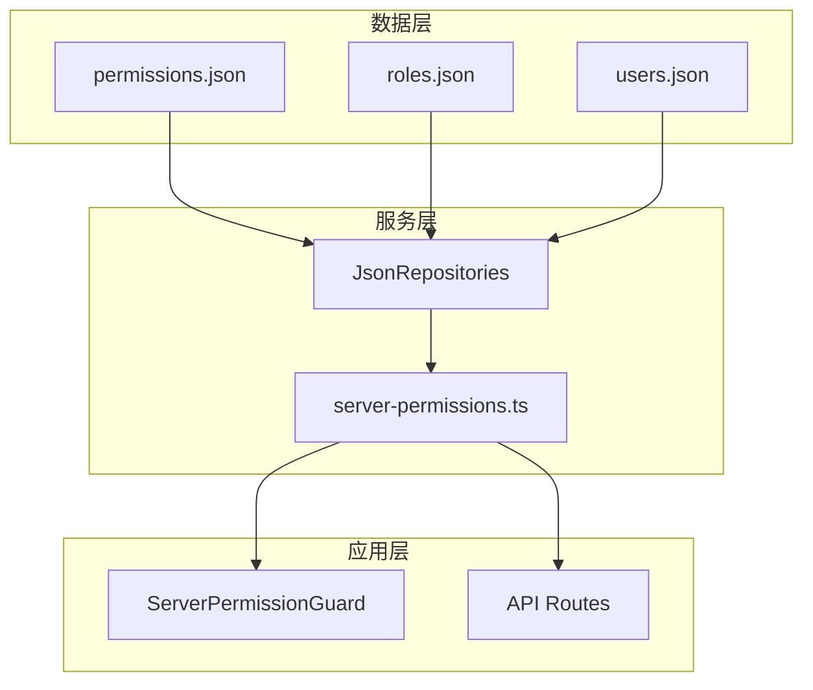
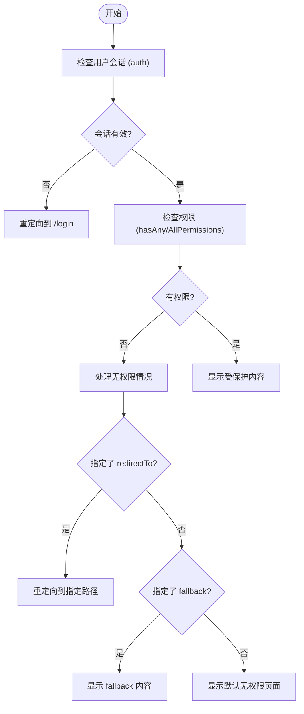
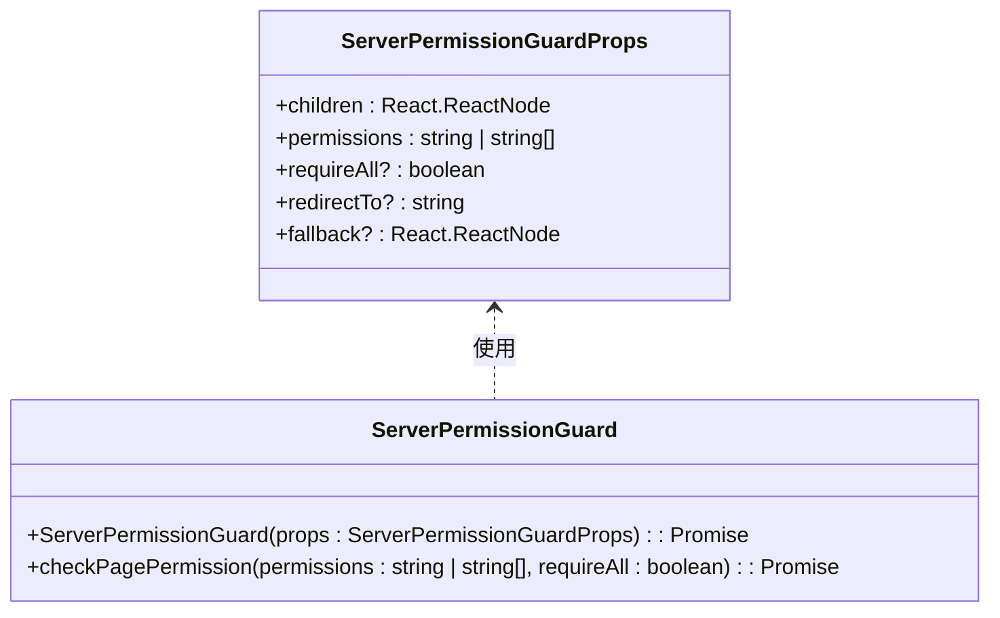
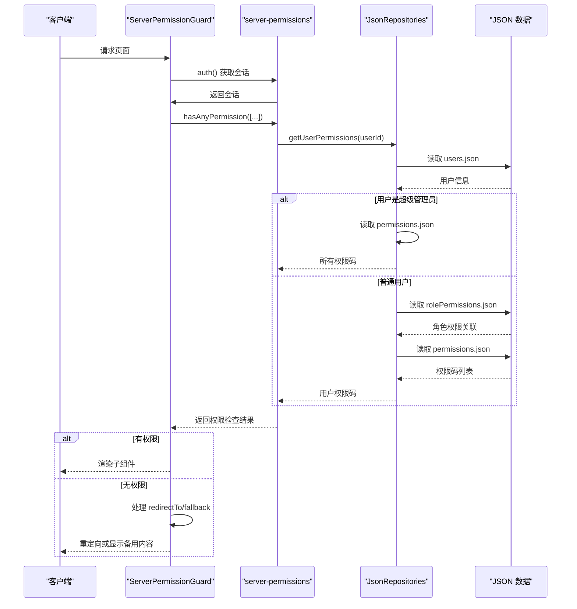
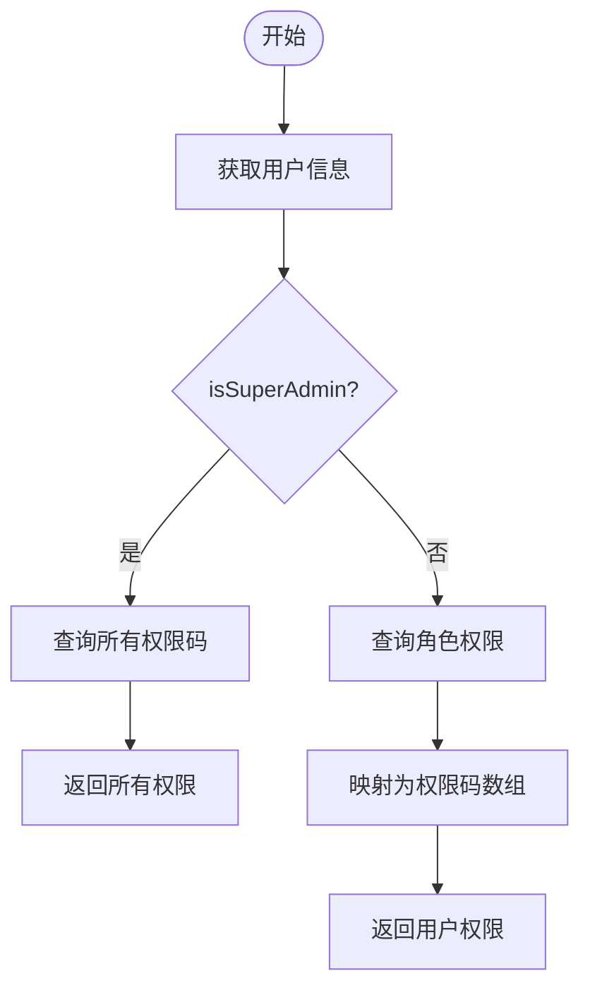
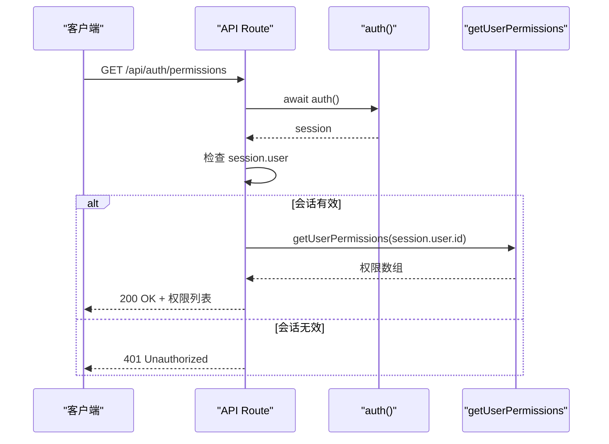

# 后端权限验证

<cite>
**本文档引用文件**  
- [server-permission-guard.tsx](file://src/components/auth/server-permission-guard.tsx)
- [server-permissions.ts](file://src/lib/server-permissions.ts)
- [auth.ts](file://src/lib/auth.ts)
- [jsonRepos.ts](file://src/repository/impl/jsonRepos.ts)
- [permissions.json](file://data/permissions.json)
- [roles.json](file://data/roles.json)
- [users.json](file://data/users.json)
- [route.ts](file://src/app/api/permissions/route.ts)
- [surper-admin.ts](file://src/config/surper-admin.ts)
</cite>

## 目录
1. [项目结构](#项目结构)
2. [核心组件](#核心组件)
3. [权限验证机制实现](#权限验证机制实现)
4. [ServerPermissionGuard 组件分析](#serverpermissionguard-组件分析)
5. [服务端权限函数详解](#服务端权限函数详解)
6. [超级管理员权限处理](#超级管理员权限处理)
7. [API 路由中的权限应用](#api-路由中的权限应用)
8. [安全最佳实践与性能优化](#安全最佳实践与性能优化)

## 项目结构

本项目采用基于角色的权限控制系统（RBAC），权限数据以 JSON 文件形式存储于 `data/` 目录下，包括 `permissions.json`、`rolePermissions.json` 和 `roles.json`。核心权限逻辑位于 `src/lib/server-permissions.ts`，服务端权限守卫组件为 `src/components/auth/server-permission-guard.tsx`。API 路由在 `src/app/api/` 下实现权限检查。

**图示来源**  
- [jsonRepos.ts](file://src/repository/impl/jsonRepos.ts#L1-L877)
- [server-permissions.ts](file://src/lib/server-permissions.ts#L1-L116)

**本节来源**  
- [project_structure](#project_structure)

## 核心组件

后端权限验证的核心是 `ServerPermissionGuard` 组件和 `server-permissions.ts` 中的权限检查函数。前者用于页面级权限控制，后者提供底层权限判断能力。权限数据通过 `JsonRepositories` 从 JSON 文件中读取，用户会话通过 `auth()` 函数从 Cookie 中解析。

**本节来源**  
- [server-permission-guard.tsx](file://src/components/auth/server-permission-guard.tsx#L1-L89)
- [server-permissions.ts](file://src/lib/server-permissions.ts#L1-L116)

## 权限验证机制实现

系统在服务端执行权限检查，确保权限验证的安全性。流程如下：首先通过 `auth()` 获取用户会话信息，然后调用 `hasAnyPermission` 或 `hasAllPermissions` 进行权限校验。若校验失败，根据 `redirectTo` 和 `fallback` 参数决定后续行为。

**图示来源**  
- [server-permission-guard.tsx](file://src/components/auth/server-permission-guard.tsx#L14-L63)

**本节来源**  
- [server-permission-guard.tsx](file://src/components/auth/server-permission-guard.tsx#L1-L89)

## ServerPermissionGuard 组件分析

`ServerPermissionGuard` 是一个异步服务端组件，接收 `permissions`、`requireAll`、`redirectTo` 和 `fallback` 等参数。其主要职责是保护页面或组件，确保只有具备相应权限的用户才能访问。

### 参数说明
- **permissions**: 需要检查的权限码，支持单个字符串或字符串数组。
- **requireAll**: 布尔值，`true` 表示需要所有权限，`false` 表示只需任意一个权限。
- **redirectTo**: 当无权限时，重定向到指定路径。
- **fallback**: 当无权限时，显示的备用内容。

**图示来源**  
- [server-permission-guard.tsx](file://src/components/auth/server-permission-guard.tsx#L6-L12)
- [server-permission-guard.tsx](file://src/components/auth/server-permission-guard.tsx#L14-L88)

**本节来源**  
- [server-permission-guard.tsx](file://src/components/auth/server-permission-guard.tsx#L1-L89)

## 服务端权限函数详解

`server-permissions.ts` 提供了核心的权限验证函数，均在服务端执行。

### getUserPermissions
获取指定用户的所有权限码。若未传入 `userId`，则从当前请求的 Cookie 中提取。首先获取用户信息，若为超级管理员则返回所有权限，否则根据角色关联查询权限。

### hasPermission
检查用户是否拥有指定的单个权限码。

### hasAnyPermission
检查用户是否拥有 `permissionCodes` 数组中的任意一个权限。

### hasAllPermissions
检查用户是否拥有 `permissionCodes` 数组中的所有权限。

**图示来源**  
- [server-permissions.ts](file://src/lib/server-permissions.ts#L27-L66)
- [server-permissions.ts](file://src/lib/server-permissions.ts#L72-L114)
- [jsonRepos.ts](file://src/repository/impl/jsonRepos.ts#L1-L877)

**本节来源**  
- [server-permissions.ts](file://src/lib/server-permissions.ts#L1-L116)

## 超级管理员权限处理

系统通过 `isSuperAdmin` 字段识别超级管理员。在 `getUserPermissions` 函数中，若检测到用户为超级管理员，则直接查询 `permissions.json` 文件获取所有权限码并返回，从而赋予其所有权限。

**图示来源**  
- [server-permissions.ts](file://src/lib/server-permissions.ts#L45-L48)
- [models.ts](file://src/repository/models.ts#L13)

**本节来源**  
- [server-permissions.ts](file://src/lib/server-permissions.ts#L27-L66)
- [surper-admin.ts](file://src/config/surper-admin.ts#L1-L9)

## API 路由中的权限应用

API 路由通过 `getUserPermissions` 函数实现权限检查。例如，`/api/auth/permissions` 路由在返回用户权限前，会先验证会话有效性。

**图示来源**  
- [auth.ts](file://src/lib/auth.ts#L18-L43)
- [server-permissions.ts](file://src/lib/server-permissions.ts#L27-L66)
- [route.ts](file://src/app/api/auth/permissions/route.ts#L1-L22)

**本节来源**  
- [route.ts](file://src/app/api/auth/permissions/route.ts#L1-L22)
- [server-permissions.ts](file://src/lib/server-permissions.ts#L1-L116)

## 安全最佳实践与性能优化

### 安全最佳实践
1. **服务端验证**：所有权限检查必须在服务端进行，防止客户端篡改。
2. **会话保护**：使用 JWT 并通过 `verifyToken` 验证其有效性。
3. **输入验证**：对所有 API 输入进行严格验证。
4. **日志记录**：关键操作（如权限变更）应记录操作日志。

### 性能优化建议
1. **权限缓存**：对于频繁访问的权限数据，可考虑引入缓存机制（如 Redis），避免每次请求都读取文件。
2. **批量查询优化**：`getUserPermissions` 中一次性加载所有权限，减少 I/O 次数。
3. **数据库替换**：生产环境应将 JSON 文件存储替换为数据库（如 PostgreSQL），以提高查询效率和并发能力。
4. **权限码预加载**：对于静态权限结构，可在应用启动时预加载权限树，减少运行时计算。

**本节来源**  
- [server-permissions.ts](file://src/lib/server-permissions.ts#L27-L66)
- [jsonRepos.ts](file://src/repository/impl/jsonRepos.ts#L1-L877)
- [auth.ts](file://src/lib/auth.ts#L18-L43)