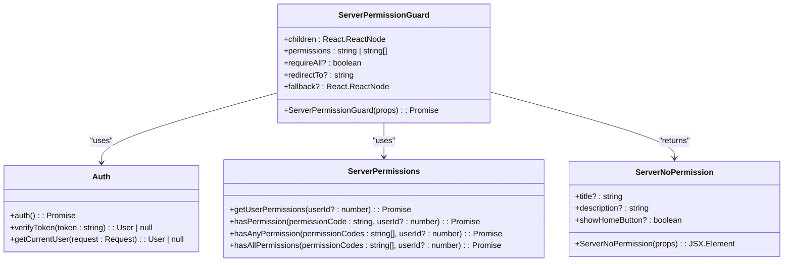
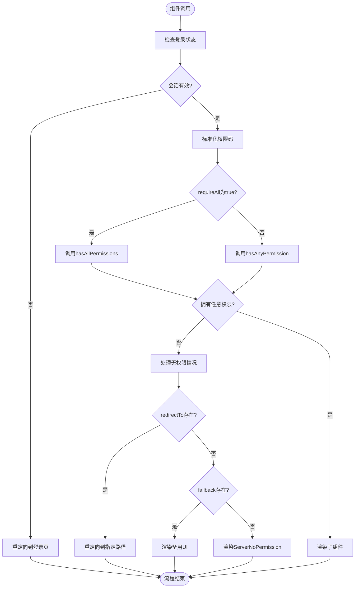
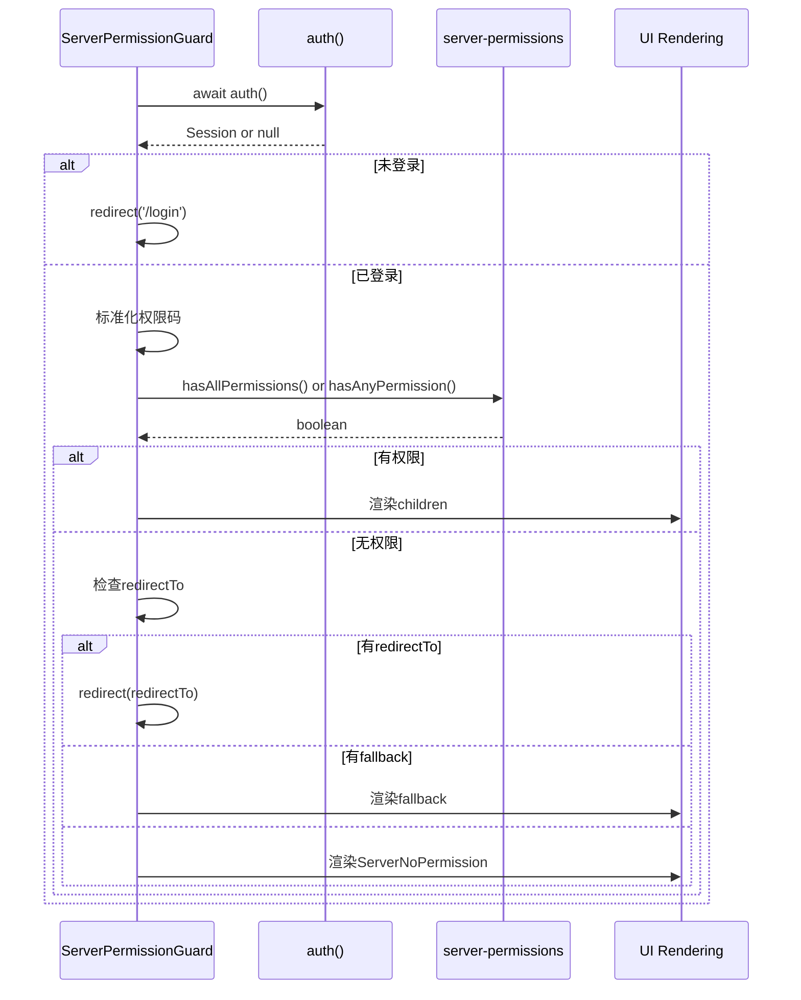

# 服务端组件权限验证

<cite>
**Referenced Files in This Document**  
- [server-permission-guard.tsx](file://src/components/auth/server-permission-guard.tsx)
- [server-permissions.ts](file://src/lib/server-permissions.ts)
- [auth.ts](file://src/lib/auth.ts)
- [server-no-permission.tsx](file://src/components/ui/server-no-permission.tsx)
- [permissions.ts](file://src/lib/permissions.ts)
- [permission-guard.tsx](file://src/components/auth/permission-guard.tsx)
- [permissions.md](file://src/docs/permissions.md)
</cite>

## 目录
1. [引言](#引言)
2. [核心组件分析](#核心组件分析)
3. [权限验证流程](#权限验证流程)
4. [属性定义与使用](#属性定义与使用)
5. [实际使用示例](#实际使用示例)
6. [服务端与客户端权限验证对比](#服务端与客户端权限验证对比)
7. [常见错误与解决方案](#常见错误与解决方案)
8. [结论](#结论)

## 引言

在v0-game_admin服务端，权限验证是确保系统安全的关键环节。本文档深入解析ServerPermissionGuard组件的实现机制，详细说明其作为服务端组件如何在渲染前执行权限校验。通过本文档，开发者将全面了解服务端权限验证的工作原理、使用方法以及最佳实践。

**Section sources**
- [permissions.md](file://src/docs/permissions.md#L1-L182)

## 核心组件分析

ServerPermissionGuard组件是v0-game_admin服务端权限验证的核心实现。该组件在服务端执行，确保在页面渲染前完成权限校验，从根本上防止未授权访问。

组件通过导入auth函数获取用户会话信息，利用hasAllPermissions和hasAnyPermission函数进行权限检查，并在权限不足时返回ServerNoPermission组件。这种设计确保了权限验证的可靠性和安全性。



**Diagram sources**
- [server-permission-guard.tsx](file://src/components/auth/server-permission-guard.tsx#L1-L89)
- [server-permissions.ts](file://src/lib/server-permissions.ts#L1-L116)
- [auth.ts](file://src/lib/auth.ts#L1-L78)
- [server-no-permission.tsx](file://src/components/ui/server-no-permission.tsx#L1-L63)

**Section sources**
- [server-permission-guard.tsx](file://src/components/auth/server-permission-guard.tsx#L1-L89)
- [server-permissions.ts](file://src/lib/server-permissions.ts#L1-L116)

## 权限验证流程

ServerPermissionGuard组件的权限验证流程是一个严谨的安全检查过程，确保只有授权用户才能访问受保护的资源。



**Diagram sources**
- [server-permission-guard.tsx](file://src/components/auth/server-permission-guard.tsx#L14-L63)

**Section sources**
- [server-permission-guard.tsx](file://src/components/auth/server-permission-guard.tsx#L14-L63)

## 权限验证流程

ServerPermissionGuard组件的权限验证流程是一个严谨的安全检查过程，确保只有授权用户才能访问受保护的资源。


**Diagram sources**
- [server-permission-guard.tsx](file://src/components/auth/server-permission-guard.tsx#L14-L63)

**Section sources**
- [server-permission-guard.tsx](file://src/components/auth/server-permission-guard.tsx#L14-L63)

## 属性定义与使用

ServerPermissionGuard组件提供了灵活的属性配置，满足不同场景下的权限验证需求。

### 核心属性

| 属性 | 类型 | 默认值 | 描述 |
|------|------|--------|------|
| permissions | string \| string[] | - | 需要验证的权限码或权限码数组 |
| requireAll | boolean | false | 是否要求用户拥有所有指定权限 |
| redirectTo | string | - | 权限不足时的重定向路径 |
| fallback | React.ReactNode | - | 权限不足时的备用UI组件 |
| children | React.ReactNode | - | 受保护的子组件 |

**Section sources**
- [server-permission-guard.tsx](file://src/components/auth/server-permission-guard.tsx#L7-L12)

### 权限检查逻辑

组件内部通过以下逻辑进行权限检查：

1. **获取用户会话**：调用auth()函数获取当前用户会话
2. **权限码标准化**：将单个权限码或权限码数组统一处理为数组格式
3. **权限检查**：根据requireAll参数决定调用hasAllPermissions或hasAnyPermission函数
4. **结果处理**：根据权限检查结果决定后续操作



**Diagram sources**
- [server-permission-guard.tsx](file://src/components/auth/server-permission-guard.tsx#L14-L63)
- [server-permissions.ts](file://src/lib/server-permissions.ts#L87-L114)

**Section sources**
- [server-permission-guard.tsx](file://src/components/auth/server-permission-guard.tsx#L14-L63)

## 实际使用示例

以下是ServerPermissionGuard组件在实际页面中的使用示例，展示如何保护用户管理、角色管理等敏感页面。

### 保护用户管理页面

```tsx
import { ServerPermissionGuard } from '@/components/auth/server-permission-guard';
import { PERMISSIONS } from '@/lib/permissions';

export default async function UserManagementPage() {
  return (
    <ServerPermissionGuard permissions={PERMISSIONS.USER.READ}>
      <div>用户管理页面内容</div>
    </ServerPermissionGuard>
  );
}
```

### 保护角色管理页面

```tsx
import { ServerPermissionGuard } from '@/components/auth/server-permission-guard';
import { PERMISSIONS } from '@/lib/permissions';

export default async function RoleManagementPage() {
  return (
    <ServerPermissionGuard 
      permissions={[PERMISSIONS.ROLE.READ, PERMISSIONS.ROLE.UPDATE]}
      requireAll={true}
      redirectTo="/dashboard/overview"
    >
      <div>角色管理页面内容</div>
    </ServerPermissionGuard>
  );
}
```

### 自定义无权限界面

```tsx
import { ServerPermissionGuard } from '@/components/auth/server-permission-guard';
import { PERMISSIONS } from '@/lib/permissions';

export default async function SensitivePage() {
  const customFallback = (
    <div className="flex items-center justify-center min-h-screen">
      <div className="text-center">
        <h2 className="text-2xl font-bold">此功能暂未开放</h2>
        <p className="mt-2">请联系管理员获取访问权限</p>
      </div>
    </div>
  );

  return (
    <ServerPermissionGuard 
      permissions={PERMISSIONS.PERMISSION.DELETE}
      fallback={customFallback}
    >
      <div>敏感功能页面</div>
    </ServerPermissionGuard>
  );
}
```

**Section sources**
- [permissions.md](file://src/docs/permissions.md#L82-L97)

## 服务端与客户端权限验证对比

ServerPermissionGuard与PermissionGuard在使用场景和安全特性上有显著差异。

### 主要差异

| 特性 | ServerPermissionGuard | PermissionGuard |
|------|----------------------|----------------|
| 执行环境 | 服务端 | 客户端 |
| 安全性 | 高（无法绕过） | 中（可被绕过） |
| 使用场景 | 页面级保护 | 组件级保护 |
| 加载体验 | 需要等待服务端响应 | 即时响应 |
| 适用组件 | 服务端组件 | 客户端组件 |

### 安全优势分析

服务端验证具有以下安全优势：

1. **无法绕过**：验证逻辑在服务端执行，前端无法修改或绕过
2. **数据安全**：敏感数据在服务端就被过滤，不会发送到客户端
3. **一致性**：所有请求都经过统一的权限检查，避免客户端实现差异
4. **防篡改**：不受客户端环境影响，防止恶意修改

```mermaid
graph TD
A[客户端请求] --> B{服务端验证}
B --> |通过| C[返回完整页面]
B --> |拒绝| D[返回错误页面]
E[客户端代码] --> F{客户端验证}
F --> |通过| G[显示内容]
F --> |拒绝| H[隐藏内容]
style B fill:#4CAF50,stroke:#388E3C
style F fill:#FFC107,stroke:#FFA000
note right of B: 验证在服务端执行<br>无法被客户端绕过
note right of F: 验证在客户端执行<br>可被开发者工具绕过
```

**Diagram sources**
- [server-permission-guard.tsx](file://src/components/auth/server-permission-guard.tsx#L1-L89)
- [permission-guard.tsx](file://src/components/auth/permission-guard.tsx#L1-L95)

**Section sources**
- [server-permission-guard.tsx](file://src/components/auth/server-permission-guard.tsx#L1-L89)
- [permission-guard.tsx](file://src/components/auth/permission-guard.tsx#L1-L95)

## 常见错误与解决方案

在使用ServerPermissionGuard组件时，开发者可能会遇到一些常见错误。

### 常见错误

1. **在客户端组件中使用**：ServerPermissionGuard只能在服务端组件中使用
2. **权限码拼写错误**：权限码与系统定义不一致
3. **缺少异步声明**：未将页面函数声明为async
4. **权限码格式错误**：未正确使用PERMISSIONS常量

### 解决方案

```tsx
// 错误示例：在客户端组件中使用
'use client';
import { ServerPermissionGuard } from '@/components/auth/server-permission-guard';

function ClientComponent() {
  // ❌ 错误：ServerPermissionGuard不能在客户端组件中使用
  return (
    <ServerPermissionGuard permissions="system.user.read">
      <div>内容</div>
    </ServerPermissionGuard>
  );
}

// 正确示例：在服务端组件中使用
export default async function ServerComponent() {
  // ✅ 正确：在服务端组件中使用，且函数声明为async
  return (
    <ServerPermissionGuard permissions={PERMISSIONS.USER.READ}>
      <div>内容</div>
    </ServerPermissionGuard>
  );
}
```

**Section sources**
- [server-permission-guard.tsx](file://src/components/auth/server-permission-guard.tsx#L1-L89)
- [permissions.md](file://src/docs/permissions.md#L1-L182)

## 结论

ServerPermissionGuard组件为v0-game_admin提供了可靠的服务端权限验证机制。通过在渲染前执行权限检查，确保了系统的安全性。开发者应根据具体需求选择合适的属性配置，并遵循最佳实践，避免常见错误。服务端验证与客户端验证相结合，构建了多层次的安全防护体系，有效保护了系统的敏感资源。