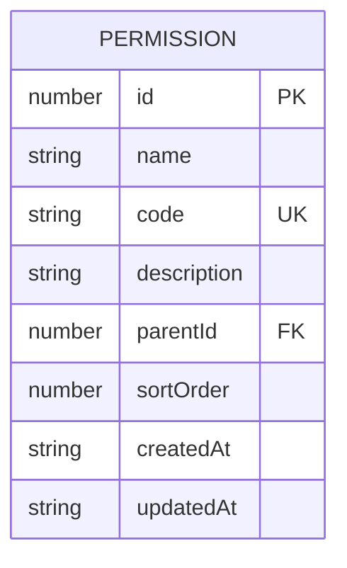
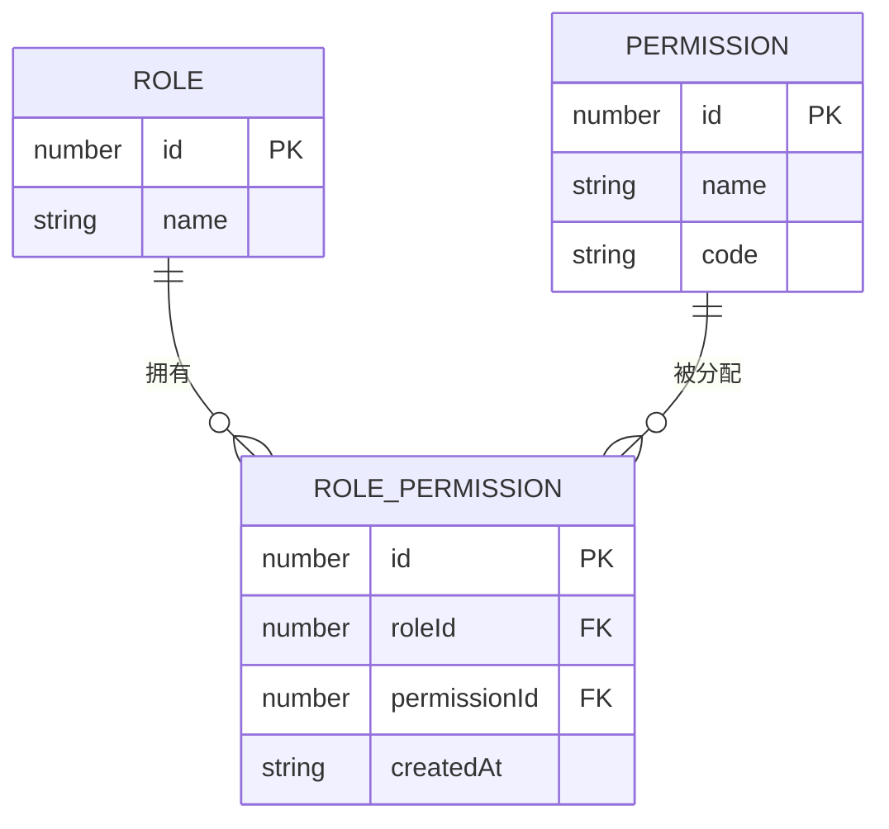
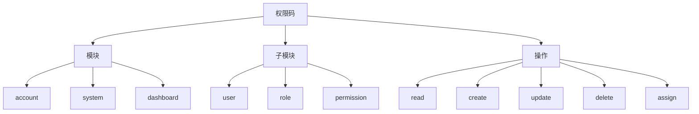
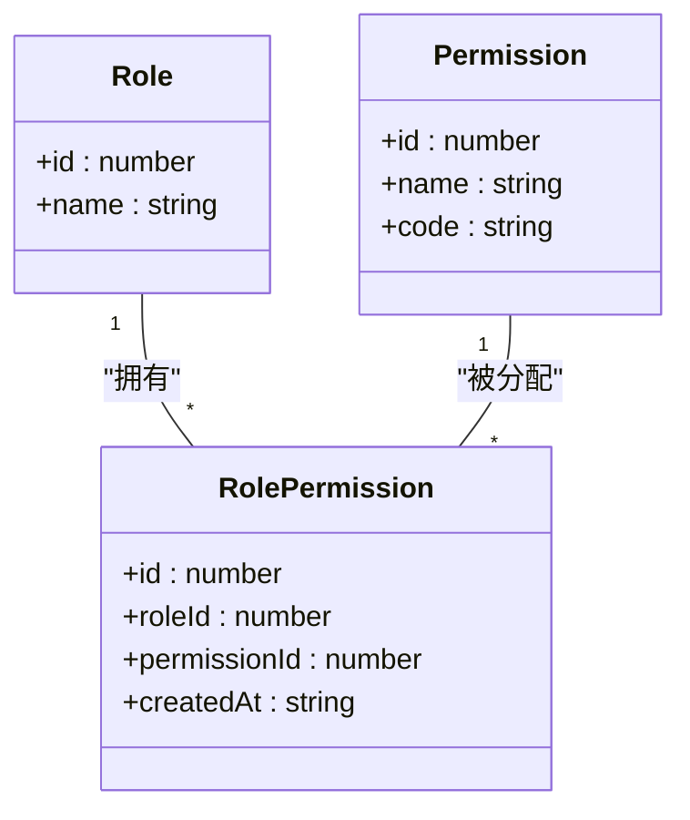
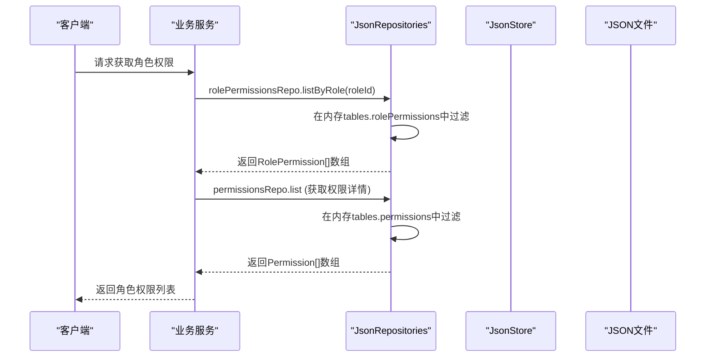

# 权限数据模型

<cite>
**本文档引用的文件**  
- [permissions.json](file://data/permissions.json)
- [rolePermissions.json](file://data/rolePermissions.json)
- [models.ts](file://src/repository/models.ts)
- [jsonRepos.ts](file://src/repository/impl/jsonRepos.ts)
- [jsonStore.ts](file://src/repository/store/jsonStore.ts)
- [permissions.ts](file://src/lib/permissions.ts)
- [init-admin.ts](file://scripts/init-admin.ts)
</cite>

## 目录
1. [介绍](#介绍)
2. [核心数据模型定义](#核心数据模型定义)
3. [权限数据组织与层级结构](#权限数据组织与层级结构)
4. [角色权限关联机制](#角色权限关联机制)
5. [基于JSON的仓储层实现](#基于json的仓储层实现)
6. [权限常量与类型安全](#权限常量与类型安全)
7. [权限系统最佳实践](#权限系统最佳实践)

## 介绍
本项目采用基于JSON文件存储的轻量级权限管理系统，通过`permissions.json`和`rolePermissions.json`两个核心数据文件，实现了灵活的权限控制机制。系统定义了权限（Permission）和角色权限关联（RolePermission）两个核心数据模型，支持权限的树形层级管理与角色的多对多权限分配。权限数据通过`repository`层进行统一访问，结合`lib/permissions.ts`中的预定义常量，确保了权限码的类型安全和一致性。该设计适用于开发环境和小数据量场景，具备良好的可维护性和扩展性。

## 核心数据模型定义

### 权限模型 (Permission)
权限模型定义了系统中可被控制的最小操作单元，其结构在`src/repository/models.ts`中通过TypeScript接口`Permission`进行声明。

**字段说明：**
- `id`: 唯一标识符，类型为`number`，由系统自增生成。
- `name`: 权限的中文名称，类型为`string`，用于在UI中展示。
- `code`: 权限码，类型为`string`，是权限的唯一标识，遵循特定的命名规范。
- `description`: 权限描述，类型为`string | null`，可选字段，用于解释权限的具体用途。
- `parentId`: 父权限ID，类型为`number | null`，用于构建权限的树形层级结构。`null`表示该权限为根节点。
- `sortOrder`: 排序序号，类型为`number`，用于在UI中对权限进行排序。
- `createdAt` 和 `updatedAt`: 时间戳，类型为`string`（ISO格式），记录权限的创建和更新时间。



**Diagram sources**
- [models.ts](file://src/repository/models.ts#L29-L37)

**Section sources**
- [models.ts](file://src/repository/models.ts#L29-L37)
- [permissions.json](file://data/permissions.json#L1-L12)

### 角色权限关联模型 (RolePermission)
该模型是角色（Role）与权限（Permission）之间的多对多关联表，用于建立角色与具体权限的绑定关系。

**字段说明：**
- `id`: 唯一标识符，类型为`number`，由系统自增生成。
- `roleId`: 角色ID，类型为`number`，外键，指向`roles.json`中的角色。
- `permissionId`: 权限ID，类型为`number`，外键，指向`permissions.json`中的权限。
- `createdAt`: 关联创建时间，类型为`string`（ISO格式）。



**Diagram sources**
- [models.ts](file://src/repository/models.ts#L40-L44)

**Section sources**
- [models.ts](file://src/repository/models.ts#L40-L44)
- [rolePermissions.json](file://data/rolePermissions.json#L1-L8)

## 权限数据组织与层级结构

### permissions.json 文件结构
`data/permissions.json`文件是一个包含权限对象数组的JSON文件。每个权限对象都包含上述`Permission`模型定义的所有字段。文件中的权限数据通过`parentId`字段形成树形层级结构。

例如，一个典型的权限数据可能如下：
```json
[
  {
    "id": 1,
    "name": "查看仪表盘",
    "code": "dashboard:view",
    "description": "访问仪表盘",
    "parentId": null,
    "sortOrder": 0,
    "createdAt": "2024-01-01T00:00:00.000Z",
    "updatedAt": "2024-01-01T00:00:00.000Z"
  },
  {
    "id": 2,
    "name": "用户管理",
    "code": "account.user",
    "description": "管理用户信息",
    "parentId": null,
    "sortOrder": 1,
    "createdAt": "2024-01-01T00:00:00.000Z",
    "updatedAt": "2024-01-01T00:00:00.000Z"
  },
  {
    "id": 3,
    "name": "查看用户",
    "code": "account.user.read",
    "description": "查看用户列表和详情",
    "parentId": 2,
    "sortOrder": 0,
    "createdAt": "2024-01-01T00:00:00.000Z",
    "updatedAt": "2024-01-01T00:00:00.000Z"
  }
]
```
在此结构中，"用户管理"（id=2）是"查看用户"（id=3）的父权限。

### 权限码 (code) 命名规范
权限码采用点分命名法（dot notation），形成清晰的树形层级关系。其命名规范如下：
- **格式**：`模块.子模块.操作`，例如`system.user.read`。
- **模块**：表示功能大类，如`account`（账户）、`system`（系统）、`dashboard`（仪表盘）。
- **子模块**：表示模块下的具体功能，如`user`（用户）、`role`（角色）、`permission`（权限）。
- **操作**：表示具体的权限动作，如`read`（读取）、`create`（创建）、`update`（更新）、`delete`（删除）、`assign`（分配）。

这种命名方式使得权限码具有自描述性，并且能够通过字符串前缀来判断层级关系。例如，`account.user.read`和`account.user.create`都属于`account.user`这个父权限。



**Diagram sources**
- [permissions.json](file://data/permissions.json#L1-L12)
- [permissions.ts](file://src/lib/permissions.ts#L3-L32)

**Section sources**
- [permissions.json](file://data/permissions.json#L1-L12)
- [permissions.ts](file://src/lib/permissions.ts#L3-L32)

## 角色权限关联机制

### rolePermissions.json 文件结构
`data/rolePermissions.json`文件是一个包含角色权限关联对象数组的JSON文件。每个对象记录了一个角色与一个权限的绑定关系。

例如：
```json
[
  {
    "id": 1,
    "roleId": 1,
    "permissionId": 1,
    "createdAt": "2024-01-01T00:00:00.000Z"
  },
  {
    "id": 2,
    "roleId": 1,
    "permissionId": 3,
    "createdAt": "2024-01-01T00:00:00.000Z"
  }
]
```
此数据表示ID为1的角色（如超级管理员）同时拥有ID为1和3的权限。

### 多对多关联实现
该机制通过`rolePermissions.json`文件实现了角色与权限的多对多关联：
- **一个角色可以拥有多个权限**：通过在`rolePermissions.json`中为同一个`roleId`添加多条记录来实现。
- **一个权限可以被多个角色拥有**：通过在`rolePermissions.json`中为同一个`permissionId`添加多条记录来实现。

这种设计解耦了角色和权限的直接依赖，使得权限的分配和回收变得非常灵活。



**Diagram sources**
- [rolePermissions.json](file://data/rolePermissions.json#L1-L8)
- [models.ts](file://src/repository/models.ts#L40-L44)

**Section sources**
- [rolePermissions.json](file://data/rolePermissions.json#L1-L8)
- [jsonRepos.ts](file://src/repository/impl/jsonRepos.ts#L394-L413)

## 基于JSON的仓储层实现

### 数据访问层架构
系统的数据访问层位于`src/repository`目录，采用仓储（Repository）模式，将数据访问逻辑与业务逻辑分离。核心实现位于`impl/jsonRepos.ts`，它基于`store/jsonStore.ts`提供的文件读写能力。

### JSON存储与访问
- **数据存储**：`JsonStore`类负责与`data`目录下的JSON文件进行交互。它使用`fs`模块进行文件的原子写入（通过写入临时文件后重命名），确保数据的完整性。
- **数据加载**：`JsonRepositories`类在初始化时（`init`方法）会从所有JSON文件中读取数据，并加载到内存中的`tables`对象里。
- **数据查询**：所有的查询操作（如`listPermissions`）都是在内存中的`tables.permissions`数组上进行过滤、排序和分页，性能高效。
- **数据持久化**：任何数据变更（如`createPermission`、`addRolePermission`）都会先修改内存中的数据，然后调用`flush`方法将整个`tables`对象全量写回对应的JSON文件。

### 核心数据访问操作
- **权限查询**：`permissionsRepo.list`方法支持根据名称、权限码等条件进行筛选和分页。
- **角色权限关联查询**：`rolePermissionsRepo.listByRole(roleId)`方法用于查询指定角色拥有的所有权限ID，这是权限校验的基础。



**Diagram sources**
- [jsonStore.ts](file://src/repository/store/jsonStore.ts#L1-L49)
- [jsonRepos.ts](file://src/repository/impl/jsonRepos.ts#L1-L800)

**Section sources**
- [jsonStore.ts](file://src/repository/store/jsonStore.ts#L1-L49)
- [jsonRepos.ts](file://src/repository/impl/jsonRepos.ts#L1-L800)

## 权限常量与类型安全

### lib/permissions.ts 中的预定义常量
`src/lib/permissions.ts`文件通过`PERMISSIONS`常量对象，为系统中所有权限码提供了类型安全的引用。

```typescript
export const PERMISSIONS = {
  USER: {
    READ: 'account.user.read',
    CREATE: 'account.user.create',
    UPDATE: 'account.user.update',
    DELETE: 'account.user.delete'
  },
  ROLE: {
    READ: 'account.role.read',
    CREATE: 'account.role.create',
    // ... 其他权限
  }
} as const;
```

### 类型安全优势
1. **避免拼写错误**：开发者无需手动输入权限码字符串，直接使用`PERMISSIONS.USER.READ`即可，编译器能捕获任何拼写错误。
2. **代码提示**：IDE能提供完整的权限码自动补全，极大提升开发效率。
3. **集中管理**：所有权限码集中在一个文件中定义，便于维护和审计。
4. **类型推断**：`as const`断言确保了`PERMISSIONS`对象的类型是完全不可变的，其属性值的类型就是字面量字符串类型，而非`string`。

### 在权限校验中的应用
在UI组件中，`PERMISSIONS`常量被直接用于权限校验组件，如`PermissionGuard`：
```tsx
<PermissionGuard permissions={PERMISSIONS.USER.READ}>
  <UserManagementPage />
</PermissionGuard>
```
这确保了权限校验的准确性，是整个权限系统可靠性的基石。

**Section sources**
- [permissions.ts](file://src/lib/permissions.ts#L1-L39)
- [docs/permissions.md](file://src/docs/permissions.md#L34-L48)

## 权限系统最佳实践

### 权限数据初始化
- **脚本初始化**：使用`scripts/init-admin.ts`脚本可以初始化管理员角色和权限。该脚本通过`ensureRolePermissions`函数确保指定角色拥有指定的权限集合，避免重复添加。
- **数据文件维护**：`permissions.json`应作为权限的“源数据”，在系统初始化或升级时，确保其包含所有必需的权限定义。

### 权限维护
- **新增权限**：在`permissions.json`中添加新权限时，必须为其分配唯一的`id`和符合规范的`code`，并正确设置`parentId`以维护树形结构。
- **删除权限**：删除权限时，需同时清理`rolePermissions.json`中所有引用该权限的记录，以保持数据一致性。`jsonRepos.ts`中的`deletePermission`方法已自动处理此逻辑。

### 权限扩展
- **新增模块**：为新功能模块添加权限时，应在`lib/permissions.ts`中扩展`PERMISSIONS`常量，遵循`模块.子模块.操作`的命名规范。
- **权限粒度**：权限的粒度应根据业务需求合理设计，避免过于粗放或过于细碎。例如，`account.user`可以作为父权限，而`account.user.read`、`account.user.create`等作为子权限。

### 开发与使用
- **前端**：在需要权限控制的页面或组件中，使用`PermissionGuard`或`ServerPermissionGuard`组件进行包裹。
- **后端API**：API路由应实现相应的权限校验逻辑，确保接口的安全性。
- **测试**：对权限变更进行充分测试，特别是角色权限分配和回收的场景。

**Section sources**
- [init-admin.ts](file://scripts/init-admin.ts#L99-L111)
- [permissions.ts](file://src/lib/permissions.ts#L1-L39)
- [jsonRepos.ts](file://src/repository/impl/jsonRepos.ts#L380-L392)