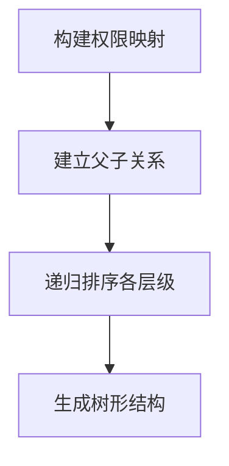
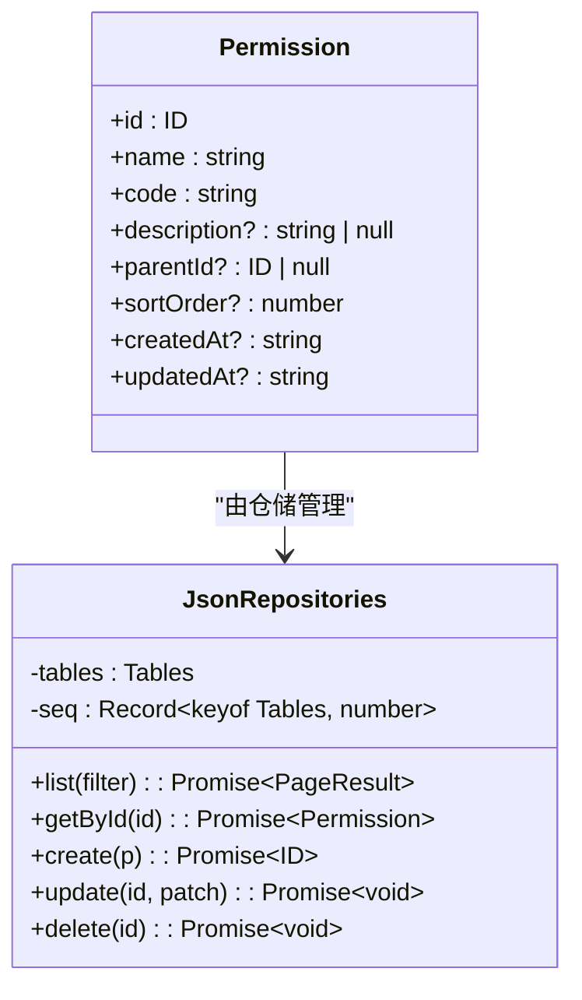
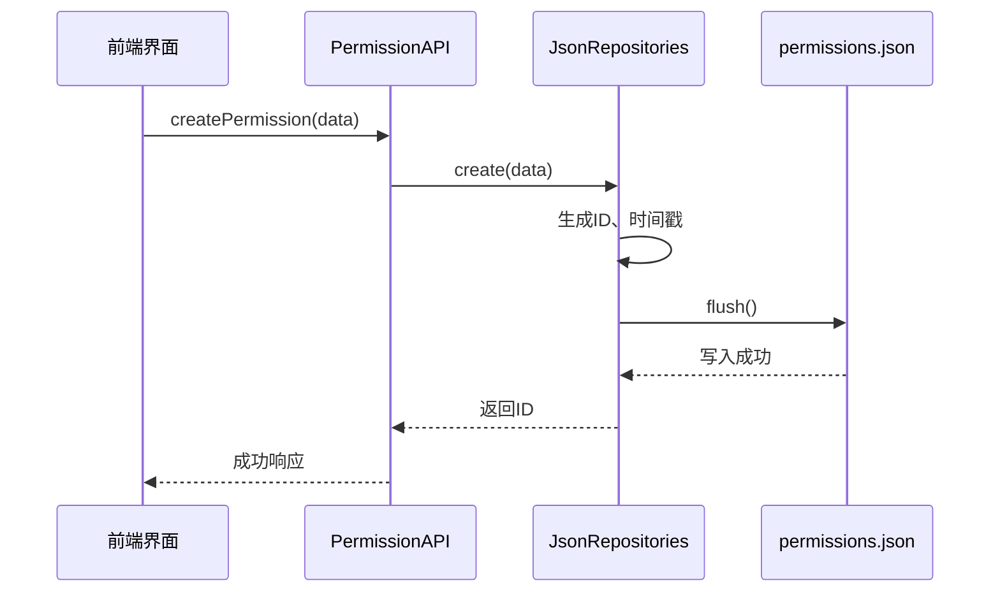

# 权限数据结构

<cite>
**本文档引用的文件**  
- [permissions.json](file://data/permissions.json)
- [models.ts](file://src/repository/models.ts)
- [jsonRepos.ts](file://src/repository/impl/jsonRepos.ts)
- [permission-tree.tsx](file://src/components/shared/permission-tree.tsx)
- [permission.ts](file://src/service/api/permission.ts)
</cite>

## 目录
1. [权限模型字段定义](#权限模型字段定义)
2. [权限数据组织方式](#权限数据组织方式)
3. [树形层级结构与排序机制](#树形层级结构与排序机制)
4. [数据模型与JSON存储一致性](#数据模型与json存储一致性)
5. [权限节点增删改查的数据完整性维护](#权限节点增删改查的数据完整性维护)

## 权限模型字段定义

权限模型（Permission）定义了系统中权限的基本属性，其字段包括：

- **id**: 权限的唯一标识符，类型为数字（number），在系统中全局唯一。
- **name**: 权限的名称，类型为字符串（string），用于展示给用户。
- **code**: 权限的标识码，类型为字符串（string），用于程序中的权限校验，通常采用点分命名法（如 `account.user.read`）。
- **description**: 权限的描述信息，类型为可选字符串（string | null），用于说明该权限的具体用途。
- **parentId**: 父权限的ID，类型为可选数字（ID | null），用于构建权限的树形结构，若为根节点则值为 null。
- **sortOrder**: 排序序号，类型为可选数字（number），用于在同一层级内对权限进行排序。
- **createdAt**: 创建时间，类型为可选字符串（string），ISO格式的时间戳。
- **updatedAt**: 更新时间，类型为可选字符串（string），ISO格式的时间戳。

这些字段在 `src/repository/models.ts` 中通过 TypeScript 接口 `Permission` 定义，并与 JSON 存储格式保持一致。

**Section sources**
- [models.ts](file://src/repository/models.ts#L28-L37)

## 权限数据组织方式

权限数据存储在 `data/permissions.json` 文件中，以 JSON 数组的形式保存所有权限记录。每个权限对象包含上述字段，通过 `id` 和 `parentId` 建立父子关系，形成树状结构。

例如，一个典型的权限条目如下：
```json
{
  "id": 1,
  "name": "查看仪表盘",
  "code": "dashboard:view",
  "description": "访问仪表盘",
  "parentId": null,
  "sortOrder": 0,
  "createdAt": "2024-01-01T00:00:00.000Z",
  "updatedAt": "2024-01-01T00:00:00.000Z"
}
```

该文件作为系统的静态数据源，由 `JsonRepositories` 类在启动时加载到内存中，并支持运行时的增删改查操作。

**Section sources**
- [permissions.json](file://data/permissions.json#L1-L12)
- [jsonRepos.ts](file://src/repository/impl/jsonRepos.ts#L105-L108)

## 树形层级结构与排序机制

权限系统采用树形结构来组织权限，通过 `parentId` 字段实现层级关系。当某个权限的 `parentId` 指向另一个权限的 `id` 时，前者即为后者的子权限。

前端组件 `PermissionTree`（位于 `src/components/shared/permission-tree.tsx`）负责将扁平的权限列表转换为树形结构。其构建逻辑如下：

1. 遍历所有权限，创建一个以 `id` 为键的映射表，并初始化每个权限的 `children` 数组。
2. 再次遍历权限列表，若某权限的 `parentId` 存在且对应父权限存在，则将其加入父权限的 `children` 数组。
3. 使用 `sortOrder` 对每一层级的权限进行排序，确保显示顺序符合预期。

排序机制通过递归函数 `sortPerms` 实现，优先按 `sortOrder` 升序排列，若未设置则默认为 0。



**Diagram sources**
- [permission-tree.tsx](file://src/components/shared/permission-tree.tsx#L287-L322)

**Section sources**
- [permission-tree.tsx](file://src/components/shared/permission-tree.tsx#L287-L322)

## 数据模型与JSON存储一致性

权限数据模型在 `src/repository/models.ts` 中定义，与 `data/permissions.json` 的结构完全一致，确保了内存对象与持久化存储之间的无缝映射。

`JsonRepositories` 类提供了对权限数据的 CRUD 操作，并在每次修改后调用 `flush()` 方法将整个数据集写回 JSON 文件，保证数据一致性。此外，所有时间字段均使用 ISO 格式字符串，便于跨平台解析和存储。

该设计支持未来向数据库迁移，只需替换 `PermissionsRepository` 的实现即可，无需改动上层业务逻辑。



**Diagram sources**
- [models.ts](file://src/repository/models.ts#L28-L37)
- [jsonRepos.ts](file://src/repository/impl/jsonRepos.ts#L320-L392)

**Section sources**
- [models.ts](file://src/repository/models.ts#L28-L37)
- [jsonRepos.ts](file://src/repository/impl/jsonRepos.ts#L320-L392)

## 权限节点增删改查的数据完整性维护

在进行权限节点的增删改查操作时，系统通过以下策略维护数据完整性：

### 创建权限
- 调用 `createPermission` 方法时，自动生成唯一 `id`，并设置默认 `sortOrder` 为 0。
- 自动填充 `createdAt` 和 `updatedAt` 为当前时间。
- 若指定 `parentId`，需验证父权限是否存在，防止悬空引用。

### 更新权限
- 更新操作通过 `updatePermission` 方法执行，仅允许修改 `name`、`code`、`description`、`parentId` 和 `sortOrder`。
- 更新时自动刷新 `updatedAt` 字段。
- 修改 `parentId` 时需检测是否形成循环引用（即子权限不能成为自身的祖先）。

### 删除权限
- 删除操作通过 `deletePermission` 方法执行，首先从权限列表中移除目标权限。
- 同时清理 `rolePermissions.json` 中关联的权限分配记录，避免角色持有无效权限。
- 支持级联删除子权限，或要求先手动删除所有子节点。

### 循环引用检测
系统虽未显式实现循环引用检测算法，但通过业务逻辑约束（如前端禁止选择自身或后代作为父级）间接避免该问题。建议在创建或更新时增加校验逻辑，遍历祖先链以确认无循环。

### API 支持
后端 API 提供了完整的权限管理接口，定义于 `src/service/api/permission.ts`，包括：
- `getPermissions`: 获取权限列表
- `getPermissionTree`: 获取树形结构
- `createPermission`: 创建权限
- `updatePermission`: 更新权限
- `deletePermission`: 删除权限

这些接口由对应的路由处理函数（如 `src/app/api/permissions/route.ts`）调用仓储层实现，确保事务性和数据一致性。



**Diagram sources**
- [permission.ts](file://src/service/api/permission.ts#L26-L32)
- [jsonRepos.ts](file://src/repository/impl/jsonRepos.ts#L353-L367)
- [route.ts](file://src/app/api/permissions/route.ts#L44-L57)

**Section sources**
- [permission.ts](file://src/service/api/permission.ts#L26-L32)
- [jsonRepos.ts](file://src/repository/impl/jsonRepos.ts#L353-L367)
- [route.ts](file://src/app/api/permissions/route.ts#L44-L57)