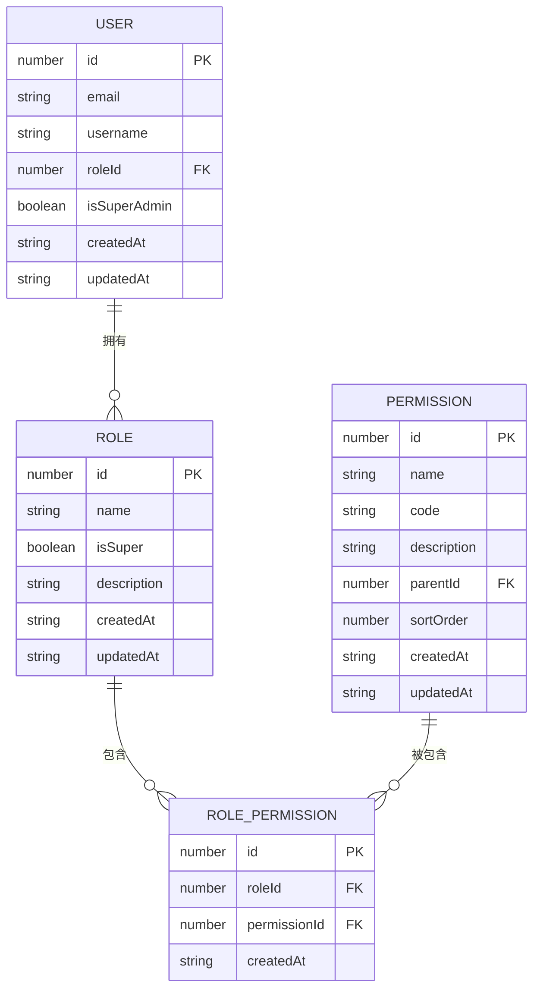
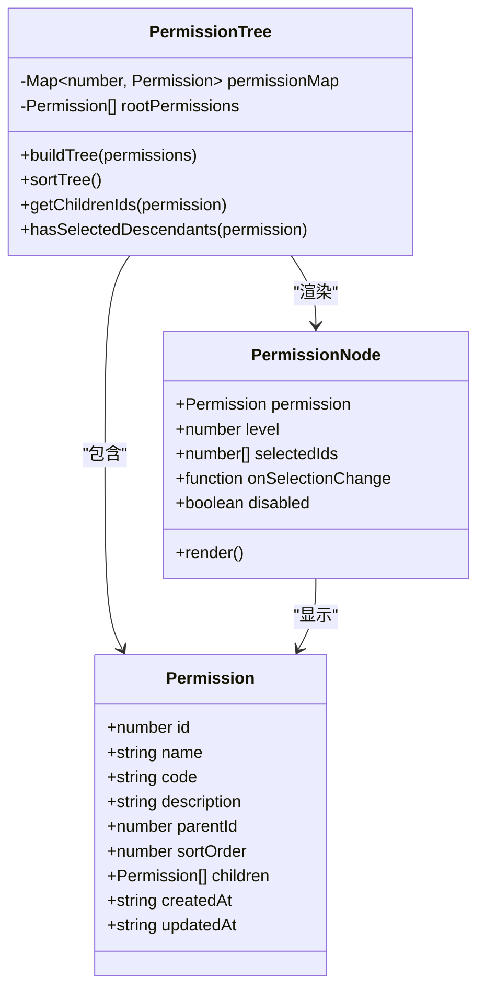
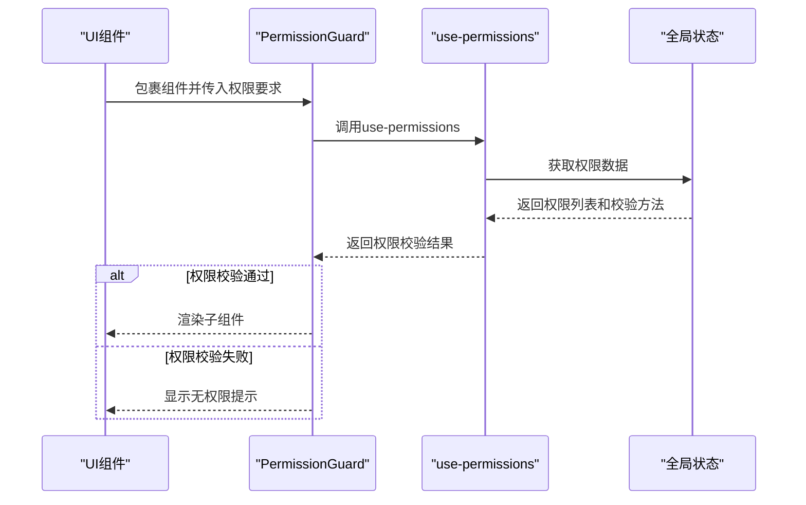
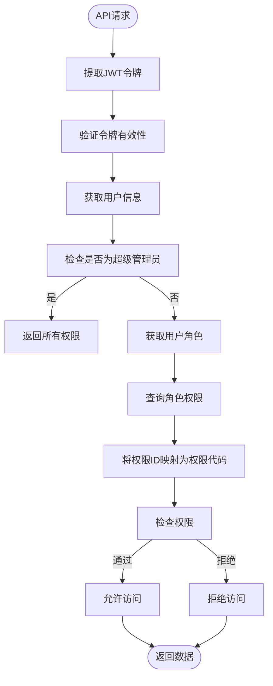
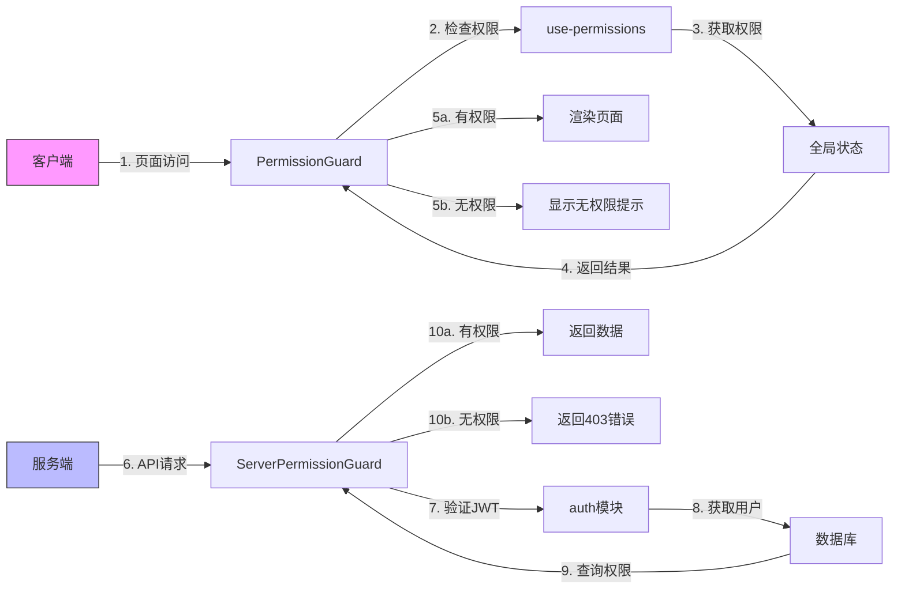

# 权限系统设计

<cite>
**本文档引用文件**  
- [permissions.md](file://src/docs/permissions.md)
- [permission-guard.tsx](file://src/components/auth/permission-guard.tsx)
- [server-permission-guard.tsx](file://src/components/auth/server-permission-guard.tsx)
- [use-permissions.ts](file://src/hooks/use-permissions.ts)
- [server-permissions.ts](file://src/lib/server-permissions.ts)
- [permissions.ts](file://src/lib/permissions.ts)
- [permission-tree.tsx](file://src/components/shared/permission-tree.tsx)
- [rolePermissions.json](file://data/rolePermissions.json)
- [roles.json](file://data/roles.json)
- [permissions.json](file://data/permissions.json)
- [auth.ts](file://src/lib/auth.ts)
- [auth-store.ts](file://src/stores/auth.ts)
</cite>

## 目录
1. [权限系统概述](#权限系统概述)
2. [RBAC模型与数据关系](#rbac模型与数据关系)
3. [权限树形结构构建](#权限树形结构构建)
4. [前端权限控制实现](#前端权限控制实现)
5. [后端权限验证流程](#后端权限验证流程)
6. [权限校验流程图](#权限校验流程图)
7. [权限缓存与性能优化](#权限缓存与性能优化)
8. [权限管理操作指南](#权限管理操作指南)

## 权限系统概述

v0-game_admin项目实现了基于角色的访问控制（RBAC）权限系统，支持前后端双重权限验证机制。系统通过Permission、Role、User三者之间的关联关系实现精细化的权限管理。权限采用树形结构组织，支持父子权限继承关系，确保权限分配的灵活性和可维护性。系统提供了完整的权限管理界面，包括权限、角色和用户的增删改查功能，以及权限分配的可视化操作。

**Section sources**
- [permissions.md](file://src/docs/permissions.md#L1-L61)

## RBAC模型与数据关系

系统采用标准的RBAC（基于角色的访问控制）模型，通过三个核心实体实现权限控制：Permission（权限）、Role（角色）和User（用户）。三者之间的关系通过中间表rolePermissions进行关联，形成多对多的映射关系。

用户与角色之间是一对一的关系，每个用户被分配一个角色；角色与权限之间是多对多的关系，一个角色可以拥有多个权限，一个权限也可以被分配给多个角色。这种设计实现了权限的集中管理和灵活分配，避免了直接为用户分配权限带来的管理复杂性。

**Diagram sources**
- [roles.json](file://data/roles.json)
- [permissions.json](file://data/permissions.json)
- [rolePermissions.json](file://data/rolePermissions.json)

**Section sources**
- [permissions.md](file://src/docs/permissions.md#L1-L61)

## 权限树形结构构建

权限系统采用树形结构组织权限，支持父子权限关系。每个权限节点包含id、name、code、description、parentId和sortOrder等属性。parentId字段用于建立父子关系，null值表示根节点；sortOrder字段用于控制同级节点的显示顺序。

权限树的构建过程分为三个步骤：首先将所有权限加载到内存中并建立id到权限对象的映射；然后遍历所有权限，根据parentId将子权限添加到父权限的children数组中；最后对每个层级的权限列表按sortOrder进行排序，确保显示顺序的一致性。

**Diagram sources**
- [permission-tree.tsx](file://src/components/shared/permission-tree.tsx#L15-L23)
- [permissions.json](file://data/permissions.json)

**Section sources**
- [permissions.md](file://src/docs/permissions.md#L1-L61)
- [permission-tree.tsx](file://src/components/shared/permission-tree.tsx#L287-L350)

## 前端权限控制实现

前端权限控制主要通过permission-guard组件和use-permissions Hook实现。permission-guard是一个高阶组件，用于包裹需要权限保护的UI元素或页面组件。它通过use-permissions Hook获取当前用户的权限状态，并根据配置的权限要求决定是否渲染子组件。

use-permissions Hook从全局状态管理器中获取用户的权限数据，并提供hasPermission、hasAnyPermission和hasAllPermissions等便捷的校验方法。这些方法支持单个权限检查、任意权限检查和所有权限检查三种模式，满足不同的业务场景需求。

**Diagram sources**
- [permission-guard.tsx](file://src/components/auth/permission-guard.tsx#L16-L65)
- [use-permissions.ts](file://src/hooks/use-permissions.ts#L7-L24)
- [auth-store.ts](file://src/stores/auth.ts)

**Section sources**
- [permission-guard.tsx](file://src/components/auth/permission-guard.tsx#L9-L14)
- [use-permissions.ts](file://src/hooks/use-permissions.ts#L7-L24)

## 后端权限验证流程

后端权限验证通过server-permissions.ts模块实现，主要在API路由中进行服务端权限校验。系统提供了hasPermission、hasAnyPermission和hasAllPermissions等异步方法，用于检查用户是否具有指定的权限。这些方法首先从请求的cookie中提取JWT令牌，验证用户身份，然后根据用户ID查询其所属角色和关联的权限列表。

对于超级管理员用户，系统会返回所有权限代码，确保其拥有最高权限。对于普通用户，系统会查询角色权限关联表，获取用户角色所拥有的所有权限代码，然后进行权限匹配检查。这种设计有效防止了越权访问，确保了系统的安全性。

**Diagram sources**
- [server-permissions.ts](file://src/lib/server-permissions.ts#L27-L66)
- [auth.ts](file://src/lib/auth.ts#L18-L43)

**Section sources**
- [server-permissions.ts](file://src/lib/server-permissions.ts#L71-L82)
- [server-permissions.ts](file://src/lib/server-permissions.ts#L87-L98)

## 权限校验流程图

权限校验流程涵盖客户端提示与服务端拦截的双重保障机制。客户端通过permission-guard组件进行初步权限检查，提供即时的用户体验反馈；服务端通过server-permissions模块进行最终权限验证，确保系统的安全性。这种双重校验机制既保证了用户体验，又确保了系统的安全可靠。

**Diagram sources**
- [permission-guard.tsx](file://src/components/auth/permission-guard.tsx#L16-L65)
- [server-permission-guard.tsx](file://src/components/auth/server-permission-guard.tsx#L14-L63)

**Section sources**
- [permission-guard.tsx](file://src/components/auth/permission-guard.tsx#L44-L63)
- [server-permission-guard.tsx](file://src/components/auth/server-permission-guard.tsx#L46-L59)

## 权限缓存与性能优化

为了提高权限系统的性能，系统采用了多种缓存和优化策略。首先，在服务端对用户权限进行缓存，避免每次权限校验都查询数据库。其次，在客户端使用全局状态管理器存储用户权限，减少重复的API调用。此外，系统还对权限树的构建过程进行了优化，通过一次性的大数据量查询和内存中的树形结构构建，减少了数据库交互次数。

权限数据的加载采用懒加载策略，只有在用户首次访问需要权限校验的页面时才加载权限数据。对于频繁访问的权限数据，系统会设置合理的缓存有效期，平衡数据一致性和性能需求。这些优化措施显著提升了系统的响应速度和用户体验。

**Section sources**
- [server-permissions.ts](file://src/lib/server-permissions.ts#L47-L48)
- [auth-store.ts](file://src/stores/auth.ts#L196-L201)

## 权限管理操作指南

### 定义新权限
通过权限管理界面，管理员可以创建新的权限节点。需要填写权限名称、权限代码、描述和排序序号等信息。权限代码采用点分命名法，如"account.user.read"，便于组织和管理。创建后，新权限会自动出现在权限树中，可供角色分配。

### 分配角色权限
在角色管理界面，管理员可以为角色分配权限。系统提供权限树形选择器，支持批量选择和取消选择。选择父权限时，会自动选中所有子权限；取消父权限时，会自动取消所有子权限。权限分配操作会记录详细的审计日志，便于追踪和审查。

### 在API接口中添加权限守卫
在API路由中，通过引入server-permission-guard组件，可以轻松添加权限守卫。只需指定所需的权限代码和校验模式（requireAll），系统会自动完成权限验证。对于需要特殊处理的场景，也可以直接调用server-permissions模块提供的校验方法。

**Section sources**
- [permissions.md](file://src/docs/permissions.md#L1-L61)
- [server-permission-guard.tsx](file://src/components/auth/server-permission-guard.tsx#L68-L87)
- [permissions.ts](file://src/lib/permissions.ts#L4-L33)