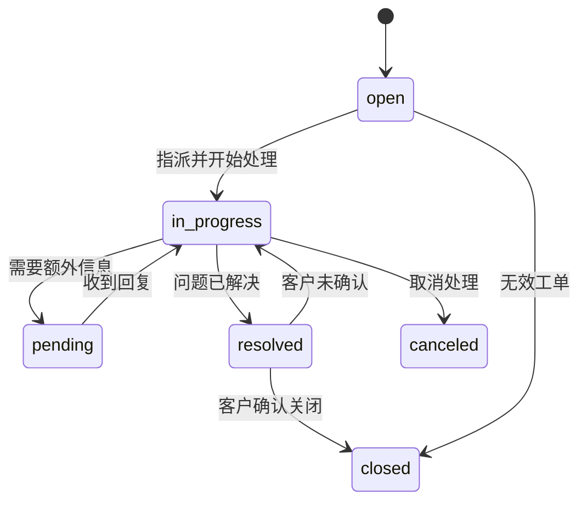
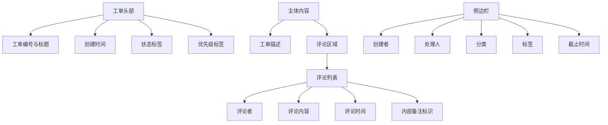
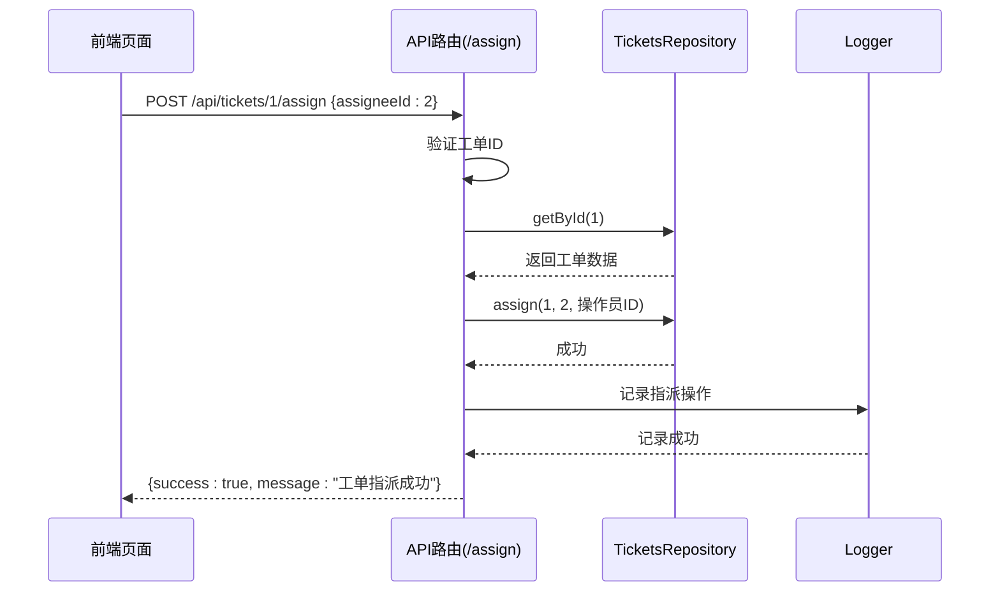
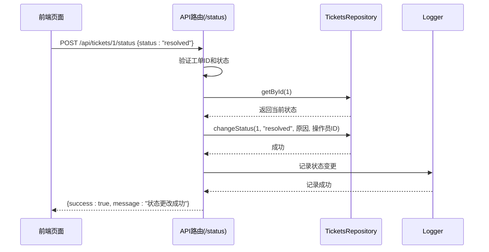
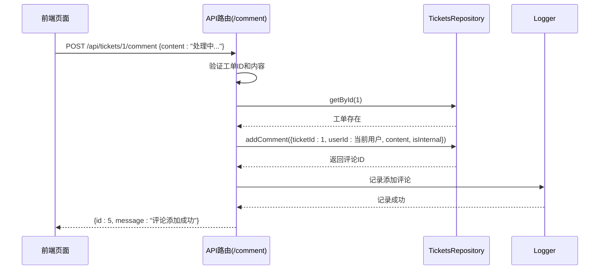
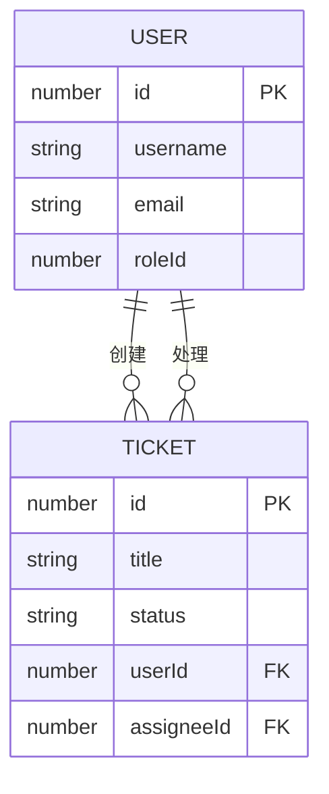

# 工单系统模块

<cite>
**本文档引用文件**  
- [ticket.ts](file://src/service/api/ticket.ts)
- [route.ts](file://src/app/api/tickets/[id]/status/route.ts)
- [route.ts](file://src/app/api/tickets/[id]/assign/route.ts)
- [route.ts](file://src/app/api/tickets/[id]/comment/route.ts)
- [route.ts](file://src/app/api/tickets/list/route.ts)
- [models.ts](file://src/repository/models.ts)
- [interfaces.ts](file://src/repository/interfaces.ts)
- [tickets.json](file://data/tickets.json)
- [ticketComments.json](file://data/ticketComments.json)
- [users.json](file://data/users.json)
- [page.tsx](file://src/app/dashboard/tickets/page.tsx)
- [page.tsx](file://src/app/dashboard/tickets/[id]/page.tsx)
- [use-ticket-management.ts](file://src/app/dashboard/tickets/hooks/use-ticket-management.ts)
</cite>

## 目录
1. [引言](#引言)
2. [工单全生命周期管理](#工单全生命周期管理)
3. [工单详情页结构](#工单详情页结构)
4. [后端处理逻辑](#后端处理逻辑)
5. [用户系统集成](#用户系统集成)
6. [工单查询与过滤](#工单查询与过滤)
7. [性能优化建议](#性能优化建议)

## 引言
工单系统是客服支持与问题追踪的核心模块，用于管理用户提交的问题、投诉或请求。本系统支持工单的创建、分配、状态流转、评论交互和操作历史记录，确保问题处理流程的透明化与可追溯性。工单数据持久化于JSON文件中，通过API路由与前端页面实现完整交互。

## 工单全生命周期管理

工单的生命周期涵盖从创建到关闭的全过程，包含多个状态和操作节点。

### 工单创建
工单由用户或客服人员创建，需提供标题、描述、优先级、分类、标签、创建者ID及可选的截止时间。创建后工单状态默认为“open”（待处理）。

### 状态流转
工单支持以下状态流转：
- **open**：待处理
- **in_progress**：处理中
- **pending**：挂起
- **resolved**：已解决
- **closed**：已关闭
- **canceled**：已取消

状态变更通过`/api/tickets/[id]/status`接口实现，系统记录变更前后的状态及操作原因。

### 分配机制
工单可指派给特定处理人（assigneeId），支持重新分配或取消指派（assigneeId为null）。未指派工单可在“待分配”列表中查看。

**工单状态流转图**

**Diagram sources**
- [models.ts](file://src/repository/models.ts#L83-L84)
- [route.ts](file://src/app/api/tickets/[id]/status/route.ts#L32)

**Section sources**
- [ticket.ts](file://src/service/api/ticket.ts#L98-L104)
- [route.ts](file://src/app/api/tickets/[id]/status/route.ts#L1-L53)

## 工单详情页结构

工单详情页展示工单的完整信息，包含基本信息、描述、评论及操作历史。

### 基本信息展示
- 工单编号与标题
- 创建时间（相对时间显示）
- 当前状态（标签形式）
- 优先级（标签形式）
- 分类、标签、截止时间等元数据

### 评论交互
用户和客服可在工单下添加评论，支持内部备注（仅内部可见）与公开评论。评论按时间倒序排列，显示评论者ID、时间及内容。

### 操作历史
系统自动记录工单的关键操作事件，如创建、指派、状态变更、评论添加等，形成操作时间线。

**工单详情页结构示意图**

**Diagram sources**
- [page.tsx](file://src/app/dashboard/tickets/[id]/page.tsx#L83-L145)
- [ticketComments.json](file://data/ticketComments.json)

**Section sources**
- [page.tsx](file://src/app/dashboard/tickets/[id]/page.tsx#L36-L145)

## 后端处理逻辑

工单系统的后端逻辑通过Next.js API路由实现，遵循RESTful设计原则。

### API路由说明
| 路由 | 方法 | 功能 |
|------|------|------|
| `/api/tickets` | POST | 创建工单 |
| `/api/tickets/[id]` | GET | 获取工单详情 |
| `/api/tickets/[id]` | PATCH | 更新工单 |
| `/api/tickets/[id]` | DELETE | 删除工单 |
| `/api/tickets/[id]/assign` | POST | 指派工单 |
| `/api/tickets/[id]/status` | POST | 更改工单状态 |
| `/api/tickets/[id]/comment` | POST | 添加评论 |
| `/api/tickets/list` | POST | 查询工单列表 |

### 工单分配处理流程

**Diagram sources**
- [route.ts](file://src/app/api/tickets/[id]/assign/route.ts#L1-L46)
- [interfaces.ts](file://src/repository/interfaces.ts#L112)

**Section sources**
- [route.ts](file://src/app/api/tickets/[id]/assign/route.ts#L1-L46)
- [ticket.ts](file://src/service/api/ticket.ts#L90-L96)

### 状态更新处理流程

**Diagram sources**
- [route.ts](file://src/app/api/tickets/[id]/status/route.ts#L1-L53)
- [interfaces.ts](file://src/repository/interfaces.ts#L113)

**Section sources**
- [route.ts](file://src/app/api/tickets/[id]/status/route.ts#L1-L53)
- [ticket.ts](file://src/service/api/ticket.ts#L98-L104)

### 添加评论处理流程

**Diagram sources**
- [route.ts](file://src/app/api/tickets/[id]/comment/route.ts#L1-L55)
- [interfaces.ts](file://src/repository/interfaces.ts#L114)

**Section sources**
- [route.ts](file://src/app/api/tickets/[id]/comment/route.ts#L1-L55)
- [ticket.ts](file://src/service/api/ticket.ts#L106-L112)

## 用户系统集成

工单系统与用户系统深度集成，确保权限控制与操作追溯。

### 工单创建者关联
工单通过`userId`字段关联创建者，该字段引用`users.json`中的用户ID。前端展示时可显示用户基本信息。

### 工单处理人关联
工单通过`assigneeId`字段关联处理人，同样引用用户ID。系统支持按处理人筛选工单。

### 权限控制
- 只有具有相应权限的用户才能创建、分配、更改状态或删除工单
- 普通用户仅能查看自己创建的工单
- 管理员可查看和操作所有工单

**用户与工单关系图**

**Diagram sources**
- [models.ts](file://src/repository/models.ts#L6-L18)
- [models.ts](file://src/repository/models.ts#L86-L102)
- [users.json](file://data/users.json)
- [tickets.json](file://data/tickets.json)

**Section sources**
- [models.ts](file://src/repository/models.ts)
- [users.json](file://data/users.json)
- [tickets.json](file://data/tickets.json)

## 工单查询与过滤

系统提供强大的工单查询与过滤功能，支持多维度筛选。

### 查询参数
| 参数 | 说明 |
|------|------|
| keyword | 标题或描述关键词搜索 |
| statuses | 按状态筛选 |
| priorities | 按优先级筛选 |
| categories | 按分类筛选 |
| tagsAny | 包含任意指定标签 |
| tagsAll | 包含所有指定标签 |
| userIds | 按创建者筛选 |
| assigneeIds | 按处理人筛选 |
| onlyUnassigned | 仅未分配工单 |
| createdFrom/createdTo | 创建时间范围 |
| dueFrom/dueTo | 截止时间范围 |
| myTickets | 仅我的工单（处理人或创建者） |

### 使用指南
1. 在工单列表页使用筛选面板选择条件
2. 支持组合筛选，如“高优先级 + 未分配 + 支付类”
3. 可保存常用筛选方案
4. 支持导出筛选结果

**Section sources**
- [ticket.ts](file://src/service/api/ticket.ts#L4-L31)
- [route.ts](file://src/app/api/tickets/list/route.ts#L1-L83)
- [page.tsx](file://src/app/dashboard/tickets/page.tsx#L1-L181)

## 性能优化建议

### 数据库优化
- 当前使用JSON文件存储，适用于小规模数据
- 数据量增长后建议迁移至关系型数据库（如PostgreSQL）或NoSQL数据库（如MongoDB）
- 建立索引：在`status`、`assigneeId`、`createdAt`、`dueAt`等常用查询字段上建立索引

### 查询优化
- 实现分页查询，避免一次性加载过多数据
- 支持懒加载评论和操作历史
- 对高频查询条件进行缓存

### 前端优化
- 使用虚拟滚动渲染大量工单
- 实现查询结果缓存，避免重复请求
- 添加加载状态和错误处理提示

### 监控与日志
- 记录API响应时间，识别慢查询
- 监控工单创建、分配、解决的平均时长
- 定期分析日志，发现性能瓶颈

**Section sources**
- [ticket.ts](file://src/service/api/ticket.ts)
- [interfaces.ts](file://src/repository/interfaces.ts)
- [list/route.ts](file://src/app/api/tickets/list/route.ts)