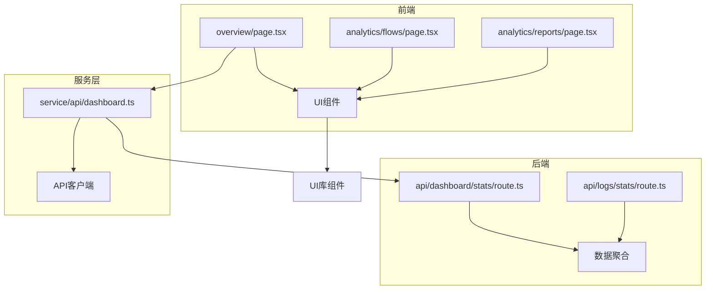
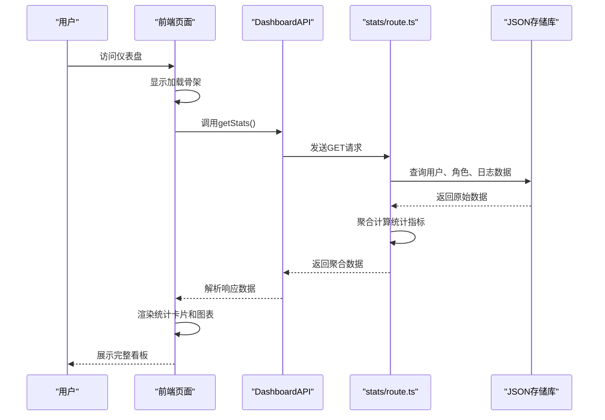
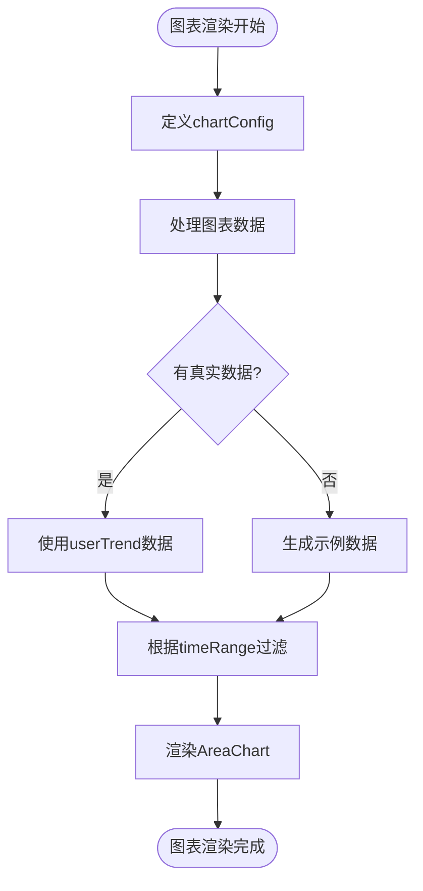
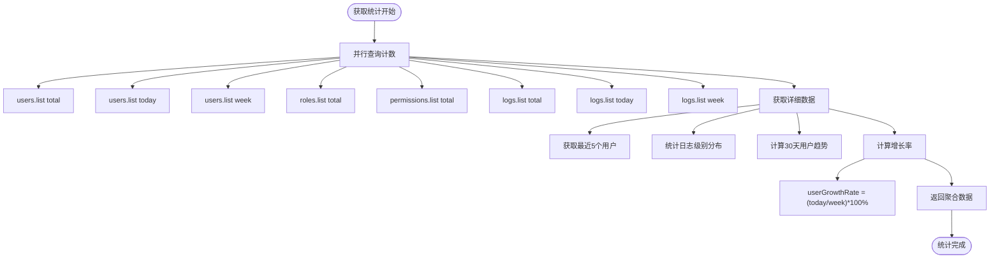
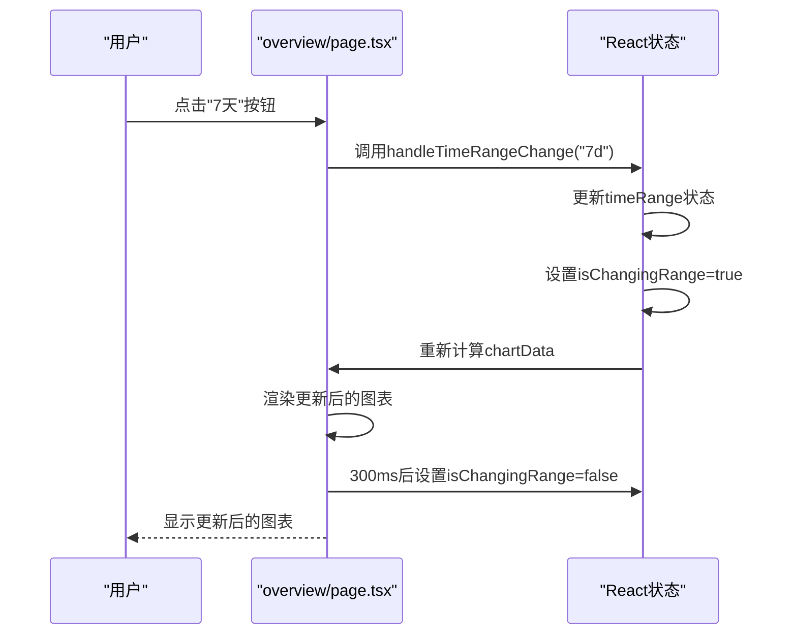
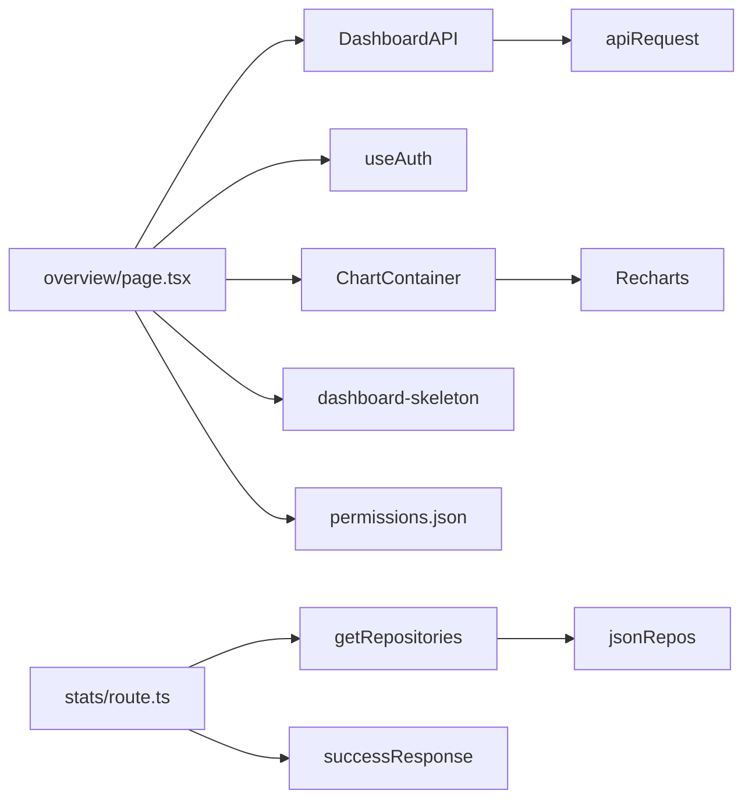

# 数据看板模块

<cite>
**本文档引用文件**   
- [dashboard.ts](file://src/service/api/dashboard.ts)
- [stats\route.ts](file://src/app/api/dashboard/stats/route.ts)
- [overview\page.tsx](file://src/app/dashboard/overview/page.tsx)
- [chart.tsx](file://src/components/ui/chart.tsx)
- [permissions.json](file://data/permissions.json)
</cite>

## 目录
1. [简介](#简介)
2. [项目结构](#项目结构)
3. [核心组件](#核心组件)
4. [架构概述](#架构概述)
5. [详细组件分析](#详细组件分析)
6. [依赖分析](#依赖分析)
7. [性能考虑](#性能考虑)
8. [故障排除指南](#故障排除指南)
9. [结论](#结论)

## 简介
数据看板模块为系统管理员提供关键业务指标的可视化展示，包含用户增长、系统日志、角色权限等核心数据的统计与分析。该模块通过前后端协作实现数据聚合、可视化呈现和交互功能，帮助管理员快速掌握系统运行状况。

## 项目结构
数据看板模块主要由前端页面、API路由和权限配置三部分组成，采用Next.js的App Router架构，遵循清晰的分层设计。



**图表来源**
- [overview\page.tsx](file://src/app/dashboard/overview/page.tsx#L1-L576)
- [stats\route.ts](file://src/app/api/dashboard/stats/route.ts#L1-L108)
- [dashboard.ts](file://src/service/api/dashboard.ts#L1-L9)

**章节来源**
- [overview\page.tsx](file://src/app/dashboard/overview/page.tsx#L1-L576)
- [stats\route.ts](file://src/app/api/dashboard/stats/route.ts#L1-L108)

## 核心组件
数据看板模块的核心组件包括统计数据显示、图表可视化、数据绑定机制和交互功能。前端通过DashboardAPI获取聚合数据，后端从JSON存储库中提取原始数据并进行统计计算。权限系统确保只有授权用户才能访问看板数据。

**章节来源**
- [dashboard.ts](file://src/service/api/dashboard.ts#L1-L9)
- [stats\route.ts](file://src/app/api/dashboard/stats/route.ts#L1-L108)
- [overview\page.tsx](file://src/app/dashboard/overview/page.tsx#L1-L576)

## 架构概述
数据看板模块采用前后端分离架构，前端负责数据展示和用户交互，后端负责数据聚合和API提供。系统通过权限验证确保数据安全，使用Recharts实现数据可视化，并支持时间范围选择等交互功能。



**图表来源**
- [dashboard.ts](file://src/service/api/dashboard.ts#L5-L7)
- [stats\route.ts](file://src/app/api/dashboard/stats/route.ts#L4-L108)
- [overview\page.tsx](file://src/app/dashboard/overview/page.tsx#L72-L86)

## 详细组件分析

### 数据统计与可视化分析
数据看板模块实现了完整的统计数据显示和可视化功能，支持多种图表类型和交互操作。

#### 统计数据显示机制
系统通过DashboardAPI获取聚合数据，并在前端页面中以统计卡片和图表的形式展示。统计卡片显示关键指标的总量、增长率和趋势。

```mermaid
classDiagram
class DashboardStats {
+overview : OverviewStats
+recentUsers : User[]
+logLevelStats : LevelStat[]
+userTrend : TrendData[]
}
class OverviewStats {
+totalUsers : number
+todayUsers : number
+weekUsers : number
+userGrowthRate : string
+totalRoles : number
+totalPermissions : number
+totalLogs : number
+todayLogs : number
+weekLogs : number
+errorLogs : number
}
class User {
+id : number
+username : string
+email : string
+avatar : string
+createdAt : string
}
class LevelStat {
+level : string
+count : number
}
class TrendData {
+date : string
+users : number
}
DashboardAPI --> DashboardStats : "返回"
overview/page.tsx --> DashboardStats : "使用"
```

**图表来源**
- [overview\page.tsx](file://src/app/dashboard/overview/page.tsx#L28-L56)
- [stats\route.ts](file://src/app/api/dashboard/stats/route.ts#L87-L103)

#### 图表配置与数据绑定
系统使用Recharts库实现数据可视化，通过ChartContainer组件封装图表配置，支持折线图、柱状图等多种图表类型。



**图表来源**
- [overview\page.tsx](file://src/app/dashboard/overview/page.tsx#L110-L174)
- [chart.tsx](file://src/components/ui/chart.tsx#L36-L69)

#### 业务指标计算逻辑
后端API在/stats/route.ts中实现业务指标的计算逻辑，包括用户增长、日志统计等关键指标。



**图表来源**
- [stats\route.ts](file://src/app/api/dashboard/stats/route.ts#L17-L108)

#### 图表交互功能
系统实现了时间范围选择等交互功能，用户可以通过按钮切换3天、7天、30天的时间范围，图表数据会相应更新。



**图表来源**
- [overview\page.tsx](file://src/app/dashboard/overview/page.tsx#L94-L100)
- [overview\page.tsx](file://src/app/dashboard/overview/page.tsx#L307-L323)

**章节来源**
- [overview\page.tsx](file://src/app/dashboard/overview/page.tsx#L62-L63)
- [overview\page.tsx](file://src/app/dashboard/overview/page.tsx#L307-L323)

## 依赖分析
数据看板模块依赖于多个核心组件和服务，形成了清晰的依赖关系网络。



**图表来源**
- [dashboard.ts](file://src/service/api/dashboard.ts#L1-L9)
- [stats\route.ts](file://src/app/api/dashboard/stats/route.ts#L1-L108)
- [overview\page.tsx](file://src/app/dashboard/overview/page.tsx#L1-L576)
- [permissions.json](file://data/permissions.json#L1-L12)

## 性能考虑
数据看板模块在性能方面采用了多项优化策略，确保快速响应和流畅的用户体验。

### 数据缓存策略
后端API通过并行查询和分页计数的方式优化数据获取性能，避免一次性加载大量数据。

### 图表渲染优化
前端采用骨架屏（Skeleton）技术，在数据加载时显示占位符，提升用户感知性能。同时，图表数据处理采用防抖和缓存机制，避免频繁重新计算。

**章节来源**
- [dashboard-skeleton.tsx](file://src/components/ui/dashboard-skeleton.tsx#L1-L164)
- [overview\page.tsx](file://src/app/dashboard/overview/page.tsx#L101-L106)

## 故障排除指南
当数据看板出现异常时，可按照以下步骤进行排查：

1. 检查用户权限是否包含"dashboard:view"
2. 查看网络请求是否成功返回数据
3. 检查后端API日志是否有错误信息
4. 验证数据存储是否正常

**章节来源**
- [permissions.json](file://data/permissions.json#L1-L12)
- [overview\page.tsx](file://src/app/dashboard/overview/page.tsx#L73-L84)

## 结论
数据看板模块为系统提供了全面的数据可视化功能，通过前后端协作实现了高效的统计数据显示。系统采用现代化的前端技术栈，支持丰富的交互功能和灵活的图表配置。未来可进一步优化数据聚合算法，增加更多类型的图表和分析功能。