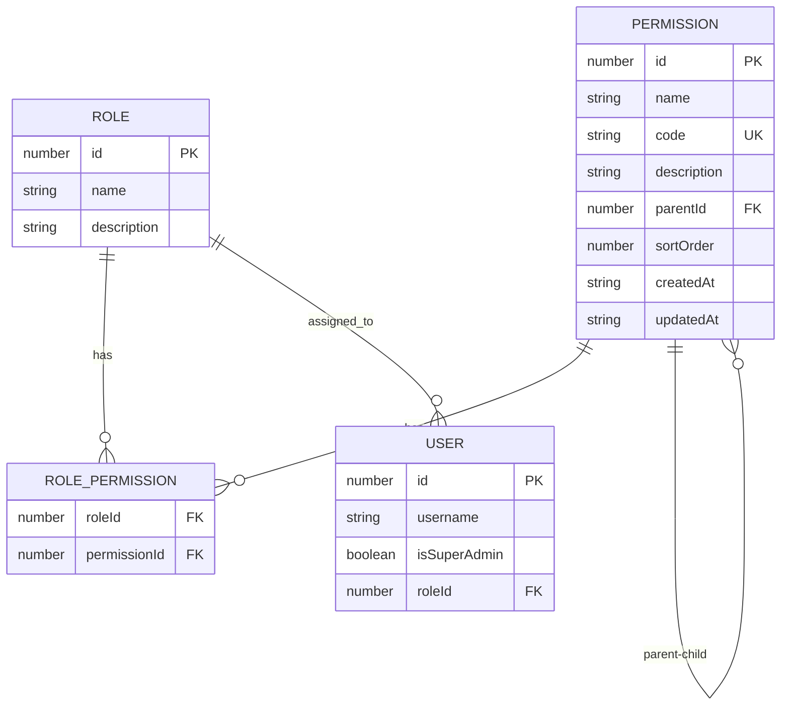
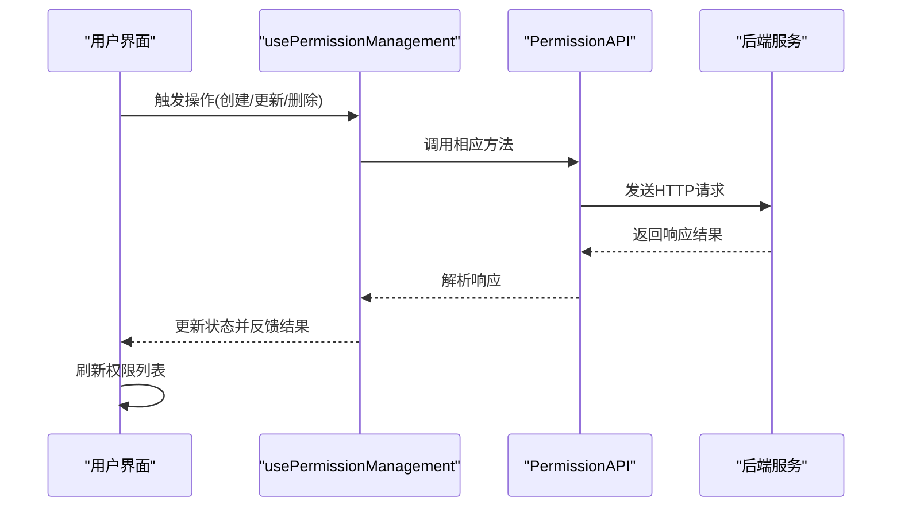
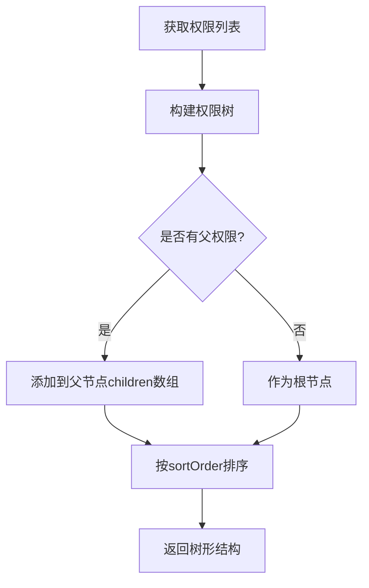
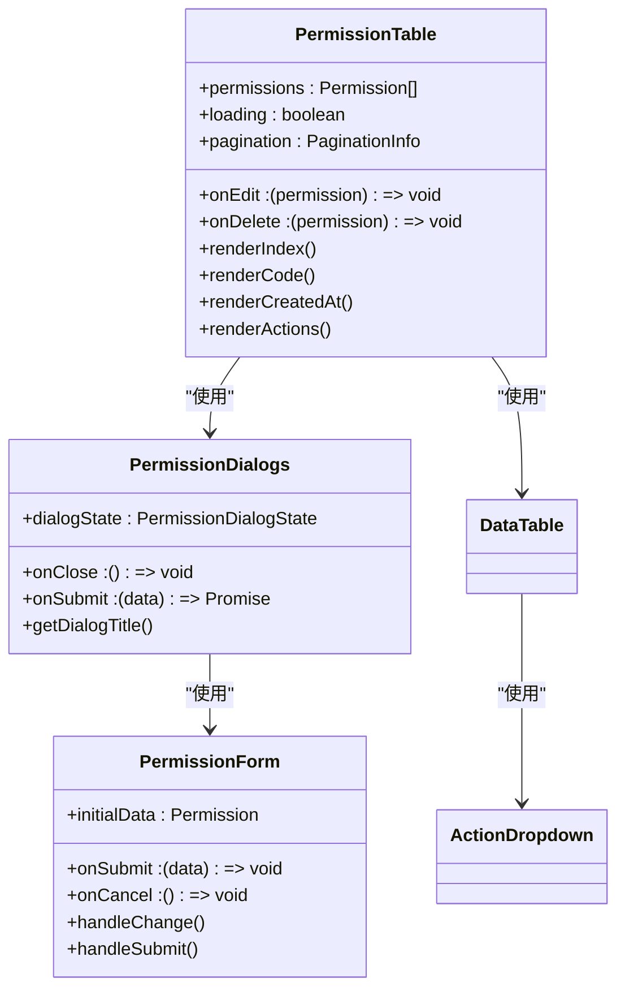
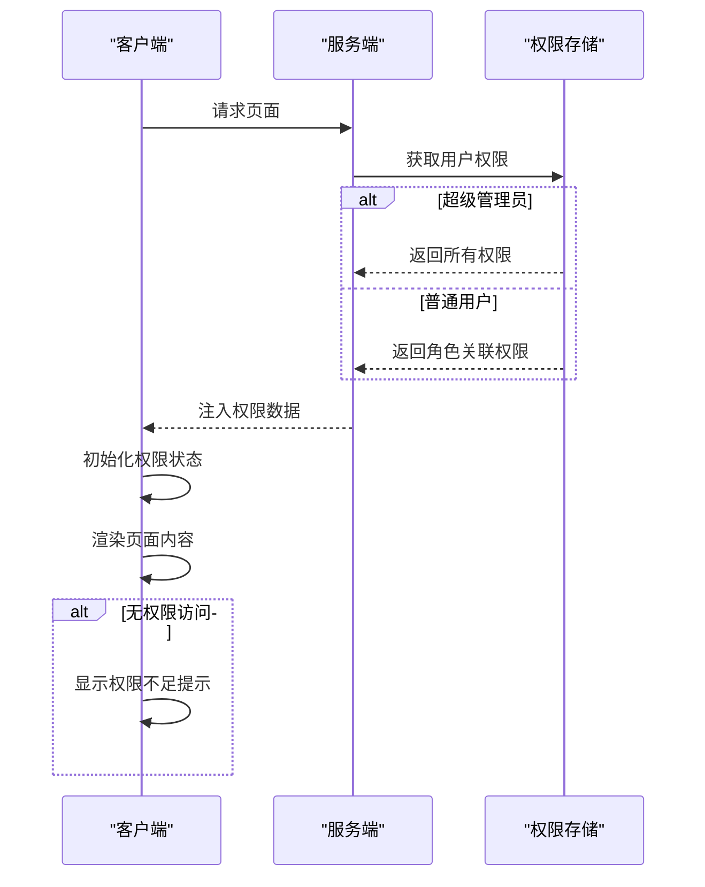
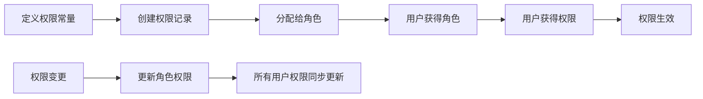

# 权限管理模块

<cite>
**本文档引用文件**   
- [permissions.md](file://src/docs/permissions.md)
- [permission-guard.tsx](file://src/components/auth/permission-guard.tsx)
- [server-permission-guard.tsx](file://src/components/auth/server-permission-guard.tsx)
- [usePermissionManagement.ts](file://src/app/dashboard/account/permission/hooks/usePermissionManagement.ts)
- [PermissionTable.tsx](file://src/app/dashboard/account/permission/components/PermissionTable.tsx)
- [permission-tree.tsx](file://src/components/shared/permission-tree.tsx)
- [permissions.ts](file://src/lib/permissions.ts)
- [server-permissions.ts](file://src/lib/server-permissions.ts)
- [permission.ts](file://src/service/api/permission.ts)
- [types.ts](file://src/app/dashboard/account/permission/types.ts)
- [use-permissions.ts](file://src/hooks/use-permissions.ts)
- [nav-main-with-permission.tsx](file://src/components/layout/nav-main-with-permission.tsx)
</cite>

## 目录
1. [简介](#简介)
2. [权限结构设计](#权限结构设计)
3. [权限增删改查操作](#权限增删改查操作)
4. [权限层级关系维护](#权限层级关系维护)
5. [权限树渲染与交互](#权限树渲染与交互)
6. [细粒度权限控制实现](#细粒度权限控制实现)
7. [权限节点定义与传播](#权限节点定义与传播)
8. [最佳实践与常见陷阱](#最佳实践与常见陷阱)

## 简介

本项目实现了基于角色的权限控制系统（RBAC），支持前端和后端的协同权限验证。系统采用树形结构组织权限，通过权限标识码进行细粒度控制。权限管理模块提供了完整的权限生命周期管理功能，包括权限的增删改查、树形结构展示、权限分配等核心功能。

系统通过客户端和服务端双重验证机制确保安全性，未登录用户将被自动重定向到登录页面，无权限用户将显示权限不足提示。权限系统与角色系统深度集成，通过角色-权限关联表实现权限的批量分配和管理。

**Section sources**
- [permissions.md](file://src/docs/permissions.md#L1-L61)

## 权限结构设计

权限系统采用树形层级结构，支持父子权限关系。每个权限节点包含唯一标识码（code）、名称、描述等属性，通过parentId字段建立层级关系。系统预定义了多个权限域，如账号管理、角色管理、权限管理、日志管理等，每个域下包含具体的权限操作。

权限标识码采用点分命名法，如`account.user.read`表示"账号管理-用户管理-查看用户"权限，这种命名方式既体现了权限的层级关系，又便于权限的批量管理和查询。超级管理员拥有所有权限，普通用户通过角色间接获得权限。

**Diagram sources**
- [types.ts](file://src/app/dashboard/account/permission/types.ts#L1-L7)
- [models.ts](file://src/repository/models.ts#L28-L37)

## 权限增删改查操作

权限管理模块提供了完整的CRUD操作接口。通过`usePermissionManagement`自定义Hook封装了权限的增删改查业务逻辑，包括获取权限列表、创建权限、更新权限、删除权限等操作。所有操作都通过统一的API服务类`PermissionAPI`进行网络请求。

权限查询支持分页、搜索和筛选功能，可根据权限名称、编码、创建时间范围等条件进行过滤。创建和编辑权限通过模态对话框实现，包含权限名称、权限标识、描述等字段的表单验证。删除权限前会弹出确认对话框，防止误操作。

**Section sources**
- [usePermissionManagement.ts](file://src/app/dashboard/account/permission/hooks/usePermissionManagement.ts#L14-L180)
- [permission.ts](file://src/service/api/permission.ts#L3-L57)

## 权限层级关系维护

系统通过parentId字段维护权限的层级关系，形成树形结构。每个权限节点可以有零个或多个子权限，子权限继承父权限的上下文。权限树的构建在客户端完成，通过将扁平化的权限列表转换为嵌套的树形结构。

权限层级关系的维护遵循严格的业务规则：删除父权限时会级联删除所有子权限；移动权限节点时会更新相关节点的parentId；权限排序通过sortOrder字段控制。系统提供了获取权限树结构的专用API接口，便于在不同场景下使用。

**Section sources**
- [permission-tree.tsx](file://src/components/shared/permission-tree.tsx#L280-L322)
- [permission.ts](file://src/service/api/permission.ts#L16-L18)

## 权限树渲染与交互

权限树通过`PermissionTable`组件进行渲染展示，支持展开/折叠交互。组件采用虚拟滚动技术优化大数据量下的渲染性能，每行显示权限的序号、名称、标识码、创建时间等信息，并提供编辑和删除操作按钮。

权限树的展开/折叠状态通过useState管理，初始状态根据权限是否被选中智能判断。点击展开按钮时，动态渲染子权限节点，形成层级视觉效果。权限标识码使用Badge组件展示，突出显示其技术属性。表格支持分页，每页显示固定数量的权限记录。

**Section sources**
- [PermissionTable.tsx](file://src/app/dashboard/account/permission/components/PermissionTable.tsx#L39-L117)
- [PermissionForm.tsx](file://src/app/dashboard/account/permission/components/PermissionForm.tsx#L22-L101)

## 细粒度权限控制实现

系统实现了客户端和服务端协同的细粒度权限控制机制。客户端通过`PermissionGuard`组件进行权限守卫，服务端通过`ServerPermissionGuard`组件进行权限验证，形成双重安全保障。

客户端权限检查基于用户会话中的权限列表，提供同步的权限判断方法：`hasPermission`检查单一权限，`hasAnyPermission`检查是否具有任意一个权限，`hasAllPermissions`检查是否具有所有权限。服务端权限检查通过`getUserPermissions`函数获取用户权限集，确保权限数据的准确性和安全性。

**Section sources**
- [permission-guard.tsx](file://src/components/auth/permission-guard.tsx#L16-L65)
- [server-permissions.ts](file://src/lib/server-permissions.ts#L27-L66)

## 权限节点定义与传播

新的权限节点通过`PERMISSIONS`常量对象进行定义，采用TypeScript的const断言确保类型安全。权限定义遵循模块化组织原则，按功能域分组，每个权限都有清晰的语义化名称和唯一的标识码。

权限传播机制基于角色-权限关联模型，用户通过角色间接获得权限。当用户被分配角色时，系统自动加载该角色关联的所有权限。权限变更会立即影响所有拥有该角色的用户，确保权限策略的一致性。超级管理员权限特殊处理，不受角色权限限制。

**Section sources**
- [permissions.ts](file://src/lib/permissions.ts#L3-L32)
- [server-permissions.ts](file://src/lib/server-permissions.ts#L44-L49)

## 最佳实践与常见陷阱

权限设计应遵循最小权限原则，只授予完成任务所必需的权限。权限命名应保持一致性，采用"模块.功能.操作"的命名规范。避免创建过于细粒度的权限，以免增加管理复杂度。

常见陷阱包括：权限循环依赖、权限爆炸（权限数量过多）、权限冲突等。应定期审查权限结构，合并冗余权限，删除无用权限。测试时应覆盖各种权限组合场景，确保权限判断逻辑的正确性。

权限变更应通过审计日志记录，便于追踪和回溯。生产环境的权限修改应经过审批流程，避免误操作导致安全风险。对于敏感操作权限，建议增加二次确认或多因素认证。

**Section sources**
- [permissions.md](file://src/docs/permissions.md#L177-L182)
- [nav-main-with-permission.tsx](file://src/components/layout/nav-main-with-permission.tsx#L26-L165)