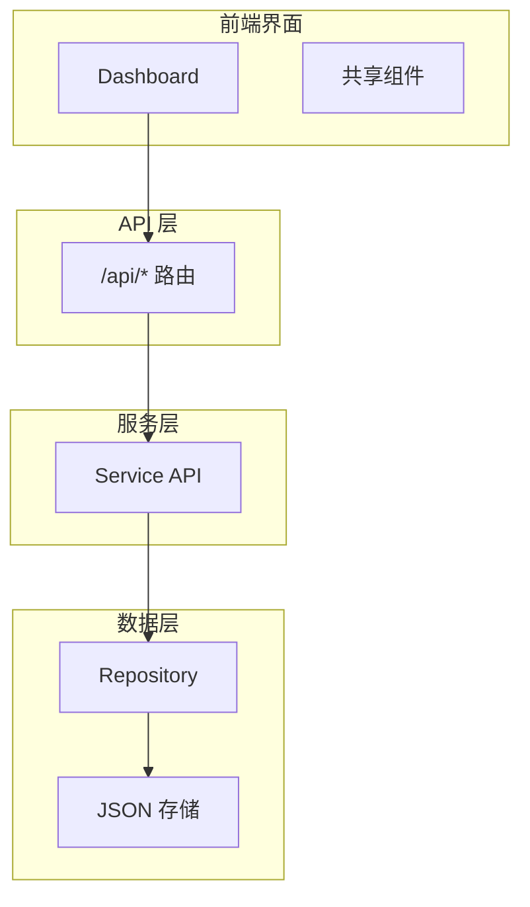
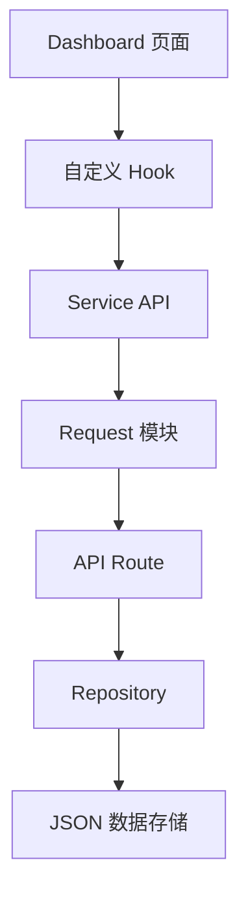
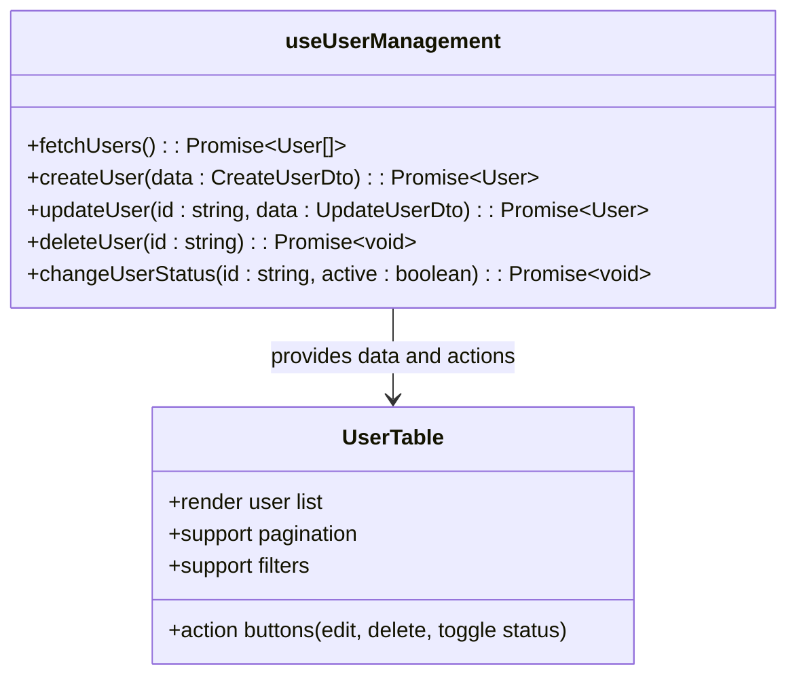
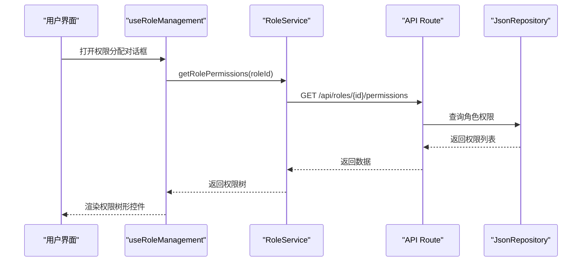
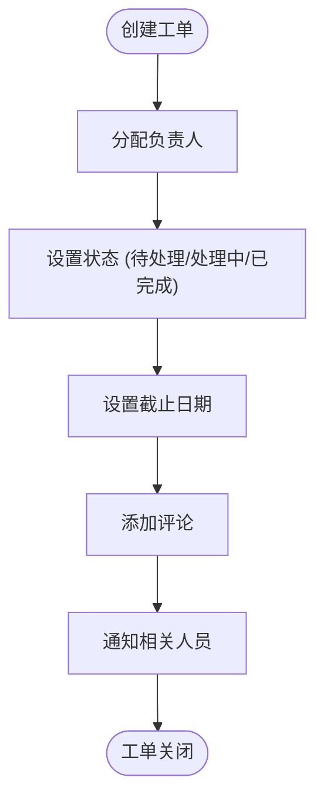
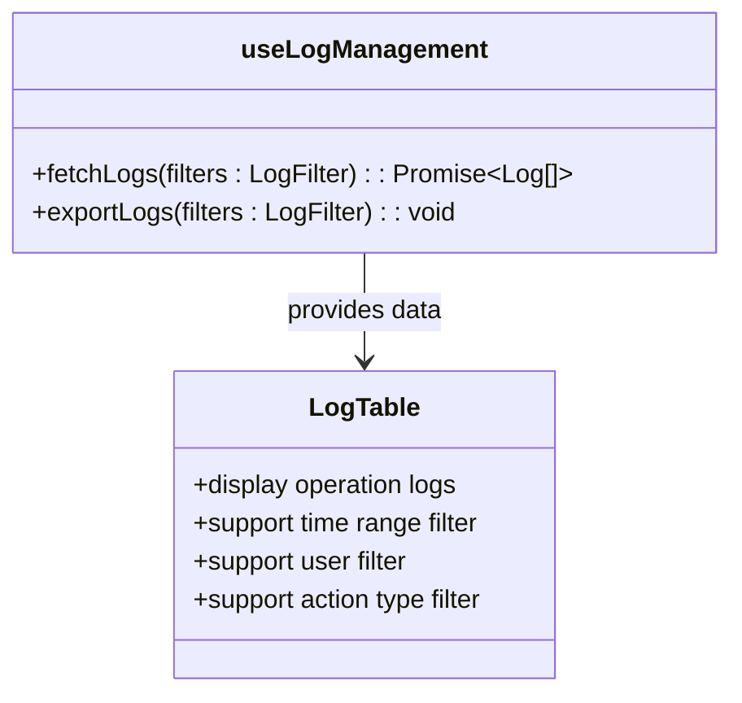
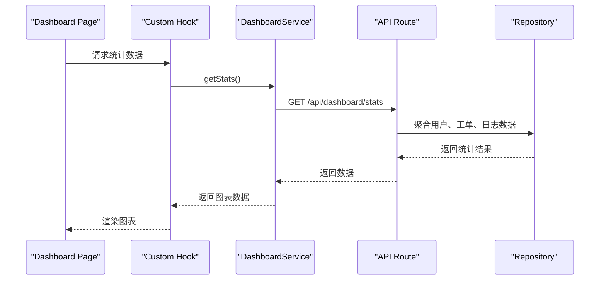
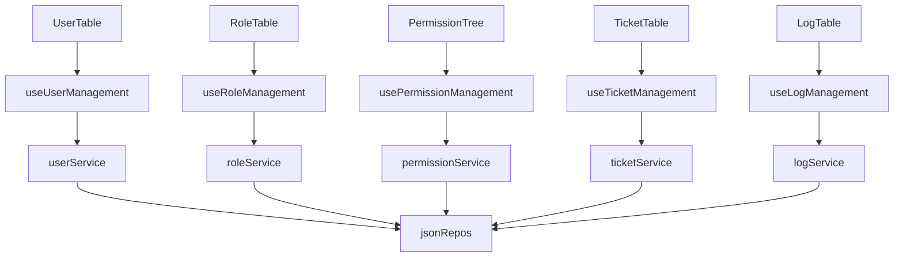

# 核心功能模块

<cite>
**本文档引用的文件**  
- [useUserManagement.ts](file://src/app/dashboard/account/user/hooks/useUserManagement.ts)
- [UserTable.tsx](file://src/app/dashboard/account/user/components/UserTable.tsx)
- [useRoleManagement.ts](file://src/app/dashboard/account/role/hooks/useRoleManagement.ts)
- [RolePermissionDialog.tsx](file://src/app/dashboard/account/role/components/RolePermissionDialog.tsx)
- [usePermissionManagement.ts](file://src/app/dashboard/account/permission/hooks/usePermissionManagement.ts)
- [permission-tree.tsx](file://src/components/shared/permission-tree.tsx)
- [use-ticket-management.ts](file://src/app/dashboard/tickets/hooks/use-ticket-management.ts)
- [ticket-table.tsx](file://src/app/dashboard/tickets/components/ticket-table.tsx)
- [useLogManagement.ts](file://src/app/dashboard/system/logs/hooks/useLogManagement.ts)
- [LogTable.tsx](file://src/app/dashboard/system/logs/components/LogTable.tsx)
- [dashboard.ts](file://src/service/api/dashboard.ts)
- [user.ts](file://src/service/api/user.ts)
- [role.ts](file://src/service/api/role.ts)
- [permission.ts](file://src/service/api/permission.ts)
- [ticket.ts](file://src/service/api/ticket.ts)
- [log.ts](file://src/service/api/log.ts)
- [jsonRepos.ts](file://src/repository/impl/jsonRepos.ts)
- [page.tsx](file://src/app/dashboard/page.tsx)
- [layout.tsx](file://src/app/dashboard/layout.tsx)
</cite>

## 目录
1. [简介](#简介)
2. [项目结构](#项目结构)
3. [核心组件](#核心组件)
4. [架构概览](#架构概览)
5. [详细组件分析](#详细组件分析)
6. [依赖分析](#依赖分析)
7. [性能考虑](#性能考虑)
8. [故障排除指南](#故障排除指南)
9. [结论](#结论)

## 简介
v0-game_admin 是一个面向游戏管理的后台系统，提供用户、角色、权限、工单、日志和数据看板等核心功能模块。本系统采用 Next.js 构建，结合 React Server Components 和客户端交互逻辑，实现高效的数据管理与可视化。各模块均通过统一的 API 接口与后端服务通信，支持细粒度权限控制和可扩展的组件架构。

## 项目结构
系统采用功能模块化组织方式，主要分为 `dashboard`（管理页面）、`api`（接口路由）、`service`（业务服务）、`repository`（数据访问）和 `components`（共享组件）五大层级。前端页面集中在 `src/app/dashboard` 目录下，每个功能模块拥有独立的子目录，包含页面、组件、Hook 和类型定义。

**Diagram sources**
- [page.tsx](file://src/app/dashboard/page.tsx)
- [route.ts](file://src/app/api/users/route.ts)

**Section sources**
- [page.tsx](file://src/app/dashboard/page.tsx)
- [layout.tsx](file://src/app/dashboard/layout.tsx)

## 核心组件
系统核心功能围绕用户管理、角色与权限、工单系统、系统日志和数据看板展开。所有模块均遵循一致的设计模式：使用自定义 Hook 管理状态与逻辑，通过组件封装 UI 展示，并通过统一的服务层调用后端接口。

**Section sources**
- [useUserManagement.ts](file://src/app/dashboard/account/user/hooks/useUserManagement.ts)
- [useRoleManagement.ts](file://src/app/dashboard/account/role/hooks/useRoleManagement.ts)
- [use-ticket-management.ts](file://src/app/dashboard/tickets/hooks/use-ticket-management.ts)

## 架构概览
系统采用分层架构设计，从前端页面到数据存储形成清晰的调用链路。页面组件通过 Hook 调用服务层 API，服务层再通过统一请求模块访问后端接口，最终由 Repository 层处理数据持久化。

**Diagram sources**
- [useUserManagement.ts](file://src/app/dashboard/account/user/hooks/useUserManagement.ts)
- [user.ts](file://src/service/api/user.ts)
- [jsonRepos.ts](file://src/repository/impl/jsonRepos.ts)

## 详细组件分析

### 用户管理模块分析
用户管理模块支持用户的增删改查（CRUD）及状态管理（启用/禁用）。页面位于 `dashboard/account/user`，核心逻辑由 `useUserManagement` Hook 实现，负责用户列表获取、创建、更新和删除操作。UI 层通过 `UserTable` 组件展示用户数据，并提供搜索、分页和筛选功能。

**Diagram sources**
- [useUserManagement.ts](file://src/app/dashboard/account/user/hooks/useUserManagement.ts)
- [UserTable.tsx](file://src/app/dashboard/account/user/components/UserTable.tsx)

**Section sources**
- [useUserManagement.ts](file://src/app/dashboard/account/user/hooks/useUserManagement.ts)
- [UserTable.tsx](file://src/app/dashboard/account/user/components/UserTable.tsx)

### 角色与权限管理模块分析
角色管理模块支持角色的 CRUD 操作，并通过 `RolePermissionDialog` 实现权限分配功能。权限系统采用树形结构，支持细粒度控制。`useRoleManagement` Hook 负责角色数据管理，而 `usePermissionManagement` 则处理权限树的加载与更新。

**Diagram sources**
- [useRoleManagement.ts](file://src/app/dashboard/account/role/hooks/useRoleManagement.ts)
- [RolePermissionDialog.tsx](file://src/app/dashboard/account/role/components/RolePermissionDialog.tsx)
- [permission-tree.tsx](file://src/components/shared/permission-tree.tsx)

**Section sources**
- [useRoleManagement.ts](file://src/app/dashboard/account/role/hooks/useRoleManagement.ts)
- [usePermissionManagement.ts](file://src/app/dashboard/account/permission/hooks/usePermissionManagement.ts)

### 工单系统模块分析
工单系统支持工单的创建、分配、状态流转和评论功能。`use-ticket-management` Hook 封装了所有工单操作逻辑，包括状态变更（status）、负责人分配（assign）、截止日期设置（due）和添加评论（comment）。工单列表通过 `ticket-table.tsx` 组件展示。

**Diagram sources**
- [use-ticket-management.ts](file://src/app/dashboard/tickets/hooks/use-ticket-management.ts)
- [ticket-table.tsx](file://src/app/dashboard/tickets/components/ticket-table.tsx)

**Section sources**
- [use-ticket-management.ts](file://src/app/dashboard/tickets/hooks/use-ticket-management.ts)
- [ticket.ts](file://src/service/api/ticket.ts)

### 系统日志模块分析
系统日志模块记录所有关键操作，并提供查询功能。`useLogManagement` Hook 负责日志数据的获取与过滤，支持按时间范围、操作类型和操作人进行筛选。日志数据通过 `LogTable` 组件展示，并支持导出功能。

**Diagram sources**
- [useLogManagement.ts](file://src/app/dashboard/system/logs/hooks/useLogManagement.ts)
- [LogTable.tsx](file://src/app/dashboard/system/logs/components/LogTable.tsx)

**Section sources**
- [useLogManagement.ts](file://src/app/dashboard/system/logs/hooks/useLogManagement.ts)
- [log.ts](file://src/service/api/log.ts)

### 数据看板模块分析
数据看板模块通过图表展示关键业务指标。`dashboard.ts` 服务提供统计接口，前端通过调用 `/api/dashboard/stats` 获取聚合数据，并使用 UI 组件中的 `chart.tsx` 进行可视化展示。

**Diagram sources**
- [dashboard.ts](file://src/service/api/dashboard.ts)
- [chart.tsx](file://src/components/ui/chart.tsx)

**Section sources**
- [dashboard.ts](file://src/service/api/dashboard.ts)
- [page.tsx](file://src/app/dashboard/overview/page.tsx)

## 依赖分析
系统各模块通过服务层解耦，依赖关系清晰。前端组件依赖自定义 Hook，Hook 依赖服务层，服务层依赖 Repository。权限系统通过 `permission-guard.tsx` 组件实现路由级和组件级的访问控制。

**Diagram sources**
- [user.ts](file://src/service/api/user.ts)
- [role.ts](file://src/service/api/role.ts)
- [permission.ts](file://src/service/api/permission.ts)
- [ticket.ts](file://src/service/api/ticket.ts)
- [log.ts](file://src/service/api/log.ts)
- [jsonRepos.ts](file://src/repository/impl/jsonRepos.ts)

**Section sources**
- [jsonRepos.ts](file://src/repository/impl/jsonRepos.ts)
- [index.ts](file://src/repository/index.ts)

## 性能考虑
系统采用服务端渲染（SSR）结合客户端交互的方式，在保证首屏加载速度的同时提供良好的用户体验。数据获取通过服务层缓存和分页机制优化性能，避免一次性加载大量数据。树形权限结构采用懒加载策略，提升大型权限系统的响应速度。

## 故障排除指南
常见问题包括权限不足、数据未更新和接口调用失败。建议检查：
- 当前用户权限是否满足操作要求
- API 接口返回状态码及错误信息
- Repository 数据文件路径与读写权限
- Hook 中的异步操作是否正确处理错误

**Section sources**
- [server-permission-guard.tsx](file://src/components/auth/server-permission-guard.tsx)
- [error-page.tsx](file://src/components/ui/error-page.tsx)

## 结论
v0-game_admin 系统通过模块化设计实现了高内聚、低耦合的架构。各功能模块职责清晰，通过统一的服务层和 Repository 层实现数据一致性。系统具备良好的可维护性和扩展性，适合进一步集成更多游戏管理功能。