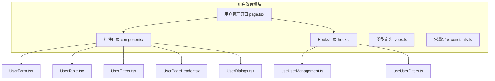
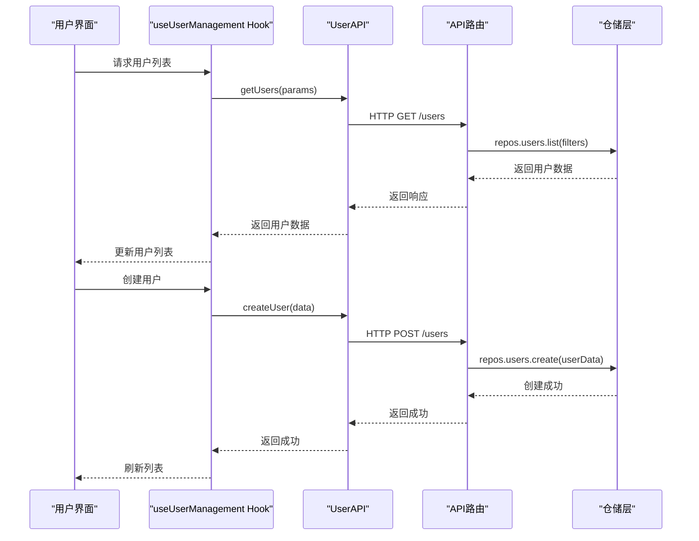
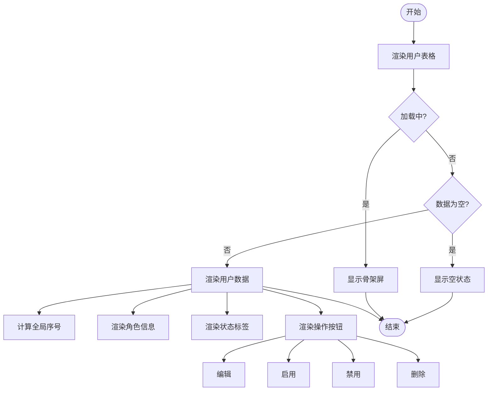
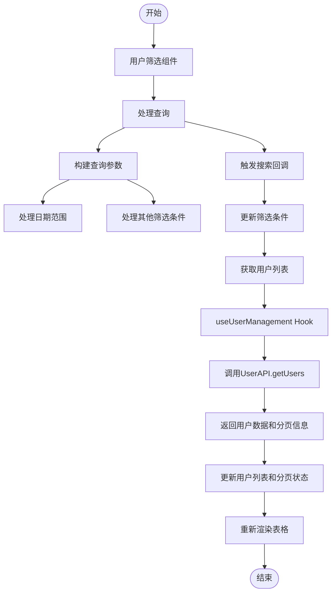
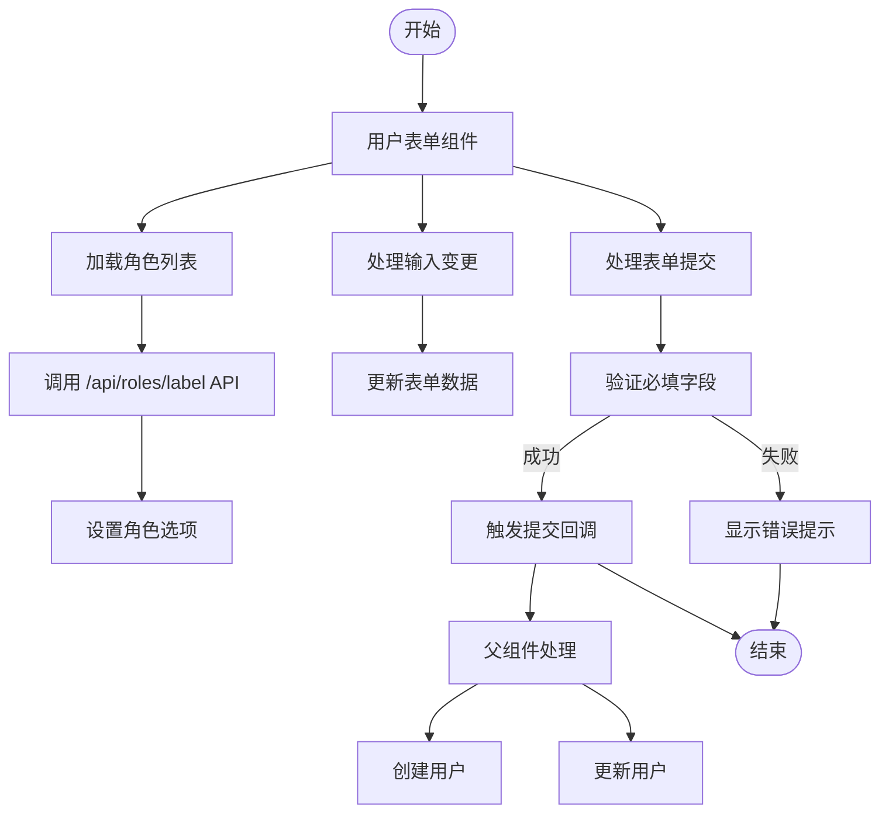
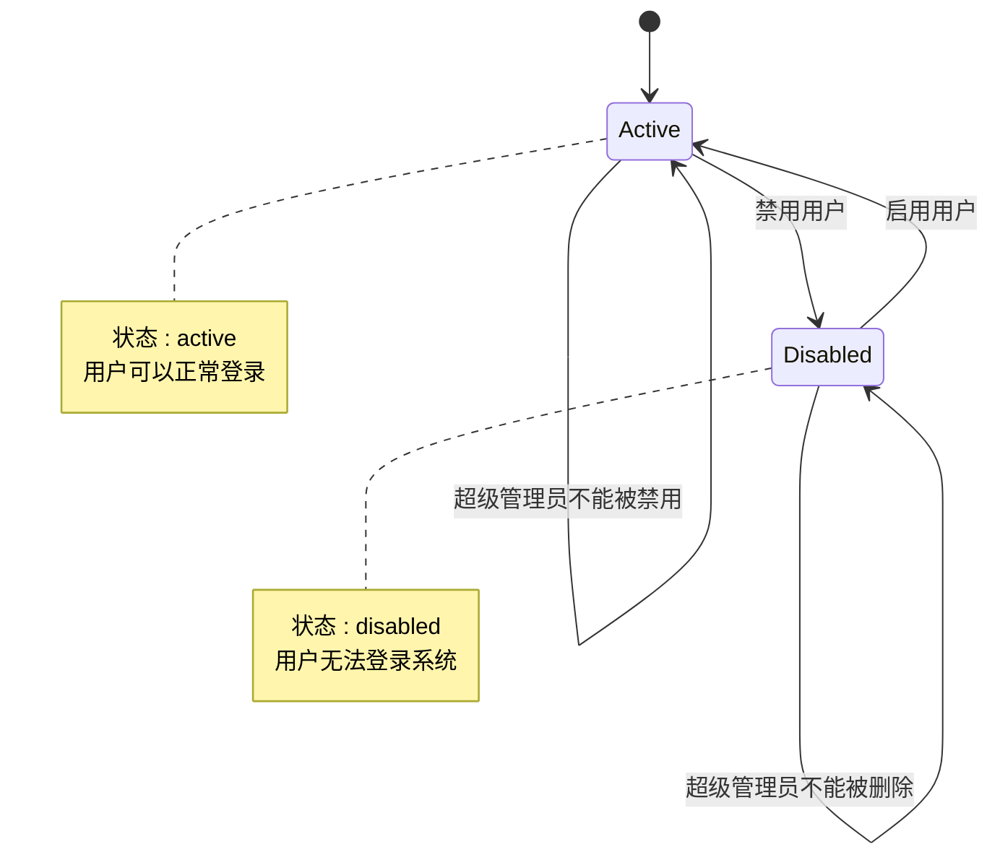
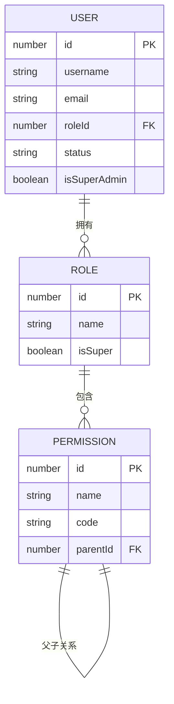
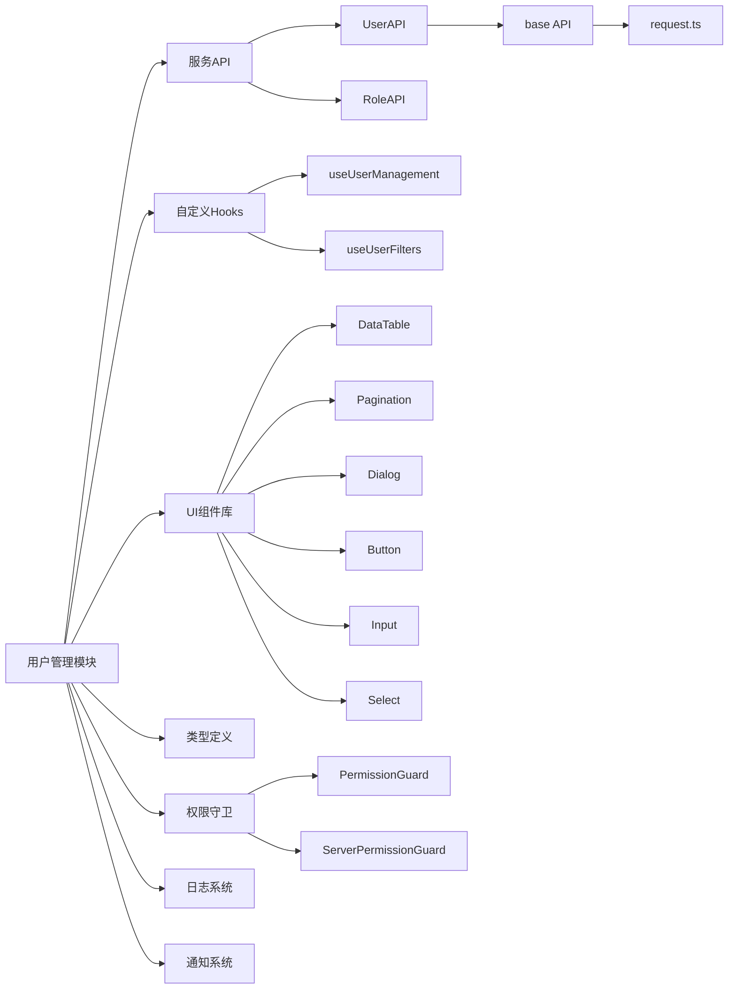

# 用户管理模块

<cite>
**本文档引用的文件**
- [page.tsx](file://src/app/dashboard/account/user/page.tsx)
- [UserTable.tsx](file://src/app/dashboard/account/user/components/UserTable.tsx)
- [useUserManagement.ts](file://src/app/dashboard/account/user/hooks/useUserManagement.ts)
- [UserForm.tsx](file://src/app/dashboard/account/user/components/UserForm.tsx)
- [user.ts](file://src/service/api/user.ts)
- [route.ts](file://src/app/api/users/route.ts)
- [permission-guard.tsx](file://src/components/auth/permission-guard.tsx)
- [server-permission-guard.tsx](file://src/components/auth/server-permission-guard.tsx)
- [server-permissions.ts](file://src/lib/server-permissions.ts)
- [UserDialogs.tsx](file://src/app/dashboard/account/user/components/UserDialogs.tsx)
</cite>

## 目录
1. [简介](#简介)
2. [项目结构](#项目结构)
3. [核心组件](#核心组件)
4. [架构概述](#架构概述)
5. [详细组件分析](#详细组件分析)
6. [依赖分析](#依赖分析)
7. [性能考虑](#性能考虑)
8. [故障排除指南](#故障排除指南)
9. [结论](#结论)

## 简介
用户管理模块是系统中用于管理用户账户的核心功能，支持用户的增删改查（CRUD）操作。该模块通过前端组件与后端API协同工作，实现用户列表展示、搜索过滤、分页加载、创建与编辑表单、状态管理以及权限控制等功能。本模块与角色和权限系统紧密集成，确保只有具备相应权限的用户才能访问和操作相关功能。

## 项目结构
用户管理模块位于 `src/app/dashboard/account/user` 目录下，采用组件化和Hooks分离的设计模式，将UI组件与业务逻辑解耦。

**Diagram sources**
- [page.tsx](file://src/app/dashboard/account/user/page.tsx)

**Section sources**
- [page.tsx](file://src/app/dashboard/account/user/page.tsx)

## 核心组件
用户管理模块的核心由多个组件和Hook构成，主要包括：
- `UserTable`：负责展示用户列表数据和操作按钮
- `UserForm`：处理用户创建和编辑的表单逻辑
- `UserDialogs`：管理新增和编辑用户的对话框
- `useUserManagement`：封装用户数据的增删改查和角色数据获取的业务逻辑
- `UserFilters`：提供用户列表的搜索和筛选功能

这些组件通过Props传递回调函数进行通信，保持了良好的解耦性。

**Section sources**
- [UserTable.tsx](file://src/app/dashboard/account/user/components/UserTable.tsx)
- [UserForm.tsx](file://src/app/dashboard/account/user/components/UserForm.tsx)
- [useUserManagement.ts](file://src/app/dashboard/account/user/hooks/useUserManagement.ts)

## 架构概述
用户管理模块采用前后端分离的架构，前端通过API调用与后端交互，后端使用仓储模式（Repository Pattern）访问数据。

**Diagram sources**
- [useUserManagement.ts](file://src/app/dashboard/account/user/hooks/useUserManagement.ts)
- [user.ts](file://src/service/api/user.ts)
- [route.ts](file://src/app/api/users/route.ts)

## 详细组件分析

### 用户表格与列表展示
`UserTable` 组件负责展示用户列表数据，支持分页、排序和操作按钮。表格通过 `DataTable` 组件渲染，列配置包含序号、用户名、邮箱、角色、状态、最后登录时间和创建时间。

**Diagram sources**
- [UserTable.tsx](file://src/app/dashboard/account/user/components/UserTable.tsx)

**Section sources**
- [UserTable.tsx](file://src/app/dashboard/account/user/components/UserTable.tsx)

### 搜索过滤与分页加载
用户列表支持多种筛选条件，包括用户名、邮箱、角色、状态和日期范围。分页功能通过 `Pagination` 组件实现，支持每页显示条数切换和页码跳转。

**Diagram sources**
- [UserFilters.tsx](file://src/app/dashboard/account/user/components/UserFilters.tsx)
- [useUserManagement.ts](file://src/app/dashboard/account/user/hooks/useUserManagement.ts)

**Section sources**
- [UserFilters.tsx](file://src/app/dashboard/account/user/components/UserFilters.tsx)
- [useUserManagement.ts](file://src/app/dashboard/account/user/hooks/useUserManagement.ts)

### 用户创建与编辑表单
`UserForm` 组件处理用户创建和编辑的表单逻辑，包含用户名、邮箱、密码、角色和状态等字段。表单实现了基本的验证规则和交互逻辑。

**Diagram sources**
- [UserForm.tsx](file://src/app/dashboard/account/user/components/UserForm.tsx)

**Section sources**
- [UserForm.tsx](file://src/app/dashboard/account/user/components/UserForm.tsx)

### 用户状态管理
用户状态管理包括启用和禁用操作，通过更新用户状态字段实现。系统对超级管理员用户实施特殊保护，禁止禁用或删除。

**Diagram sources**
- [page.tsx](file://src/app/dashboard/account/user/page.tsx)
- [UserTable.tsx](file://src/app/dashboard/account/user/components/UserTable.tsx)

**Section sources**
- [page.tsx](file://src/app/dashboard/account/user/page.tsx)

### 权限系统集成
用户管理模块与权限系统深度集成，通过权限守卫控制访问。系统采用基于角色的权限控制（RBAC），定义了用户管理相关的权限码。

**Diagram sources**
- [server-permissions.ts](file://src/lib/server-permissions.ts)
- [permission-guard.tsx](file://src/components/auth/permission-guard.tsx)

**Section sources**
- [server-permissions.ts](file://src/lib/server-permissions.ts)

## 依赖分析
用户管理模块依赖多个系统组件和外部服务，形成清晰的依赖关系。

**Diagram sources**
- [useUserManagement.ts](file://src/app/dashboard/account/user/hooks/useUserManagement.ts)
- [user.ts](file://src/service/api/user.ts)
- [permission-guard.tsx](file://src/components/auth/permission-guard.tsx)

**Section sources**
- [useUserManagement.ts](file://src/app/dashboard/account/user/hooks/useUserManagement.ts)

## 性能考虑
用户管理模块在性能方面进行了多项优化：
- 采用分页加载，避免一次性加载大量数据
- 使用React的useCallback和useMemo优化渲染性能
- 对API调用进行错误处理和重试机制
- 使用骨架屏提升加载体验
- 对角色列表进行缓存，避免重复请求

## 故障排除指南
### 数据加载失败
当用户列表加载失败时，可能的原因包括：
- 网络连接问题
- API服务不可用
- 用户权限不足
- 查询参数错误

解决方案：
1. 检查网络连接状态
2. 查看浏览器控制台是否有错误信息
3. 确认用户是否具有`account.user.read`权限
4. 检查API路由是否正常工作

### 表单验证错误
表单验证错误通常发生在创建或编辑用户时，常见原因：
- 必填字段未填写
- 用户名已存在
- 邮箱格式不正确
- 密码强度不足

解决方案：
1. 确保所有必填字段都已填写
2. 检查用户名是否与其他用户重复
3. 使用正确的邮箱格式
4. 设置符合要求的密码

### 权限访问问题
当用户无法访问用户管理页面时：
1. 确认用户是否已登录
2. 检查用户角色是否具有`account.user.read`权限
3. 查看权限分配是否正确
4. 确认超级管理员角色的特殊权限

**Section sources**
- [page.tsx](file://src/app/dashboard/account/user/page.tsx)
- [UserForm.tsx](file://src/app/dashboard/account/user/components/UserForm.tsx)
- [route.ts](file://src/app/api/users/route.ts)

## 结论
用户管理模块是一个功能完整、结构清晰的系统模块，实现了用户CRUD操作的全部功能。通过组件化设计和Hooks分离，代码具有良好的可维护性和可扩展性。模块与权限系统深度集成，确保了系统的安全性。未来可以考虑增加更多高级功能，如批量操作、导入导出、审计日志等，进一步提升用户体验和管理效率。