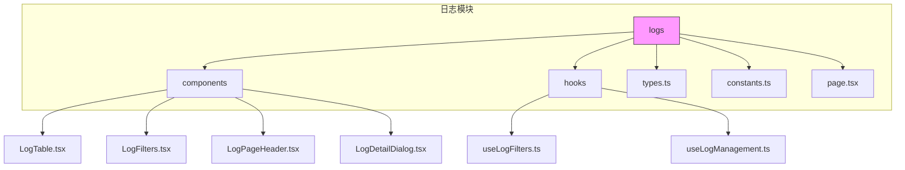
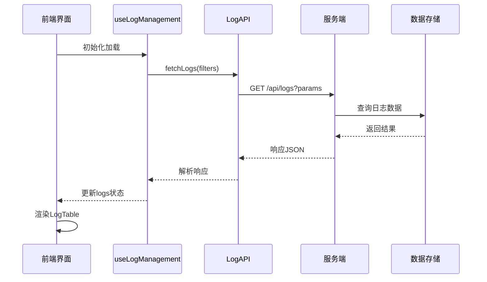
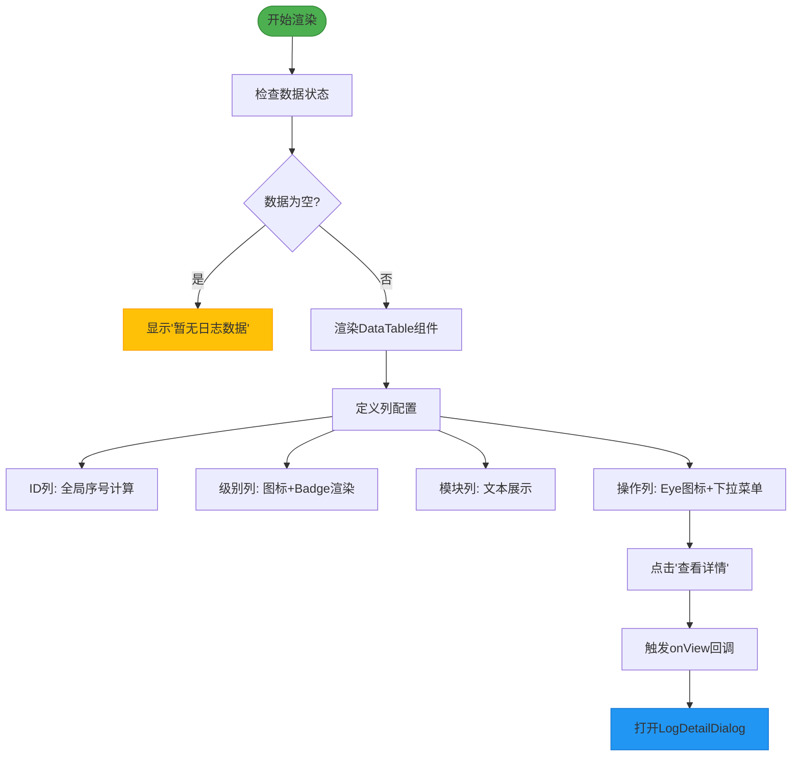
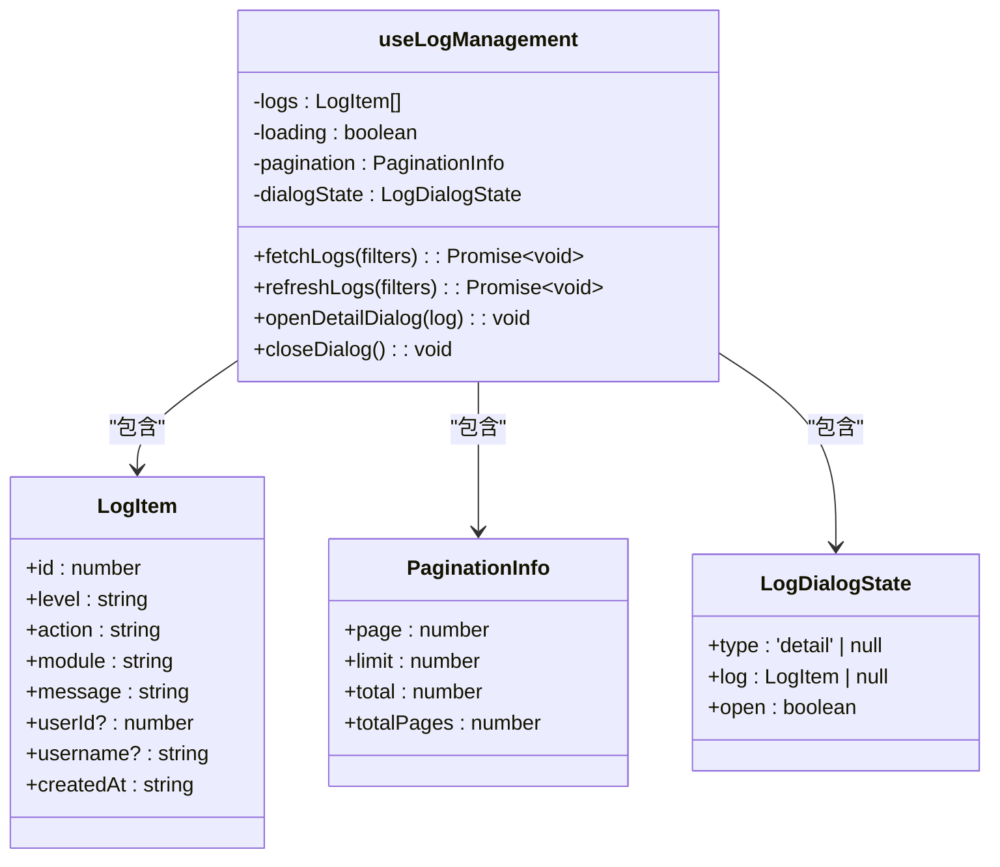
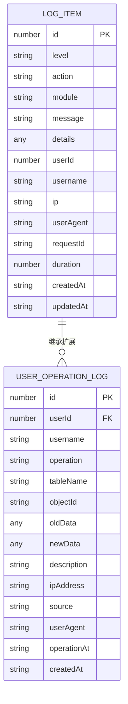
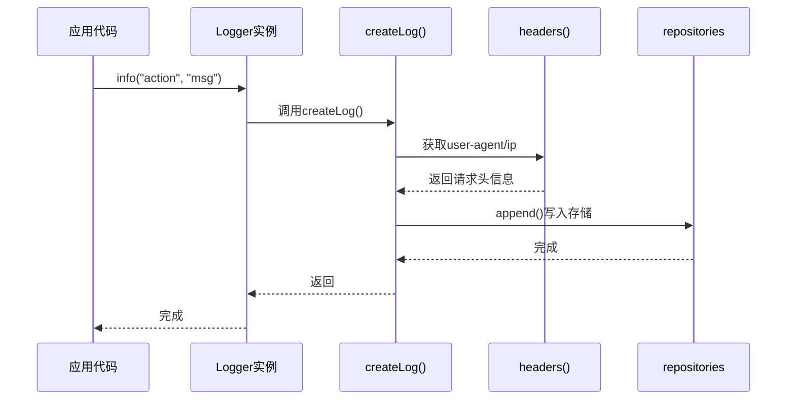

# 系统日志模块

<cite>
**本文档引用文件**  
- [LogTable.tsx](file://src/app/dashboard/system/logs/components/LogTable.tsx)
- [useLogManagement.ts](file://src/app/dashboard/system/logs/hooks/useLogManagement.ts)
- [types.ts](file://src/app/dashboard/system/logs/types.ts)
- [logger.ts](file://src/lib/logger.ts)
- [operation-logs-api.md](file://src/docs/operation-logs-api.md)
- [LogAPI.ts](file://src/service/api/log.ts)
- [route.ts](file://src/app/api/logs/route.ts)
- [stats/route.ts](file://src/app/api/logs/stats/route.ts)
</cite>

## 目录
1. [简介](#简介)
2. [项目结构](#项目结构)
3. [核心组件](#核心组件)
4. [架构概览](#架构概览)
5. [详细组件分析](#详细组件分析)
6. [依赖分析](#依赖分析)
7. [性能考量](#性能考量)
8. [故障排除指南](#故障排除指南)
9. [结论](#结论)

## 简介
本系统日志模块为游戏管理后台提供全面的操作审计与运行监控能力。该模块支持操作日志的记录、查询、过滤、分页展示及统计分析功能，覆盖用户行为追踪、系统异常监控和安全审计等关键场景。通过结构化日志设计和高效的数据处理流程，确保管理员能够快速定位问题、分析用户行为并满足合规性要求。

## 项目结构
系统日志相关功能集中于 `src/app/dashboard/system/logs` 目录下，采用模块化组织方式，包含组件、Hook、类型定义和页面入口。



**Diagram sources**  
- [page.tsx](file://src/app/dashboard/system/logs/page.tsx#L1-L122)

**Section sources**  
- [page.tsx](file://src/app/dashboard/system/logs/page.tsx#L1-L122)

## 核心组件
日志模块的核心由前端组件、业务逻辑Hook和后端API构成。前端通过 `LogTable` 组件展示日志列表，结合 `useLogManagement` Hook 实现数据获取与状态管理，并通过 `LogDetailDialog` 提供详情查看功能。后端通过 `/api/logs` 和 `/api/user-operation-logs` 提供数据接口，支持多条件筛选、分页查询和统计聚合。

**Section sources**  
- [LogTable.tsx](file://src/app/dashboard/system/logs/components/LogTable.tsx#L1-L137)
- [useLogManagement.ts](file://src/app/dashboard/system/logs/hooks/useLogManagement.ts#L1-L153)

## 架构概览
整个日志系统从前端到后端形成闭环，支持日志的生成、存储、查询和展示。



**Diagram sources**  
- [useLogManagement.ts](file://src/app/dashboard/system/logs/hooks/useLogManagement.ts#L33-L79)
- [route.ts](file://src/app/api/logs/route.ts#L10-L47)

## 详细组件分析

### 日志表格组件分析
`LogTable` 组件负责渲染日志数据列表，支持分页、排序和操作详情查看。



**Diagram sources**  
- [LogTable.tsx](file://src/app/dashboard/system/logs/components/LogTable.tsx#L42-L136)

**Section sources**  
- [LogTable.tsx](file://src/app/dashboard/system/logs/components/LogTable.tsx#L1-L137)

### 日志管理Hook分析
`useLogManagement` Hook 封装了日志模块的核心业务逻辑，包括数据获取、刷新和弹窗控制。



**Diagram sources**  
- [useLogManagement.ts](file://src/app/dashboard/system/logs/hooks/useLogManagement.ts#L20-L153)

**Section sources**  
- [useLogManagement.ts](file://src/app/dashboard/system/logs/hooks/useLogManagement.ts#L1-L153)

### 日志数据结构设计
日志条目采用结构化设计，包含操作类型、操作人、时间戳等关键字段，便于查询和分析。



**Diagram sources**  
- [types.ts](file://src/app/dashboard/system/logs/types.ts#L4-L52)

**Section sources**  
- [types.ts](file://src/app/dashboard/system/logs/types.ts#L1-L124)

### 日志记录机制分析
系统通过 `logger.ts` 提供统一的日志记录接口，支持不同级别和模块的日志输出。



**Diagram sources**  
- [logger.ts](file://src/lib/logger.ts#L69-L111)

**Section sources**  
- [logger.ts](file://src/lib/logger.ts#L1-L322)

## 依赖分析
日志模块依赖多个系统组件，形成完整的调用链路。

```mermaid
graph LR
A[LogTable] --> B[DataTable]
C[useLogManagement] --> D[LogAPI]
D --> E[/api/logs]
E --> F[getRepositories]
F --> G[JSON存储]
H[logger] --> I[headers]
I --> J[Next.js请求上下文]
style A fill:#e1f5fe
style B fill:#b3e5fc
style C fill:#e1f5fe
style D fill:#b3e5fc
style E fill:#81d4fa
style F fill:#4fc3f7
style G fill:#29b6f6
```

**Diagram sources**  
- [LogTable.tsx](file://src/app/dashboard/system/logs/components/LogTable.tsx#L7)
- [useLogManagement.ts](file://src/app/dashboard/system/logs/hooks/useLogManagement.ts#L13)
- [route.ts](file://src/app/api/logs/route.ts#L3)
- [logger.ts](file://src/lib/logger.ts#L3)

**Section sources**  
- [LogTable.tsx](file://src/app/dashboard/system/logs/components/LogTable.tsx#L1-L137)
- [useLogManagement.ts](file://src/app/dashboard/system/logs/hooks/useLogManagement.ts#L1-L153)
- [route.ts](file://src/app/api/logs/route.ts#L1-L79)
- [logger.ts](file://src/lib/logger.ts#L1-L322)

## 性能考量
日志系统在设计时充分考虑了性能优化，包括索引优化、分页查询和缓存机制。

- **索引优化**：建议对 `userId`, `username`, `operation`, `tableName`, `objectId`, `operationAt`, `ipAddress` 等字段建立索引
- **分页查询**：默认每页20条，最大100条，避免一次性加载过多数据
- **统计聚合**：通过 `GET /api/logs/stats` 提供预聚合的统计信息，减少前端计算压力
- **数据清理**：支持通过 `DELETE /api/logs?days=30` 清理指定天数前的日志，控制存储增长

**Section sources**  
- [operation-logs-api.md](file://src/docs/operation-logs-api.md#L159-L175)
- [route.ts](file://src/app/api/logs/route.ts#L53-L78)
- [stats/route.ts](file://src/app/api/logs/stats/route.ts#L27-L87)

## 故障排除指南
当遇到日志相关问题时，可按以下步骤排查：

1. **日志未显示**：检查 `useLogManagement` 中的 `fetchLogs` 是否被正确调用，确认筛选条件是否过于严格
2. **数据不完整**：验证后端API返回的 `pager.totalPages` 和 `total` 字段，确认分页逻辑正确
3. **性能缓慢**：检查数据库索引是否建立，避免对 `oldData/newData` JSON字段进行全文搜索
4. **权限问题**：确认用户具有 `PERMISSIONS.LOG.READ` 权限，否则无法访问日志页面
5. **记录失败**：查看 `logger.ts` 中的 `createLog` 错误捕获，确认存储写入是否成功

**Section sources**  
- [useLogManagement.ts](file://src/app/dashboard/system/logs/hooks/useLogManagement.ts#L72-L76)
- [logger.ts](file://src/lib/logger.ts#L47-L49)
- [route.ts](file://src/app/api/logs/route.ts#L48-L49)

## 结论
系统日志模块通过结构化的数据设计、高效的查询机制和友好的用户界面，实现了完整的操作审计功能。该模块不仅支持基本的日志记录与查询，还提供了统计分析、敏感信息脱敏和存储优化等高级特性。未来可进一步完善 `fetchLogStats` 功能，实现更丰富的可视化报表，并加强异常行为检测和实时告警能力。