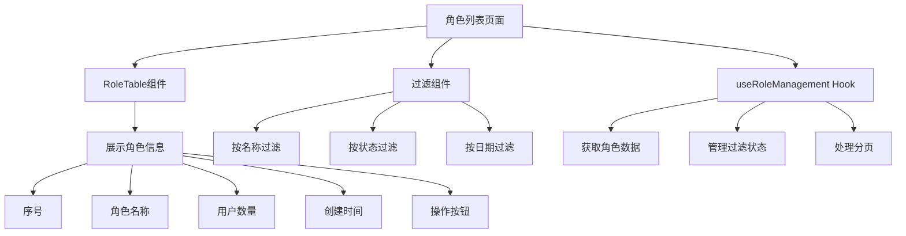
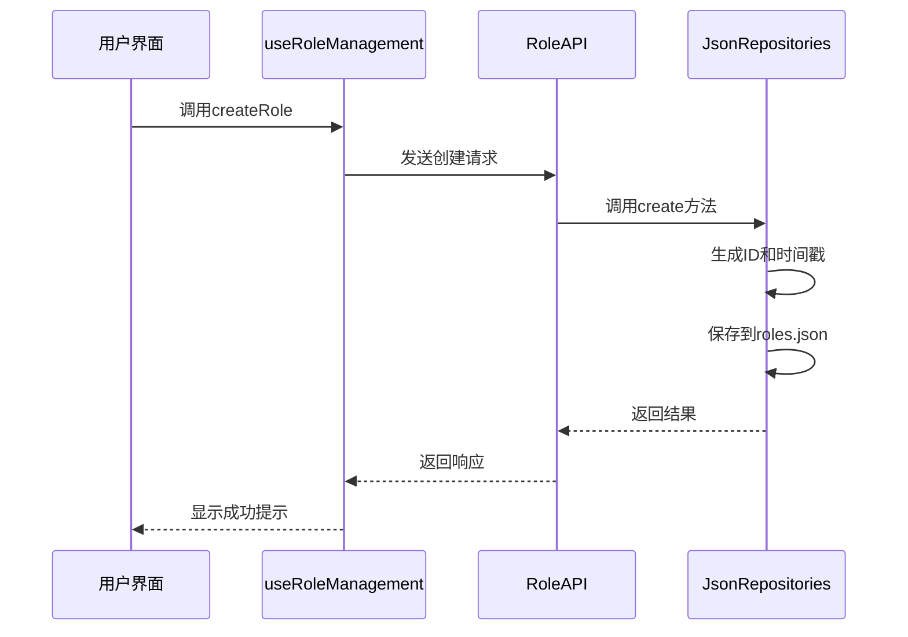
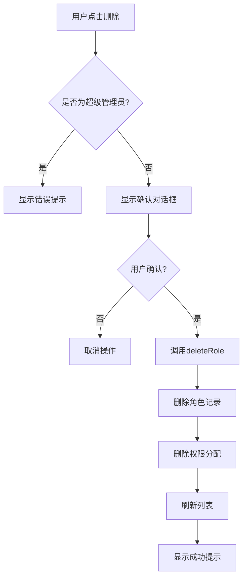
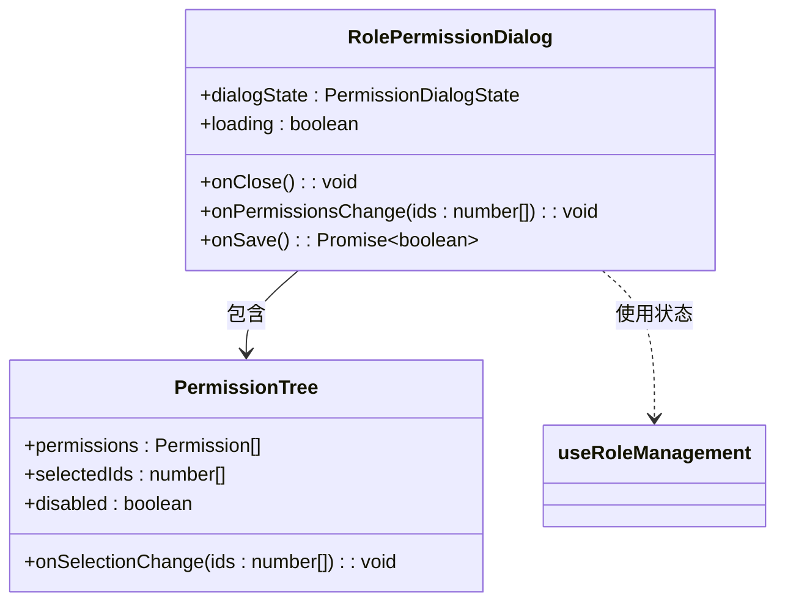
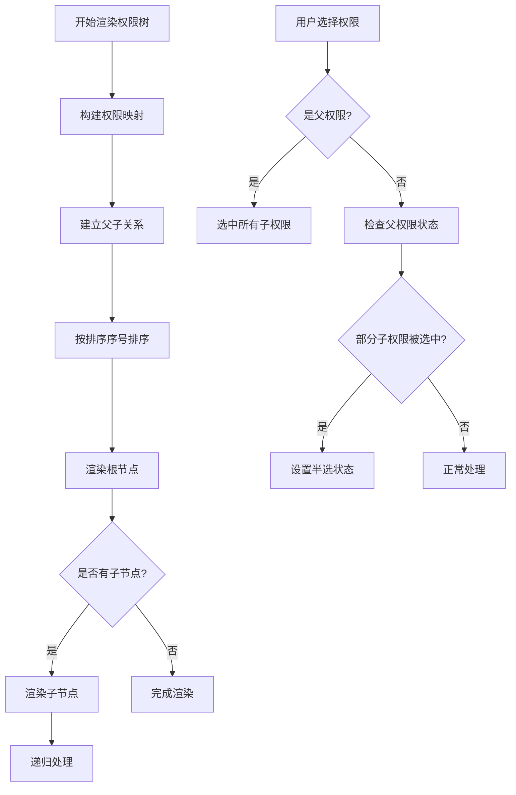
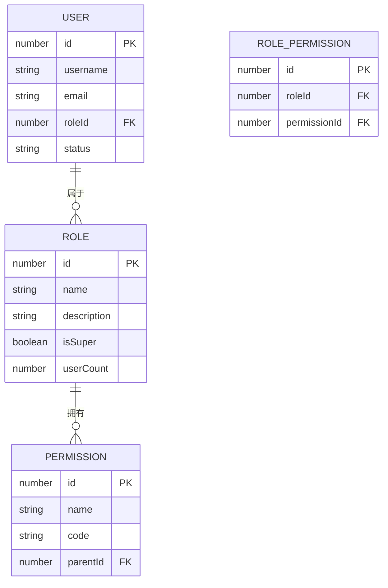
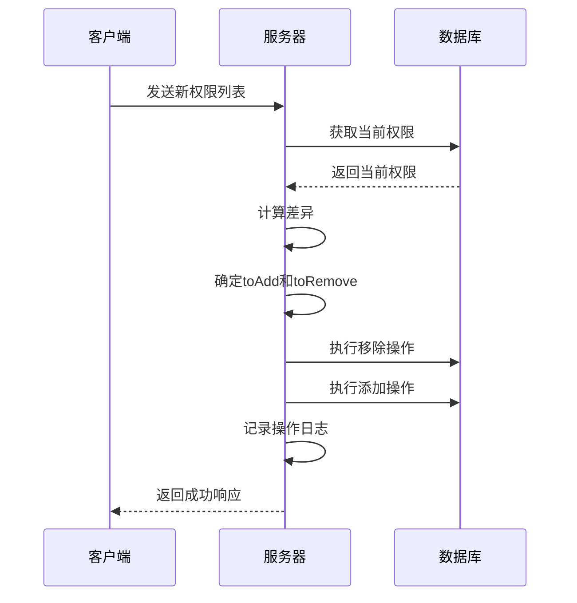

# 角色管理模块

<cite>
**本文档引用的文件**   
- [useRoleManagement.ts](file://src/app/dashboard/account/role/hooks/useRoleManagement.ts)
- [RoleTable.tsx](file://src/app/dashboard/account/role/components/RoleTable.tsx)
- [RolePermissionDialog.tsx](file://src/app/dashboard/account/role/components/RolePermissionDialog.tsx)
- [jsonRepos.ts](file://src/repository/impl/jsonRepos.ts)
- [role.ts](file://src/service/api/role.ts)
- [types.ts](file://src/app/dashboard/account/role/types.ts)
- [permission-tree.tsx](file://src/components/shared/permission-tree.tsx)
- [route.ts](file://src/app/api/roles/route.ts)
- [permissions\route.ts](file://src/app/api/roles/[id]/permissions/route.ts)
</cite>

## 目录
1. [角色管理模块](#角色管理模块)
2. [核心功能概述](#核心功能概述)
3. [角色列表展示与过滤](#角色列表展示与过滤)
4. [角色创建与编辑](#角色创建与编辑)
5. [角色删除机制](#角色删除机制)
6. [权限分配对话框](#权限分配对话框)
7. [权限树渲染与选择状态](#权限树渲染与选择状态)
8. [角色与用户关联关系](#角色与用户关联关系)
9. [权限分配冲突处理](#权限分配冲突处理)
10. [最佳实践建议](#最佳实践建议)

## 核心功能概述

角色管理模块提供了完整的角色生命周期管理功能，包括角色的创建、编辑、删除以及权限分配。系统通过`useRoleManagement` Hook管理角色状态和操作，`RoleTable`组件负责展示角色列表，`RolePermissionDialog`组件处理权限分配。角色与权限通过多对多关系关联，存储在`rolePermissions.json`文件中。超级管理员角色具有特殊保护机制，不能被编辑或删除。

**Section sources**
- [useRoleManagement.ts](file://src/app/dashboard/account/role/hooks/useRoleManagement.ts#L16-L315)
- [types.ts](file://src/app/dashboard/account/role/types.ts#L1-L71)

## 角色列表展示与过滤

角色列表通过`RoleTable`组件展示，包含序号、角色名称、用户数量、创建时间和操作列。表格支持分页和过滤功能，通过`useRoleManagement` Hook获取数据。角色名称列会特殊显示超级管理员角色，用户数量以徽章形式展示。操作列提供编辑、权限分配和删除按钮，超级管理员角色不显示删除按钮。

过滤功能通过`RoleFilters`类型定义，支持按角色名称、状态（普通/超级）和日期范围进行过滤。过滤状态由`useRoleManagement` Hook管理，应用过滤后会重新获取角色列表。

**Diagram sources **
- [RoleTable.tsx](file://src/app/dashboard/account/role/components/RoleTable.tsx#L24-L131)
- [useRoleManagement.ts](file://src/app/dashboard/account/role/hooks/useRoleManagement.ts#L37-L88)

**Section sources**
- [RoleTable.tsx](file://src/app/dashboard/account/role/components/RoleTable.tsx#L15-L133)
- [useRoleManagement.ts](file://src/app/dashboard/account/role/hooks/useRoleManagement.ts#L36-L89)

## 角色创建与编辑

角色的创建和编辑功能通过`useRoleManagement` Hook中的`createRole`和`updateRole`方法实现。创建角色时，需要提供角色名称和描述，系统会验证角色名称是否已存在。编辑角色时，超级管理员角色受到保护，不能被修改。角色数据通过API提交到后端，成功后会显示成功提示。

角色数据模型包含ID、名称、描述、创建时间、更新时间、用户数量和是否为超级管理员等字段。创建角色时，系统会自动生成ID和时间戳。角色名称在数据库中具有唯一性约束。

**Diagram sources **
- [useRoleManagement.ts](file://src/app/dashboard/account/role/hooks/useRoleManagement.ts#L92-L129)
- [jsonRepos.ts](file://src/repository/impl/jsonRepos.ts#L180-L186)
- [role.ts](file://src/service/api/role.ts#L20-L25)

**Section sources**
- [useRoleManagement.ts](file://src/app/dashboard/account/role/hooks/useRoleManagement.ts#L92-L129)
- [jsonRepos.ts](file://src/repository/impl/jsonRepos.ts#L180-L186)

## 角色删除机制

角色删除功能通过`useRoleManagement` Hook中的`deleteRole`方法实现。删除角色时，系统会同时清理该角色相关的权限分配记录，确保数据一致性。删除操作需要二次确认，防止误操作。超级管理员角色受到保护，不能被删除。

在数据存储层面，删除角色会从`roles.json`文件中移除对应记录，并从`rolePermissions.json`文件中移除所有与该角色相关的权限分配记录。系统会记录删除操作日志，包括操作者、目标角色和时间戳。

**Diagram sources **
- [useRoleManagement.ts](file://src/app/dashboard/account/role/hooks/useRoleManagement.ts#L132-L146)
- [jsonRepos.ts](file://src/repository/impl/jsonRepos.ts#L196-L204)

**Section sources**
- [useRoleManagement.ts](file://src/app/dashboard/account/role/hooks/useRoleManagement.ts#L132-L146)
- [jsonRepos.ts](file://src/repository/impl/jsonRepos.ts#L196-L204)

## 权限分配对话框

权限分配通过`RolePermissionDialog`组件实现，该组件在用户点击角色的"权限分配"按钮时弹出。对话框显示当前角色的名称和权限树，用户可以勾选或取消勾选权限。对话框底部显示已选择的权限数量，并提供保存和取消按钮。

对话框支持响应式设计，在移动设备和桌面设备上有不同的布局。移动设备上，操作按钮垂直排列；桌面设备上，操作按钮水平排列。对话框会根据角色是否为超级管理员来决定是否可编辑，超级管理员角色的权限不能修改。

**Diagram sources **
- [RolePermissionDialog.tsx](file://src/app/dashboard/account/role/components/RolePermissionDialog.tsx#L30-L213)
- [permission-tree.tsx](file://src/components/shared/permission-tree.tsx#L274-L323)

**Section sources**
- [RolePermissionDialog.tsx](file://src/app/dashboard/account/role/components/RolePermissionDialog.tsx#L1-L215)
- [useRoleManagement.ts](file://src/app/dashboard/account/role/hooks/useRoleManagement.ts#L252-L273)

## 权限树渲染与选择状态

权限树通过`PermissionTree`组件渲染，支持树形结构展示和父子权限的联动选择。当用户选中父权限时，所有子权限会自动被选中；当取消父权限时，所有子权限会自动被取消。半选状态表示父权限的部分子权限被选中。

权限树的渲染逻辑包括：构建权限映射、建立父子关系、按排序序号排序。选择状态管理通过`handleSelectionChange`函数实现，该函数会智能处理半选状态的父权限，确保它们也被包含在选中ID列表中。权限树支持展开/折叠操作，已选中权限的节点会默认展开。

**Diagram sources **
- [permission-tree.tsx](file://src/components/shared/permission-tree.tsx#L274-L402)
- [RolePermissionDialog.tsx](file://src/app/dashboard/account/role/components/RolePermissionDialog.tsx#L97-L129)

**Section sources**
- [permission-tree.tsx](file://src/components/shared/permission-tree.tsx#L1-L403)
- [RolePermissionDialog.tsx](file://src/app/dashboard/account/role/components/RolePermissionDialog.tsx#L30-L213)

## 角色与用户关联关系

角色与用户通过`roleId`字段关联，每个用户属于一个角色。当角色的权限发生变化时，拥有该角色的所有用户的权限会实时更新。这种设计实现了权限的集中管理，管理员只需修改角色权限，所有相关用户的权限会自动同步。

在数据存储层面，用户信息存储在`users.json`文件中，包含`roleId`字段指向角色ID。角色信息存储在`roles.json`文件中。权限分配信息存储在`rolePermissions.json`文件中，形成角色与权限的多对多关系。当获取角色列表时，系统会聚合每个角色的用户数量。

**Diagram sources **
- [jsonRepos.ts](file://src/repository/impl/jsonRepos.ts#L88-L116)
- [jsonRepos.ts](file://src/repository/impl/jsonRepos.ts#L152-L175)

**Section sources**
- [jsonRepos.ts](file://src/repository/impl/jsonRepos.ts#L86-L150)
- [types.ts](file://src/app/dashboard/account/role/types.ts#L1-L71)

## 权限分配冲突处理

权限分配采用幂等更新策略，通过比较新旧权限集合来确定需要添加和移除的权限。系统会先获取角色的现有权限，然后计算出需要新增和移除的权限ID集合，最后分别执行添加和移除操作。这种设计确保了权限更新的原子性和一致性。

当权限被删除时，系统会自动清理所有角色的权限分配记录，防止出现孤立的权限引用。同样，当角色被删除时，系统会清理该角色的所有权限分配记录。权限分配操作会记录详细的日志，包括操作者、目标角色、原权限、新权限、新增权限和移除权限。

**Diagram sources **
- [permissions\route.ts](file://src/app/api/roles/[id]/permissions/route.ts#L71-L81)
- [jsonRepos.ts](file://src/repository/impl/jsonRepos.ts#L261-L274)

**Section sources**
- [permissions\route.ts](file://src/app/api/roles/[id]/permissions/route.ts#L42-L108)
- [jsonRepos.ts](file://src/repository/impl/jsonRepos.ts#L261-L274)

## 最佳实践建议

1. **权限设计**：采用分层的权限结构，将相关权限组织在同一个父权限下，便于批量分配和管理。
2. **角色命名**：使用清晰、一致的命名规范，如"管理员"、"编辑"、"查看者"等，避免使用模糊的名称。
3. **权限最小化**：遵循最小权限原则，只授予用户完成工作所需的最低权限。
4. **定期审查**：定期审查角色和权限分配，移除不再需要的权限和角色。
5. **审计日志**：利用系统提供的操作日志功能，监控权限变更，及时发现异常操作。
6. **超级管理员保护**：不要随意创建超级管理员角色，确保其权限不被滥用。
7. **批量操作**：当需要为多个用户分配相同权限时，优先创建角色并分配给用户，而不是单独设置权限。

**Section sources**
- [useRoleManagement.ts](file://src/app/dashboard/account/role/hooks/useRoleManagement.ts#L252-L273)
- [jsonRepos.ts](file://src/repository/impl/jsonRepos.ts#L196-L204)
- [permissions\route.ts](file://src/app/api/roles/[id]/permissions/route.ts#L83-L94)