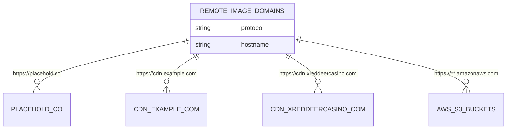

# 传统服务器部署

<cite>
**本文档引用的文件**  
- [DEPLOYMENT.md](file://DEPLOYMENT.md)
- [next.config.ts](file://next.config.ts)
- [package.json](file://package.json)
</cite>

## 目录
1. [生产构建](#生产构建)
2. [启动生产服务器](#启动生产服务器)
3. [PM2进程管理](#pm2进程管理)
4. [生产环境配置](#生产环境配置)
5. [Nginx反向代理配置](#nginx反向代理配置)
6. [常见问题](#常见问题)

## 生产构建

使用 `pnpm build` 命令生成生产环境构建文件。该命令会执行 Next.js 的生产构建流程，包括代码分割、资源压缩、Tree Shaking 等优化措施，以确保应用在生产环境中具有最佳性能。

构建过程会生成一个 `.next` 目录，其中包含经过优化的静态资源和服务器端渲染所需的文件。这些文件是部署到生产服务器的基础。

**Section sources**
- [DEPLOYMENT.md](file://DEPLOYMENT.md#L65-L66)
- [package.json](file://package.json#L7)

## 启动生产服务器

使用 `pnpm start` 命令启动 Node.js 生产服务器。该命令会启动一个基于 Next.js 的生产级服务器，监听指定端口（默认为 3001）并提供构建后的应用。

确保在启动前已正确配置环境变量，特别是数据库连接和 JWT 密钥等关键配置。

**Section sources**
- [DEPLOYMENT.md](file://DEPLOYMENT.md#L68-L69)
- [package.json](file://package.json#L8)

## PM2进程管理

为确保应用的稳定性和高可用性，建议使用 PM2 进程管理工具来管理应用进程。PM2 可以自动重启崩溃的进程、监控资源使用情况，并支持集群模式以充分利用多核 CPU。

推荐的 PM2 配置示例如下：
```json
{
  "apps": [
    {
      "name": "v0-game_admin",
      "script": "node_modules/next/dist/bin/next",
      "args": "start",
      "instances": "max",
      "autorestart": true,
      "watch": false,
      "max_memory_restart": "1G",
      "env": {
        "NODE_ENV": "production"
      }
    }
  ]
}
```

**Section sources**
- [DEPLOYMENT.md](file://DEPLOYMENT.md#L68-L69)
- [package.json](file://package.json#L8)

## 生产环境配置

结合 `next.config.ts` 文件中的配置，了解关键的生产环境设置：

- **静态资源处理**：Next.js 会自动优化静态资源，包括图片压缩和字体优化
- **远程图片域名白名单**：在 `next.config.ts` 中通过 `images.remotePatterns` 配置了允许加载远程图片的域名，包括 `placehold.co`、`cdn.example.com`、`cdn.xreddeercasino.com` 以及所有 AWS S3 存储桶（`**.amazonaws.com`）

这些配置确保了应用在生产环境中能够安全地加载必要的远程资源。



**Diagram sources**
- [next.config.ts](file://next.config.ts#L9-L27)

**Section sources**
- [next.config.ts](file://next.config.ts#L9-L27)

## Nginx反向代理配置

提供 Nginx 反向代理配置示例，用于处理 HTTPS 请求和优化静态文件服务：

```nginx
server {
    listen 80;
    server_name your-domain.com;
    return 301 https://$server_name$request_uri;
}

server {
    listen 443 ssl http2;
    server_name your-domain.com;

    ssl_certificate /path/to/certificate.crt;
    ssl_certificate_key /path/to/private.key;

    location / {
        proxy_pass http://localhost:3001;
        proxy_http_version 1.1;
        proxy_set_header Upgrade $http_upgrade;
        proxy_set_header Connection 'upgrade';
        proxy_set_header Host $host;
        proxy_set_header X-Real-IP $remote_addr;
        proxy_set_header X-Forwarded-Proto $scheme;
        proxy_set_header X-Forwarded-For $proxy_add_x_forwarded_for;
        proxy_cache_bypass $http_upgrade;
    }

    location /_next/static/ {
        alias /path/to/your/app/.next/static/;
        expires 1y;
        add_header Cache-Control "public, immutable";
    }
}
```

此配置实现了：
- HTTP 到 HTTPS 的重定向
- SSL/TLS 加密
- 静态资源缓存优化
- 正确的请求头转发

**Section sources**
- [DEPLOYMENT.md](file://DEPLOYMENT.md#L152)
- [next.config.ts](file://next.config.ts#L9-L27)

## 常见问题

### 数据库连接失败
- 检查 `DATABASE_URL` 环境变量是否正确
- 确认 PostgreSQL 服务已启动并可访问
- 验证网络连接和防火墙设置

### JWT 认证问题
- 确认 `JWT_SECRET` 和 `JWT_REFRESH_SECRET` 已正确设置
- 检查 token 是否过期
- 验证 token 格式是否正确

### 构建失败
- 检查 Node.js 版本是否满足要求（18.x 或更高）
- 清理依赖并重新安装：`rm -rf node_modules && pnpm install`
- 确认所有必需的环境变量已配置

**Section sources**
- [DEPLOYMENT.md](file://DEPLOYMENT.md#L164-L181)