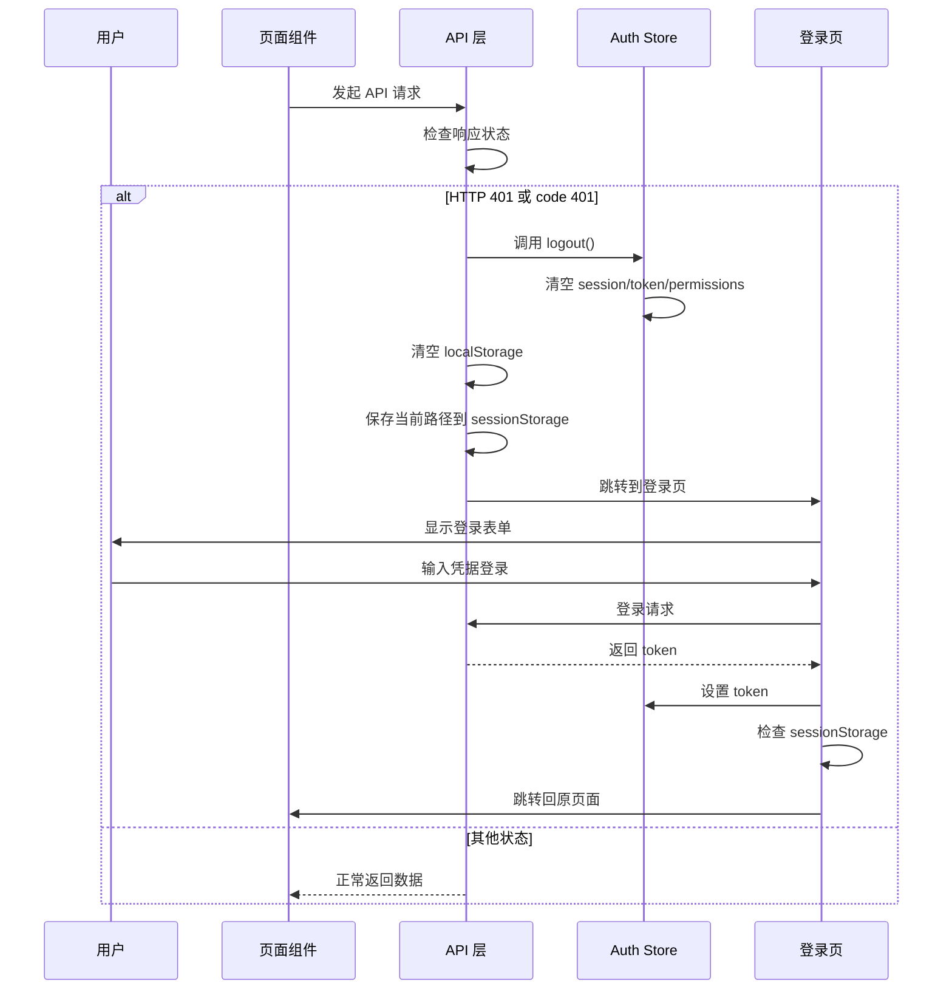

# 401 自动登出功能说明

## 功能概述

当任何 API 接口返回 401 状态码（未授权）时，系统会自动：

1. 清理本地认证状态（token、session、permissions）
2. 清理 localStorage 中的持久化数据
3. 保存当前页面路径到 sessionStorage
4. 自动跳转到登录页
5. 用户重新登录后，自动跳转回原页面

## 实现位置

### 核心文件

**1. API 基础拦截器** - `src/service/api/base.ts`

```typescript
// 401 错误处理标志，防止重复登出
let isHandling401 = false;

/**
 * 处理 401 未授权错误
 * 当 API 返回 401 时，自动清理本地认证状态并跳转到登录页
 */
function handle401Error() {
  // 防止重复处理
  if (isHandling401) {
    return;
  }

  isHandling401 = true;

  // 动态导入 auth store，避免循环依赖
  import('@/stores/auth').then(({ useAuthStore }) => {
    const { logout } = useAuthStore.getState();

    // 清理本地认证状态
    logout();

    // 清理 localStorage 中的持久化数据
    localStorage.removeItem('auth-storage');

    // 保存当前页面路径，登录后可以跳转回来
    const currentPath = window.location.pathname + window.location.search;
    if (currentPath !== '/login') {
      sessionStorage.setItem('redirectAfterLogin', currentPath);
    }

    // 跳转到登录页
    window.location.href = '/login';
  });
}
```

**关键特性：**

- ✅ 自动检测 HTTP 401 和业务 code 401
- ✅ 防止重复处理（isHandling401 标志）
- ✅ 动态导入避免循环依赖
- ✅ 保存原路径用于登录后跳转

**2. 登录表单增强** - `src/app/login/components/login-form.tsx`

```typescript
// 检查是否有保存的重定向路径
const redirectPath = sessionStorage.getItem('redirectAfterLogin');
if (redirectPath && redirectPath !== '/login') {
  // 清除保存的重定向路径
  sessionStorage.removeItem('redirectAfterLogin');
  // 跳转到原页面
  router.push(redirectPath);
  router.refresh();
} else {
  // 没有保存的路径，默认跳转到 dashboard
  router.push('/dashboard');
  router.refresh();
}
```

## 工作流程



## 触发场景

401 自动登出会在以下场景触发：

### 1. Token 过期

- JWT token 有效期到期
- 后端返回 `401 Unauthorized`

### 2. Token 无效

- Token 被篡改
- Token 格式错误
- 后端验证失败返回 `code: 401`

### 3. 未登录访问受保护接口

- 用户未登录但访问需要认证的 API
- Session 失效

## 测试方法

### 测试场景 1：模拟 Token 过期

**步骤：**

1. 登录系统
2. 打开浏览器开发者工具 → Application → Local Storage
3. 手动修改 `auth-storage` 中的 token 为无效值（如 `"invalid-token-123"`）
4. 刷新页面或触发任何 API 请求
5. **预期结果：**
   - ✅ 自动跳转到登录页
   - ✅ localStorage 被清空
   - ✅ 控制台显示：`[401 Unauthorized] 登录已过期，正在跳转到登录页...`

### 测试场景 2：测试登录后跳转回原页面

**步骤：**

1. 登录系统
2. 访问某个特定页面，如：`/dashboard/users?page=2`
3. 使 token 失效（方法同场景 1）
4. 自动跳转到登录页后，重新登录
5. **预期结果：**
   - ✅ 登录成功后自动跳转回 `/dashboard/users?page=2`
   - ✅ sessionStorage 中的 `redirectAfterLogin` 被清除

### 测试场景 3：多个并发请求 401

**步骤：**

1. 登录系统
2. 打开一个会发起多个 API 请求的页面（如 Dashboard）
3. 使 token 失效
4. 刷新页面
5. **预期结果：**
   - ✅ 只执行一次登出操作（通过 `isHandling401` 标志防止重复）
   - ✅ 只跳转一次到登录页

### 测试场景 4：后端返回业务 401

**步骤：**

1. 修改后端接口，使其返回 `{ code: 401, message: "登录已过期" }`（HTTP 状态码仍为 200）
2. 登录系统并访问该接口
3. **预期结果：**
   - ✅ 自动触发登出逻辑
   - ✅ 跳转到登录页

## 代码关键点

### 1. 防止重复处理

```typescript
// 使用全局标志防止多个 401 请求同时触发登出
if (isHandling401) {
  return; // 已经在处理中，直接返回
}

isHandling401 = true;

// 处理完成后延迟重置标志
setTimeout(() => {
  isHandling401 = false;
}, 1000);
```

### 2. 动态导入避免循环依赖

```typescript
// 不能直接导入 useAuthStore，会造成循环依赖
// import { useAuthStore } from '@/stores/auth'; ❌

// 使用动态导入
import('@/stores/auth').then(({ useAuthStore }) => {
  const { logout } = useAuthStore.getState();
  logout();
});
```

### 3. 双重检测机制

```typescript
// 检测 HTTP 层面的 401
if (response.status === 401) {
  handle401Error();
}

// 检测业务层面的 401（有些后端返回 HTTP 200 但 code 为 401）
if (result.code === 401) {
  handle401Error();
}
```

## 配置说明

### 环境变量

无需额外配置，功能开箱即用。

### 自定义行为

如需自定义 401 处理逻辑，可修改 `handle401Error` 函数：

```typescript
function handle401Error() {
  // 1. 添加自定义日志
  logger.warn('用户认证失败', { timestamp: new Date() });

  // 2. 发送监控报告
  // reportToMonitoring({ event: '401_error' });

  // 3. 显示友好提示
  toast.error('登录已过期，请重新登录');

  // 4. 执行登出...
}
```

## 注意事项

1. **不要在服务端组件中使用**

   - 该功能依赖浏览器 API（localStorage、window.location）
   - 仅在客户端组件中生效

2. **与路由守卫的配合**

   - 路由守卫（middleware）仍会在服务端检查认证
   - 401 拦截器是客户端的最后一道防线

3. **性能考虑**

   - 使用动态导入，不会增加初始加载时间
   - 防重复机制避免不必要的操作

4. **安全性**
   - 彻底清理本地认证数据
   - 不保留任何敏感信息

## 相关文件

- `src/service/api/base.ts` - API 拦截器核心逻辑
- `src/stores/auth.ts` - 认证状态管理
- `src/app/login/components/login-form.tsx` - 登录后重定向逻辑
- `src/hooks/use-auth.ts` - 认证 Hook

## 更新日志

**2025-01-03**

- ✅ 实现 401 自动拦截和登出
- ✅ 添加登录后跳转回原页面功能
- ✅ 防止重复处理机制
- ✅ 支持业务层面的 401 检测
